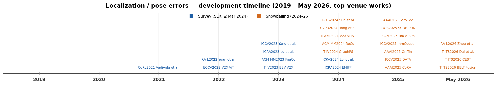
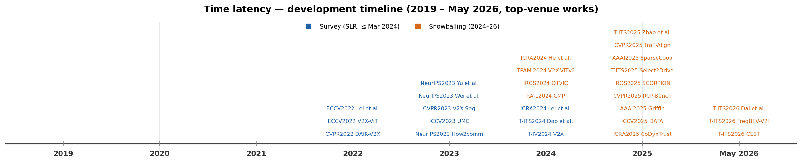
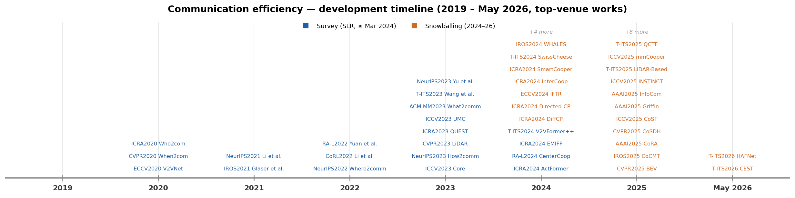
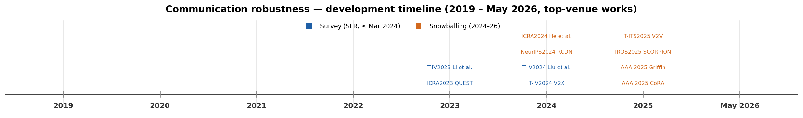
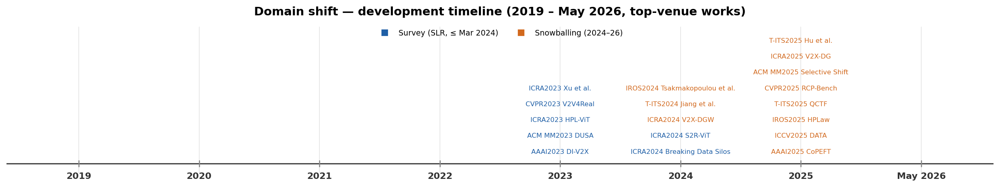
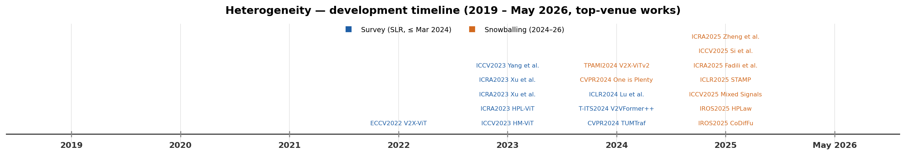
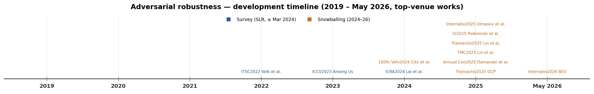

# Awesome Collaborative Perception [](https://awesome.re)

> A curated, continuously maintained index of **vehicular collaborative perception** research, organized by the taxonomy of our survey *"A Systematic Literature Review on Vehicular Collaborative Perception: A Computer Vision Perspective"* (IEEE T-ITS, 2026).

<div align="center">

[](https://doi.org/10.1109/TITS.2025.3631141)
[](https://creativecommons.org/licenses/by/4.0/)
[](#structured-taxonomy)

[](#contributing)
[](https://github.com/leiwanrobotics/awesome-collaborative-perception/stargazers)

</div>

<p align="center">

</p>

**Vehicular collaborative perception** — also called cooperative or collective perception — lets connected vehicles and roadside infrastructure exchange sensor information over V2V / V2I / V2X links to see through occlusions and beyond line of sight, overcoming the fundamental limits of single-vehicle perception. This repository is a continuously maintained index of **402 curated papers (2019–2026)**, each classified along three axes — **modality**, **collaboration scheme**, and **perception task** — with direct links to the paper and to official code when available. The corpus is predominantly peer-reviewed, with recent arXiv preprints included from the snowballing extension.

The collection is built in two reproducible stages:

- **Systematic review** — 106 studies (≤ March 2024) selected with a PRISMA-style protocol (Tables I–XXIX of the survey).
- **Forward-snowballing extension** — 296 studies (2024–2026) discovered from the citation graph of the surveyed papers and screened with the same inclusion / exclusion criteria.

Every row is tagged **`Survey`** or **`Snowball`** in the *Source* column. The [Publication Statistics](#publication-statistics) mirror the survey's Table VIII (the 106 surveyed studies); the per-section tables additionally include the snowballing extension. All artifacts are regenerated from [`collaborative-perception.bib`](collaborative-perception.bib) by the scripts in [`tools/`](tools/README.md) — contributions welcome (see [Contributing](#contributing)).

## Table of Contents

- [Related Reviews](#related-reviews)
- [Publication Statistics](#publication-statistics)
- [Structured Taxonomy](#structured-taxonomy)
- [Modality Type](#modality-type)
  - [LiDAR](#lidar)
  - [Camera](#camera)
  - [LiDAR-Camera](#lidar-camera)
  - [Modality-Agnostic / Other](#modality-agnostic--other)
- [Collaboration Type](#collaboration-type)
  - [Early Collaboration](#early-collaboration)
  - [Intermediate Collaboration](#intermediate-collaboration)
  - [Late Collaboration](#late-collaboration)
  - [Hybrid Collaboration](#hybrid-collaboration)
- [Perception Tasks](#perception-tasks)
  - [Collaborative Object Detection](#collaborative-object-detection)
  - [Collaborative Semantic Segmentation](#collaborative-semantic-segmentation)
  - [Collaborative Object Tracking](#collaborative-object-tracking)
  - [Collaborative Motion Prediction](#collaborative-motion-prediction)
  - [Collaborative Lane Detection](#collaborative-lane-detection)
  - [Multi-Task and Task-Agnostic](#multi-task-and-task-agnostic)
- [Approaches to Address Realistic Issues](#approaches-to-address-realistic-issues)
  - [Localization / Pose Errors](#localization--pose-errors)
  - [Time Latency](#time-latency)
  - [Communication Efficiency](#communication-efficiency)
  - [Communication Robustness](#communication-robustness)
  - [Domain Shift](#domain-shift)
  - [Heterogeneity](#heterogeneity)
  - [Adversarial Robustness](#adversarial-robustness)
- [Datasets](#datasets)
- [Contributing](#contributing)
- [Citation](#citation)
- [License](#license)

---

## Related Reviews

| Review | Year | Publication | Focus |
| --- | ---: | --- | --- |
| Bai et al. | 2022 | IEEE T-ITS | High-level overview of CP architecture and node structure |
| Caillot et al. | 2022 | IEEE T-ITS | Focus on localization, object detection, and tracking |
| Han et al. | 2023 | IEEE ITS Magazine | CP methods for both ideal and adverse scenarios |
| Liu et al. | 2023 | arXiv | Introduction to CP issues |
| Huang et al. | 2024 | arXiv | Framework proposal for CP |

Relative to these, our survey adds a transparent PRISMA-style selection protocol, a unified modality / collaboration / task taxonomy, and a computer-vision-centric comparative analysis — which this repository operationalizes as a living, reproducible index.

---

## Publication Statistics

These figures mirror **Table VIII** of the survey (aggregate, unique-study counts) so the repository stays consistent with the paper.

| Dimension | Categories (survey Table VIII) |
| --- | --- |
| **Modality** | LiDAR (63), Camera (13), LiDAR-Camera (12) |
| **Collaboration** | Early (6), Intermediate (71), Late (15), Hybrid (6) |
| **Task** | Object Detection (78), Semantic Segmentation (6), Object Tracking (5), Motion Prediction (3), Lane Detection (2), Multi-task (3), Task-agnostic (8) |
| **Region** | Asia (54), North America (38), Europe (13), Africa (1) |
| **Top venues** | ICRA (16), CVPR (8), IEEE T-IV (8), NeurIPS (8), ICCV (5), IEEE RA-L (5), IEEE ITSC (5), IEEE T-ITS (4), IEEE IoTJ (4), IEEE IV (4) |

> These counts cover the **106 surveyed studies only**. The taxonomy tables below additionally include the forward-snowballing extension (2024–2026), with each row marked `Survey` or `Snowball` in the **Source** column. Per-section counts therefore exceed these figures; minor differences between the surveyed sections and Table VIII arise from the survey's unique-study aggregation and an *Agnostic* modality bucket not separated in Table VIII.

Publications over time across all 402 collected papers (survey vs forward-snowballing, by modality, collaboration, and task):

<p align="center">

</p>

<sub>Regenerate with <code>python tools/data_extraction/make_timeline_figure.py</code>. Survey collection ≤ March 2024; 2024–2026 extended via forward snowballing; 2026 is partial.</sub>

---
## Structured Taxonomy

Papers are organized along three taxonomy axes of the survey plus a fourth, cross-cutting view, so the repository works as a practical lookup index rather than a flat list:

1. **Modality** — *LiDAR*, *Camera*, *LiDAR-Camera*, and *Modality-Agnostic* (e.g. object-level late fusion).
2. **Collaboration scheme** — *Early* (raw-data sharing), *Intermediate* (feature sharing), *Late* (result sharing), and *Hybrid*.
3. **Perception task** — *Object Detection*, *Semantic Segmentation*, *Object Tracking*, *Motion Prediction*, *Lane Detection*, and *Multi-Task / Task-Agnostic*.
4. **Realistic-issue approaches** (cross-cutting, survey Section VII) — *Localization / Pose Errors*, *Time Latency*, *Communication Efficiency*, *Communication Robustness*, *Domain Shift*, *Heterogeneity*, and *Adversarial Robustness*; grouped by the real-world deployment problem each method relaxes (see [Approaches to Address Realistic Issues](#approaches-to-address-realistic-issues)).

The same study appears under each axis it belongs to, and a per-table **development timeline** precedes every table to trace how that category evolved. To keep the timelines legible, only works published at top venues (CVPR, ICCV, ECCV, TPAMI, NeurIPS, ICLR, AAAI, ICRA, IROS, T-ITS, …) are marked. Each mark is labelled `VENUE+YEAR approach` (e.g. `CVPR2024 RCooper`); the approach is the method's own name when the paper coins one, otherwise `First-author et al.`.

**Table key.** &nbsp; **Title** links to the publication (truncated for width — click through for the full title); **Code** links to the official repository. &nbsp; Compact column labels: **Modality** — `LiDAR`, `Cam` (Camera), `L+C` (LiDAR-Camera), `Agn.` (Modality-Agnostic). &nbsp; **Collab.** — `Early`, `Inter` (Intermediate), `Late`, `Hybrid` (datasets show their V2X mode `V2V` / `V2I` here). &nbsp; **Task** — `Det` (Object Detection), `Track` (Object Tracking), `Pred` (Motion Prediction), `Seg` (Semantic Segmentation), `Lane` (Lane Detection), `Multi` (Multi-Task / Task-Agnostic), `Data` (Dataset / Benchmark). &nbsp; **Source** — `Survey` (in the SLR, ≤ Mar 2024) or `Snowball` (forward-snowballing extension, 2024–2026).

---

## Modality Type

### LiDAR (191 papers)

<details>
<summary>📋 <b>Expand</b> timeline &amp; 191-paper table</summary>

<p align="center">

</p>

| Title | Venue | Year | Collab. | Task | Code | Source |
| --- | --- | --- | --- | --- | --- | --- |
| [A Cooperative 3-D Perception Framework via Representation…](https://www.semanticscholar.org/search?q=A%20Cooperative%203-D%20Perception%20Framework%20via%20Representation%20Alignment%20and%20Latent%20State%20Reasoning%20for%20Spatially%20Variant%20LiDAR%20Observations&sort=relevance) | IEEE TIM | 2026 | Inter | Det | — | Snowball |
| [An Efficient Cross-Agent Spatial-Temporal Collaboration…](https://doi.org/10.1109/tccn.2026.3686792) | IEEE TCCN | 2026 | Inter | Det | — | Snowball |
| [Boosting Vehicle-to-Vehicle Collaborative Perception in…](https://doi.org/10.1109/lra.2026.3653278) | IEEE RA-L | 2026 | Inter | Det | — | Snowball |
| [BRIDGE: Task-Aware LiDAR Point Cloud Compression with Optimal…](https://www.semanticscholar.org/search?q=BRIDGE%3A%20Task-Aware%20LiDAR%20Point%20Cloud%20Compression%20with%20Optimal%20Detection-Critical%20Subset%20Learning&sort=relevance) | Most | 2026 | Early | Det | — | Snowball |
| [CampusSyn: A Real World Complex Environment Dataset for…](https://doi.org/10.1109/icicip67436.2026.11417530) | International… | 2026 | Inter | Data | — | Snowball |
| [COOPMamba: Efficient Vehicle-to-Vehicle Cooperative Perception…](https://doi.org/10.1109/jsen.2026.3682367) | Sensors | 2026 | Inter | Det | [Code](https://github.com/npunancy/coopmamba) | Snowball |
| [Edge-Assisted Semantics-Aware Point Cloud Sampling and…](https://doi.org/10.1109/jiot.2026.3656459) | IEEE IoTJ | 2026 | Early | Det | — | Snowball |
| [HAFNet: Hybrid-Stage Collaborative Perception via…](https://doi.org/10.1109/tits.2026.3651733) | IEEE T-ITS | 2026 | Hybrid | Det | — | Snowball |
| [Octopus: Vehicle-to-Road Collaborative Perception for…](https://doi.org/10.1145/3774904.3792317) | ACM Web Conference… | 2026 | Inter | Det | — | Snowball |
| [Research on Cooperative Vehicle-Infrastructure Perception…](https://doi.org/10.3390/wevj17040164) | World Electric… | 2026 | Inter | Det | — | Snowball |
| [SC-MII: Infrastructure LiDAR-based 3D Object Detection on Edge…](https://doi.org/10.1109/CCNC65079.2026.11366278) | Consumer… | 2026 | Inter | Det | — | Snowball |
| [STCo: A Communication-Efficient Spatiotemporal Context-Aware…](https://doi.org/10.1109/jiot.2026.3667134) | IEEE IoTJ | 2026 | Inter | Det | — | Snowball |
| [VICooper: Communication-Efficient Vehicle-Infrastructure…](https://doi.org/10.1109/jiot.2025.3624814) | IEEE IoTJ | 2026 | Inter | Det | — | Snowball |
| [A Lightweight Two-Stage Multivehicle Feature Fusion Method…](https://www.semanticscholar.org/search?q=A%20Lightweight%20Two-Stage%20Multivehicle%20Feature%20Fusion%20Method%20Guided%20by%20Global%20Feature&sort=relevance) | Sensors | 2025 | Inter | Det | — | Snowball |
| [A Novel Communication-Efficient Cooperative Perception…](https://doi.org/10.1109/jiot.2025.3582847) | IEEE IoTJ | 2025 | Inter | Det | — | Snowball |
| [A Vehicle-Infrastructure Cooperative LiDAR Object Detection…](https://doi.org/10.1109/vtc2025-fall65116.2025.11310157) | IEEE VTC | 2025 | Inter | Det | — | Snowball |
| [A Vehicle–Infrastructure Cooperative Perception Network Based…](https://doi.org/10.3390/app15063399) | Applied Sciences | 2025 | Inter | Det | — | Snowball |
| [Adaptive Fusion of LiDAR Features for 3D Object Detection in…](https://doi.org/10.3390/s25133865) | Sensors | 2025 | Inter | Det | — | Snowball |
| [CoDynTrust: Robust Asynchronous Collaborative Perception via…](https://www.semanticscholar.org/search?q=CoDynTrust%3A%20Robust%20Asynchronous%20Collaborative%20Perception%20via%20Dynamic%20Feature%20Trust%20Modulus&sort=relevance) | ICRA | 2025 | Inter | Det | [Code](https://github.com/CrazyShout/CoDynTrust) | Snowball |
| [Collaborative Perception Against Data Fabrication Attacks in…](https://doi.org/10.1109/tmc.2025.3571013) | IEEE TMC | 2025 | Inter | Det | [Code](https://github.com/zqzqz/AdvCollaborativePerception) | Snowball |
| [CoMCM: Collaborative 3D Detection With Multiscale Clustering…](https://doi.org/10.1109/jstsp.2025.3650028) | IEEE Journal on… | 2025 | Inter | Det | — | Snowball |
| [Context-Aware Fusion Framework for Enhancing Robustness in…](https://doi.org/10.1109/icicml67980.2025.11333560) | ICICML | 2025 | Inter | Det | — | Snowball |
| [CoPe: Taming Collaborative 3D Perception via Lite Network…](https://doi.org/10.1109/icdcs63083.2025.00027) | IEEE International… | 2025 | Inter | Det | — | Snowball |
| [CoRange: Collaborative Range-Aware Adaptive Fusion for…](https://doi.org/10.1109/tiv.2024.3478756) | IEEE T-IV | 2025 | Inter | Det | — | Snowball |
| [CoSGMN: Cooperative 3D Object Detection with Spatial Grouping…](https://doi.org/10.1109/igarss55030.2025.11243101) | Remote Sens. | 2025 | Inter | Det | — | Snowball |
| [CPD-KD: a cooperative perception network for discrepancy…](https://doi.org/10.1038/s41598-025-08482-5) | Scientific Reports | 2025 | Inter | Det | — | Snowball |
| [Cross-Domain Generalization for LiDAR-Based 3D Object Detection…](https://doi.org/10.3390/s25030767) | Sensors | 2025 | Inter | Det | — | Snowball |
| [CTCP: Contrastive Representation Learning for Balanced…](https://www.semanticscholar.org/search?q=CTCP%3A%20Contrastive%20Representation%20Learning%20for%20Balanced%20Two-Stage%20Collaborative%20Perception&sort=relevance) | ICAICE | 2025 | Inter | Det | — | Snowball |
| [CUDA-X: Unsupervised Domain-Adaptive Vehicle-to-Everything…](https://doi.org/10.1109/tnnls.2025.3539358) | IEEE Transactions on… | 2025 | Inter | Det | — | Snowball |
| [Delay-Aware Graph Attention Framework for Collaborative…](https://doi.org/10.1109/vtc2025-fall65116.2025.11310224) | IEEE VTC | 2025 | Inter | Det | — | Snowball |
| [Density-Aware Early Fusion for Vehicle Collaborative Perception](https://doi.org/10.1109/mits.2024.3502177) | IEEE ITS Mag. | 2025 | Early | Det | — | Snowball |
| [Edge-Assisted Collaborative Perception Against Jamming and…](https://doi.org/10.1109/twc.2024.3510601) | IEEE Transactions on… | 2025 | Inter | Det | — | Snowball |
| [Enhancing collaborative perception through multi-scale…](https://doi.org/10.1016/j.aap.2025.108367) | Accident Analysis and… | 2025 | Inter | Det | — | Snowball |
| [Enhancing Cooperative LiDAR-Based Perception Accuracy in…](https://doi.org/10.1109/tits.2025.3541265) | IEEE T-ITS | 2025 | Inter | Det | — | Snowball |
| [GCP: Guarded Collaborative Perception with Spatial-Temporal…](https://doi.org/10.1109/tdsc.2026.3693684) | IEEE Transactions on… | 2025 | Inter | Det | [Code](https://github.com/yihangtao/GCP.git) | Snowball |
| [GIFF: Graph Iterative Attention Based Feature Fusion for…](https://doi.org/10.5220/0013297900003912) | VISIGRAPP : VISAPP | 2025 | Inter | Det | — | Snowball |
| [HGSTA: Leveraging Hypergraph Computing for Effective…](https://doi.org/10.1109/vtc2025-fall65116.2025.11309988) | IEEE VTC | 2025 | Inter | Det | — | Snowball |
| [HPLaw: Heterogeneous Parallel LiDARs for Adverse Weather in V2V](https://doi.org/10.1109/iros60139.2025.11247380) | IROS | 2025 | Inter | Det | — | Snowball |
| [Improving Vulnerable Road-Users Detection Through Hybrid…](https://doi.org/10.1109/itsc60802.2025.11423004) | IEEE ITSC | 2025 | Hybrid | Det | — | Snowball |
| [Incentivizing Point Cloud-Based Accurate Cooperative Perception…](https://doi.org/10.1109/tvt.2024.3519626) | IEEE T-VT | 2025 | Early | Det | — | Snowball |
| [InfoCom: Kilobyte-Scale Communication-Efficient Collaborative…](https://www.semanticscholar.org/search?q=InfoCom%3A%20Kilobyte-Scale%20Communication-Efficient%20Collaborative%20Perception%20with%20Information%20Bottleneck&sort=relevance) | AAAI | 2025 | Inter | Det | [Code](https://github.com/fengxueguiren/InfoCom) | Snowball |
| [INSTINCT: Instance-Level Interaction Architecture for…](https://doi.org/10.1109/iccv51701.2025.02362) | ICCV | 2025 | Inter | Det | [Code](https://github.com/CrazyShout/INSTINCT) | Snowball |
| [Learning spatio-temporal representation for cooperative 3D…](https://doi.org/10.1016/j.neunet.2025.107626) | Neural Networks | 2025 | Inter | Det, Track | — | Snowball |
| [Learning to Detect Objects from Multi-Agent LiDAR Scans without…](https://doi.org/10.1109/cvpr52734.2025.00140) | CVPR | 2025 | Early | Det | [Code](https://github.com/xmuqimingxia/DOtA) | Snowball |
| [MHCPP: A Motion-Based Historical Enhancement Collaborative…](https://doi.org/10.1109/tits.2025.3608565) | IEEE T-ITS | 2025 | Inter | Det, Pred | — | Snowball |
| [Mixed Signals: A Diverse Point Cloud Dataset for Heterogeneous…](https://doi.org/10.1109/iccv51701.2025.02671) | ICCV | 2025 | Inter | Det | — | Snowball |
| [Multi-Scale Dynamic Spatial Attention Module for Robust Point…](https://doi.org/10.1109/access.2025.3616145) | IEEE Access | 2025 | Inter | Det | [Code](https://github.com/usergxx/MSDSAM) | Snowball |
| [Multidimensional Feature Enhancement and Interactive Fusion…](https://doi.org/10.1109/icetis66286.2025.11144067) | ICETIS | 2025 | Inter | Det | — | Snowball |
| [Optimized Collaborative Perception: Sector-Based BEV Fusion in…](https://doi.org/10.1109/vtc2025-spring65109.2025.11174390) | IEEE VTC | 2025 | Early | Det | — | Snowball |
| [Optimizing Cooperative Multi-Object Tracking using Graph Signal…](https://doi.org/10.1109/icmew68306.2025.11152179) | ICMEW | 2025 | Late | Track | — | Snowball |
| [Overcoming Communication Time Delay in V2V Collaborative…](https://doi.org/10.1109/itsc60802.2025.11423434) | IEEE ITSC | 2025 | Inter | Det | — | Snowball |
| [PerceptNet-V2X duplicate check passthrough placeholder](https://www.semanticscholar.org/search?q=PerceptNet-V2X%20duplicate%20check%20passthrough%20placeholder&sort=relevance) | __SKIP__ | 2025 | Inter | Det | — | Snowball |
| [PerceptNet-V2X: Perception Network for Vehicle to Everything…](https://doi.org/10.1109/access.2025.3624285) | IEEE Access | 2025 | Inter | Det | — | Snowball |
| [Planning-Oriented Cooperative Perception Among Heterogeneous…](https://doi.org/10.1109/icra55743.2025.11127774) | ICRA | 2025 | Early | Det | — | Snowball |
| [PosiFusion: A Vehicle-to-Everything Cooperative Perception…](https://doi.org/10.5194/isprs-annals-x-1-w2-2025-115-2025) | Remote Sens. | 2025 | Inter | Det | — | Snowball |
| [Reflectance Prediction-Based Knowledge Distillation for Robust…](https://doi.org/10.1109/tip.2025.3648203) | IEEE T-IP | 2025 | Early | Det | [Code](https://github.com/HaoJing-SX/RPKD) | Snowball |
| [Robust Collaborative Perception: Combining Adversarial Training…](https://doi.org/10.1109/iv64158.2025.11097632) | IEEE IV | 2025 | Inter | Det | — | Snowball |
| [Robust Multi-Agent Collaborative Perception via Spatio-Temporal…](https://doi.org/10.1109/tcsvt.2025.3528980) | IEEE TCSVT | 2025 | Inter | Det | — | Snowball |
| [Robust Multi-Agent Collaborative Perception via…](https://doi.org/10.1109/vtc2025-spring65109.2025.11174503) | IEEE VTC | 2025 | Inter | Det | — | Snowball |
| [Robustifying 3D Perception via Least-Squares Graphs for…](https://doi.org/10.1109/iecon58223.2025.11221345) | Annual Conference of… | 2025 | Late | Track | — | Snowball |
| [S2S-Net: Addressing the Domain Gap of Heterogeneous Sensor…](https://doi.org/10.1109/ICVES65691.2025.11376363) | International… | 2025 | Inter | Det | — | Snowball |
| [Safety Field-Based Vehicle-Infrastructure Cooperative…](https://doi.org/10.1109/tits.2025.3546980) | IEEE T-ITS | 2025 | Early | Det | — | Snowball |
| [SCORPION: Robust Spatial-Temporal Collaborative Perception…](https://doi.org/10.1109/iros60139.2025.11247050) | IROS | 2025 | Inter | Det | — | Snowball |
| [Select2Drive: Pragmatic Communications for Real-Time…](https://doi.org/10.1109/tits.2025.3611377) | IEEE T-ITS | 2025 | Inter | Det, Multi | — | Snowball |
| [Selective Shift: Towards Personalized Domain Adaptation in…](https://doi.org/10.1145/3746027.3754723) | ACM MM | 2025 | Inter | Det | — | Snowball |
| [SlimComm: Doppler-Guided Sparse Queries for Bandwidth-Efficient…](https://doi.org/10.1109/iccvw69036.2025.00190) | ICCVW | 2025 | Inter | Det | [Code](https://github.com/fzi-forschungszentrum-informatik/SlimComm) | Snowball |
| [SMSCNet:Sparse Multi-Scale and Spatially Enhanced Cooperative…](https://doi.org/10.1109/cvci66304.2025.11348559) | CVCI | 2025 | Inter | Det | — | Snowball |
| [SparseAlign: A Fully Sparse Framework for Cooperative Object…](https://doi.org/10.1109/cvpr52734.2025.02077) | CVPR | 2025 | Inter | Det | [Code](https://github.com/YuanYunshuang/SparseAlign) | Snowball |
| [The Impact of Pose Alignment Errors on a Classical Late…](https://doi.org/10.1109/ojvt.2025.3591210) | IEEE Open Journal of… | 2025 | Late | Det | — | Snowball |
| [TraF-Align: Trajectory-aware Feature Alignment for Asynchronous…](https://doi.org/10.1109/cvpr52734.2025.01125) | CVPR | 2025 | Inter | Det | [Code](https://github.com/zhyingS/TraF-Align) | Snowball |
| [Transformer-Based Latency Compensation for Cooperative…](https://www.semanticscholar.org/search?q=Transformer-Based%20Latency%20Compensation%20for%20Cooperative%20Perception&sort=relevance) | IEEE Vehicular… | 2025 | Early | Det | — | Snowball |
| [TurboTrain: Towards Efficient and Balanced Multi-Task Learning…](https://doi.org/10.1109/ICCV51701.2025.00418) | ICCV | 2025 | Inter | Det, Pred, Multi | [Code](https://github.com/ucla-mobility/TurboTrain) | Snowball |
| [UniSense: Spatial-Uncertainty-Aware Collaborative Sensing for…](https://doi.org/10.1145/3711875.3729130) | ACM SIGMOBILE… | 2025 | Inter | Det | [Code](https://github.com/LetStarFly/UniSense) | Snowball |
| [V2V-APG: Adversarial Progressive Generalization for…](https://doi.org/10.1109/jiot.2025.3621285) | IEEE IoTJ | 2025 | Inter | Det | — | Snowball |
| [V2VLoc: Robust GNSS-Free Collaborative Perception via LiDAR…](https://doi.org/10.1609/aaai.v40i9.37633) | AAAI | 2025 | Inter | Det | — | Snowball |
| [V2X-DG: Domain Generalization for Vehicle-to-Everything…](https://doi.org/10.1109/icra55743.2025.11128005) | ICRA | 2025 | Inter | Det | — | Snowball |
| [V2X-MGHD: A Collaborative Perception Network for Multiview…](https://doi.org/10.1109/jsen.2025.3572449) | Sensors | 2025 | Inter | Det | [Code](https://github.com/feeling0414-lab/V2X-MGHD) | Snowball |
| [A Collaborative Perception Network based on Dynamic Multi-scale…](https://doi.org/10.23919/ccc63176.2024.10661468) | Cybersecurity and… | 2024 | Inter | Det | — | Snowball |
| [A Two-Stage Clustering Method for Point Clouds Based on…](https://doi.org/10.1109/icmre60776.2024.10532146) | International… | 2024 | Early | Det | — | Snowball |
| [BB-Align: A Lightweight Pose Recovery Framework for…](https://doi.org/10.1109/icdcs60910.2024.00098) | IEEE International… | 2024 | Inter | Det | — | Snowball |
| [Breaking Data Silos: Cross-Domain Learning for Multi-Agent…](https://doi.org/10.1109/ICRA57147.2024.10610591) | ICRA | 2024 | Inter | Det | [Code](https://github.com/jinlong17/BDS-V2V) | Survey |
| [CenterCoop: Center-Based Feature Aggregation for…](https://doi.org/10.1109/LRA.2023.3339399) | IEEE RA-L | 2024 | Inter | Det | — | Survey |
| [CMP: Cooperative Motion Prediction With Multi-Agent…](https://doi.org/10.1109/lra.2025.3546862) | IEEE RA-L | 2024 | Hybrid | Det, Track, Pred | [Code](https://github.com/tasl-lab/CMP) | Snowball |
| [CoDTS: Enhancing Sparsely Supervised Collaborative Perception…](https://doi.org/10.1609/aaai.v39i3.32348) | AAAI | 2024 | Inter | Det | [Code](https://github.com/CatOneTwo/CoDTS) | Snowball |
| [CollabGAT: Collaborative Perception Using Graph Attention…](https://www.semanticscholar.org/search?q=CollabGAT%3A%20Collaborative%20Perception%20Using%20Graph%20Attention%20Network&sort=relevance) | IEEE Access | 2024 | Inter | Det | — | Snowball |
| [Collaborative Joint Perception and Prediction for Autonomous…](https://doi.org/10.3390/s24196263) | Sensors | 2024 | Inter | Seg, Pred, Multi | — | Snowball |
| [Collaborative Multi-Object Tracking With Conformal Uncertainty…](https://doi.org/10.1109/LRA.2024.3364450) | IEEE RA-L | 2024 | Late | Track | [Code](https://github.com/susanbao/mot_cup) | Survey |
| [Cooperative 3D Multi-Object Tracking for Connected and…](https://doi.org/10.1109/IV55156.2024.10588576) | IEEE IV | 2024 | Late | Track | — | Snowball |
| [CooPre: Cooperative Pretraining for V2X Cooperative Perception](https://doi.org/10.1109/iros60139.2025.11246787) | IROS | 2024 | Inter | Det | [Code](https://github.com/ucla-mobility/CooPre) | Snowball |
| [CoSense3D: an Agent-based Efficient Learning Framework for…](https://doi.org/10.1109/iv55156.2024.10588865) | IEEE IV | 2024 | Inter | Det | [Code](https://github.com/YuanYunshuang/CoSense3D) | Snowball |
| [Directed-CP: Directed Collaborative Perception for Connected…](https://doi.org/10.1109/icra55743.2025.11127818) | ICRA | 2024 | Inter | Det | [Code](https://github.com/yihangtao/Directed-CP) | Snowball |
| [Distance-Aware Attentive Framework for Multi-Agent…](https://doi.org/10.65109/xjqs5325) | Adaptive Agents and… | 2024 | Inter | Det | — | Snowball |
| [DSRC: Learning Density-insensitive and Semantic-aware…](https://doi.org/10.1609/aaai.v39i9.33078) | AAAI | 2024 | Inter | Det | [Code](https://github.com/Terry9a/DSRC) | Snowball |
| [EdgeCooper: Network-Aware Cooperative LiDAR Perception for…](https://doi.org/10.1109/JSAC.2023.3322764) | IEEE JSAC | 2024 | Early | Det | — | Survey |
| [Efficient Vehicle-Infrastructure Collaborative Perception Based…](https://doi.org/10.1109/tits.2023.3346214) | IEEE T-ITS | 2024 | Late | Det, Track | — | Snowball |
| [Efficient Vehicular Collaborative Perception Based on…](https://doi.org/10.1109/tvt.2024.3403263) | IEEE T-VT | 2024 | Inter | Det | — | Snowball |
| [Fast Clustering for Cooperative Perception Based on LiDAR…](https://doi.org/10.1007/s12559-023-10211-x) | Cognitive Computation | 2024 | Early | Det | — | Survey |
| [Graph Attention Based Feature Fusion For Collaborative…](https://doi.org/10.5220/0013297900003912) | IEEE IV | 2024 | Inter | Det | — | Snowball |
| [HP3D-V2V: High-Precision 3D Object Detection Vehicle-to-Vehicle…](https://doi.org/10.3390/s24072170) | Sensors | 2024 | Inter | Det | — | Survey |
| [Interruption-Aware Cooperative Perception for V2X…](https://doi.org/10.1109/TIV.2024.3371974) | IEEE T-IV | 2024 | Inter | Det | — | Survey |
| [KeyCoop: Communication-Efficient Raw-Level Cooperative…](https://www.semanticscholar.org/search?q=KeyCoop%3A%20Communication-Efficient%20Raw-Level%20Cooperative%20Perception%20for%20Connected%20Autonomous%20Vehicles%20via%20Keypoints%20Extraction&sort=relevance) | Annual IEEE… | 2024 | Early | Det | — | Snowball |
| [Learning 3D Perception from Others' Predictions](https://www.semanticscholar.org/search?q=Learning%203D%20Perception%20from%20Others%27%20Predictions&sort=relevance) | ICLR | 2024 | Late | Det | [Code](https://github.com/jinsuyoo/rnb-pop) | Snowball |
| [Leveraging Temporal Contexts to Enhance Vehicle-Infrastructure…](https://doi.org/10.1109/itsc58415.2024.10920140) | IEEE ITSC | 2024 | Inter | Det | — | Snowball |
| [LiDAR-Based End-to-End Temporal Perception for…](https://doi.org/10.1109/jiot.2025.3552526) | IEEE IoTJ | 2024 | Inter | Det, Track | — | Snowball |
| [LSTV-V2V: A Large-Scale Traffic Virtual Dataset for…](https://doi.org/10.1109/itsc58415.2024.10920245) | IEEE ITSC | 2024 | Inter | Data | — | Snowball |
| [MACP: Efficient Model Adaptation for Cooperative Perception](https://doi.org/10.1109/WACV57701.2024.00334) | WACV | 2024 | Inter | Det | [Code](https://github.com/PurdueDigitalTwin/MACP) | Survey |
| [MKD-Cooper: Cooperative 3D Object Detection for Autonomous…](https://doi.org/10.1109/TIV.2023.3310580) | IEEE T-IV | 2024 | Inter | Det | — | Survey |
| [MR3D-Net: Dynamic Multi-Resolution 3D Sparse Voxel Grid Fusion…](https://doi.org/10.1109/itsc58415.2024.10919592) | IEEE ITSC | 2024 | Early | Det | [Code](https://github.com/ekut-es/MR3D-Net) | Snowball |
| [Multi-Agent Collaborative Perception via Motion-Aware Robust…](https://doi.org/10.1109/cvpr52733.2024.01449) | CVPR | 2024 | Inter | Det | [Code](https://github.com/IndigoChildren/collaborative-perception-MRCNet) | Snowball |
| [PACP: Priority-Aware Collaborative Perception for Connected and…](https://doi.org/10.1109/TMC.2024.3449371) | IEEE TMC | 2024 | Inter | Det | [Code](https://github.com/fangzr/PACP) | Snowball |
| [PAFNet: Pillar Attention Fusion Network for…](https://doi.org/10.3390/sym16040401) | Symmetry | 2024 | Inter | Det | — | Survey |
| [Perception for Connected Autonomous Vehicles under Adverse…](https://www.semanticscholar.org/search?q=Perception%20for%20Connected%20Autonomous%20Vehicles%20under%20Adverse%20Weather%20Conditions&sort=relevance) | IROS | 2024 | Inter | Det | — | Snowball |
| [Pillar Attention Encoder for Adaptive Cooperative Perception](https://doi.org/10.1109/JIOT.2024.3390552) | IEEE IoTJ | 2024 | Inter | Det | — | Survey |
| [Practical Collaborative Perception: A Framework for…](https://doi.org/10.1109/TITS.2024.3371177) | IEEE T-ITS | 2024 | Late | Det | [Code](https://github.com/quan-dao/practical-collab-perception) | Survey |
| [Region-Based Hybrid Collaborative Perception for Connected…](https://doi.org/10.1109/TVT.2023.3324439) | IEEE T-VT | 2024 | Hybrid | Det | — | Survey |
| [Reinforcement Learning Based Collaborative Perception for…](https://doi.org/10.1109/globecom52923.2024.10901016) | Global Communications… | 2024 | Inter | Det | — | Snowball |
| [Research on cooperative perception method based on…](https://doi.org/10.1117/12.3031369) | Other Conferences | 2024 | Inter | Det | — | Snowball |
| [Rethinking the Role of Infrastructure in Collaborative…](https://doi.org/10.1007/978-3-031-91813-1_14) | ECCV Workshops | 2024 | Inter | Det | — | Snowball |
| [Robust Collaborative Perception against Temporal Information…](https://doi.org/10.1109/icra57147.2024.10611481) | ICRA | 2024 | Inter | Det | [Code](https://github.com/hexunjie/Ro-temd) | Snowball |
| [Robust Collaborative Perception without External Localization…](https://doi.org/10.1109/ICRA57147.2024.10610635) | ICRA | 2024 | Inter | Det | [Code](https://github.com/MediaBrain-SJTU/FreeAlign) | Survey |
| S2R-ViT for Multi-Agent Cooperative Perception: Bridging the… | ICRA | 2024 | Inter | Det | [Code](https://github.com/jinlong17/S2R-ViT) | Survey |
| [Select2Col: Leveraging Spatial-Temporal Importance of Semantic…](https://doi.org/10.1109/TVT.2024.3390414) | IEEE Trans. Veh.… | 2024 | Inter | Det | [Code](https://github.com/huangqzj/Select2Col/) | Survey |
| [Self-Supervised Adaptive Weighting for Cooperative Perception…](https://doi.org/10.1109/TIV.2023.3345035) | IEEE T-IV | 2024 | Inter | Det | — | Survey |
| [Semantic Communication for Cooperative Perception Based on…](https://doi.org/10.1016/j.jfranklin.2024.106739) | Journal of the… | 2024 | Inter | Det | — | Survey |
| [Semantic Communication for Cooperative Perception with HARQ](https://doi.org/10.1109/mlsp58920.2024.10734724) | International… | 2024 | Inter | Det | — | Snowball |
| [Semantic Scene Completion in Autonomous Driving: A Two-Stream…](https://doi.org/10.3390/s24237702) | Sensors | 2024 | Inter | Seg, Multi | — | Snowball |
| [SmartCooper: Vehicular Collaborative Perception with Adaptive…](https://doi.org/10.1109/icra57147.2024.10610199) | ICRA | 2024 | Inter | Det | — | Snowball |
| [StreamLTS: Query-based Temporal-Spatial LiDAR Fusion for…](https://doi.org/10.1007/978-3-031-91813-1_3) | ECCV Workshops | 2024 | Inter | Det | [Code](https://github.com/YuanYunshuang/CoSense3D) | Snowball |
| [Task-Oriented Communication for Vehicle-to-Infrastructure…](https://www.semanticscholar.org/search?q=Task-Oriented%20Communication%20for%20Vehicle-to-Infrastructure%20Cooperative%20Perception&sort=relevance) | International… | 2024 | Inter | Det | — | Snowball |
| [Task-Oriented Wireless Communications for Collaborative…](https://doi.org/10.1109/MNET.2024.3414144) | IEEE Network | 2024 | Inter | Det | — | Snowball |
| [Toward Robust Cooperative Perception via Spatio-Temporal…](https://www.semanticscholar.org/search?q=Toward%20Robust%20Cooperative%20Perception%20via%20Spatio-Temporal%20Modelling&sort=relevance) | IEEE Transactions on… | 2024 | Inter | Det | — | Snowball |
| [V2IViewer: Towards Efficient Collaborative Perception via Point…](https://doi.org/10.1109/tnse.2024.3479770) | IEEE Transactions on… | 2024 | Late | Det, Track | — | Snowball |
| [V2VFormer: Vehicle-to-Vehicle Cooperative Perception With…](https://doi.org/10.1109/TIV.2024.3353254) | IEEE T-IV | 2024 | Inter | Det | — | Survey |
| [V2X-DGW: Domain Generalization for Multi-Agent Perception Under…](https://doi.org/10.1109/icra55743.2025.11127945) | ICRA | 2024 | Inter | Det | [Code](https://github.com/Baolu1998/V2X-DGW) | Snowball |
| [V2X-DSI: A Density-Sensitive Infrastructure LiDAR Benchmark for…](https://doi.org/10.1109/iv55156.2024.10588684) | IEEE IV | 2024 | Inter | Det | — | Snowball |
| [V2X-R: Cooperative LiDAR-4D Radar Fusion with Denoising…](https://doi.org/10.1109/cvpr52734.2025.02551) | CVPR | 2024 | Inter | Det | [Code](https://github.com/ylwhxht/V2X-R) | Snowball |
| [V2X-ViTv2: Improved Vision Transformers for…](https://doi.org/10.1109/tpami.2024.3479222) | IEEE TPAMI | 2024 | Inter | Det | — | Snowball |
| [V2XPnP: Vehicle-to-Everything Spatio-Temporal Fusion for…](https://doi.org/10.1109/iccv51701.2025.02356) | ICCV | 2024 | Inter | Det, Pred | [Code](https://github.com/Zewei-Zhou/V2XPnP) | Snowball |
| [VRF: Vehicle Road-side Point Cloud Fusion](https://doi.org/10.1145/3643832.3661874) | ACM SIGMOBILE… | 2024 | Early | Det | — | Snowball |
| [Weather-Aware Collaborative Perception With Uncertainty…](https://doi.org/10.1109/tits.2024.3479720) | IEEE T-ITS | 2024 | Inter | Det | — | Snowball |
| [What Makes Good Collaborative Views? Contrastive Mutual…](https://doi.org/10.1609/aaai.v38i16.29705) | AAAI | 2024 | Inter | Det | [Code](https://github.com/77SWF/CMiMC) | Snowball |
| [3D Multi-Object Tracking Based on Two-Stage Data Association…](https://doi.org/10.1109/IV55152.2023.10186777) | IEEE IV | 2023 | Late | Track | — | Survey |
| [A Cooperative Perception System Robust to Localization Errors](https://doi.org/10.1109/IV55152.2023.10186727) | IEEE IV | 2023 | Late | Det | — | Survey |
| [A LiDAR Semantic Segmentation Framework for the Cooperative…](https://doi.org/10.1109/VTC2023-Fall60731.2023.10333790) | IEEE VTC | 2023 | Inter | Seg | — | Survey |
| [Adaptive Feature Fusion for Cooperative Perception Using LiDAR…](https://doi.org/10.1109/WACV56688.2023.00124) | WACV | 2023 | Inter | Det | [Code](https://github.com/DonghaoQiao/Adaptive-Feature-Fusion-for-Cooperative-Perception) | Survey |
| [Among Us: Adversarially Robust Collaborative Perception by…](https://doi.org/10.1109/ICCV51070.2023.00024) | ICCV | 2023 | Late | Det | [Code](https://github.com/coperception/ROBOSAC) | Survey |
| Asynchrony-Robust Collaborative Perception via Bird's Eye View… | NeurIPS | 2023 | Inter | Det | [Code](https://github.com/MediaBrain-SJTU/CoBEVFlow) | Survey |
| [Bridging the Domain Gap for Multi-Agent Perception](https://doi.org/10.1109/ICRA48891.2023.10160871) | ICRA | 2023 | Inter | Det | [Code](https://github.com/DerrickXuNu/MPDA) | Survey |
| [Collaborative 3D Object Detection for Autonomous Vehicles via…](https://doi.org/10.1109/TITS.2023.3272027) | IEEE T-ITS | 2023 | Inter | Det | — | Survey |
| [Collective PV-RCNN: A Novel Fusion Technique Using Collective…](https://doi.org/10.1109/ITSC57777.2023.10422079) | IEEE ITSC | 2023 | Late | Det | [Code](https://github.com/ekut-es) | Survey |
| [Cooperative Perception With Learning-Based V2V Communications](https://doi.org/10.1109/LWC.2023.3295612) | IEEE Wireless… | 2023 | Hybrid | Det | — | Survey |
| [Core: Cooperative Reconstruction for Multi-Agent Perception](https://doi.org/10.1109/ICCV51070.2023.00800) | ICCV | 2023 | Inter | Det, Multi | [Code](https://github.com/zllxot/CORE) | Survey |
| [DI-V2X: Learning Domain-Invariant Representation for…](https://doi.org/10.1609/aaai.v38i4.28105) | AAAI | 2023 | Inter | Det | [Code](https://github.com/Serenos/DI-V2X) | Survey |
| [DUSA: Decoupled Unsupervised Sim2Real Adaptation for…](https://doi.org/10.1145/3581783.3611948) | ACM MM | 2023 | Inter | Det | [Code](https://github.com/refkxh/DUSA) | Survey |
| [Dynamic Feature Sharing for Cooperative Perception from Point…](https://doi.org/10.1109/ITSC57777.2023.10422242) | IEEE ITSC | 2023 | Inter | Det | — | Survey |
| [FeaCo: Reaching Robust Feature-Level Consensus in Noisy Pose…](https://doi.org/10.1145/3581783.3611880) | ACM MM | 2023 | Inter | Det | [Code](https://github.com/jmgu0212/FeaCo.git) | Survey |
| Flow-Based Feature Fusion for Vehicle-Infrastructure… | NeurIPS | 2023 | Inter | Det | [Code](https://github.com/haibao-yu/FFNet-VIC3D) | Survey |
| [Generating Evidential BEV Maps in Continuous Driving Space](https://doi.org/10.1016/j.isprsjprs.2023.08.013) | Remote Sens. | 2023 | Early | Det, Multi | [Code](https://github.com/YuanYunshuang/GevBEV) | Survey |
| How2comm: Communication-Efficient and Collaboration-Pragmatic… | NeurIPS | 2023 | Inter | Det | [Code](https://github.com/ydk122024/How2comm) | Survey |
| [HPL-ViT: A Unified Perception Framework for Heterogeneous…](https://doi.org/10.1109/ICRA57147.2024.10611424) | ICRA | 2023 | Inter | Det | — | Survey |
| [HYDRO-3D: Hybrid Object Detection and Tracking for Cooperative…](https://doi.org/10.1109/TIV.2023.3282567) | IEEE T-IV | 2023 | Inter | Det | — | Survey |
| [Learning for Vehicle-to-Vehicle Cooperative Perception Under…](https://doi.org/10.1109/TIV.2023.3260040) | IEEE T-IV | 2023 | Inter | Det | [Code](https://github.com/jinlong17/V2VLC) | Survey |
| [LUCOOP: Leibniz University Cooperative Perception and Urban…](https://doi.org/10.1109/IV55152.2023.10186693) | IEEE IV | 2023 | V2V | Data | — | Survey |
| [Model-Agnostic Multi-Agent Perception Framework](https://doi.org/10.1109/ICRA48891.2023.10161460) | ICRA | 2023 | Late | Det | [Code](https://github.com/DerrickXuNu/model_anostic) | Survey |
| [Robust Collaborative 3D Object Detection in Presence of Pose…](https://doi.org/10.1109/ICRA48891.2023.10160546) | ICRA | 2023 | Inter | Det | [Code](https://github.com/yifanlu0227/CoAlign) | Survey |
| [Robust Real-time Multi-vehicle Collaboration on Asynchronous…](https://doi.org/10.1145/3570361.3613271) | Annual International… | 2023 | Early | Det | — | Survey |
| [Spatio-Temporal Domain Awareness for Multi-Agent Collaborative…](https://doi.org/10.1109/ICCV51070.2023.02137) | ICCV | 2023 | Inter | Det | [Code](https://github.com/ydk122024/SCOPE) | Survey |
| [UMC: A Unified Bandwidth-efficient and Multi-resolution Based…](https://doi.org/10.1109/ICCV51070.2023.00752) | ICCV | 2023 | Inter | Det | [Code](https://github.com/ispc-lab/UMC) | Survey |
| [Uncertainty Quantification of Collaborative Detection for…](https://doi.org/10.1109/ICRA48891.2023.10160367) | ICRA | 2023 | Inter | Det | [Code](https://github.com/coperception/double-m-quantification) | Survey |
| [VINet: Lightweight, Scalable, and Heterogeneous Cooperative…](https://doi.org/10.1016/j.ymssp.2023.110723) | Mechanical Systems… | 2023 | Inter | Det | — | Survey |
| [What2comm: Towards Communication-efficient Collaborative…](https://doi.org/10.1145/3581783.3611699) | ACM MM | 2023 | Inter | Det | — | Survey |
| [A Joint Perception Scheme For Connected Vehicles](https://doi.org/10.1109/SENSORS52175.2022.9967271) | Sensors | 2022 | Early | Det | — | Survey |
| [Complementarity-Enhanced and Redundancy-Minimized Collaboration…](https://doi.org/10.1145/3503161.3548197) | ACM MM | 2022 | Inter | Det | — | Survey |
| [F-Transformer: Point Cloud Fusion Transformer for Cooperative…](https://doi.org/10.1007/978-3-031-15919-0_15) | Artificial Neural… | 2022 | Inter | Det | — | Survey |
| [Keypoints-Based Deep Feature Fusion for Cooperative Vehicle…](https://doi.org/10.1109/LRA.2022.3143299) | IEEE RA-L | 2022 | Inter | Det | [Code](https://github.com/YuanYunshuang/FPV_RCNN) | Survey |
| [Latency-Aware Collaborative Perception](https://doi.org/10.1007/978-3-031-19824-3_19) | ECCV | 2022 | Inter | Det | [Code](https://github.com/MediaBrain-SJTU/SyncNet) | Survey |
| [Multi-Modal Virtual-Real Fusion Based Transformer for…](https://doi.org/10.1109/PAAP56126.2022.10010640) | PAAP | 2022 | Inter | Det | — | Survey |
| [Multi-Robot Scene Completion: Towards Task-Agnostic…](https://coperception.github.io/star/) | CoRL | 2022 | Early | Det, Seg, Multi | [Code](https://github.com/coperception/star) | Survey |
| [Pillar-Based Cooperative Perception from Point Clouds for…](https://doi.org/10.1155/2022/3646272) | Wireless… | 2022 | Early | Det | — | Survey |
| [PillarGrid: Deep Learning-Based Cooperative Perception for 3D…](https://doi.org/10.1109/ITSC55140.2022.9921947) | IEEE ITSC | 2022 | Inter | Det | — | Survey |
| [Slim-FCP: Lightweight-Feature-Based Cooperative Perception for…](https://doi.org/10.1109/JIOT.2022.3153260) | IEEE IoTJ | 2022 | Inter | Det | — | Survey |
| [Soft Actor--Critic-Based Multilevel Cooperative Perception for…](https://doi.org/10.1109/JIOT.2022.3179739) | IEEE IoTJ | 2022 | Hybrid | Det | — | Survey |
| [V2X-ViT: Vehicle-to-Everything Cooperative Perception with…](https://doi.org/10.1007/978-3-031-19842-7_7) | ECCV | 2022 | Inter | Det | [Code](https://github.com/DerrickXuNu/v2x-vit) | Survey |
| [CoFF: Cooperative Spatial Feature Fusion for 3-D Object…](https://doi.org/10.1109/JIOT.2021.3053184) | IEEE IoTJ | 2021 | Inter | Det | — | Survey |
| [Distributed Dynamic Map Fusion via Federated Learning for…](https://doi.org/10.1109/ICRA48506.2021.9561612) | ICRA | 2021 | Late | Det | [Code](https://github.com/zijianzhang/CARLA_INVS) | Survey |
| Learning Distilled Collaboration Graph for Multi-Agent… | NeurIPS | 2021 | Inter | Det | [Code](https://github.com/ai4ce/DiscoNet) | Survey |
| Learning to Communicate and Correct Pose Errors | CoRL | 2021 | Inter | Det | — | Survey |
| [Bandwidth-Adaptive Feature Sharing for Cooperative LIDAR Object…](https://doi.org/10.1109/CAVS51000.2020.9334618) | CAVS | 2020 | Inter | Det | — | Survey |
| [Cooperative LIDAR Object Detection via Feature Sharing in Deep…](https://doi.org/10.1109/VTC2020-Fall49728.2020.9348723) | IEEE VTC | 2020 | Inter | Det | — | Survey |
| [V2VNet: Vehicle-to-Vehicle Communication for Joint Perception…](https://doi.org/10.1007/978-3-030-58536-5_36) | ECCV | 2020 | Inter | Det | — | Survey |
| [F-Cooper: Feature Based Cooperative Perception for Autonomous…](https://doi.org/10.1145/3318216.3363300) | ACM/IEEE Symposium on… | 2019 | Inter | Det | [Code](https://github.com/Aug583/F-COOPER) | Survey |

</details>

### Camera (49 papers)

<details>
<summary>📋 <b>Expand</b> timeline &amp; 49-paper table</summary>

<p align="center">

</p>

| Title | Venue | Year | Collab. | Task | Code | Source |
| --- | --- | --- | --- | --- | --- | --- |
| [Enhancing BEV Perception Through Vehicle-Road Cooperative…](https://doi.org/10.1109/tvt.2025.3626427) | IEEE T-VT | 2026 | Inter | Det | — | Snowball |
| [FreqBEV-V2I: Frequency-Domain BEV-Enhanced…](https://doi.org/10.1109/tits.2025.3630170) | IEEE T-ITS | 2026 | Inter | Det | — | Snowball |
| [Multiview BEV Fusion From Vehicle-on-Board and Roadside Cameras…](https://doi.org/10.1109/jsen.2026.3661270) | Sensors | 2026 | Inter | Det | — | Snowball |
| [Privacy-Concealing Cooperative Perception for BEV Scene…](https://doi.org/10.1109/icassp55912.2026.11464941) | ICASSP | 2026 | Inter | Seg | — | Snowball |
| [An Autonomous Vehicle Collaborative Perception Method Based on…](https://doi.org/10.1109/tce.2025.3583286) | IEEE transactions on… | 2025 | Late | Det | — | Snowball |
| [AVCPNet: An AAV-Vehicle Collaborative Perception Network for…](https://doi.org/10.1109/TGRS.2025.3546669) | Remote Sens. | 2025 | Inter | Det | [Code](https://github.com/wyccoo/uvcp) | Snowball |
| [CRUISE: Cooperative Reconstruction and Editing in V2X Scenarios…](https://doi.org/10.1109/iros60139.2025.11246201) | IROS | 2025 | Inter | Det, Track | [Code](https://github.com/SainingZhang/CRUISE) | Snowball |
| [Edge Assisted Low-Latency Cooperative BEV Perception With…](https://doi.org/10.1109/tmc.2024.3509716) | IEEE TMC | 2025 | Late | Det, Pred | — | Snowball |
| [Edge-Enabled Collaborative Object Detection for Real-Time…](https://doi.org/10.1109/edge67623.2025.00011) | International… | 2025 | Late | Det | — | Snowball |
| [Enhancing Roadside 3D Detection with Height-Depth Fusion in…](https://doi.org/10.1109/memat68155.2025.11433945) | MEMAT | 2025 | Inter | Det | — | Snowball |
| [Extended Visibility of Autonomous Vehicles via Optimized…](https://doi.org/10.2139/ssrn.5171366) | TR-C | 2025 | Early | Det | — | Snowball |
| [Feature-Level Vehicle-Infrastructure Cooperative Perception…](https://doi.org/10.3390/smartcities8050171) | Smart Cities | 2025 | Inter | Det | — | Snowball |
| [Generative Map Priors for Collaborative BEV Semantic…](https://doi.org/10.1109/CVPR52734.2025.01113) | CVPR | 2025 | Inter | Seg | [Code](https://github.com/buaa-colalab/CoGMP) | Snowball |
| [Intelligent Cooperative Perception Technology for Vehicles and…](https://doi.org/10.3390/electronics14244969) | Electronics | 2025 | Inter | Seg | — | Snowball |
| [Omni-V2X: A Vision-Language Model for Actionable Insights in…](https://doi.org/10.2139/ssrn.5038210) | IJCNN | 2025 | Inter | Multi | — | Snowball |
| [RCP-Bench: Benchmarking Robustness for Collaborative Perception…](https://doi.org/10.1109/cvpr52734.2025.01112) | CVPR | 2025 | Inter | Det | [Code](https://github.com/LuckyDush/RCP-Bench) | Snowball |
| [Roadside Fisheye Vision for Cooperative Perception in…](https://doi.org/10.1109/ojits.2025.3603968) | IEEE Open Journal of… | 2025 | Late | Det, Track | — | Snowball |
| [RoCo-Sim: Enhancing Roadside Collaborative Perception through…](https://doi.org/10.1109/ICCV51701.2025.02504) | ICCV | 2025 | Inter | Det | [Code](https://github.com/duyuwen-duen/RoCo-Sim) | Snowball |
| [Semantic Communication-Enhanced Cooperative Object Detection…](https://doi.org/10.1109/wcsp68525.2025.1010233) | International… | 2025 | Inter | Det | — | Snowball |
| [Toward Full-Scene Domain Generalization in Multi-Agent…](https://doi.org/10.1109/tits.2024.3506284) | IEEE T-ITS | 2025 | Inter | Seg | [Code](https://github.com/DG-CAVs/DG-CoPerception) | Snowball |
| [V2V Cooperative Perception With Adaptive Communication Loss for…](https://www.semanticscholar.org/search?q=V2V%20Cooperative%20Perception%20With%20Adaptive%20Communication%20Loss%20for%20Autonomous%20Driving&sort=relevance) | IEEE T-ITS | 2025 | Inter | Det | — | Snowball |
| [VI-BEV: Vehicle-Infrastructure Collaborative Perception for 3-D…](https://doi.org/10.1109/ojits.2025.3543831) | IEEE Open Journal of… | 2025 | Inter | Det | — | Snowball |
| [Vision-Only Gaussian Splatting for Collaborative Semantic…](https://doi.org/10.1609/aaai.v40i4.37269) | AAAI | 2025 | Inter | Multi | [Code](https://github.com/ChengChen2020/VOGS-CP) | Snowball |
| [VIU-YOLO: Vehicle-Infrastructure-UAV Cooperative Perception…](https://doi.org/10.1109/icus66297.2025.11295715) | ICUS | 2025 | Inter | Det | — | Snowball |
| [ActFormer: Scalable Collaborative Perception via Active Queries](https://doi.org/10.1109/ICRA57147.2024.10610907) | ICRA | 2024 | Inter | Det | [Code](https://github.com/coperception/ActFormer) | Survey |
| [CoDRMA: Collaborative Depth Refinement via Dual-Mask and…](https://doi.org/10.1109/CASE59546.2024.10711318) | CASE | 2024 | Inter | Det | — | Snowball |
| [Collaborative and Reidentifying Techniques for Improved…](https://doi.org/10.1109/jiot.2024.3402071) | IEEE IoTJ | 2024 | Late | Det | — | Snowball |
| [Collaborative Semantic Occupancy Prediction with Hybrid Feature…](https://doi.org/10.1109/CVPR52733.2024.01704) | CVPR | 2024 | Inter | Seg, Multi | [Code](https://github.com/rruisong/CoHFF) | Survey |
| [Cooperative Perception Using V2X Communications: An…](https://www.semanticscholar.org/search?q=Cooperative%20Perception%20Using%20V2X%20Communications%3A%20An%20Experimental%20Study&sort=relevance) | IEEE VTC | 2024 | Late | Det | [Code](https://github.com/FaisalHawlader/LuxDrive-Dataset) | Snowball |
| [EMIFF: Enhanced Multi-scale Image Feature Fusion for…](https://doi.org/10.1109/ICRA57147.2024.10610545) | ICRA | 2024 | Inter | Det | [Code](https://github.com/Bosszhe/EMIFF) | Survey |
| [Enhanced Cooperative Perception for Autonomous Vehicles Using…](https://doi.org/10.1109/dcoss-iot61029.2024.00108) | DCOSS-IoT | 2024 | Early | Det | — | Snowball |
| [Enhancing Lane Detection with a Lightweight Collaborative Late…](https://doi.org/10.1016/j.robot.2024.104680) | Robotics and… | 2024 | Late | Lane | — | Survey |
| [Experimental Study of Multi-Camera Infrastructure Perception…](https://doi.org/10.1109/tits.2024.3424673) | IEEE T-ITS | 2024 | Late | Det, Track | — | Snowball |
| [ICOP: Image-based Cooperative Perception for End-to-End…](https://doi.org/10.1109/iv55156.2024.10588825) | IEEE IV | 2024 | Inter | Det | — | Snowball |
| [IFTR: An Instance-Level Fusion Transformer for Visual…](https://doi.org/10.1007/978-3-031-73021-4_8) | ECCV | 2024 | Inter | Det | [Code](https://github.com/wangsh0111/IFTR) | Snowball |
| [RCDN: Towards Robust Camera-Insensitivity Collaborative…](https://doi.org/10.48550/arXiv.2405.16868) | NeurIPS | 2024 | Inter | Det | — | Snowball |
| [Unlocking Past Information: Temporal Embeddings in Cooperative…](https://doi.org/10.1109/iv55156.2024.10588608) | IEEE IV | 2024 | Inter | Seg | [Code](https://github.com/cvims/TempCoBEV) | Snowball |
| [V2X-BGN: Camera-based V2X-Collaborative 3D Object Detection…](https://doi.org/10.1109/iv55156.2024.10588592) | IEEE IV | 2024 | Late | Det | — | Snowball |
| [V2X-VLM: End-to-End V2X Cooperative Autonomous Driving Through…](https://doi.org/10.1016/j.trc.2025.105457) | TR-C | 2024 | Inter | Multi | — | Snowball |
| CoBEVT: Cooperative Bird's Eye View Semantic Segmentation with… | CoRL | 2023 | Inter | Seg | [Code](https://github.com/DerrickXuNu/CoBEVT) | Survey |
| [CoLD Fusion: A Real-time Capable Spline-based Fusion Algorithm…](https://doi.org/10.1109/IV55152.2023.10186632) | IEEE IV | 2023 | Late | Lane | — | Survey |
| [Collaboration Helps Camera Overtake LiDAR in 3D Detection](https://doi.org/10.1109/CVPR52729.2023.00892) | CVPR | 2023 | Inter | Det | [Code](https://github.com/MediaBrain-SJTU/CoCa3D) | Survey |
| [MoRFF: Multi-View Object Detection for Connected Autonomous…](https://doi.org/10.1109/VTC2023-Fall60731.2023.10333428) | IEEE VTC | 2023 | Inter | Det | — | Survey |
| [QUEST: Query Stream for Practical Cooperative Perception](https://doi.org/10.1109/ICRA57147.2024.10610412) | ICRA | 2023 | Inter | Det | [Code](https://github.com/leofansq/QUEST) | Survey |
| [Bandwidth Constrained Cooperative Object Detection in Images](https://doi.org/10.1117/12.2636279) | Artificial… | 2022 | Inter | Det | — | Survey |
| [Overcoming Obstructions via Bandwidth-Limited Multi-Agent…](https://doi.org/10.1109/IROS51168.2021.9636761) | IROS | 2021 | Inter | Seg | — | Survey |
| [A Novel Multi-View Pedestrian Detection Database for…](https://doi.org/10.1016/j.future.2020.07.025) | Future Generation… | 2020 | V2I | Data | — | Survey |
| [When2com: Multi-Agent Perception via Communication Graph…](https://doi.org/10.1109/CVPR42600.2020.00416) | CVPR | 2020 | Inter | Seg | [Code](https://github.com/GT-RIPL/MultiAgentPerception) | Survey |
| [Who2com: Collaborative Perception via Learnable Handshake…](https://doi.org/10.1109/ICRA40945.2020.9197364) | ICRA | 2020 | Inter | Seg | — | Survey |

</details>

### LiDAR-Camera (55 papers)

<details>
<summary>📋 <b>Expand</b> timeline &amp; 55-paper table</summary>

<p align="center">

</p>

| Title | Venue | Year | Collab. | Task | Code | Source |
| --- | --- | --- | --- | --- | --- | --- |
| [CoFeatNet: An Efficient Multimodal Feature Extraction Network…](https://doi.org/10.1109/jiot.2026.3662009) | IEEE IoTJ | 2026 | Inter | Det | — | Snowball |
| [G-MIND: Galway Multimodal Infrastructure Node Dataset for…](https://doi.org/10.1109/ojvt.2025.3648251) | IEEE Open Journal of… | 2026 | Late | Det | [Code](https://github.com/daramolloy/GMIND-sdk) | Snowball |
| [A Multimodal Collaborative Perception Framework in Challenging…](https://doi.org/10.1109/IC-NIDC67200.2025.11390536) | IEEE International… | 2025 | Inter | Det | — | Snowball |
| [Advanced Multi-Modal Sensor Fusion Architectures for Robust…](https://doi.org/10.1109/icetci64844.2025.11084124) | ICETCI | 2025 | Inter | Det | — | Snowball |
| [CoCMT: Communication-Efficient Cross-Modal Transformer for…](https://doi.org/10.1109/iros60139.2025.11247637) | IROS | 2025 | Inter | Det | [Code](https://github.com/taco-group/COCMT) | Snowball |
| [Cross-Modality Cooperative Perception for Multiple Vehicles…](https://doi.org/10.1109/SmartIoT66867.2025.00043) | International… | 2025 | Inter | Det | — | Snowball |
| [End-to-End 3D Spatiotemporal Perception with Multimodal Fusion…](https://doi.org/10.1109/jiot.2026.3694808) | IEEE IoTJ | 2025 | Inter | Det, Track | [Code](https://github.com/yangzvv/XET-V2X) | Snowball |
| [Energy-Aware Multi-Modal Vision Transformer (ViT) based C-V2X…](https://doi.org/10.1109/mass66014.2025.00065) | IEEE International… | 2025 | Inter | Det | — | Snowball |
| [From Chaos to Clarity: Strengthening 3D Collaborative…](https://doi.org/10.1109/urtc68753.2025.11532973) | URTC | 2025 | Inter | Det | — | Snowball |
| [HeCoFuse: Cross-Modal Complementary V2X Cooperative Perception…](https://doi.org/10.1109/itsc60802.2025.11423237) | IEEE ITSC | 2025 | Inter | Det | [Code](https://github.com/ChuhengWei/HeCoFuse) | Snowball |
| [Heterogeneous Multiscale Cooperative Perception for Connected…](https://doi.org/10.1109/jiot.2025.3560738) | IEEE IoTJ | 2025 | Inter | Det | — | Snowball |
| [MDNet: Multimodal Cooperative Perception via Spatial Alignment…](https://doi.org/10.1109/jiot.2025.3531145) | IEEE IoTJ | 2025 | Inter | Det | — | Snowball |
| [MM-VSM: Multi-Modal Vehicle Semantic Mesh and Trajectory…](https://doi.org/10.3390/app15126930) | Applied Sciences | 2025 | Inter | Det, Multi | — | Snowball |
| [MTRCP: Multimodal Two-Level Fusion Architecture for Roadside…](https://doi.org/10.1109/mits.2025.3565617) | IEEE ITS Mag. | 2025 | Hybrid | Det | — | Snowball |
| [Multi-Modal Vehicle-Infrastructure Collaborative Perception via…](https://doi.org/10.1109/csis-iac65538.2025.11161374) | CSIS-IAC | 2025 | Inter | Det | — | Snowball |
| [Near-Sensor LiDAR and Visual Feature Extraction and…](https://doi.org/10.1109/jiot.2025.3583443) | IEEE IoTJ | 2025 | Inter | Det | — | Snowball |
| [RG-Attn: Radian Glue Attention for Multi-Modal Multi-Agent…](https://www.semanticscholar.org/search?q=RG-Attn%3A%20Radian%20Glue%20Attention%20for%20Multi-Modal%20Multi-Agent%20Cooperative%20Perception&sort=relevance) | ICCVW | 2025 | Inter | Det | [Code](https://github.com/LantaoLi/RG-Attn) | Snowball |
| [TruckV2X: A Truck-Centered Perception Dataset](https://doi.org/10.1109/LRA.2025.3592884) | IEEE RA-L | 2025 | Inter | Det | — | Snowball |
| [V2I-Coop: Accurate Object Detection for Connected Automated…](https://doi.org/10.1109/tmc.2024.3486758) | IEEE TMC | 2025 | Inter | Det | — | Snowball |
| [V2X Fusion Communication Framework Based on VANETS…](https://doi.org/10.1002/ett.70263) | Transactions on… | 2025 | Inter | Det | — | Snowball |
| [Vehicle-to-Infrastructure Multi-Sensor Fusion (V2I-MSF) With…](https://doi.org/10.1109/access.2025.3551367) | IEEE Access | 2025 | Inter | Det, Lane | — | Snowball |
| [VRDeepSafety: A Scalable VR Simulation Platform with V2X…](https://doi.org/10.3390/wevj16020082) | World Electric… | 2025 | Inter | Det, Pred | — | Snowball |
| [Adver-City: Open-Source Multi-Modal Dataset for Collaborative…](https://doi.org/10.1109/itsc60802.2025.11423805) | IEEE ITSC | 2024 | Inter | Data | [Code](https://github.com/QUARRG/Adver-City) | Snowball |
| [CoBEVFusion Cooperative Perception with LiDAR-Camera Bird's Eye…](https://doi.org/10.1109/dicta63115.2024.00064) | International… | 2024 | Inter | Det, Seg | — | Snowball |
| [Collaborative Multimodal Fusion Network for Multiagent…](https://doi.org/10.1109/tcyb.2024.3491756) | IEEE Transactions on… | 2024 | Inter | Det | — | Snowball |
| [CooPercept: Cooperative Perception for 3D Object Detection of…](https://doi.org/10.3390/drones8060228) | Drones | 2024 | Inter | Det | — | Snowball |
| [CoopScenes: Multi-Scene Infrastructure and Vehicle Data for…](https://www.semanticscholar.org/search?q=CoopScenes%3A%20Multi-Scene%20Infrastructure%20and%20Vehicle%20Data%20for%20Advancing%20Collective%20Perception%20in%20Autonomous%20Driving&sort=relevance) | IEEE IV | 2024 | Inter | Det | [Code](https://github.com/CoopScenes/CoopScenes-DevKit) | Snowball |
| [DeepAccident: A Motion and Accident Prediction Benchmark for…](https://doi.org/10.1609/aaai.v38i6.28370) | AAAI | 2024 | V2V+V2I | Data | [Code](https://github.com/tianqi-wang1996/DeepAccident) | Survey |
| [Empowering Autonomous Shuttles with Next-Generation…](https://doi.org/10.1007/978-3-031-91813-1_15) | ECCV Workshops | 2024 | Late | Det | — | Snowball |
| [Enhancing Autonomous Driving Through Collaborative Perception…](https://doi.org/10.1109/itsc58415.2024.10919502) | IEEE ITSC | 2024 | Late | Det, Track | — | Snowball |
| [Fusion of Multiple Sensors and V2V Information for 3D Object…](https://doi.org/10.1109/iccsn63464.2024.10793347) | ICCSN | 2024 | Inter | Det | — | Snowball |
| [HEAD: A Bandwidth-Efficient Cooperative Perception Approach for…](https://doi.org/10.1007/978-3-031-91813-1_13) | ECCV Workshops | 2024 | Late | Det | — | Snowball |
| [HoloVIC: Large-scale Dataset and Benchmark for Multi-Sensor…](https://doi.org/10.1109/CVPR52733.2024.02089) | CVPR | 2024 | V2I | Data | — | Survey |
| [Infrastructure-Assisted Collaborative Perception in Automated…](https://doi.org/10.1109/vtc2024-spring62846.2024.10683664) | IEEE VTC | 2024 | Inter | Det | — | Snowball |
| [Multi-Modality Fusion Perception Strategy Based on Adaptive…](https://doi.org/10.1109/itsc58415.2024.10919674) | IEEE ITSC | 2024 | Inter | Det | — | Snowball |
| [Multiagent Multitraversal Multimodal Self-Driving: Open MARS…](https://doi.org/10.1109/cvpr52733.2024.02081) | CVPR | 2024 | Inter | Data | [Code](https://github.com/ai4ce/MARS) | Snowball |
| [OTVIC: A Dataset with Online Transmission for…](https://doi.org/10.1109/iros58592.2024.10802656) | IROS | 2024 | Late | Det | [Code](https://github.com/cn-hezhu/OTVIC) | Snowball |
| [RCooper: A Real-world Large-scale Dataset for Roadside…](https://doi.org/10.1109/cvpr52733.2024.02109) | CVPR | 2024 | Inter | Det, Track | [Code](https://github.com/AIR-THU/DAIR-RCooper) | Snowball |
| [SCOPE: A Synthetic Multi-Modal Dataset for Collective…](https://doi.org/10.1109/itsc58415.2024.10920280) | IEEE ITSC | 2024 | Inter | Data | [Code](https://github.com/ekut-es/scope-dataset) | Snowball |
| [TUMTraf V2X Cooperative Perception Dataset](https://doi.org/10.1109/CVPR52733.2024.02139) | CVPR | 2024 | V2I | Data | [Code](https://github.com/tum-traffic-dataset/coopdet3d) | Survey |
| [Unified Multi-Modal Multi-Agent Cooperative Perception…](https://doi.org/10.4271/2024-01-7028) | SAE technical paper… | 2024 | Inter | Det | — | Snowball |
| [V2VFormer++: Multi-Modal Vehicle-to-Vehicle Cooperative…](https://doi.org/10.1109/TITS.2023.3314919) | IEEE T-ITS | 2024 | Inter | Det | — | Survey |
| [ViT-FuseNet: Multimodal Fusion of Vision Transformer for…](https://doi.org/10.1109/ACCESS.2024.3368404) | IEEE Access | 2024 | Inter | Det | — | Survey |
| [MCoT: Multi-Modal Vehicle-to-Vehicle Cooperative Perception…](https://doi.org/10.1109/ICPADS60453.2023.00226) | ICPADS | 2023 | Inter | Det | — | Survey |
| [Multimodal Cooperative 3D Object Detection Over Connected…](https://doi.org/10.1109/MNET.010.2300029) | IEEE Network | 2023 | Inter | Det | — | Survey |
| [V2V4Real: A Real-World Large-Scale Dataset for…](https://doi.org/10.1109/CVPR52729.2023.01318) | CVPR | 2023 | V2V | Data | [Code](https://github.com/ucla-mobility/V2V4Real) | Survey |
| [V2VFusion: Multimodal Fusion for Enhanced Vehicle-to-Vehicle…](https://doi.org/10.1109/CAC59555.2023.10450676) | CAC | 2023 | Inter | Det | — | Survey |
| [V2X-Seq: A Large-Scale Sequential Dataset for…](https://doi.org/10.1109/CVPR52729.2023.00531) | CVPR | 2023 | V2I | Data | [Code](https://github.com/AIR-THU/DAIR-V2X-Seq) | Survey |
| [DAIR-V2X: A Large-Scale Dataset for Vehicle-Infrastructure…](https://doi.org/10.1109/CVPR52688.2022.02067) | CVPR | 2022 | V2I | Data | [Code](https://github.com/AIR-THU/DAIR-V2X) | Survey |
| [DOLPHINS: Dataset for Collaborative Perception Enabled…](https://doi.org/10.1007/978-3-031-26348-4_29) | Computer Vision… | 2022 | V2V+V2I | Data | [Code](https://github.com/explosion5/Dolphins) | Survey |
| [Multistage Fusion Approach of Lidar and Camera for…](https://doi.org/10.1109/WCMEIM56910.2022.10021459) | WCMEIM | 2022 | Inter | Det | — | Survey |
| [OPV2V: An Open Benchmark Dataset and Fusion Pipeline for…](https://doi.org/10.1109/ICRA46639.2022.9812038) | ICRA | 2022 | V2V | Data | [Code](https://github.com/DerrickXuNu/OpenCOOD) | Survey |
| [V2X-Sim: Multi-Agent Collaborative Perception Dataset and…](https://doi.org/10.1109/LRA.2022.3192802) | IEEE RA-L | 2022 | V2V+V2I | Data | [Code](https://github.com/ai4ce/V2X-Sim) | Survey |
| Where2comm: Communication-Efficient Collaborative Perception… | NeurIPS | 2022 | Inter | Det | [Code](https://github.com/MediaBrain-SJTU/where2comm) | Survey |
| [COMAP: A SYNTHETIC DATASET FOR COLLECTIVE MULTI-AGENT…](https://doi.org/10.5194/isprs-archives-XLIII-B2-2021-255-2021) | Remote Sens. | 2021 | V2V | Data | — | Survey |

</details>

### Modality-Agnostic / Other (107 papers)

<details>
<summary>📋 <b>Expand</b> timeline &amp; 107-paper table</summary>

<p align="center">

</p>

| Title | Venue | Year | Collab. | Task | Code | Source |
| --- | --- | --- | --- | --- | --- | --- |
| [An Online-Training-Free Adaptor for Open Heterogeneous…](https://doi.org/10.1109/tcsvt.2025.3628726) | IEEE TCSVT | 2026 | Inter | Det | — | Snowball |
| [Asymmetric Frequency-Adaptive State-Space Model for Roadside…](https://doi.org/10.1109/tcsvt.2026.3651666) | IEEE TCSVT | 2026 | Inter | Det | — | Snowball |
| [BELT-Fusion: Bayesian Evidential Late Fusion for Trustworthy…](https://doi.org/10.1109/tits.2025.3625597) | IEEE T-ITS | 2026 | Late | Det | [Code](https://github.com/ZhiguoZhao/BELT-Fusion) | Snowball |
| [Bridging Infrastructures and Vehicles: A Cooperative Framework…](https://doi.org/10.1109/jiot.2026.3671814) | IEEE IoTJ | 2026 | Late | Pred | — | Snowball |
| [Bringing Different Views Together: A Hybrid Cooperative…](https://doi.org/10.1109/mnet.2025.3546821) | IEEE Network | 2026 | Hybrid | Det | — | Snowball |
| [CEST: Enhancing Multi-Agent Perception via…](https://www.semanticscholar.org/search?q=CEST%3A%20Enhancing%20Multi-Agent%20Perception%20via%20Communication-Efficient%20Spatial%E2%80%93Temporal%20Fusion&sort=relevance) | IEEE T-ITS | 2026 | Inter | Det | — | Snowball |
| [Communication Efficient Cooperative Perception via…](https://doi.org/10.1109/access.2026.3674083) | IEEE Access | 2026 | Inter | Det | — | Snowball |
| [Cooperative Perception of Multi-Agents Under the…](https://doi.org/10.1109/tits.2025.3626365) | IEEE T-ITS | 2026 | Inter | Det | — | Snowball |
| [FullPerception: Network-Level Collaborative Perception for…](https://www.semanticscholar.org/search?q=FullPerception%3A%20Network-Level%20Collaborative%20Perception%20for%20Eliminating%20Vehicular%20Blind%20Spots&sort=relevance) | IEEE TMC | 2026 | Inter | Det | — | Snowball |
| [Fusion of Heterogeneous and Multi-Location Sensors for…](https://doi.org/10.1109/MOST69733.2026.00012) | Most | 2026 | Late | Det | — | Snowball |
| [Hierarchical and Hybrid Fusion for Robust Collaborative…](https://doi.org/10.1109/iceic69189.2026.11386373) | International… | 2026 | Hybrid | Det | — | Snowball |
| [IoT-Enabled Cooperative Autonomous Driving: A Hierarchical…](https://doi.org/10.1109/JIOT.2026.3654101) | IEEE IoTJ | 2026 | Late | Pred | — | Snowball |
| [Mobility-Aware Sensing Data Orchestration for…](https://doi.org/10.1109/icnc68183.2026.11416959) | International… | 2026 | Early | Det | — | Snowball |
| [Spatio-Temporal Interaction Aware Cooperative Perception for…](https://doi.org/10.1109/icra57147.2024.10610188) | IEEE TMC | 2026 | Inter | Det | — | Snowball |
| [V2X-JEPA: Self-Supervised Multiagent Joint Embedding Predictive…](https://doi.org/10.1109/jiot.2026.3660030) | IEEE IoTJ | 2026 | Inter | Det | — | Snowball |
| [A Late Collaborative Perception Framework for 3D Multi-Object…](https://doi.org/10.1109/icras65818.2025.11108781) | ICRA | 2025 | Late | Det | — | Snowball |
| [A Sparse BEV Feature Transmission Algorithm with Delay…](https://doi.org/10.1109/vtc2025-fall65116.2025.11310712) | IEEE VTC | 2025 | Inter | Det | — | Snowball |
| [Adversarial Collaborative Perception in Autonomous Driving](https://doi.org/10.1109/ds-rt68115.2025.11185995) | IEEE International… | 2025 | Hybrid | Det | — | Snowball |
| [Bandwidth-Adaptive Spatiotemporal Correspondence Identification…](https://doi.org/10.1109/icra55743.2025.11127581) | ICRA | 2025 | Inter | Det | — | Snowball |
| [Bandwidth-Efficient Communication Modelling for Autonomous…](https://doi.org/10.1109/wacv61041.2025.00599) | IEEE Workshop/Winter… | 2025 | Inter | Det | — | Snowball |
| [CAMNet: Leveraging Cooperative Awareness Messages for Vehicle…](https://doi.org/10.1109/ccnc65079.2026.11366398) | Consumer… | 2025 | Late | Pred | — | Snowball |
| [Co-MTP: A Cooperative Trajectory Prediction Framework with…](https://doi.org/10.1109/icra55743.2025.11127303) | ICRA | 2025 | Inter | Pred | [Code](https://github.com/xiaomiaozhang/Co-MTP) | Snowball |
| [CoDifFu: Diffusion-Based Collaborative Perception with…](https://doi.org/10.1109/iros60139.2025.11247103) | IROS | 2025 | Inter | Det | — | Snowball |
| [CoDS: Enhancing Collaborative Perception in Heterogeneous…](https://doi.org/10.1109/TMC.2025.3622937) | IEEE TMC | 2025 | Inter | Det | — | Snowball |
| [Collaborate for Real-Time Gain: Semantic-Based Robotic…](https://www.semanticscholar.org/search?q=Collaborate%20for%20Real-Time%20Gain%3A%20Semantic-Based%20Robotic%20Communication%20in%203D%20Object%20Tracking&sort=relevance) | IEEE TMC | 2025 | Inter | Det, Track | — | Snowball |
| [Communication-Efficient Multi-Agent Collaborative Perception…](https://doi.org/10.1109/globecom59602.2025.11432592) | Global Communications… | 2025 | Inter | Det | — | Snowball |
| [CoopDETR: A Unified Cooperative Perception Framework for 3D…](https://doi.org/10.1109/icra55743.2025.11128057) | ICRA | 2025 | Inter | Det | — | Snowball |
| [Cooperative 3D Multi-Object Tracking With Cross-Agent Data…](https://doi.org/10.1109/tvt.2025.3577676) | IEEE T-VT | 2025 | Late | Track | — | Snowball |
| [CooperRisk: A Driving Risk Quantification Pipeline with…](https://doi.org/10.1109/iros60139.2025.11246231) | IROS | 2025 | Inter | Pred | — | Snowball |
| [Cooptrack: Exploring End-to-End Learning for Efficient…](https://doi.org/10.1109/iccv51701.2025.02502) | ICCV | 2025 | Inter | Det, Track | [Code](https://github.com/zhongjiaru/CoopTrack) | Snowball |
| [CoPAD: Multi-source Trajectory Fusion and Cooperative…](https://doi.org/10.1109/iros60139.2025.11247038) | IROS | 2025 | Early | Pred | — | Snowball |
| [CoPEFT: Fast Adaptation Framework for Multi-Agent Collaborative…](https://doi.org/10.1609/aaai.v39i22.34502) | AAAI | 2025 | Inter | Det | [Code](https://github.com/fengxueguiren/CoPEFT) | Snowball |
| [CoRA: A Collaborative Robust Architecture with Hybrid Fusion…](https://doi.org/10.1609/aaai.v40i4.37274) | AAAI | 2025 | Hybrid | Det | — | Snowball |
| [CoSDH: Communication-Efficient Collaborative Perception via…](https://doi.org/10.1109/cvpr52734.2025.00641) | CVPR | 2025 | Hybrid | Det | [Code](https://github.com/Xu2729/CoSDH) | Snowball |
| [CoST: Efficient Collaborative Perception from Unified…](https://doi.org/10.1109/iccv51701.2025.00112) | ICCV | 2025 | Inter | Det | [Code](https://github.com/tzhhhh123/CoST) | Snowball |
| [CoSTFE: Spatio-Temporal Feature Enhancement for Collaborative…](https://doi.org/10.1109/tits.2025.3594753) | IEEE T-ITS | 2025 | Inter | Det | — | Snowball |
| [CoVeRaP: Cooperative Vehicular Perception through mmWave FMCW…](https://doi.org/10.1109/ICCCN65249.2025.11133916) | International… | 2025 | Inter | Det | [Code](https://github.com/John1001Song/FMCW_Vehicle_Fusion) | Snowball |
| [DATA: Domain-And-Time Alignment for High-Quality Feature Fusion…](https://doi.org/10.1109/iccv51701.2025.02660) | ICCV | 2025 | Inter | Det | [Code](https://github.com/ChengchangTian/DATA) | Snowball |
| [DelAwareCol: Delay Aware Collaborative Perception](https://doi.org/10.1109/ojvt.2025.3556381) | IEEE Open Journal of… | 2025 | Inter | Det | — | Snowball |
| [E2E-V2X-CP: An Efficient Cooperative Perception Method for…](https://doi.org/10.1109/smartiot66867.2025.00044) | International… | 2025 | Inter | Det, Pred | — | Snowball |
| [Efficient Collaborative Perception With Integrated Uncertainty…](https://doi.org/10.1109/tits.2025.3587766) | IEEE T-ITS | 2025 | Inter | Det | [Code](https://github.com/HIT-K/ER-CoPe) | Snowball |
| [Efficient Multi-Agent Collaborative Perception via Context…](https://doi.org/10.1109/iccc68654.2025.11438167) | ICCC | 2025 | Inter | Det | — | Snowball |
| [Efficomm: Bandwidth Efficient Multi Agent Communication](https://doi.org/10.1109/itsc60802.2025.11423066) | IEEE ITSC | 2025 | Inter | Det | — | Snowball |
| [Enhancing Autonomous Vehicles' Situational Awareness With…](https://doi.org/10.1109/tiv.2024.3462744) | IEEE T-IV | 2025 | Late | Pred | — | Snowball |
| [Evaluation of an Uncertainty-Aware Late Fusion Algorithm for…](https://doi.org/10.1109/irce66030.2025.11203125) | IRCE | 2025 | Late | Det | — | Snowball |
| [Extensible Heterogeneous Collaborative Perception in Autonomous…](https://doi.org/10.3390/robotics14120186) | Robotics | 2025 | Inter | Det | [Code](https://github.com/Babak-Ebrahimi/PolyCode) | Snowball |
| [FENSe: Feedback-Enabled Neighbor Selection for Spatial Aware…](https://doi.org/10.1109/ICPADS67057.2025.11323225) | International… | 2025 | Inter | Det | — | Snowball |
| [FocalComm: Hard Instance-Aware Multi-Agent Perception](https://doi.org/10.1109/wacv61042.2026.00607) | IEEE Workshop/Winter… | 2025 | Inter | Det | [Code](https://github.com/scdrand23/FocalComm) | Snowball |
| [Griffin: Aerial-Ground Cooperative Detection and Tracking…](https://doi.org/10.1609/aaai.v40i12.37951) | AAAI | 2025 | Inter | Det, Track | [Code](https://github.com/wang-jh18-SVM/Griffin) | Snowball |
| [Improving Efficiency of V2X Based Collaborative Perception by…](https://doi.org/10.1109/meet67398.2025.11335987) | MEET | 2025 | Inter | Det | — | Snowball |
| [Is Discretization Fusion All You Need for Collaborative…](https://doi.org/10.1109/icra55743.2025.11128776) | ICRA | 2025 | Inter | Det | [Code](https://github.com/sidiangongyuan/ACCO) | Snowball |
| [Knowledge-Informed Multi-Agent Trajectory Prediction at…](https://doi.org/10.48550/arXiv.2501.13461) | IEEE T-ITS | 2025 | Late | Pred | — | Snowball |
| [Latency Robust Cooperative Perception Using Asynchronous…](https://doi.org/10.1109/wacv61041.2025.00476) | IEEE Workshop/Winter… | 2025 | Inter | Det | [Code](https://github.com/JesseWong333/LRCP) | Snowball |
| [LFF-V2V: A Late Fusion Cooperative Framework in V2V Scenarios](https://doi.org/10.1109/iv64158.2025.11097375) | IEEE IV | 2025 | Late | Det, Pred | — | Snowball |
| [Location- and Modality-aware Heterogeneous Data Fusion for…](https://doi.org/10.1109/MASS66014.2025.00031) | IEEE International… | 2025 | Inter | Det | — | Snowball |
| [Matching Under Uncertainty: Toward Robust and…](https://doi.org/10.1109/mesa68091.2025.11278863) | IEEE/ASME… | 2025 | Hybrid | Det | — | Snowball |
| [mmCooper: A Multi-Agent Multi-Stage Communication-Efficient and…](https://doi.org/10.1109/iccv51701.2025.02637) | ICCV | 2025 | Hybrid | Det | — | Snowball |
| [Multitask Collaborative Perception for Vehicle-to-Everything…](https://doi.org/10.1109/tim.2025.3548801) | IEEE TIM | 2025 | Inter | Det, Seg, Multi | — | Snowball |
| [PMI-Transformer: Parking Memory Interaction Transformer for…](https://doi.org/10.1109/tits.2025.3614199) | IEEE T-ITS | 2025 | Late | Pred | — | Snowball |
| [PnPDA+: A Meta Feature-Guided Domain Adapter for Collaborative…](https://doi.org/10.3390/wevj16070343) | World Electric… | 2025 | Inter | Det | — | Snowball |
| [QCTF: A Quantized Communication and Transferable Fusion…](https://doi.org/10.1109/tits.2025.3574725) | IEEE T-ITS | 2025 | Inter | Det | — | Snowball |
| [Residual Vector Quantization For Communication-Efficient…](https://doi.org/10.1109/icassp55912.2026.11464570) | ICASSP | 2025 | Inter | Det | — | Snowball |
| [Risk Map as Middleware: Toward Interpretable Cooperative…](https://doi.org/10.1109/lra.2025.3636031) | IEEE RA-L | 2025 | Inter | Pred | — | Snowball |
| [RSOF: Receiver-Side Object Filtering for Scalable Collective…](https://doi.org/10.1109/vtc2025-spring65109.2025.11174621) | IEEE VTC | 2025 | Late | Det | — | Snowball |
| [Seeing More With Less: Leveraging Positional Telemetry for V2X…](https://doi.org/10.1109/fnwf66845.2025.11317191) | FNWF | 2025 | Late | Det, Track | — | Snowball |
| [Sensor Selection for Multi-Level Collaborative Perception with…](https://doi.org/10.1109/vtc2025-spring65109.2025.11174938) | IEEE VTC | 2025 | Hybrid | Track | — | Snowball |
| [SparseCoop: Cooperative Perception with Kinematic-Grounded…](https://doi.org/10.1609/aaai.v40i12.37952) | AAAI | 2025 | Inter | Det, Track | [Code](https://github.com/wang-jh18-SVM/SparseCoop) | Snowball |
| [STAMP: Scalable Task And Model-agnostic Collaborative Perception](https://www.semanticscholar.org/search?q=STAMP%3A%20Scalable%20Task%20And%20Model-agnostic%20Collaborative%20Perception&sort=relevance) | ICLR | 2025 | Inter | Det, Multi | [Code](https://github.com/taco-group/STAMP) | Snowball |
| [Supply-Demand-Driven Information Selection Algorithm for…](https://doi.org/10.1109/aiotc66747.2025.11198777) | AIoTC | 2025 | Inter | Det | — | Snowball |
| [Towards Communication-Efficient Cooperative Perception via…](https://doi.org/10.1109/tmc.2024.3496856) | IEEE TMC | 2025 | Inter | Pred | — | Snowball |
| [Towards Communication-Efficient Heterogeneous Collaborative…](https://doi.org/10.1109/icpads67057.2025.11322931) | International… | 2025 | Inter | Multi | — | Snowball |
| [Towards Model-Agnostic Cooperative Perception](https://doi.org/10.1109/ijcnn64981.2025.11229412) | IJCNN | 2025 | Inter | Det | [Code](https://github.com/JesseWong333/IMCP) | Snowball |
| [TrajAgents: A Multi-Agent Framework for Interpretable and…](https://doi.org/10.1109/mesa68091.2025.11278858) | IEEE/ASME… | 2025 | Late | Pred | — | Snowball |
| [V2X-DGPE: Addressing Domain Gaps and Pose Errors for Robust…](https://doi.org/10.1109/iv64158.2025.11097385) | IEEE IV | 2025 | Inter | Det | [Code](https://github.com/wangsch10/V2X-DGPE) | Snowball |
| [Vehicle-Road-Cloud Collaborative Perception: Resource and…](https://doi.org/10.3390/app152312613) | Applied Sciences | 2025 | Inter | Det | — | Snowball |
| [ViTraj: Learning Dual-Side Representations for…](https://www.semanticscholar.org/search?q=ViTraj%3A%20Learning%20Dual-Side%20Representations%20for%20Vehicle-Infrastructure%20Cooperative%20Trajectory%20Prediction&sort=relevance) | ACM MM | 2025 | Late | Pred | — | Snowball |
| [Weighted Least-Squares Multi-Detection Fusion and Kalman…](https://doi.org/10.1109/icnsc66229.2025.00035) | International… | 2025 | Late | Det, Track | — | Snowball |
| [You Share Beliefs, I Adapt: Progressive Heterogeneous…](https://doi.org/10.1109/iccv51701.2025.02555) | ICCV | 2025 | Inter | Det | [Code](https://github.com/sihaoo1/PHCP) | Snowball |
| An Extensible Framework for Open Heterogeneous Collaborative… | ICLR | 2024 | Inter | Det | [Code](https://github.com/yifanlu0227/HEAL) | Survey |
| [Boosting Collaborative Vehicular Perception on the Edge with…](https://doi.org/10.1145/3666025.3699328) | ACM International… | 2024 | Hybrid | Det, Seg | — | Snowball |
| [Co-HTTP: Cooperative Trajectory Prediction with Heterogeneous…](https://doi.org/10.1109/itsc58415.2024.10919922) | IEEE ITSC | 2024 | Late | Pred | — | Snowball |
| [CoFormerNet: A Transformer-Based Fusion Approach for Enhanced…](https://doi.org/10.3390/s24134101) | Sensors | 2024 | Inter | Det | — | Snowball |
| [CoMamba: Real-time Cooperative Perception Unlocked with…](https://doi.org/10.1109/iros60139.2025.11245863) | IROS | 2024 | Inter | Det | [Code](https://github.com/taco-group/CoMamba) | Snowball |
| [Communication-Efficient Collaborative Perception via…](https://doi.org/10.1109/cvpr52733.2024.01466) | CVPR | 2024 | Inter | Det | [Code](https://github.com/PhyllisH/CodeFilling) | Snowball |
| [Consensus-based Attack Detection and Cooperative Perception of…](https://doi.org/10.1109/vtc2024-fall63153.2024.10757806) | IEEE VTC | 2024 | Late | Det | — | Snowball |
| [Cooperative Perception with Deep Reinforcement Learning in…](https://doi.org/10.1109/msn63567.2024.00117) | International… | 2024 | Late | Det | — | Snowball |
| [CooperFuse: A Real-Time Cooperative Perception Fusion Framework](https://doi.org/10.1109/iv55156.2024.10588758) | IEEE IV | 2024 | Late | Det, Track | — | Snowball |
| [DiffCP: Ultra-Low Bit Collaborative Perception via Diffusion…](https://doi.org/10.1109/icra55743.2025.11128518) | ICRA | 2024 | Inter | Det | — | Snowball |
| [Efficient Collaborative Perception with Adaptive Communication…](https://doi.org/10.1109/ricai64321.2024.10910966) | International… | 2024 | Inter | Det | — | Snowball |
| [End-to-End Autonomous Driving through V2X Cooperation](https://www.semanticscholar.org/search?q=End-to-End%20Autonomous%20Driving%20through%20V2X%20Cooperation&sort=relevance) | AAAI | 2024 | Hybrid | Multi | [Code](https://github.com/AIR-THU/UniV2X) | Snowball |
| [Enhancing Motion Prediction by a Cooperative Framework](https://doi.org/10.1109/iv55156.2024.10588440) | IEEE IV | 2024 | Late | Pred | — | Snowball |
| [FeaKM: Robust Collaborative Perception under Noisy Pose…](https://doi.org/10.1145/3696474.3696686) | International Joint… | 2024 | Inter | Det | [Code](https://github.com/uestchjw/FeaKM) | Snowball |
| [GraphPS: Graph Pair Sequences-Based Noisy-Robust Multi-Hop…](https://doi.org/10.1109/tiv.2023.3337656) | IEEE T-IV | 2024 | Late | Det | — | Snowball |
| [InterCoop: Spatio-Temporal Interaction Aware Cooperative…](https://doi.org/10.1109/icra57147.2024.10610188) | ICRA | 2024 | Inter | Det | — | Snowball |
| [MSMA: Multi-agent Trajectory Prediction in Connected and…](https://doi.org/10.1061/9780784485484.026) | CICTP 2024 | 2024 | Late | Pred | [Code](https://github.com/xichennn/MSMA) | Snowball |
| [Multi-Task Collaborative Perception Algorithm Based on…](https://doi.org/10.1109/icus61736.2024.10839829) | ICUS | 2024 | Inter | Multi | — | Snowball |
| [One is Plenty: A Polymorphic Feature Interpreter for Immutable…](https://www.semanticscholar.org/search?q=One%20is%20Plenty%3A%20A%20Polymorphic%20Feature%20Interpreter%20for%20Immutable%20Heterogeneous%20Collaborative%20Perception&sort=relevance) | CVPR | 2024 | Inter | Det | [Code](https://github.com/yuchen-xia/PolyInter) | Snowball |
| [Probabilistic 3D Multi-Object Cooperative Tracking for…](https://doi.org/10.1109/ICRA57147.2024.10610367) | ICRA | 2024 | Late | Track | [Code](https://github.com/eddyhkchiu/DMSTrack) | Survey |
| [RoCo: Robust Cooperative Perception By Iterative Object…](https://doi.org/10.1145/3664647.3680559) | ACM MM | 2024 | Inter | Det | [Code](https://github.com/HuangZhe885/RoCo) | Snowball |
| [SwissCheese: Fine-Grained Channel-Spatial Feature Filtering for…](https://doi.org/10.1109/tits.2024.3480359) | IEEE T-ITS | 2024 | Inter | Det | — | Snowball |
| [TimeSync: GAN-Driven Temporal Feature Synchronization for…](https://www.semanticscholar.org/search?q=TimeSync%3A%20GAN-Driven%20Temporal%20Feature%20Synchronization%20for%20Robust%20Collaborative%20Perception%20in%20Autonomous%20Driving&sort=relevance) | International… | 2024 | Inter | Det | — | Snowball |
| [Toward Collaborative Autonomous Driving: Simulation Platform…](https://doi.org/10.1109/tpami.2025.3560327) | IEEE TPAMI | 2024 | Inter | Multi | [Code](https://github.com/CollaborativePerception/V2Xverse) | Snowball |
| [WHALES: A Multi-Agent Scheduling Dataset for Enhanced…](https://doi.org/10.1109/iros60139.2025.11247472) | IROS | 2024 | Inter | Det | [Code](https://github.com/chensiweiTHU/WHALES) | Snowball |
| [BEV-V2X: Cooperative Birds-Eye-View Fusion and Grid Occupancy…](https://doi.org/10.1109/TIV.2023.3293954) | IEEE T-IV | 2023 | Inter | Pred, Multi | — | Survey |
| [HM-ViT: Hetero-modal Vehicle-to-Vehicle Cooperative Perception…](https://doi.org/10.1109/ICCV51070.2023.00033) | ICCV | 2023 | Inter | Det | [Code](https://github.com/XHwind/HM-ViT) | Survey |
| [Environment-Aware Optimization of Track-to-Track Fusion for…](https://doi.org/10.1109/ITSC55140.2022.9922388) | IEEE ITSC | 2022 | Late | Det | — | Survey |
| [Cooperative Road Geometry Estimation via Sharing Processed…](https://doi.org/10.1109/CAVS51000.2020.9334579) | CAVS | 2020 | Late | Lane | — | Survey |

</details>

---

## Collaboration Type

### Early Collaboration (25 papers)

<details>
<summary>📋 <b>Expand</b> timeline &amp; 25-paper table</summary>

<p align="center">

</p>

| Title | Venue | Year | Modality | Task | Code | Source |
| --- | --- | --- | --- | --- | --- | --- |
| [BRIDGE: Task-Aware LiDAR Point Cloud Compression with Optimal…](https://www.semanticscholar.org/search?q=BRIDGE%3A%20Task-Aware%20LiDAR%20Point%20Cloud%20Compression%20with%20Optimal%20Detection-Critical%20Subset%20Learning&sort=relevance) | Most | 2026 | LiDAR | Det | — | Snowball |
| [Edge-Assisted Semantics-Aware Point Cloud Sampling and…](https://doi.org/10.1109/jiot.2026.3656459) | IEEE IoTJ | 2026 | LiDAR | Det | — | Snowball |
| [Mobility-Aware Sensing Data Orchestration for…](https://doi.org/10.1109/icnc68183.2026.11416959) | International… | 2026 | Agn. | Det | — | Snowball |
| [CoPAD: Multi-source Trajectory Fusion and Cooperative…](https://doi.org/10.1109/iros60139.2025.11247038) | IROS | 2025 | Agn. | Pred | — | Snowball |
| [Density-Aware Early Fusion for Vehicle Collaborative Perception](https://doi.org/10.1109/mits.2024.3502177) | IEEE ITS Mag. | 2025 | LiDAR | Det | — | Snowball |
| [Extended Visibility of Autonomous Vehicles via Optimized…](https://doi.org/10.2139/ssrn.5171366) | TR-C | 2025 | Cam | Det | — | Snowball |
| [Incentivizing Point Cloud-Based Accurate Cooperative Perception…](https://doi.org/10.1109/tvt.2024.3519626) | IEEE T-VT | 2025 | LiDAR | Det | — | Snowball |
| [Learning to Detect Objects from Multi-Agent LiDAR Scans without…](https://doi.org/10.1109/cvpr52734.2025.00140) | CVPR | 2025 | LiDAR | Det | [Code](https://github.com/xmuqimingxia/DOtA) | Snowball |
| [Optimized Collaborative Perception: Sector-Based BEV Fusion in…](https://doi.org/10.1109/vtc2025-spring65109.2025.11174390) | IEEE VTC | 2025 | LiDAR | Det | — | Snowball |
| [Planning-Oriented Cooperative Perception Among Heterogeneous…](https://doi.org/10.1109/icra55743.2025.11127774) | ICRA | 2025 | LiDAR | Det | — | Snowball |
| [Reflectance Prediction-Based Knowledge Distillation for Robust…](https://doi.org/10.1109/tip.2025.3648203) | IEEE T-IP | 2025 | LiDAR | Det | [Code](https://github.com/HaoJing-SX/RPKD) | Snowball |
| [Safety Field-Based Vehicle-Infrastructure Cooperative…](https://doi.org/10.1109/tits.2025.3546980) | IEEE T-ITS | 2025 | LiDAR | Det | — | Snowball |
| [Transformer-Based Latency Compensation for Cooperative…](https://www.semanticscholar.org/search?q=Transformer-Based%20Latency%20Compensation%20for%20Cooperative%20Perception&sort=relevance) | IEEE Vehicular… | 2025 | LiDAR | Det | — | Snowball |
| [A Two-Stage Clustering Method for Point Clouds Based on…](https://doi.org/10.1109/icmre60776.2024.10532146) | International… | 2024 | LiDAR | Det | — | Snowball |
| [EdgeCooper: Network-Aware Cooperative LiDAR Perception for…](https://doi.org/10.1109/JSAC.2023.3322764) | IEEE JSAC | 2024 | LiDAR | Det | — | Survey |
| [Enhanced Cooperative Perception for Autonomous Vehicles Using…](https://doi.org/10.1109/dcoss-iot61029.2024.00108) | DCOSS-IoT | 2024 | Cam | Det | — | Snowball |
| [Fast Clustering for Cooperative Perception Based on LiDAR…](https://doi.org/10.1007/s12559-023-10211-x) | Cognitive Computation | 2024 | LiDAR | Det | — | Survey |
| [KeyCoop: Communication-Efficient Raw-Level Cooperative…](https://www.semanticscholar.org/search?q=KeyCoop%3A%20Communication-Efficient%20Raw-Level%20Cooperative%20Perception%20for%20Connected%20Autonomous%20Vehicles%20via%20Keypoints%20Extraction&sort=relevance) | Annual IEEE… | 2024 | LiDAR | Det | — | Snowball |
| [MR3D-Net: Dynamic Multi-Resolution 3D Sparse Voxel Grid Fusion…](https://doi.org/10.1109/itsc58415.2024.10919592) | IEEE ITSC | 2024 | LiDAR | Det | [Code](https://github.com/ekut-es/MR3D-Net) | Snowball |
| [VRF: Vehicle Road-side Point Cloud Fusion](https://doi.org/10.1145/3643832.3661874) | ACM SIGMOBILE… | 2024 | LiDAR | Det | — | Snowball |
| [Generating Evidential BEV Maps in Continuous Driving Space](https://doi.org/10.1016/j.isprsjprs.2023.08.013) | Remote Sens. | 2023 | LiDAR | Det, Multi | [Code](https://github.com/YuanYunshuang/GevBEV) | Survey |
| [Robust Real-time Multi-vehicle Collaboration on Asynchronous…](https://doi.org/10.1145/3570361.3613271) | Annual International… | 2023 | LiDAR | Det | — | Survey |
| [A Joint Perception Scheme For Connected Vehicles](https://doi.org/10.1109/SENSORS52175.2022.9967271) | Sensors | 2022 | LiDAR | Det | — | Survey |
| [Multi-Robot Scene Completion: Towards Task-Agnostic…](https://coperception.github.io/star/) | CoRL | 2022 | LiDAR | Det, Seg, Multi | [Code](https://github.com/coperception/star) | Survey |
| [Pillar-Based Cooperative Perception from Point Clouds for…](https://doi.org/10.1155/2022/3646272) | Wireless… | 2022 | LiDAR | Det | — | Survey |

</details>

### Intermediate Collaboration (291 papers)

<details>
<summary>📋 <b>Expand</b> timeline &amp; 291-paper table</summary>

<p align="center">

</p>

| Title | Venue | Year | Modality | Task | Code | Source |
| --- | --- | --- | --- | --- | --- | --- |
| [A Cooperative 3-D Perception Framework via Representation…](https://www.semanticscholar.org/search?q=A%20Cooperative%203-D%20Perception%20Framework%20via%20Representation%20Alignment%20and%20Latent%20State%20Reasoning%20for%20Spatially%20Variant%20LiDAR%20Observations&sort=relevance) | IEEE TIM | 2026 | LiDAR | Det | — | Snowball |
| [An Efficient Cross-Agent Spatial-Temporal Collaboration…](https://doi.org/10.1109/tccn.2026.3686792) | IEEE TCCN | 2026 | LiDAR | Det | — | Snowball |
| [An Online-Training-Free Adaptor for Open Heterogeneous…](https://doi.org/10.1109/tcsvt.2025.3628726) | IEEE TCSVT | 2026 | Agn. | Det | — | Snowball |
| [Asymmetric Frequency-Adaptive State-Space Model for Roadside…](https://doi.org/10.1109/tcsvt.2026.3651666) | IEEE TCSVT | 2026 | Agn. | Det | — | Snowball |
| [Boosting Vehicle-to-Vehicle Collaborative Perception in…](https://doi.org/10.1109/lra.2026.3653278) | IEEE RA-L | 2026 | LiDAR | Det | — | Snowball |
| [CampusSyn: A Real World Complex Environment Dataset for…](https://doi.org/10.1109/icicip67436.2026.11417530) | International… | 2026 | LiDAR | Data | — | Snowball |
| [CEST: Enhancing Multi-Agent Perception via…](https://www.semanticscholar.org/search?q=CEST%3A%20Enhancing%20Multi-Agent%20Perception%20via%20Communication-Efficient%20Spatial%E2%80%93Temporal%20Fusion&sort=relevance) | IEEE T-ITS | 2026 | Agn. | Det | — | Snowball |
| [CoFeatNet: An Efficient Multimodal Feature Extraction Network…](https://doi.org/10.1109/jiot.2026.3662009) | IEEE IoTJ | 2026 | L+C | Det | — | Snowball |
| [Communication Efficient Cooperative Perception via…](https://doi.org/10.1109/access.2026.3674083) | IEEE Access | 2026 | Agn. | Det | — | Snowball |
| [Cooperative Perception of Multi-Agents Under the…](https://doi.org/10.1109/tits.2025.3626365) | IEEE T-ITS | 2026 | Agn. | Det | — | Snowball |
| [COOPMamba: Efficient Vehicle-to-Vehicle Cooperative Perception…](https://doi.org/10.1109/jsen.2026.3682367) | Sensors | 2026 | LiDAR | Det | [Code](https://github.com/npunancy/coopmamba) | Snowball |
| [Enhancing BEV Perception Through Vehicle-Road Cooperative…](https://doi.org/10.1109/tvt.2025.3626427) | IEEE T-VT | 2026 | Cam | Det | — | Snowball |
| [FreqBEV-V2I: Frequency-Domain BEV-Enhanced…](https://doi.org/10.1109/tits.2025.3630170) | IEEE T-ITS | 2026 | Cam | Det | — | Snowball |
| [FullPerception: Network-Level Collaborative Perception for…](https://www.semanticscholar.org/search?q=FullPerception%3A%20Network-Level%20Collaborative%20Perception%20for%20Eliminating%20Vehicular%20Blind%20Spots&sort=relevance) | IEEE TMC | 2026 | Agn. | Det | — | Snowball |
| [Multiview BEV Fusion From Vehicle-on-Board and Roadside Cameras…](https://doi.org/10.1109/jsen.2026.3661270) | Sensors | 2026 | Cam | Det | — | Snowball |
| [Octopus: Vehicle-to-Road Collaborative Perception for…](https://doi.org/10.1145/3774904.3792317) | ACM Web Conference… | 2026 | LiDAR | Det | — | Snowball |
| [Privacy-Concealing Cooperative Perception for BEV Scene…](https://doi.org/10.1109/icassp55912.2026.11464941) | ICASSP | 2026 | Cam | Seg | — | Snowball |
| [Research on Cooperative Vehicle-Infrastructure Perception…](https://doi.org/10.3390/wevj17040164) | World Electric… | 2026 | LiDAR | Det | — | Snowball |
| [SC-MII: Infrastructure LiDAR-based 3D Object Detection on Edge…](https://doi.org/10.1109/CCNC65079.2026.11366278) | Consumer… | 2026 | LiDAR | Det | — | Snowball |
| [Spatio-Temporal Interaction Aware Cooperative Perception for…](https://doi.org/10.1109/icra57147.2024.10610188) | IEEE TMC | 2026 | Agn. | Det | — | Snowball |
| [STCo: A Communication-Efficient Spatiotemporal Context-Aware…](https://doi.org/10.1109/jiot.2026.3667134) | IEEE IoTJ | 2026 | LiDAR | Det | — | Snowball |
| [V2X-JEPA: Self-Supervised Multiagent Joint Embedding Predictive…](https://doi.org/10.1109/jiot.2026.3660030) | IEEE IoTJ | 2026 | Agn. | Det | — | Snowball |
| [VICooper: Communication-Efficient Vehicle-Infrastructure…](https://doi.org/10.1109/jiot.2025.3624814) | IEEE IoTJ | 2026 | LiDAR | Det | — | Snowball |
| [A Lightweight Two-Stage Multivehicle Feature Fusion Method…](https://www.semanticscholar.org/search?q=A%20Lightweight%20Two-Stage%20Multivehicle%20Feature%20Fusion%20Method%20Guided%20by%20Global%20Feature&sort=relevance) | Sensors | 2025 | LiDAR | Det | — | Snowball |
| [A Multimodal Collaborative Perception Framework in Challenging…](https://doi.org/10.1109/IC-NIDC67200.2025.11390536) | IEEE International… | 2025 | L+C | Det | — | Snowball |
| [A Novel Communication-Efficient Cooperative Perception…](https://doi.org/10.1109/jiot.2025.3582847) | IEEE IoTJ | 2025 | LiDAR | Det | — | Snowball |
| [A Sparse BEV Feature Transmission Algorithm with Delay…](https://doi.org/10.1109/vtc2025-fall65116.2025.11310712) | IEEE VTC | 2025 | Agn. | Det | — | Snowball |
| [A Vehicle-Infrastructure Cooperative LiDAR Object Detection…](https://doi.org/10.1109/vtc2025-fall65116.2025.11310157) | IEEE VTC | 2025 | LiDAR | Det | — | Snowball |
| [A Vehicle–Infrastructure Cooperative Perception Network Based…](https://doi.org/10.3390/app15063399) | Applied Sciences | 2025 | LiDAR | Det | — | Snowball |
| [Adaptive Fusion of LiDAR Features for 3D Object Detection in…](https://doi.org/10.3390/s25133865) | Sensors | 2025 | LiDAR | Det | — | Snowball |
| [Advanced Multi-Modal Sensor Fusion Architectures for Robust…](https://doi.org/10.1109/icetci64844.2025.11084124) | ICETCI | 2025 | L+C | Det | — | Snowball |
| [AVCPNet: An AAV-Vehicle Collaborative Perception Network for…](https://doi.org/10.1109/TGRS.2025.3546669) | Remote Sens. | 2025 | Cam | Det | [Code](https://github.com/wyccoo/uvcp) | Snowball |
| [Bandwidth-Adaptive Spatiotemporal Correspondence Identification…](https://doi.org/10.1109/icra55743.2025.11127581) | ICRA | 2025 | Agn. | Det | — | Snowball |
| [Bandwidth-Efficient Communication Modelling for Autonomous…](https://doi.org/10.1109/wacv61041.2025.00599) | IEEE Workshop/Winter… | 2025 | Agn. | Det | — | Snowball |
| [Co-MTP: A Cooperative Trajectory Prediction Framework with…](https://doi.org/10.1109/icra55743.2025.11127303) | ICRA | 2025 | Agn. | Pred | [Code](https://github.com/xiaomiaozhang/Co-MTP) | Snowball |
| [CoCMT: Communication-Efficient Cross-Modal Transformer for…](https://doi.org/10.1109/iros60139.2025.11247637) | IROS | 2025 | L+C | Det | [Code](https://github.com/taco-group/COCMT) | Snowball |
| [CoDifFu: Diffusion-Based Collaborative Perception with…](https://doi.org/10.1109/iros60139.2025.11247103) | IROS | 2025 | Agn. | Det | — | Snowball |
| [CoDS: Enhancing Collaborative Perception in Heterogeneous…](https://doi.org/10.1109/TMC.2025.3622937) | IEEE TMC | 2025 | Agn. | Det | — | Snowball |
| [CoDynTrust: Robust Asynchronous Collaborative Perception via…](https://www.semanticscholar.org/search?q=CoDynTrust%3A%20Robust%20Asynchronous%20Collaborative%20Perception%20via%20Dynamic%20Feature%20Trust%20Modulus&sort=relevance) | ICRA | 2025 | LiDAR | Det | [Code](https://github.com/CrazyShout/CoDynTrust) | Snowball |
| [Collaborate for Real-Time Gain: Semantic-Based Robotic…](https://www.semanticscholar.org/search?q=Collaborate%20for%20Real-Time%20Gain%3A%20Semantic-Based%20Robotic%20Communication%20in%203D%20Object%20Tracking&sort=relevance) | IEEE TMC | 2025 | Agn. | Det, Track | — | Snowball |
| [Collaborative Perception Against Data Fabrication Attacks in…](https://doi.org/10.1109/tmc.2025.3571013) | IEEE TMC | 2025 | LiDAR | Det | [Code](https://github.com/zqzqz/AdvCollaborativePerception) | Snowball |
| [CoMCM: Collaborative 3D Detection With Multiscale Clustering…](https://doi.org/10.1109/jstsp.2025.3650028) | IEEE Journal on… | 2025 | LiDAR | Det | — | Snowball |
| [Communication-Efficient Multi-Agent Collaborative Perception…](https://doi.org/10.1109/globecom59602.2025.11432592) | Global Communications… | 2025 | Agn. | Det | — | Snowball |
| [Context-Aware Fusion Framework for Enhancing Robustness in…](https://doi.org/10.1109/icicml67980.2025.11333560) | ICICML | 2025 | LiDAR | Det | — | Snowball |
| [CoopDETR: A Unified Cooperative Perception Framework for 3D…](https://doi.org/10.1109/icra55743.2025.11128057) | ICRA | 2025 | Agn. | Det | — | Snowball |
| [CooperRisk: A Driving Risk Quantification Pipeline with…](https://doi.org/10.1109/iros60139.2025.11246231) | IROS | 2025 | Agn. | Pred | — | Snowball |
| [Cooptrack: Exploring End-to-End Learning for Efficient…](https://doi.org/10.1109/iccv51701.2025.02502) | ICCV | 2025 | Agn. | Det, Track | [Code](https://github.com/zhongjiaru/CoopTrack) | Snowball |
| [CoPe: Taming Collaborative 3D Perception via Lite Network…](https://doi.org/10.1109/icdcs63083.2025.00027) | IEEE International… | 2025 | LiDAR | Det | — | Snowball |
| [CoPEFT: Fast Adaptation Framework for Multi-Agent Collaborative…](https://doi.org/10.1609/aaai.v39i22.34502) | AAAI | 2025 | Agn. | Det | [Code](https://github.com/fengxueguiren/CoPEFT) | Snowball |
| [CoRange: Collaborative Range-Aware Adaptive Fusion for…](https://doi.org/10.1109/tiv.2024.3478756) | IEEE T-IV | 2025 | LiDAR | Det | — | Snowball |
| [CoSGMN: Cooperative 3D Object Detection with Spatial Grouping…](https://doi.org/10.1109/igarss55030.2025.11243101) | Remote Sens. | 2025 | LiDAR | Det | — | Snowball |
| [CoST: Efficient Collaborative Perception from Unified…](https://doi.org/10.1109/iccv51701.2025.00112) | ICCV | 2025 | Agn. | Det | [Code](https://github.com/tzhhhh123/CoST) | Snowball |
| [CoSTFE: Spatio-Temporal Feature Enhancement for Collaborative…](https://doi.org/10.1109/tits.2025.3594753) | IEEE T-ITS | 2025 | Agn. | Det | — | Snowball |
| [CoVeRaP: Cooperative Vehicular Perception through mmWave FMCW…](https://doi.org/10.1109/ICCCN65249.2025.11133916) | International… | 2025 | Agn. | Det | [Code](https://github.com/John1001Song/FMCW_Vehicle_Fusion) | Snowball |
| [CPD-KD: a cooperative perception network for discrepancy…](https://doi.org/10.1038/s41598-025-08482-5) | Scientific Reports | 2025 | LiDAR | Det | — | Snowball |
| [Cross-Domain Generalization for LiDAR-Based 3D Object Detection…](https://doi.org/10.3390/s25030767) | Sensors | 2025 | LiDAR | Det | — | Snowball |
| [Cross-Modality Cooperative Perception for Multiple Vehicles…](https://doi.org/10.1109/SmartIoT66867.2025.00043) | International… | 2025 | L+C | Det | — | Snowball |
| [CRUISE: Cooperative Reconstruction and Editing in V2X Scenarios…](https://doi.org/10.1109/iros60139.2025.11246201) | IROS | 2025 | Cam | Det, Track | [Code](https://github.com/SainingZhang/CRUISE) | Snowball |
| [CTCP: Contrastive Representation Learning for Balanced…](https://www.semanticscholar.org/search?q=CTCP%3A%20Contrastive%20Representation%20Learning%20for%20Balanced%20Two-Stage%20Collaborative%20Perception&sort=relevance) | ICAICE | 2025 | LiDAR | Det | — | Snowball |
| [CUDA-X: Unsupervised Domain-Adaptive Vehicle-to-Everything…](https://doi.org/10.1109/tnnls.2025.3539358) | IEEE Transactions on… | 2025 | LiDAR | Det | — | Snowball |
| [DATA: Domain-And-Time Alignment for High-Quality Feature Fusion…](https://doi.org/10.1109/iccv51701.2025.02660) | ICCV | 2025 | Agn. | Det | [Code](https://github.com/ChengchangTian/DATA) | Snowball |
| [DelAwareCol: Delay Aware Collaborative Perception](https://doi.org/10.1109/ojvt.2025.3556381) | IEEE Open Journal of… | 2025 | Agn. | Det | — | Snowball |
| [Delay-Aware Graph Attention Framework for Collaborative…](https://doi.org/10.1109/vtc2025-fall65116.2025.11310224) | IEEE VTC | 2025 | LiDAR | Det | — | Snowball |
| [E2E-V2X-CP: An Efficient Cooperative Perception Method for…](https://doi.org/10.1109/smartiot66867.2025.00044) | International… | 2025 | Agn. | Det, Pred | — | Snowball |
| [Edge-Assisted Collaborative Perception Against Jamming and…](https://doi.org/10.1109/twc.2024.3510601) | IEEE Transactions on… | 2025 | LiDAR | Det | — | Snowball |
| [Efficient Collaborative Perception With Integrated Uncertainty…](https://doi.org/10.1109/tits.2025.3587766) | IEEE T-ITS | 2025 | Agn. | Det | [Code](https://github.com/HIT-K/ER-CoPe) | Snowball |
| [Efficient Multi-Agent Collaborative Perception via Context…](https://doi.org/10.1109/iccc68654.2025.11438167) | ICCC | 2025 | Agn. | Det | — | Snowball |
| [Efficomm: Bandwidth Efficient Multi Agent Communication](https://doi.org/10.1109/itsc60802.2025.11423066) | IEEE ITSC | 2025 | Agn. | Det | — | Snowball |
| [End-to-End 3D Spatiotemporal Perception with Multimodal Fusion…](https://doi.org/10.1109/jiot.2026.3694808) | IEEE IoTJ | 2025 | L+C | Det, Track | [Code](https://github.com/yangzvv/XET-V2X) | Snowball |
| [Energy-Aware Multi-Modal Vision Transformer (ViT) based C-V2X…](https://doi.org/10.1109/mass66014.2025.00065) | IEEE International… | 2025 | L+C | Det | — | Snowball |
| [Enhancing collaborative perception through multi-scale…](https://doi.org/10.1016/j.aap.2025.108367) | Accident Analysis and… | 2025 | LiDAR | Det | — | Snowball |
| [Enhancing Cooperative LiDAR-Based Perception Accuracy in…](https://doi.org/10.1109/tits.2025.3541265) | IEEE T-ITS | 2025 | LiDAR | Det | — | Snowball |
| [Enhancing Roadside 3D Detection with Height-Depth Fusion in…](https://doi.org/10.1109/memat68155.2025.11433945) | MEMAT | 2025 | Cam | Det | — | Snowball |
| [Extensible Heterogeneous Collaborative Perception in Autonomous…](https://doi.org/10.3390/robotics14120186) | Robotics | 2025 | Agn. | Det | [Code](https://github.com/Babak-Ebrahimi/PolyCode) | Snowball |
| [Feature-Level Vehicle-Infrastructure Cooperative Perception…](https://doi.org/10.3390/smartcities8050171) | Smart Cities | 2025 | Cam | Det | — | Snowball |
| [FENSe: Feedback-Enabled Neighbor Selection for Spatial Aware…](https://doi.org/10.1109/ICPADS67057.2025.11323225) | International… | 2025 | Agn. | Det | — | Snowball |
| [FocalComm: Hard Instance-Aware Multi-Agent Perception](https://doi.org/10.1109/wacv61042.2026.00607) | IEEE Workshop/Winter… | 2025 | Agn. | Det | [Code](https://github.com/scdrand23/FocalComm) | Snowball |
| [From Chaos to Clarity: Strengthening 3D Collaborative…](https://doi.org/10.1109/urtc68753.2025.11532973) | URTC | 2025 | L+C | Det | — | Snowball |
| [GCP: Guarded Collaborative Perception with Spatial-Temporal…](https://doi.org/10.1109/tdsc.2026.3693684) | IEEE Transactions on… | 2025 | LiDAR | Det | [Code](https://github.com/yihangtao/GCP.git) | Snowball |
| [Generative Map Priors for Collaborative BEV Semantic…](https://doi.org/10.1109/CVPR52734.2025.01113) | CVPR | 2025 | Cam | Seg | [Code](https://github.com/buaa-colalab/CoGMP) | Snowball |
| [GIFF: Graph Iterative Attention Based Feature Fusion for…](https://doi.org/10.5220/0013297900003912) | VISIGRAPP : VISAPP | 2025 | LiDAR | Det | — | Snowball |
| [Griffin: Aerial-Ground Cooperative Detection and Tracking…](https://doi.org/10.1609/aaai.v40i12.37951) | AAAI | 2025 | Agn. | Det, Track | [Code](https://github.com/wang-jh18-SVM/Griffin) | Snowball |
| [HeCoFuse: Cross-Modal Complementary V2X Cooperative Perception…](https://doi.org/10.1109/itsc60802.2025.11423237) | IEEE ITSC | 2025 | L+C | Det | [Code](https://github.com/ChuhengWei/HeCoFuse) | Snowball |
| [Heterogeneous Multiscale Cooperative Perception for Connected…](https://doi.org/10.1109/jiot.2025.3560738) | IEEE IoTJ | 2025 | L+C | Det | — | Snowball |
| [HGSTA: Leveraging Hypergraph Computing for Effective…](https://doi.org/10.1109/vtc2025-fall65116.2025.11309988) | IEEE VTC | 2025 | LiDAR | Det | — | Snowball |
| [HPLaw: Heterogeneous Parallel LiDARs for Adverse Weather in V2V](https://doi.org/10.1109/iros60139.2025.11247380) | IROS | 2025 | LiDAR | Det | — | Snowball |
| [Improving Efficiency of V2X Based Collaborative Perception by…](https://doi.org/10.1109/meet67398.2025.11335987) | MEET | 2025 | Agn. | Det | — | Snowball |
| [InfoCom: Kilobyte-Scale Communication-Efficient Collaborative…](https://www.semanticscholar.org/search?q=InfoCom%3A%20Kilobyte-Scale%20Communication-Efficient%20Collaborative%20Perception%20with%20Information%20Bottleneck&sort=relevance) | AAAI | 2025 | LiDAR | Det | [Code](https://github.com/fengxueguiren/InfoCom) | Snowball |
| [INSTINCT: Instance-Level Interaction Architecture for…](https://doi.org/10.1109/iccv51701.2025.02362) | ICCV | 2025 | LiDAR | Det | [Code](https://github.com/CrazyShout/INSTINCT) | Snowball |
| [Intelligent Cooperative Perception Technology for Vehicles and…](https://doi.org/10.3390/electronics14244969) | Electronics | 2025 | Cam | Seg | — | Snowball |
| [Is Discretization Fusion All You Need for Collaborative…](https://doi.org/10.1109/icra55743.2025.11128776) | ICRA | 2025 | Agn. | Det | [Code](https://github.com/sidiangongyuan/ACCO) | Snowball |
| [Latency Robust Cooperative Perception Using Asynchronous…](https://doi.org/10.1109/wacv61041.2025.00476) | IEEE Workshop/Winter… | 2025 | Agn. | Det | [Code](https://github.com/JesseWong333/LRCP) | Snowball |
| [Learning spatio-temporal representation for cooperative 3D…](https://doi.org/10.1016/j.neunet.2025.107626) | Neural Networks | 2025 | LiDAR | Det, Track | — | Snowball |
| [Location- and Modality-aware Heterogeneous Data Fusion for…](https://doi.org/10.1109/MASS66014.2025.00031) | IEEE International… | 2025 | Agn. | Det | — | Snowball |
| [MDNet: Multimodal Cooperative Perception via Spatial Alignment…](https://doi.org/10.1109/jiot.2025.3531145) | IEEE IoTJ | 2025 | L+C | Det | — | Snowball |
| [MHCPP: A Motion-Based Historical Enhancement Collaborative…](https://doi.org/10.1109/tits.2025.3608565) | IEEE T-ITS | 2025 | LiDAR | Det, Pred | — | Snowball |
| [Mixed Signals: A Diverse Point Cloud Dataset for Heterogeneous…](https://doi.org/10.1109/iccv51701.2025.02671) | ICCV | 2025 | LiDAR | Det | — | Snowball |
| [MM-VSM: Multi-Modal Vehicle Semantic Mesh and Trajectory…](https://doi.org/10.3390/app15126930) | Applied Sciences | 2025 | L+C | Det, Multi | — | Snowball |
| [Multi-Modal Vehicle-Infrastructure Collaborative Perception via…](https://doi.org/10.1109/csis-iac65538.2025.11161374) | CSIS-IAC | 2025 | L+C | Det | — | Snowball |
| [Multi-Scale Dynamic Spatial Attention Module for Robust Point…](https://doi.org/10.1109/access.2025.3616145) | IEEE Access | 2025 | LiDAR | Det | [Code](https://github.com/usergxx/MSDSAM) | Snowball |
| [Multidimensional Feature Enhancement and Interactive Fusion…](https://doi.org/10.1109/icetis66286.2025.11144067) | ICETIS | 2025 | LiDAR | Det | — | Snowball |
| [Multitask Collaborative Perception for Vehicle-to-Everything…](https://doi.org/10.1109/tim.2025.3548801) | IEEE TIM | 2025 | Agn. | Det, Seg, Multi | — | Snowball |
| [Near-Sensor LiDAR and Visual Feature Extraction and…](https://doi.org/10.1109/jiot.2025.3583443) | IEEE IoTJ | 2025 | L+C | Det | — | Snowball |
| [Omni-V2X: A Vision-Language Model for Actionable Insights in…](https://doi.org/10.2139/ssrn.5038210) | IJCNN | 2025 | Cam | Multi | — | Snowball |
| [Overcoming Communication Time Delay in V2V Collaborative…](https://doi.org/10.1109/itsc60802.2025.11423434) | IEEE ITSC | 2025 | LiDAR | Det | — | Snowball |
| [PerceptNet-V2X duplicate check passthrough placeholder](https://www.semanticscholar.org/search?q=PerceptNet-V2X%20duplicate%20check%20passthrough%20placeholder&sort=relevance) | __SKIP__ | 2025 | LiDAR | Det | — | Snowball |
| [PerceptNet-V2X: Perception Network for Vehicle to Everything…](https://doi.org/10.1109/access.2025.3624285) | IEEE Access | 2025 | LiDAR | Det | — | Snowball |
| [PnPDA+: A Meta Feature-Guided Domain Adapter for Collaborative…](https://doi.org/10.3390/wevj16070343) | World Electric… | 2025 | Agn. | Det | — | Snowball |
| [PosiFusion: A Vehicle-to-Everything Cooperative Perception…](https://doi.org/10.5194/isprs-annals-x-1-w2-2025-115-2025) | Remote Sens. | 2025 | LiDAR | Det | — | Snowball |
| [QCTF: A Quantized Communication and Transferable Fusion…](https://doi.org/10.1109/tits.2025.3574725) | IEEE T-ITS | 2025 | Agn. | Det | — | Snowball |
| [RCP-Bench: Benchmarking Robustness for Collaborative Perception…](https://doi.org/10.1109/cvpr52734.2025.01112) | CVPR | 2025 | Cam | Det | [Code](https://github.com/LuckyDush/RCP-Bench) | Snowball |
| [Residual Vector Quantization For Communication-Efficient…](https://doi.org/10.1109/icassp55912.2026.11464570) | ICASSP | 2025 | Agn. | Det | — | Snowball |
| [RG-Attn: Radian Glue Attention for Multi-Modal Multi-Agent…](https://www.semanticscholar.org/search?q=RG-Attn%3A%20Radian%20Glue%20Attention%20for%20Multi-Modal%20Multi-Agent%20Cooperative%20Perception&sort=relevance) | ICCVW | 2025 | L+C | Det | [Code](https://github.com/LantaoLi/RG-Attn) | Snowball |
| [Risk Map as Middleware: Toward Interpretable Cooperative…](https://doi.org/10.1109/lra.2025.3636031) | IEEE RA-L | 2025 | Agn. | Pred | — | Snowball |
| [Robust Collaborative Perception: Combining Adversarial Training…](https://doi.org/10.1109/iv64158.2025.11097632) | IEEE IV | 2025 | LiDAR | Det | — | Snowball |
| [Robust Multi-Agent Collaborative Perception via Spatio-Temporal…](https://doi.org/10.1109/tcsvt.2025.3528980) | IEEE TCSVT | 2025 | LiDAR | Det | — | Snowball |
| [Robust Multi-Agent Collaborative Perception via…](https://doi.org/10.1109/vtc2025-spring65109.2025.11174503) | IEEE VTC | 2025 | LiDAR | Det | — | Snowball |
| [RoCo-Sim: Enhancing Roadside Collaborative Perception through…](https://doi.org/10.1109/ICCV51701.2025.02504) | ICCV | 2025 | Cam | Det | [Code](https://github.com/duyuwen-duen/RoCo-Sim) | Snowball |
| [S2S-Net: Addressing the Domain Gap of Heterogeneous Sensor…](https://doi.org/10.1109/ICVES65691.2025.11376363) | International… | 2025 | LiDAR | Det | — | Snowball |
| [SCORPION: Robust Spatial-Temporal Collaborative Perception…](https://doi.org/10.1109/iros60139.2025.11247050) | IROS | 2025 | LiDAR | Det | — | Snowball |
| [Select2Drive: Pragmatic Communications for Real-Time…](https://doi.org/10.1109/tits.2025.3611377) | IEEE T-ITS | 2025 | LiDAR | Det, Multi | — | Snowball |
| [Selective Shift: Towards Personalized Domain Adaptation in…](https://doi.org/10.1145/3746027.3754723) | ACM MM | 2025 | LiDAR | Det | — | Snowball |
| [Semantic Communication-Enhanced Cooperative Object Detection…](https://doi.org/10.1109/wcsp68525.2025.1010233) | International… | 2025 | Cam | Det | — | Snowball |
| [SlimComm: Doppler-Guided Sparse Queries for Bandwidth-Efficient…](https://doi.org/10.1109/iccvw69036.2025.00190) | ICCVW | 2025 | LiDAR | Det | [Code](https://github.com/fzi-forschungszentrum-informatik/SlimComm) | Snowball |
| [SMSCNet:Sparse Multi-Scale and Spatially Enhanced Cooperative…](https://doi.org/10.1109/cvci66304.2025.11348559) | CVCI | 2025 | LiDAR | Det | — | Snowball |
| [SparseAlign: A Fully Sparse Framework for Cooperative Object…](https://doi.org/10.1109/cvpr52734.2025.02077) | CVPR | 2025 | LiDAR | Det | [Code](https://github.com/YuanYunshuang/SparseAlign) | Snowball |
| [SparseCoop: Cooperative Perception with Kinematic-Grounded…](https://doi.org/10.1609/aaai.v40i12.37952) | AAAI | 2025 | Agn. | Det, Track | [Code](https://github.com/wang-jh18-SVM/SparseCoop) | Snowball |
| [STAMP: Scalable Task And Model-agnostic Collaborative Perception](https://www.semanticscholar.org/search?q=STAMP%3A%20Scalable%20Task%20And%20Model-agnostic%20Collaborative%20Perception&sort=relevance) | ICLR | 2025 | Agn. | Det, Multi | [Code](https://github.com/taco-group/STAMP) | Snowball |
| [Supply-Demand-Driven Information Selection Algorithm for…](https://doi.org/10.1109/aiotc66747.2025.11198777) | AIoTC | 2025 | Agn. | Det | — | Snowball |
| [Toward Full-Scene Domain Generalization in Multi-Agent…](https://doi.org/10.1109/tits.2024.3506284) | IEEE T-ITS | 2025 | Cam | Seg | [Code](https://github.com/DG-CAVs/DG-CoPerception) | Snowball |
| [Towards Communication-Efficient Cooperative Perception via…](https://doi.org/10.1109/tmc.2024.3496856) | IEEE TMC | 2025 | Agn. | Pred | — | Snowball |
| [Towards Communication-Efficient Heterogeneous Collaborative…](https://doi.org/10.1109/icpads67057.2025.11322931) | International… | 2025 | Agn. | Multi | — | Snowball |
| [Towards Model-Agnostic Cooperative Perception](https://doi.org/10.1109/ijcnn64981.2025.11229412) | IJCNN | 2025 | Agn. | Det | [Code](https://github.com/JesseWong333/IMCP) | Snowball |
| [TraF-Align: Trajectory-aware Feature Alignment for Asynchronous…](https://doi.org/10.1109/cvpr52734.2025.01125) | CVPR | 2025 | LiDAR | Det | [Code](https://github.com/zhyingS/TraF-Align) | Snowball |
| [TruckV2X: A Truck-Centered Perception Dataset](https://doi.org/10.1109/LRA.2025.3592884) | IEEE RA-L | 2025 | L+C | Det | — | Snowball |
| [TurboTrain: Towards Efficient and Balanced Multi-Task Learning…](https://doi.org/10.1109/ICCV51701.2025.00418) | ICCV | 2025 | LiDAR | Det, Pred, Multi | [Code](https://github.com/ucla-mobility/TurboTrain) | Snowball |
| [UniSense: Spatial-Uncertainty-Aware Collaborative Sensing for…](https://doi.org/10.1145/3711875.3729130) | ACM SIGMOBILE… | 2025 | LiDAR | Det | [Code](https://github.com/LetStarFly/UniSense) | Snowball |
| [V2I-Coop: Accurate Object Detection for Connected Automated…](https://doi.org/10.1109/tmc.2024.3486758) | IEEE TMC | 2025 | L+C | Det | — | Snowball |
| [V2V Cooperative Perception With Adaptive Communication Loss for…](https://www.semanticscholar.org/search?q=V2V%20Cooperative%20Perception%20With%20Adaptive%20Communication%20Loss%20for%20Autonomous%20Driving&sort=relevance) | IEEE T-ITS | 2025 | Cam | Det | — | Snowball |
| [V2V-APG: Adversarial Progressive Generalization for…](https://doi.org/10.1109/jiot.2025.3621285) | IEEE IoTJ | 2025 | LiDAR | Det | — | Snowball |
| [V2VLoc: Robust GNSS-Free Collaborative Perception via LiDAR…](https://doi.org/10.1609/aaai.v40i9.37633) | AAAI | 2025 | LiDAR | Det | — | Snowball |
| [V2X Fusion Communication Framework Based on VANETS…](https://doi.org/10.1002/ett.70263) | Transactions on… | 2025 | L+C | Det | — | Snowball |
| [V2X-DG: Domain Generalization for Vehicle-to-Everything…](https://doi.org/10.1109/icra55743.2025.11128005) | ICRA | 2025 | LiDAR | Det | — | Snowball |
| [V2X-DGPE: Addressing Domain Gaps and Pose Errors for Robust…](https://doi.org/10.1109/iv64158.2025.11097385) | IEEE IV | 2025 | Agn. | Det | [Code](https://github.com/wangsch10/V2X-DGPE) | Snowball |
| [V2X-MGHD: A Collaborative Perception Network for Multiview…](https://doi.org/10.1109/jsen.2025.3572449) | Sensors | 2025 | LiDAR | Det | [Code](https://github.com/feeling0414-lab/V2X-MGHD) | Snowball |
| [Vehicle-Road-Cloud Collaborative Perception: Resource and…](https://doi.org/10.3390/app152312613) | Applied Sciences | 2025 | Agn. | Det | — | Snowball |
| [Vehicle-to-Infrastructure Multi-Sensor Fusion (V2I-MSF) With…](https://doi.org/10.1109/access.2025.3551367) | IEEE Access | 2025 | L+C | Det, Lane | — | Snowball |
| [VI-BEV: Vehicle-Infrastructure Collaborative Perception for 3-D…](https://doi.org/10.1109/ojits.2025.3543831) | IEEE Open Journal of… | 2025 | Cam | Det | — | Snowball |
| [Vision-Only Gaussian Splatting for Collaborative Semantic…](https://doi.org/10.1609/aaai.v40i4.37269) | AAAI | 2025 | Cam | Multi | [Code](https://github.com/ChengChen2020/VOGS-CP) | Snowball |
| [VIU-YOLO: Vehicle-Infrastructure-UAV Cooperative Perception…](https://doi.org/10.1109/icus66297.2025.11295715) | ICUS | 2025 | Cam | Det | — | Snowball |
| [VRDeepSafety: A Scalable VR Simulation Platform with V2X…](https://doi.org/10.3390/wevj16020082) | World Electric… | 2025 | L+C | Det, Pred | — | Snowball |
| [You Share Beliefs, I Adapt: Progressive Heterogeneous…](https://doi.org/10.1109/iccv51701.2025.02555) | ICCV | 2025 | Agn. | Det | [Code](https://github.com/sihaoo1/PHCP) | Snowball |
| [A Collaborative Perception Network based on Dynamic Multi-scale…](https://doi.org/10.23919/ccc63176.2024.10661468) | Cybersecurity and… | 2024 | LiDAR | Det | — | Snowball |
| [ActFormer: Scalable Collaborative Perception via Active Queries](https://doi.org/10.1109/ICRA57147.2024.10610907) | ICRA | 2024 | Cam | Det | [Code](https://github.com/coperception/ActFormer) | Survey |
| [Adver-City: Open-Source Multi-Modal Dataset for Collaborative…](https://doi.org/10.1109/itsc60802.2025.11423805) | IEEE ITSC | 2024 | L+C | Data | [Code](https://github.com/QUARRG/Adver-City) | Snowball |
| An Extensible Framework for Open Heterogeneous Collaborative… | ICLR | 2024 | Agn. | Det | [Code](https://github.com/yifanlu0227/HEAL) | Survey |
| [BB-Align: A Lightweight Pose Recovery Framework for…](https://doi.org/10.1109/icdcs60910.2024.00098) | IEEE International… | 2024 | LiDAR | Det | — | Snowball |
| [Breaking Data Silos: Cross-Domain Learning for Multi-Agent…](https://doi.org/10.1109/ICRA57147.2024.10610591) | ICRA | 2024 | LiDAR | Det | [Code](https://github.com/jinlong17/BDS-V2V) | Survey |
| [CenterCoop: Center-Based Feature Aggregation for…](https://doi.org/10.1109/LRA.2023.3339399) | IEEE RA-L | 2024 | LiDAR | Det | — | Survey |
| [CoBEVFusion Cooperative Perception with LiDAR-Camera Bird's Eye…](https://doi.org/10.1109/dicta63115.2024.00064) | International… | 2024 | L+C | Det, Seg | — | Snowball |
| [CoDRMA: Collaborative Depth Refinement via Dual-Mask and…](https://doi.org/10.1109/CASE59546.2024.10711318) | CASE | 2024 | Cam | Det | — | Snowball |
| [CoDTS: Enhancing Sparsely Supervised Collaborative Perception…](https://doi.org/10.1609/aaai.v39i3.32348) | AAAI | 2024 | LiDAR | Det | [Code](https://github.com/CatOneTwo/CoDTS) | Snowball |
| [CoFormerNet: A Transformer-Based Fusion Approach for Enhanced…](https://doi.org/10.3390/s24134101) | Sensors | 2024 | Agn. | Det | — | Snowball |
| [CollabGAT: Collaborative Perception Using Graph Attention…](https://www.semanticscholar.org/search?q=CollabGAT%3A%20Collaborative%20Perception%20Using%20Graph%20Attention%20Network&sort=relevance) | IEEE Access | 2024 | LiDAR | Det | — | Snowball |
| [Collaborative Joint Perception and Prediction for Autonomous…](https://doi.org/10.3390/s24196263) | Sensors | 2024 | LiDAR | Seg, Pred, Multi | — | Snowball |
| [Collaborative Multimodal Fusion Network for Multiagent…](https://doi.org/10.1109/tcyb.2024.3491756) | IEEE Transactions on… | 2024 | L+C | Det | — | Snowball |
| [Collaborative Semantic Occupancy Prediction with Hybrid Feature…](https://doi.org/10.1109/CVPR52733.2024.01704) | CVPR | 2024 | Cam | Seg, Multi | [Code](https://github.com/rruisong/CoHFF) | Survey |
| [CoMamba: Real-time Cooperative Perception Unlocked with…](https://doi.org/10.1109/iros60139.2025.11245863) | IROS | 2024 | Agn. | Det | [Code](https://github.com/taco-group/CoMamba) | Snowball |
| [Communication-Efficient Collaborative Perception via…](https://doi.org/10.1109/cvpr52733.2024.01466) | CVPR | 2024 | Agn. | Det | [Code](https://github.com/PhyllisH/CodeFilling) | Snowball |
| [CooPercept: Cooperative Perception for 3D Object Detection of…](https://doi.org/10.3390/drones8060228) | Drones | 2024 | L+C | Det | — | Snowball |
| [CooPre: Cooperative Pretraining for V2X Cooperative Perception](https://doi.org/10.1109/iros60139.2025.11246787) | IROS | 2024 | LiDAR | Det | [Code](https://github.com/ucla-mobility/CooPre) | Snowball |
| [CoopScenes: Multi-Scene Infrastructure and Vehicle Data for…](https://www.semanticscholar.org/search?q=CoopScenes%3A%20Multi-Scene%20Infrastructure%20and%20Vehicle%20Data%20for%20Advancing%20Collective%20Perception%20in%20Autonomous%20Driving&sort=relevance) | IEEE IV | 2024 | L+C | Det | [Code](https://github.com/CoopScenes/CoopScenes-DevKit) | Snowball |
| [CoSense3D: an Agent-based Efficient Learning Framework for…](https://doi.org/10.1109/iv55156.2024.10588865) | IEEE IV | 2024 | LiDAR | Det | [Code](https://github.com/YuanYunshuang/CoSense3D) | Snowball |
| [DiffCP: Ultra-Low Bit Collaborative Perception via Diffusion…](https://doi.org/10.1109/icra55743.2025.11128518) | ICRA | 2024 | Agn. | Det | — | Snowball |
| [Directed-CP: Directed Collaborative Perception for Connected…](https://doi.org/10.1109/icra55743.2025.11127818) | ICRA | 2024 | LiDAR | Det | [Code](https://github.com/yihangtao/Directed-CP) | Snowball |
| [Distance-Aware Attentive Framework for Multi-Agent…](https://doi.org/10.65109/xjqs5325) | Adaptive Agents and… | 2024 | LiDAR | Det | — | Snowball |
| [DSRC: Learning Density-insensitive and Semantic-aware…](https://doi.org/10.1609/aaai.v39i9.33078) | AAAI | 2024 | LiDAR | Det | [Code](https://github.com/Terry9a/DSRC) | Snowball |
| [Efficient Collaborative Perception with Adaptive Communication…](https://doi.org/10.1109/ricai64321.2024.10910966) | International… | 2024 | Agn. | Det | — | Snowball |
| [Efficient Vehicular Collaborative Perception Based on…](https://doi.org/10.1109/tvt.2024.3403263) | IEEE T-VT | 2024 | LiDAR | Det | — | Snowball |
| [EMIFF: Enhanced Multi-scale Image Feature Fusion for…](https://doi.org/10.1109/ICRA57147.2024.10610545) | ICRA | 2024 | Cam | Det | [Code](https://github.com/Bosszhe/EMIFF) | Survey |
| [FeaKM: Robust Collaborative Perception under Noisy Pose…](https://doi.org/10.1145/3696474.3696686) | International Joint… | 2024 | Agn. | Det | [Code](https://github.com/uestchjw/FeaKM) | Snowball |
| [Fusion of Multiple Sensors and V2V Information for 3D Object…](https://doi.org/10.1109/iccsn63464.2024.10793347) | ICCSN | 2024 | L+C | Det | — | Snowball |
| [Graph Attention Based Feature Fusion For Collaborative…](https://doi.org/10.5220/0013297900003912) | IEEE IV | 2024 | LiDAR | Det | — | Snowball |
| [HP3D-V2V: High-Precision 3D Object Detection Vehicle-to-Vehicle…](https://doi.org/10.3390/s24072170) | Sensors | 2024 | LiDAR | Det | — | Survey |
| [ICOP: Image-based Cooperative Perception for End-to-End…](https://doi.org/10.1109/iv55156.2024.10588825) | IEEE IV | 2024 | Cam | Det | — | Snowball |
| [IFTR: An Instance-Level Fusion Transformer for Visual…](https://doi.org/10.1007/978-3-031-73021-4_8) | ECCV | 2024 | Cam | Det | [Code](https://github.com/wangsh0111/IFTR) | Snowball |
| [Infrastructure-Assisted Collaborative Perception in Automated…](https://doi.org/10.1109/vtc2024-spring62846.2024.10683664) | IEEE VTC | 2024 | L+C | Det | — | Snowball |
| [InterCoop: Spatio-Temporal Interaction Aware Cooperative…](https://doi.org/10.1109/icra57147.2024.10610188) | ICRA | 2024 | Agn. | Det | — | Snowball |
| [Interruption-Aware Cooperative Perception for V2X…](https://doi.org/10.1109/TIV.2024.3371974) | IEEE T-IV | 2024 | LiDAR | Det | — | Survey |
| [Leveraging Temporal Contexts to Enhance Vehicle-Infrastructure…](https://doi.org/10.1109/itsc58415.2024.10920140) | IEEE ITSC | 2024 | LiDAR | Det | — | Snowball |
| [LiDAR-Based End-to-End Temporal Perception for…](https://doi.org/10.1109/jiot.2025.3552526) | IEEE IoTJ | 2024 | LiDAR | Det, Track | — | Snowball |
| [LSTV-V2V: A Large-Scale Traffic Virtual Dataset for…](https://doi.org/10.1109/itsc58415.2024.10920245) | IEEE ITSC | 2024 | LiDAR | Data | — | Snowball |
| [MACP: Efficient Model Adaptation for Cooperative Perception](https://doi.org/10.1109/WACV57701.2024.00334) | WACV | 2024 | LiDAR | Det | [Code](https://github.com/PurdueDigitalTwin/MACP) | Survey |
| [MKD-Cooper: Cooperative 3D Object Detection for Autonomous…](https://doi.org/10.1109/TIV.2023.3310580) | IEEE T-IV | 2024 | LiDAR | Det | — | Survey |
| [Multi-Agent Collaborative Perception via Motion-Aware Robust…](https://doi.org/10.1109/cvpr52733.2024.01449) | CVPR | 2024 | LiDAR | Det | [Code](https://github.com/IndigoChildren/collaborative-perception-MRCNet) | Snowball |
| [Multi-Modality Fusion Perception Strategy Based on Adaptive…](https://doi.org/10.1109/itsc58415.2024.10919674) | IEEE ITSC | 2024 | L+C | Det | — | Snowball |
| [Multi-Task Collaborative Perception Algorithm Based on…](https://doi.org/10.1109/icus61736.2024.10839829) | ICUS | 2024 | Agn. | Multi | — | Snowball |
| [Multiagent Multitraversal Multimodal Self-Driving: Open MARS…](https://doi.org/10.1109/cvpr52733.2024.02081) | CVPR | 2024 | L+C | Data | [Code](https://github.com/ai4ce/MARS) | Snowball |
| [One is Plenty: A Polymorphic Feature Interpreter for Immutable…](https://www.semanticscholar.org/search?q=One%20is%20Plenty%3A%20A%20Polymorphic%20Feature%20Interpreter%20for%20Immutable%20Heterogeneous%20Collaborative%20Perception&sort=relevance) | CVPR | 2024 | Agn. | Det | [Code](https://github.com/yuchen-xia/PolyInter) | Snowball |
| [PACP: Priority-Aware Collaborative Perception for Connected and…](https://doi.org/10.1109/TMC.2024.3449371) | IEEE TMC | 2024 | LiDAR | Det | [Code](https://github.com/fangzr/PACP) | Snowball |
| [PAFNet: Pillar Attention Fusion Network for…](https://doi.org/10.3390/sym16040401) | Symmetry | 2024 | LiDAR | Det | — | Survey |
| [Perception for Connected Autonomous Vehicles under Adverse…](https://www.semanticscholar.org/search?q=Perception%20for%20Connected%20Autonomous%20Vehicles%20under%20Adverse%20Weather%20Conditions&sort=relevance) | IROS | 2024 | LiDAR | Det | — | Snowball |
| [Pillar Attention Encoder for Adaptive Cooperative Perception](https://doi.org/10.1109/JIOT.2024.3390552) | IEEE IoTJ | 2024 | LiDAR | Det | — | Survey |
| [RCDN: Towards Robust Camera-Insensitivity Collaborative…](https://doi.org/10.48550/arXiv.2405.16868) | NeurIPS | 2024 | Cam | Det | — | Snowball |
| [RCooper: A Real-world Large-scale Dataset for Roadside…](https://doi.org/10.1109/cvpr52733.2024.02109) | CVPR | 2024 | L+C | Det, Track | [Code](https://github.com/AIR-THU/DAIR-RCooper) | Snowball |
| [Reinforcement Learning Based Collaborative Perception for…](https://doi.org/10.1109/globecom52923.2024.10901016) | Global Communications… | 2024 | LiDAR | Det | — | Snowball |
| [Research on cooperative perception method based on…](https://doi.org/10.1117/12.3031369) | Other Conferences | 2024 | LiDAR | Det | — | Snowball |
| [Rethinking the Role of Infrastructure in Collaborative…](https://doi.org/10.1007/978-3-031-91813-1_14) | ECCV Workshops | 2024 | LiDAR | Det | — | Snowball |
| [Robust Collaborative Perception against Temporal Information…](https://doi.org/10.1109/icra57147.2024.10611481) | ICRA | 2024 | LiDAR | Det | [Code](https://github.com/hexunjie/Ro-temd) | Snowball |
| [Robust Collaborative Perception without External Localization…](https://doi.org/10.1109/ICRA57147.2024.10610635) | ICRA | 2024 | LiDAR | Det | [Code](https://github.com/MediaBrain-SJTU/FreeAlign) | Survey |
| [RoCo: Robust Cooperative Perception By Iterative Object…](https://doi.org/10.1145/3664647.3680559) | ACM MM | 2024 | Agn. | Det | [Code](https://github.com/HuangZhe885/RoCo) | Snowball |
| S2R-ViT for Multi-Agent Cooperative Perception: Bridging the… | ICRA | 2024 | LiDAR | Det | [Code](https://github.com/jinlong17/S2R-ViT) | Survey |
| [SCOPE: A Synthetic Multi-Modal Dataset for Collective…](https://doi.org/10.1109/itsc58415.2024.10920280) | IEEE ITSC | 2024 | L+C | Data | [Code](https://github.com/ekut-es/scope-dataset) | Snowball |
| [Select2Col: Leveraging Spatial-Temporal Importance of Semantic…](https://doi.org/10.1109/TVT.2024.3390414) | IEEE Trans. Veh.… | 2024 | LiDAR | Det | [Code](https://github.com/huangqzj/Select2Col/) | Survey |
| [Self-Supervised Adaptive Weighting for Cooperative Perception…](https://doi.org/10.1109/TIV.2023.3345035) | IEEE T-IV | 2024 | LiDAR | Det | — | Survey |
| [Semantic Communication for Cooperative Perception Based on…](https://doi.org/10.1016/j.jfranklin.2024.106739) | Journal of the… | 2024 | LiDAR | Det | — | Survey |
| [Semantic Communication for Cooperative Perception with HARQ](https://doi.org/10.1109/mlsp58920.2024.10734724) | International… | 2024 | LiDAR | Det | — | Snowball |
| [Semantic Scene Completion in Autonomous Driving: A Two-Stream…](https://doi.org/10.3390/s24237702) | Sensors | 2024 | LiDAR | Seg, Multi | — | Snowball |
| [SmartCooper: Vehicular Collaborative Perception with Adaptive…](https://doi.org/10.1109/icra57147.2024.10610199) | ICRA | 2024 | LiDAR | Det | — | Snowball |
| [StreamLTS: Query-based Temporal-Spatial LiDAR Fusion for…](https://doi.org/10.1007/978-3-031-91813-1_3) | ECCV Workshops | 2024 | LiDAR | Det | [Code](https://github.com/YuanYunshuang/CoSense3D) | Snowball |
| [SwissCheese: Fine-Grained Channel-Spatial Feature Filtering for…](https://doi.org/10.1109/tits.2024.3480359) | IEEE T-ITS | 2024 | Agn. | Det | — | Snowball |
| [Task-Oriented Communication for Vehicle-to-Infrastructure…](https://www.semanticscholar.org/search?q=Task-Oriented%20Communication%20for%20Vehicle-to-Infrastructure%20Cooperative%20Perception&sort=relevance) | International… | 2024 | LiDAR | Det | — | Snowball |
| [Task-Oriented Wireless Communications for Collaborative…](https://doi.org/10.1109/MNET.2024.3414144) | IEEE Network | 2024 | LiDAR | Det | — | Snowball |
| [TimeSync: GAN-Driven Temporal Feature Synchronization for…](https://www.semanticscholar.org/search?q=TimeSync%3A%20GAN-Driven%20Temporal%20Feature%20Synchronization%20for%20Robust%20Collaborative%20Perception%20in%20Autonomous%20Driving&sort=relevance) | International… | 2024 | Agn. | Det | — | Snowball |
| [Toward Collaborative Autonomous Driving: Simulation Platform…](https://doi.org/10.1109/tpami.2025.3560327) | IEEE TPAMI | 2024 | Agn. | Multi | [Code](https://github.com/CollaborativePerception/V2Xverse) | Snowball |
| [Toward Robust Cooperative Perception via Spatio-Temporal…](https://www.semanticscholar.org/search?q=Toward%20Robust%20Cooperative%20Perception%20via%20Spatio-Temporal%20Modelling&sort=relevance) | IEEE Transactions on… | 2024 | LiDAR | Det | — | Snowball |
| [Unified Multi-Modal Multi-Agent Cooperative Perception…](https://doi.org/10.4271/2024-01-7028) | SAE technical paper… | 2024 | L+C | Det | — | Snowball |
| [Unlocking Past Information: Temporal Embeddings in Cooperative…](https://doi.org/10.1109/iv55156.2024.10588608) | IEEE IV | 2024 | Cam | Seg | [Code](https://github.com/cvims/TempCoBEV) | Snowball |
| [V2VFormer++: Multi-Modal Vehicle-to-Vehicle Cooperative…](https://doi.org/10.1109/TITS.2023.3314919) | IEEE T-ITS | 2024 | L+C | Det | — | Survey |
| [V2VFormer: Vehicle-to-Vehicle Cooperative Perception With…](https://doi.org/10.1109/TIV.2024.3353254) | IEEE T-IV | 2024 | LiDAR | Det | — | Survey |
| [V2X-DGW: Domain Generalization for Multi-Agent Perception Under…](https://doi.org/10.1109/icra55743.2025.11127945) | ICRA | 2024 | LiDAR | Det | [Code](https://github.com/Baolu1998/V2X-DGW) | Snowball |
| [V2X-DSI: A Density-Sensitive Infrastructure LiDAR Benchmark for…](https://doi.org/10.1109/iv55156.2024.10588684) | IEEE IV | 2024 | LiDAR | Det | — | Snowball |
| [V2X-R: Cooperative LiDAR-4D Radar Fusion with Denoising…](https://doi.org/10.1109/cvpr52734.2025.02551) | CVPR | 2024 | LiDAR | Det | [Code](https://github.com/ylwhxht/V2X-R) | Snowball |
| [V2X-ViTv2: Improved Vision Transformers for…](https://doi.org/10.1109/tpami.2024.3479222) | IEEE TPAMI | 2024 | LiDAR | Det | — | Snowball |
| [V2X-VLM: End-to-End V2X Cooperative Autonomous Driving Through…](https://doi.org/10.1016/j.trc.2025.105457) | TR-C | 2024 | Cam | Multi | — | Snowball |
| [V2XPnP: Vehicle-to-Everything Spatio-Temporal Fusion for…](https://doi.org/10.1109/iccv51701.2025.02356) | ICCV | 2024 | LiDAR | Det, Pred | [Code](https://github.com/Zewei-Zhou/V2XPnP) | Snowball |
| [ViT-FuseNet: Multimodal Fusion of Vision Transformer for…](https://doi.org/10.1109/ACCESS.2024.3368404) | IEEE Access | 2024 | L+C | Det | — | Survey |
| [Weather-Aware Collaborative Perception With Uncertainty…](https://doi.org/10.1109/tits.2024.3479720) | IEEE T-ITS | 2024 | LiDAR | Det | — | Snowball |
| [WHALES: A Multi-Agent Scheduling Dataset for Enhanced…](https://doi.org/10.1109/iros60139.2025.11247472) | IROS | 2024 | Agn. | Det | [Code](https://github.com/chensiweiTHU/WHALES) | Snowball |
| [What Makes Good Collaborative Views? Contrastive Mutual…](https://doi.org/10.1609/aaai.v38i16.29705) | AAAI | 2024 | LiDAR | Det | [Code](https://github.com/77SWF/CMiMC) | Snowball |
| [A LiDAR Semantic Segmentation Framework for the Cooperative…](https://doi.org/10.1109/VTC2023-Fall60731.2023.10333790) | IEEE VTC | 2023 | LiDAR | Seg | — | Survey |
| [Adaptive Feature Fusion for Cooperative Perception Using LiDAR…](https://doi.org/10.1109/WACV56688.2023.00124) | WACV | 2023 | LiDAR | Det | [Code](https://github.com/DonghaoQiao/Adaptive-Feature-Fusion-for-Cooperative-Perception) | Survey |
| Asynchrony-Robust Collaborative Perception via Bird's Eye View… | NeurIPS | 2023 | LiDAR | Det | [Code](https://github.com/MediaBrain-SJTU/CoBEVFlow) | Survey |
| [BEV-V2X: Cooperative Birds-Eye-View Fusion and Grid Occupancy…](https://doi.org/10.1109/TIV.2023.3293954) | IEEE T-IV | 2023 | Agn. | Pred, Multi | — | Survey |
| [Bridging the Domain Gap for Multi-Agent Perception](https://doi.org/10.1109/ICRA48891.2023.10160871) | ICRA | 2023 | LiDAR | Det | [Code](https://github.com/DerrickXuNu/MPDA) | Survey |
| CoBEVT: Cooperative Bird's Eye View Semantic Segmentation with… | CoRL | 2023 | Cam | Seg | [Code](https://github.com/DerrickXuNu/CoBEVT) | Survey |
| [Collaboration Helps Camera Overtake LiDAR in 3D Detection](https://doi.org/10.1109/CVPR52729.2023.00892) | CVPR | 2023 | Cam | Det | [Code](https://github.com/MediaBrain-SJTU/CoCa3D) | Survey |
| [Collaborative 3D Object Detection for Autonomous Vehicles via…](https://doi.org/10.1109/TITS.2023.3272027) | IEEE T-ITS | 2023 | LiDAR | Det | — | Survey |
| [Core: Cooperative Reconstruction for Multi-Agent Perception](https://doi.org/10.1109/ICCV51070.2023.00800) | ICCV | 2023 | LiDAR | Det, Multi | [Code](https://github.com/zllxot/CORE) | Survey |
| [DI-V2X: Learning Domain-Invariant Representation for…](https://doi.org/10.1609/aaai.v38i4.28105) | AAAI | 2023 | LiDAR | Det | [Code](https://github.com/Serenos/DI-V2X) | Survey |
| [DUSA: Decoupled Unsupervised Sim2Real Adaptation for…](https://doi.org/10.1145/3581783.3611948) | ACM MM | 2023 | LiDAR | Det | [Code](https://github.com/refkxh/DUSA) | Survey |
| [Dynamic Feature Sharing for Cooperative Perception from Point…](https://doi.org/10.1109/ITSC57777.2023.10422242) | IEEE ITSC | 2023 | LiDAR | Det | — | Survey |
| [FeaCo: Reaching Robust Feature-Level Consensus in Noisy Pose…](https://doi.org/10.1145/3581783.3611880) | ACM MM | 2023 | LiDAR | Det | [Code](https://github.com/jmgu0212/FeaCo.git) | Survey |
| Flow-Based Feature Fusion for Vehicle-Infrastructure… | NeurIPS | 2023 | LiDAR | Det | [Code](https://github.com/haibao-yu/FFNet-VIC3D) | Survey |
| [HM-ViT: Hetero-modal Vehicle-to-Vehicle Cooperative Perception…](https://doi.org/10.1109/ICCV51070.2023.00033) | ICCV | 2023 | Agn. | Det | [Code](https://github.com/XHwind/HM-ViT) | Survey |
| How2comm: Communication-Efficient and Collaboration-Pragmatic… | NeurIPS | 2023 | LiDAR | Det | [Code](https://github.com/ydk122024/How2comm) | Survey |
| [HPL-ViT: A Unified Perception Framework for Heterogeneous…](https://doi.org/10.1109/ICRA57147.2024.10611424) | ICRA | 2023 | LiDAR | Det | — | Survey |
| [HYDRO-3D: Hybrid Object Detection and Tracking for Cooperative…](https://doi.org/10.1109/TIV.2023.3282567) | IEEE T-IV | 2023 | LiDAR | Det | — | Survey |
| [Learning for Vehicle-to-Vehicle Cooperative Perception Under…](https://doi.org/10.1109/TIV.2023.3260040) | IEEE T-IV | 2023 | LiDAR | Det | [Code](https://github.com/jinlong17/V2VLC) | Survey |
| [MCoT: Multi-Modal Vehicle-to-Vehicle Cooperative Perception…](https://doi.org/10.1109/ICPADS60453.2023.00226) | ICPADS | 2023 | L+C | Det | — | Survey |
| [MoRFF: Multi-View Object Detection for Connected Autonomous…](https://doi.org/10.1109/VTC2023-Fall60731.2023.10333428) | IEEE VTC | 2023 | Cam | Det | — | Survey |
| [Multimodal Cooperative 3D Object Detection Over Connected…](https://doi.org/10.1109/MNET.010.2300029) | IEEE Network | 2023 | L+C | Det | — | Survey |
| [QUEST: Query Stream for Practical Cooperative Perception](https://doi.org/10.1109/ICRA57147.2024.10610412) | ICRA | 2023 | Cam | Det | [Code](https://github.com/leofansq/QUEST) | Survey |
| [Robust Collaborative 3D Object Detection in Presence of Pose…](https://doi.org/10.1109/ICRA48891.2023.10160546) | ICRA | 2023 | LiDAR | Det | [Code](https://github.com/yifanlu0227/CoAlign) | Survey |
| [Spatio-Temporal Domain Awareness for Multi-Agent Collaborative…](https://doi.org/10.1109/ICCV51070.2023.02137) | ICCV | 2023 | LiDAR | Det | [Code](https://github.com/ydk122024/SCOPE) | Survey |
| [UMC: A Unified Bandwidth-efficient and Multi-resolution Based…](https://doi.org/10.1109/ICCV51070.2023.00752) | ICCV | 2023 | LiDAR | Det | [Code](https://github.com/ispc-lab/UMC) | Survey |
| [Uncertainty Quantification of Collaborative Detection for…](https://doi.org/10.1109/ICRA48891.2023.10160367) | ICRA | 2023 | LiDAR | Det | [Code](https://github.com/coperception/double-m-quantification) | Survey |
| [V2VFusion: Multimodal Fusion for Enhanced Vehicle-to-Vehicle…](https://doi.org/10.1109/CAC59555.2023.10450676) | CAC | 2023 | L+C | Det | — | Survey |
| [VINet: Lightweight, Scalable, and Heterogeneous Cooperative…](https://doi.org/10.1016/j.ymssp.2023.110723) | Mechanical Systems… | 2023 | LiDAR | Det | — | Survey |
| [What2comm: Towards Communication-efficient Collaborative…](https://doi.org/10.1145/3581783.3611699) | ACM MM | 2023 | LiDAR | Det | — | Survey |
| [Bandwidth Constrained Cooperative Object Detection in Images](https://doi.org/10.1117/12.2636279) | Artificial… | 2022 | Cam | Det | — | Survey |
| [Complementarity-Enhanced and Redundancy-Minimized Collaboration…](https://doi.org/10.1145/3503161.3548197) | ACM MM | 2022 | LiDAR | Det | — | Survey |
| [F-Transformer: Point Cloud Fusion Transformer for Cooperative…](https://doi.org/10.1007/978-3-031-15919-0_15) | Artificial Neural… | 2022 | LiDAR | Det | — | Survey |
| [Keypoints-Based Deep Feature Fusion for Cooperative Vehicle…](https://doi.org/10.1109/LRA.2022.3143299) | IEEE RA-L | 2022 | LiDAR | Det | [Code](https://github.com/YuanYunshuang/FPV_RCNN) | Survey |
| [Latency-Aware Collaborative Perception](https://doi.org/10.1007/978-3-031-19824-3_19) | ECCV | 2022 | LiDAR | Det | [Code](https://github.com/MediaBrain-SJTU/SyncNet) | Survey |
| [Multi-Modal Virtual-Real Fusion Based Transformer for…](https://doi.org/10.1109/PAAP56126.2022.10010640) | PAAP | 2022 | LiDAR | Det | — | Survey |
| [Multistage Fusion Approach of Lidar and Camera for…](https://doi.org/10.1109/WCMEIM56910.2022.10021459) | WCMEIM | 2022 | L+C | Det | — | Survey |
| [PillarGrid: Deep Learning-Based Cooperative Perception for 3D…](https://doi.org/10.1109/ITSC55140.2022.9921947) | IEEE ITSC | 2022 | LiDAR | Det | — | Survey |
| [Slim-FCP: Lightweight-Feature-Based Cooperative Perception for…](https://doi.org/10.1109/JIOT.2022.3153260) | IEEE IoTJ | 2022 | LiDAR | Det | — | Survey |
| [V2X-ViT: Vehicle-to-Everything Cooperative Perception with…](https://doi.org/10.1007/978-3-031-19842-7_7) | ECCV | 2022 | LiDAR | Det | [Code](https://github.com/DerrickXuNu/v2x-vit) | Survey |
| Where2comm: Communication-Efficient Collaborative Perception… | NeurIPS | 2022 | L+C | Det | [Code](https://github.com/MediaBrain-SJTU/where2comm) | Survey |
| [CoFF: Cooperative Spatial Feature Fusion for 3-D Object…](https://doi.org/10.1109/JIOT.2021.3053184) | IEEE IoTJ | 2021 | LiDAR | Det | — | Survey |
| Learning Distilled Collaboration Graph for Multi-Agent… | NeurIPS | 2021 | LiDAR | Det | [Code](https://github.com/ai4ce/DiscoNet) | Survey |
| Learning to Communicate and Correct Pose Errors | CoRL | 2021 | LiDAR | Det | — | Survey |
| [Overcoming Obstructions via Bandwidth-Limited Multi-Agent…](https://doi.org/10.1109/IROS51168.2021.9636761) | IROS | 2021 | Cam | Seg | — | Survey |
| [Bandwidth-Adaptive Feature Sharing for Cooperative LIDAR Object…](https://doi.org/10.1109/CAVS51000.2020.9334618) | CAVS | 2020 | LiDAR | Det | — | Survey |
| [Cooperative LIDAR Object Detection via Feature Sharing in Deep…](https://doi.org/10.1109/VTC2020-Fall49728.2020.9348723) | IEEE VTC | 2020 | LiDAR | Det | — | Survey |
| [V2VNet: Vehicle-to-Vehicle Communication for Joint Perception…](https://doi.org/10.1007/978-3-030-58536-5_36) | ECCV | 2020 | LiDAR | Det | — | Survey |
| [When2com: Multi-Agent Perception via Communication Graph…](https://doi.org/10.1109/CVPR42600.2020.00416) | CVPR | 2020 | Cam | Seg | [Code](https://github.com/GT-RIPL/MultiAgentPerception) | Survey |
| [Who2com: Collaborative Perception via Learnable Handshake…](https://doi.org/10.1109/ICRA40945.2020.9197364) | ICRA | 2020 | Cam | Seg | — | Survey |
| [F-Cooper: Feature Based Cooperative Perception for Autonomous…](https://doi.org/10.1145/3318216.3363300) | ACM/IEEE Symposium on… | 2019 | LiDAR | Det | [Code](https://github.com/Aug583/F-COOPER) | Survey |

</details>

### Late Collaboration (57 papers)

<details>
<summary>📋 <b>Expand</b> timeline &amp; 57-paper table</summary>

<p align="center">

</p>

| Title | Venue | Year | Modality | Task | Code | Source |
| --- | --- | --- | --- | --- | --- | --- |
| [BELT-Fusion: Bayesian Evidential Late Fusion for Trustworthy…](https://doi.org/10.1109/tits.2025.3625597) | IEEE T-ITS | 2026 | Agn. | Det | [Code](https://github.com/ZhiguoZhao/BELT-Fusion) | Snowball |
| [Bridging Infrastructures and Vehicles: A Cooperative Framework…](https://doi.org/10.1109/jiot.2026.3671814) | IEEE IoTJ | 2026 | Agn. | Pred | — | Snowball |
| [Fusion of Heterogeneous and Multi-Location Sensors for…](https://doi.org/10.1109/MOST69733.2026.00012) | Most | 2026 | Agn. | Det | — | Snowball |
| [G-MIND: Galway Multimodal Infrastructure Node Dataset for…](https://doi.org/10.1109/ojvt.2025.3648251) | IEEE Open Journal of… | 2026 | L+C | Det | [Code](https://github.com/daramolloy/GMIND-sdk) | Snowball |
| [IoT-Enabled Cooperative Autonomous Driving: A Hierarchical…](https://doi.org/10.1109/JIOT.2026.3654101) | IEEE IoTJ | 2026 | Agn. | Pred | — | Snowball |
| [A Late Collaborative Perception Framework for 3D Multi-Object…](https://doi.org/10.1109/icras65818.2025.11108781) | ICRA | 2025 | Agn. | Det | — | Snowball |
| [An Autonomous Vehicle Collaborative Perception Method Based on…](https://doi.org/10.1109/tce.2025.3583286) | IEEE transactions on… | 2025 | Cam | Det | — | Snowball |
| [CAMNet: Leveraging Cooperative Awareness Messages for Vehicle…](https://doi.org/10.1109/ccnc65079.2026.11366398) | Consumer… | 2025 | Agn. | Pred | — | Snowball |
| [Cooperative 3D Multi-Object Tracking With Cross-Agent Data…](https://doi.org/10.1109/tvt.2025.3577676) | IEEE T-VT | 2025 | Agn. | Track | — | Snowball |
| [Edge Assisted Low-Latency Cooperative BEV Perception With…](https://doi.org/10.1109/tmc.2024.3509716) | IEEE TMC | 2025 | Cam | Det, Pred | — | Snowball |
| [Edge-Enabled Collaborative Object Detection for Real-Time…](https://doi.org/10.1109/edge67623.2025.00011) | International… | 2025 | Cam | Det | — | Snowball |
| [Enhancing Autonomous Vehicles' Situational Awareness With…](https://doi.org/10.1109/tiv.2024.3462744) | IEEE T-IV | 2025 | Agn. | Pred | — | Snowball |
| [Evaluation of an Uncertainty-Aware Late Fusion Algorithm for…](https://doi.org/10.1109/irce66030.2025.11203125) | IRCE | 2025 | Agn. | Det | — | Snowball |
| [Knowledge-Informed Multi-Agent Trajectory Prediction at…](https://doi.org/10.48550/arXiv.2501.13461) | IEEE T-ITS | 2025 | Agn. | Pred | — | Snowball |
| [LFF-V2V: A Late Fusion Cooperative Framework in V2V Scenarios](https://doi.org/10.1109/iv64158.2025.11097375) | IEEE IV | 2025 | Agn. | Det, Pred | — | Snowball |
| [Optimizing Cooperative Multi-Object Tracking using Graph Signal…](https://doi.org/10.1109/icmew68306.2025.11152179) | ICMEW | 2025 | LiDAR | Track | — | Snowball |
| [PMI-Transformer: Parking Memory Interaction Transformer for…](https://doi.org/10.1109/tits.2025.3614199) | IEEE T-ITS | 2025 | Agn. | Pred | — | Snowball |
| [Roadside Fisheye Vision for Cooperative Perception in…](https://doi.org/10.1109/ojits.2025.3603968) | IEEE Open Journal of… | 2025 | Cam | Det, Track | — | Snowball |
| [Robustifying 3D Perception via Least-Squares Graphs for…](https://doi.org/10.1109/iecon58223.2025.11221345) | Annual Conference of… | 2025 | LiDAR | Track | — | Snowball |
| [RSOF: Receiver-Side Object Filtering for Scalable Collective…](https://doi.org/10.1109/vtc2025-spring65109.2025.11174621) | IEEE VTC | 2025 | Agn. | Det | — | Snowball |
| [Seeing More With Less: Leveraging Positional Telemetry for V2X…](https://doi.org/10.1109/fnwf66845.2025.11317191) | FNWF | 2025 | Agn. | Det, Track | — | Snowball |
| [The Impact of Pose Alignment Errors on a Classical Late…](https://doi.org/10.1109/ojvt.2025.3591210) | IEEE Open Journal of… | 2025 | LiDAR | Det | — | Snowball |
| [TrajAgents: A Multi-Agent Framework for Interpretable and…](https://doi.org/10.1109/mesa68091.2025.11278858) | IEEE/ASME… | 2025 | Agn. | Pred | — | Snowball |
| [ViTraj: Learning Dual-Side Representations for…](https://www.semanticscholar.org/search?q=ViTraj%3A%20Learning%20Dual-Side%20Representations%20for%20Vehicle-Infrastructure%20Cooperative%20Trajectory%20Prediction&sort=relevance) | ACM MM | 2025 | Agn. | Pred | — | Snowball |
| [Weighted Least-Squares Multi-Detection Fusion and Kalman…](https://doi.org/10.1109/icnsc66229.2025.00035) | International… | 2025 | Agn. | Det, Track | — | Snowball |
| [Co-HTTP: Cooperative Trajectory Prediction with Heterogeneous…](https://doi.org/10.1109/itsc58415.2024.10919922) | IEEE ITSC | 2024 | Agn. | Pred | — | Snowball |
| [Collaborative and Reidentifying Techniques for Improved…](https://doi.org/10.1109/jiot.2024.3402071) | IEEE IoTJ | 2024 | Cam | Det | — | Snowball |
| [Collaborative Multi-Object Tracking With Conformal Uncertainty…](https://doi.org/10.1109/LRA.2024.3364450) | IEEE RA-L | 2024 | LiDAR | Track | [Code](https://github.com/susanbao/mot_cup) | Survey |
| [Consensus-based Attack Detection and Cooperative Perception of…](https://doi.org/10.1109/vtc2024-fall63153.2024.10757806) | IEEE VTC | 2024 | Agn. | Det | — | Snowball |
| [Cooperative 3D Multi-Object Tracking for Connected and…](https://doi.org/10.1109/IV55156.2024.10588576) | IEEE IV | 2024 | LiDAR | Track | — | Snowball |
| [Cooperative Perception Using V2X Communications: An…](https://www.semanticscholar.org/search?q=Cooperative%20Perception%20Using%20V2X%20Communications%3A%20An%20Experimental%20Study&sort=relevance) | IEEE VTC | 2024 | Cam | Det | [Code](https://github.com/FaisalHawlader/LuxDrive-Dataset) | Snowball |
| [Cooperative Perception with Deep Reinforcement Learning in…](https://doi.org/10.1109/msn63567.2024.00117) | International… | 2024 | Agn. | Det | — | Snowball |
| [CooperFuse: A Real-Time Cooperative Perception Fusion Framework](https://doi.org/10.1109/iv55156.2024.10588758) | IEEE IV | 2024 | Agn. | Det, Track | — | Snowball |
| [Efficient Vehicle-Infrastructure Collaborative Perception Based…](https://doi.org/10.1109/tits.2023.3346214) | IEEE T-ITS | 2024 | LiDAR | Det, Track | — | Snowball |
| [Empowering Autonomous Shuttles with Next-Generation…](https://doi.org/10.1007/978-3-031-91813-1_15) | ECCV Workshops | 2024 | L+C | Det | — | Snowball |
| [Enhancing Autonomous Driving Through Collaborative Perception…](https://doi.org/10.1109/itsc58415.2024.10919502) | IEEE ITSC | 2024 | L+C | Det, Track | — | Snowball |
| [Enhancing Lane Detection with a Lightweight Collaborative Late…](https://doi.org/10.1016/j.robot.2024.104680) | Robotics and… | 2024 | Cam | Lane | — | Survey |
| [Enhancing Motion Prediction by a Cooperative Framework](https://doi.org/10.1109/iv55156.2024.10588440) | IEEE IV | 2024 | Agn. | Pred | — | Snowball |
| [Experimental Study of Multi-Camera Infrastructure Perception…](https://doi.org/10.1109/tits.2024.3424673) | IEEE T-ITS | 2024 | Cam | Det, Track | — | Snowball |
| [GraphPS: Graph Pair Sequences-Based Noisy-Robust Multi-Hop…](https://doi.org/10.1109/tiv.2023.3337656) | IEEE T-IV | 2024 | Agn. | Det | — | Snowball |
| [HEAD: A Bandwidth-Efficient Cooperative Perception Approach for…](https://doi.org/10.1007/978-3-031-91813-1_13) | ECCV Workshops | 2024 | L+C | Det | — | Snowball |
| [Learning 3D Perception from Others' Predictions](https://www.semanticscholar.org/search?q=Learning%203D%20Perception%20from%20Others%27%20Predictions&sort=relevance) | ICLR | 2024 | LiDAR | Det | [Code](https://github.com/jinsuyoo/rnb-pop) | Snowball |
| [MSMA: Multi-agent Trajectory Prediction in Connected and…](https://doi.org/10.1061/9780784485484.026) | CICTP 2024 | 2024 | Agn. | Pred | [Code](https://github.com/xichennn/MSMA) | Snowball |
| [OTVIC: A Dataset with Online Transmission for…](https://doi.org/10.1109/iros58592.2024.10802656) | IROS | 2024 | L+C | Det | [Code](https://github.com/cn-hezhu/OTVIC) | Snowball |
| [Practical Collaborative Perception: A Framework for…](https://doi.org/10.1109/TITS.2024.3371177) | IEEE T-ITS | 2024 | LiDAR | Det | [Code](https://github.com/quan-dao/practical-collab-perception) | Survey |
| [Probabilistic 3D Multi-Object Cooperative Tracking for…](https://doi.org/10.1109/ICRA57147.2024.10610367) | ICRA | 2024 | Agn. | Track | [Code](https://github.com/eddyhkchiu/DMSTrack) | Survey |
| [V2IViewer: Towards Efficient Collaborative Perception via Point…](https://doi.org/10.1109/tnse.2024.3479770) | IEEE Transactions on… | 2024 | LiDAR | Det, Track | — | Snowball |
| [V2X-BGN: Camera-based V2X-Collaborative 3D Object Detection…](https://doi.org/10.1109/iv55156.2024.10588592) | IEEE IV | 2024 | Cam | Det | — | Snowball |
| [3D Multi-Object Tracking Based on Two-Stage Data Association…](https://doi.org/10.1109/IV55152.2023.10186777) | IEEE IV | 2023 | LiDAR | Track | — | Survey |
| [A Cooperative Perception System Robust to Localization Errors](https://doi.org/10.1109/IV55152.2023.10186727) | IEEE IV | 2023 | LiDAR | Det | — | Survey |
| [Among Us: Adversarially Robust Collaborative Perception by…](https://doi.org/10.1109/ICCV51070.2023.00024) | ICCV | 2023 | LiDAR | Det | [Code](https://github.com/coperception/ROBOSAC) | Survey |
| [CoLD Fusion: A Real-time Capable Spline-based Fusion Algorithm…](https://doi.org/10.1109/IV55152.2023.10186632) | IEEE IV | 2023 | Cam | Lane | — | Survey |
| [Collective PV-RCNN: A Novel Fusion Technique Using Collective…](https://doi.org/10.1109/ITSC57777.2023.10422079) | IEEE ITSC | 2023 | LiDAR | Det | [Code](https://github.com/ekut-es) | Survey |
| [Model-Agnostic Multi-Agent Perception Framework](https://doi.org/10.1109/ICRA48891.2023.10161460) | ICRA | 2023 | LiDAR | Det | [Code](https://github.com/DerrickXuNu/model_anostic) | Survey |
| [Environment-Aware Optimization of Track-to-Track Fusion for…](https://doi.org/10.1109/ITSC55140.2022.9922388) | IEEE ITSC | 2022 | Agn. | Det | — | Survey |
| [Distributed Dynamic Map Fusion via Federated Learning for…](https://doi.org/10.1109/ICRA48506.2021.9561612) | ICRA | 2021 | LiDAR | Det | [Code](https://github.com/zijianzhang/CARLA_INVS) | Survey |
| [Cooperative Road Geometry Estimation via Sharing Processed…](https://doi.org/10.1109/CAVS51000.2020.9334579) | CAVS | 2020 | Agn. | Lane | — | Survey |

</details>

### Hybrid Collaboration (17 papers)

<details>
<summary>📋 <b>Expand</b> timeline &amp; 17-paper table</summary>

<p align="center">

</p>

| Title | Venue | Year | Modality | Task | Code | Source |
| --- | --- | --- | --- | --- | --- | --- |
| [Bringing Different Views Together: A Hybrid Cooperative…](https://doi.org/10.1109/mnet.2025.3546821) | IEEE Network | 2026 | Agn. | Det | — | Snowball |
| [HAFNet: Hybrid-Stage Collaborative Perception via…](https://doi.org/10.1109/tits.2026.3651733) | IEEE T-ITS | 2026 | LiDAR | Det | — | Snowball |
| [Hierarchical and Hybrid Fusion for Robust Collaborative…](https://doi.org/10.1109/iceic69189.2026.11386373) | International… | 2026 | Agn. | Det | — | Snowball |
| [Adversarial Collaborative Perception in Autonomous Driving](https://doi.org/10.1109/ds-rt68115.2025.11185995) | IEEE International… | 2025 | Agn. | Det | — | Snowball |
| [CoRA: A Collaborative Robust Architecture with Hybrid Fusion…](https://doi.org/10.1609/aaai.v40i4.37274) | AAAI | 2025 | Agn. | Det | — | Snowball |
| [CoSDH: Communication-Efficient Collaborative Perception via…](https://doi.org/10.1109/cvpr52734.2025.00641) | CVPR | 2025 | Agn. | Det | [Code](https://github.com/Xu2729/CoSDH) | Snowball |
| [Improving Vulnerable Road-Users Detection Through Hybrid…](https://doi.org/10.1109/itsc60802.2025.11423004) | IEEE ITSC | 2025 | LiDAR | Det | — | Snowball |
| [Matching Under Uncertainty: Toward Robust and…](https://doi.org/10.1109/mesa68091.2025.11278863) | IEEE/ASME… | 2025 | Agn. | Det | — | Snowball |
| [mmCooper: A Multi-Agent Multi-Stage Communication-Efficient and…](https://doi.org/10.1109/iccv51701.2025.02637) | ICCV | 2025 | Agn. | Det | — | Snowball |
| [MTRCP: Multimodal Two-Level Fusion Architecture for Roadside…](https://doi.org/10.1109/mits.2025.3565617) | IEEE ITS Mag. | 2025 | L+C | Det | — | Snowball |
| [Sensor Selection for Multi-Level Collaborative Perception with…](https://doi.org/10.1109/vtc2025-spring65109.2025.11174938) | IEEE VTC | 2025 | Agn. | Track | — | Snowball |
| [Boosting Collaborative Vehicular Perception on the Edge with…](https://doi.org/10.1145/3666025.3699328) | ACM International… | 2024 | Agn. | Det, Seg | — | Snowball |
| [CMP: Cooperative Motion Prediction With Multi-Agent…](https://doi.org/10.1109/lra.2025.3546862) | IEEE RA-L | 2024 | LiDAR | Det, Track, Pred | [Code](https://github.com/tasl-lab/CMP) | Snowball |
| [End-to-End Autonomous Driving through V2X Cooperation](https://www.semanticscholar.org/search?q=End-to-End%20Autonomous%20Driving%20through%20V2X%20Cooperation&sort=relevance) | AAAI | 2024 | Agn. | Multi | [Code](https://github.com/AIR-THU/UniV2X) | Snowball |
| [Region-Based Hybrid Collaborative Perception for Connected…](https://doi.org/10.1109/TVT.2023.3324439) | IEEE T-VT | 2024 | LiDAR | Det | — | Survey |
| [Cooperative Perception With Learning-Based V2V Communications](https://doi.org/10.1109/LWC.2023.3295612) | IEEE Wireless… | 2023 | LiDAR | Det | — | Survey |
| [Soft Actor--Critic-Based Multilevel Cooperative Perception for…](https://doi.org/10.1109/JIOT.2022.3179739) | IEEE IoTJ | 2022 | LiDAR | Det | — | Survey |

</details>

---

## Perception Tasks

### Collaborative Object Detection (337 papers)

<details>
<summary>📋 <b>Expand</b> timeline &amp; 337-paper table</summary>

<p align="center">

</p>

| Title | Venue | Year | Modality | Collab. | Code | Source |
| --- | --- | --- | --- | --- | --- | --- |
| [A Cooperative 3-D Perception Framework via Representation…](https://www.semanticscholar.org/search?q=A%20Cooperative%203-D%20Perception%20Framework%20via%20Representation%20Alignment%20and%20Latent%20State%20Reasoning%20for%20Spatially%20Variant%20LiDAR%20Observations&sort=relevance) | IEEE TIM | 2026 | LiDAR | Inter | — | Snowball |
| [An Efficient Cross-Agent Spatial-Temporal Collaboration…](https://doi.org/10.1109/tccn.2026.3686792) | IEEE TCCN | 2026 | LiDAR | Inter | — | Snowball |
| [An Online-Training-Free Adaptor for Open Heterogeneous…](https://doi.org/10.1109/tcsvt.2025.3628726) | IEEE TCSVT | 2026 | Agn. | Inter | — | Snowball |
| [Asymmetric Frequency-Adaptive State-Space Model for Roadside…](https://doi.org/10.1109/tcsvt.2026.3651666) | IEEE TCSVT | 2026 | Agn. | Inter | — | Snowball |
| [BELT-Fusion: Bayesian Evidential Late Fusion for Trustworthy…](https://doi.org/10.1109/tits.2025.3625597) | IEEE T-ITS | 2026 | Agn. | Late | [Code](https://github.com/ZhiguoZhao/BELT-Fusion) | Snowball |
| [Boosting Vehicle-to-Vehicle Collaborative Perception in…](https://doi.org/10.1109/lra.2026.3653278) | IEEE RA-L | 2026 | LiDAR | Inter | — | Snowball |
| [BRIDGE: Task-Aware LiDAR Point Cloud Compression with Optimal…](https://www.semanticscholar.org/search?q=BRIDGE%3A%20Task-Aware%20LiDAR%20Point%20Cloud%20Compression%20with%20Optimal%20Detection-Critical%20Subset%20Learning&sort=relevance) | Most | 2026 | LiDAR | Early | — | Snowball |
| [Bringing Different Views Together: A Hybrid Cooperative…](https://doi.org/10.1109/mnet.2025.3546821) | IEEE Network | 2026 | Agn. | Hybrid | — | Snowball |
| [CEST: Enhancing Multi-Agent Perception via…](https://www.semanticscholar.org/search?q=CEST%3A%20Enhancing%20Multi-Agent%20Perception%20via%20Communication-Efficient%20Spatial%E2%80%93Temporal%20Fusion&sort=relevance) | IEEE T-ITS | 2026 | Agn. | Inter | — | Snowball |
| [CoFeatNet: An Efficient Multimodal Feature Extraction Network…](https://doi.org/10.1109/jiot.2026.3662009) | IEEE IoTJ | 2026 | L+C | Inter | — | Snowball |
| [Communication Efficient Cooperative Perception via…](https://doi.org/10.1109/access.2026.3674083) | IEEE Access | 2026 | Agn. | Inter | — | Snowball |
| [Cooperative Perception of Multi-Agents Under the…](https://doi.org/10.1109/tits.2025.3626365) | IEEE T-ITS | 2026 | Agn. | Inter | — | Snowball |
| [COOPMamba: Efficient Vehicle-to-Vehicle Cooperative Perception…](https://doi.org/10.1109/jsen.2026.3682367) | Sensors | 2026 | LiDAR | Inter | [Code](https://github.com/npunancy/coopmamba) | Snowball |
| [Edge-Assisted Semantics-Aware Point Cloud Sampling and…](https://doi.org/10.1109/jiot.2026.3656459) | IEEE IoTJ | 2026 | LiDAR | Early | — | Snowball |
| [Enhancing BEV Perception Through Vehicle-Road Cooperative…](https://doi.org/10.1109/tvt.2025.3626427) | IEEE T-VT | 2026 | Cam | Inter | — | Snowball |
| [FreqBEV-V2I: Frequency-Domain BEV-Enhanced…](https://doi.org/10.1109/tits.2025.3630170) | IEEE T-ITS | 2026 | Cam | Inter | — | Snowball |
| [FullPerception: Network-Level Collaborative Perception for…](https://www.semanticscholar.org/search?q=FullPerception%3A%20Network-Level%20Collaborative%20Perception%20for%20Eliminating%20Vehicular%20Blind%20Spots&sort=relevance) | IEEE TMC | 2026 | Agn. | Inter | — | Snowball |
| [Fusion of Heterogeneous and Multi-Location Sensors for…](https://doi.org/10.1109/MOST69733.2026.00012) | Most | 2026 | Agn. | Late | — | Snowball |
| [G-MIND: Galway Multimodal Infrastructure Node Dataset for…](https://doi.org/10.1109/ojvt.2025.3648251) | IEEE Open Journal of… | 2026 | L+C | Late | [Code](https://github.com/daramolloy/GMIND-sdk) | Snowball |
| [HAFNet: Hybrid-Stage Collaborative Perception via…](https://doi.org/10.1109/tits.2026.3651733) | IEEE T-ITS | 2026 | LiDAR | Hybrid | — | Snowball |
| [Hierarchical and Hybrid Fusion for Robust Collaborative…](https://doi.org/10.1109/iceic69189.2026.11386373) | International… | 2026 | Agn. | Hybrid | — | Snowball |
| [Mobility-Aware Sensing Data Orchestration for…](https://doi.org/10.1109/icnc68183.2026.11416959) | International… | 2026 | Agn. | Early | — | Snowball |
| [Multiview BEV Fusion From Vehicle-on-Board and Roadside Cameras…](https://doi.org/10.1109/jsen.2026.3661270) | Sensors | 2026 | Cam | Inter | — | Snowball |
| [Octopus: Vehicle-to-Road Collaborative Perception for…](https://doi.org/10.1145/3774904.3792317) | ACM Web Conference… | 2026 | LiDAR | Inter | — | Snowball |
| [Research on Cooperative Vehicle-Infrastructure Perception…](https://doi.org/10.3390/wevj17040164) | World Electric… | 2026 | LiDAR | Inter | — | Snowball |
| [SC-MII: Infrastructure LiDAR-based 3D Object Detection on Edge…](https://doi.org/10.1109/CCNC65079.2026.11366278) | Consumer… | 2026 | LiDAR | Inter | — | Snowball |
| [Spatio-Temporal Interaction Aware Cooperative Perception for…](https://doi.org/10.1109/icra57147.2024.10610188) | IEEE TMC | 2026 | Agn. | Inter | — | Snowball |
| [STCo: A Communication-Efficient Spatiotemporal Context-Aware…](https://doi.org/10.1109/jiot.2026.3667134) | IEEE IoTJ | 2026 | LiDAR | Inter | — | Snowball |
| [V2X-JEPA: Self-Supervised Multiagent Joint Embedding Predictive…](https://doi.org/10.1109/jiot.2026.3660030) | IEEE IoTJ | 2026 | Agn. | Inter | — | Snowball |
| [VICooper: Communication-Efficient Vehicle-Infrastructure…](https://doi.org/10.1109/jiot.2025.3624814) | IEEE IoTJ | 2026 | LiDAR | Inter | — | Snowball |
| [A Late Collaborative Perception Framework for 3D Multi-Object…](https://doi.org/10.1109/icras65818.2025.11108781) | ICRA | 2025 | Agn. | Late | — | Snowball |
| [A Lightweight Two-Stage Multivehicle Feature Fusion Method…](https://www.semanticscholar.org/search?q=A%20Lightweight%20Two-Stage%20Multivehicle%20Feature%20Fusion%20Method%20Guided%20by%20Global%20Feature&sort=relevance) | Sensors | 2025 | LiDAR | Inter | — | Snowball |
| [A Multimodal Collaborative Perception Framework in Challenging…](https://doi.org/10.1109/IC-NIDC67200.2025.11390536) | IEEE International… | 2025 | L+C | Inter | — | Snowball |
| [A Novel Communication-Efficient Cooperative Perception…](https://doi.org/10.1109/jiot.2025.3582847) | IEEE IoTJ | 2025 | LiDAR | Inter | — | Snowball |
| [A Sparse BEV Feature Transmission Algorithm with Delay…](https://doi.org/10.1109/vtc2025-fall65116.2025.11310712) | IEEE VTC | 2025 | Agn. | Inter | — | Snowball |
| [A Vehicle-Infrastructure Cooperative LiDAR Object Detection…](https://doi.org/10.1109/vtc2025-fall65116.2025.11310157) | IEEE VTC | 2025 | LiDAR | Inter | — | Snowball |
| [A Vehicle–Infrastructure Cooperative Perception Network Based…](https://doi.org/10.3390/app15063399) | Applied Sciences | 2025 | LiDAR | Inter | — | Snowball |
| [Adaptive Fusion of LiDAR Features for 3D Object Detection in…](https://doi.org/10.3390/s25133865) | Sensors | 2025 | LiDAR | Inter | — | Snowball |
| [Advanced Multi-Modal Sensor Fusion Architectures for Robust…](https://doi.org/10.1109/icetci64844.2025.11084124) | ICETCI | 2025 | L+C | Inter | — | Snowball |
| [Adversarial Collaborative Perception in Autonomous Driving](https://doi.org/10.1109/ds-rt68115.2025.11185995) | IEEE International… | 2025 | Agn. | Hybrid | — | Snowball |
| [An Autonomous Vehicle Collaborative Perception Method Based on…](https://doi.org/10.1109/tce.2025.3583286) | IEEE transactions on… | 2025 | Cam | Late | — | Snowball |
| [AVCPNet: An AAV-Vehicle Collaborative Perception Network for…](https://doi.org/10.1109/TGRS.2025.3546669) | Remote Sens. | 2025 | Cam | Inter | [Code](https://github.com/wyccoo/uvcp) | Snowball |
| [Bandwidth-Adaptive Spatiotemporal Correspondence Identification…](https://doi.org/10.1109/icra55743.2025.11127581) | ICRA | 2025 | Agn. | Inter | — | Snowball |
| [Bandwidth-Efficient Communication Modelling for Autonomous…](https://doi.org/10.1109/wacv61041.2025.00599) | IEEE Workshop/Winter… | 2025 | Agn. | Inter | — | Snowball |
| [CoCMT: Communication-Efficient Cross-Modal Transformer for…](https://doi.org/10.1109/iros60139.2025.11247637) | IROS | 2025 | L+C | Inter | [Code](https://github.com/taco-group/COCMT) | Snowball |
| [CoDifFu: Diffusion-Based Collaborative Perception with…](https://doi.org/10.1109/iros60139.2025.11247103) | IROS | 2025 | Agn. | Inter | — | Snowball |
| [CoDS: Enhancing Collaborative Perception in Heterogeneous…](https://doi.org/10.1109/TMC.2025.3622937) | IEEE TMC | 2025 | Agn. | Inter | — | Snowball |
| [CoDynTrust: Robust Asynchronous Collaborative Perception via…](https://www.semanticscholar.org/search?q=CoDynTrust%3A%20Robust%20Asynchronous%20Collaborative%20Perception%20via%20Dynamic%20Feature%20Trust%20Modulus&sort=relevance) | ICRA | 2025 | LiDAR | Inter | [Code](https://github.com/CrazyShout/CoDynTrust) | Snowball |
| [Collaborate for Real-Time Gain: Semantic-Based Robotic…](https://www.semanticscholar.org/search?q=Collaborate%20for%20Real-Time%20Gain%3A%20Semantic-Based%20Robotic%20Communication%20in%203D%20Object%20Tracking&sort=relevance) | IEEE TMC | 2025 | Agn. | Inter | — | Snowball |
| [Collaborative Perception Against Data Fabrication Attacks in…](https://doi.org/10.1109/tmc.2025.3571013) | IEEE TMC | 2025 | LiDAR | Inter | [Code](https://github.com/zqzqz/AdvCollaborativePerception) | Snowball |
| [CoMCM: Collaborative 3D Detection With Multiscale Clustering…](https://doi.org/10.1109/jstsp.2025.3650028) | IEEE Journal on… | 2025 | LiDAR | Inter | — | Snowball |
| [Communication-Efficient Multi-Agent Collaborative Perception…](https://doi.org/10.1109/globecom59602.2025.11432592) | Global Communications… | 2025 | Agn. | Inter | — | Snowball |
| [Context-Aware Fusion Framework for Enhancing Robustness in…](https://doi.org/10.1109/icicml67980.2025.11333560) | ICICML | 2025 | LiDAR | Inter | — | Snowball |
| [CoopDETR: A Unified Cooperative Perception Framework for 3D…](https://doi.org/10.1109/icra55743.2025.11128057) | ICRA | 2025 | Agn. | Inter | — | Snowball |
| [Cooptrack: Exploring End-to-End Learning for Efficient…](https://doi.org/10.1109/iccv51701.2025.02502) | ICCV | 2025 | Agn. | Inter | [Code](https://github.com/zhongjiaru/CoopTrack) | Snowball |
| [CoPe: Taming Collaborative 3D Perception via Lite Network…](https://doi.org/10.1109/icdcs63083.2025.00027) | IEEE International… | 2025 | LiDAR | Inter | — | Snowball |
| [CoPEFT: Fast Adaptation Framework for Multi-Agent Collaborative…](https://doi.org/10.1609/aaai.v39i22.34502) | AAAI | 2025 | Agn. | Inter | [Code](https://github.com/fengxueguiren/CoPEFT) | Snowball |
| [CoRA: A Collaborative Robust Architecture with Hybrid Fusion…](https://doi.org/10.1609/aaai.v40i4.37274) | AAAI | 2025 | Agn. | Hybrid | — | Snowball |
| [CoRange: Collaborative Range-Aware Adaptive Fusion for…](https://doi.org/10.1109/tiv.2024.3478756) | IEEE T-IV | 2025 | LiDAR | Inter | — | Snowball |
| [CoSDH: Communication-Efficient Collaborative Perception via…](https://doi.org/10.1109/cvpr52734.2025.00641) | CVPR | 2025 | Agn. | Hybrid | [Code](https://github.com/Xu2729/CoSDH) | Snowball |
| [CoSGMN: Cooperative 3D Object Detection with Spatial Grouping…](https://doi.org/10.1109/igarss55030.2025.11243101) | Remote Sens. | 2025 | LiDAR | Inter | — | Snowball |
| [CoST: Efficient Collaborative Perception from Unified…](https://doi.org/10.1109/iccv51701.2025.00112) | ICCV | 2025 | Agn. | Inter | [Code](https://github.com/tzhhhh123/CoST) | Snowball |
| [CoSTFE: Spatio-Temporal Feature Enhancement for Collaborative…](https://doi.org/10.1109/tits.2025.3594753) | IEEE T-ITS | 2025 | Agn. | Inter | — | Snowball |
| [CoVeRaP: Cooperative Vehicular Perception through mmWave FMCW…](https://doi.org/10.1109/ICCCN65249.2025.11133916) | International… | 2025 | Agn. | Inter | [Code](https://github.com/John1001Song/FMCW_Vehicle_Fusion) | Snowball |
| [CPD-KD: a cooperative perception network for discrepancy…](https://doi.org/10.1038/s41598-025-08482-5) | Scientific Reports | 2025 | LiDAR | Inter | — | Snowball |
| [Cross-Domain Generalization for LiDAR-Based 3D Object Detection…](https://doi.org/10.3390/s25030767) | Sensors | 2025 | LiDAR | Inter | — | Snowball |
| [Cross-Modality Cooperative Perception for Multiple Vehicles…](https://doi.org/10.1109/SmartIoT66867.2025.00043) | International… | 2025 | L+C | Inter | — | Snowball |
| [CRUISE: Cooperative Reconstruction and Editing in V2X Scenarios…](https://doi.org/10.1109/iros60139.2025.11246201) | IROS | 2025 | Cam | Inter | [Code](https://github.com/SainingZhang/CRUISE) | Snowball |
| [CTCP: Contrastive Representation Learning for Balanced…](https://www.semanticscholar.org/search?q=CTCP%3A%20Contrastive%20Representation%20Learning%20for%20Balanced%20Two-Stage%20Collaborative%20Perception&sort=relevance) | ICAICE | 2025 | LiDAR | Inter | — | Snowball |
| [CUDA-X: Unsupervised Domain-Adaptive Vehicle-to-Everything…](https://doi.org/10.1109/tnnls.2025.3539358) | IEEE Transactions on… | 2025 | LiDAR | Inter | — | Snowball |
| [DATA: Domain-And-Time Alignment for High-Quality Feature Fusion…](https://doi.org/10.1109/iccv51701.2025.02660) | ICCV | 2025 | Agn. | Inter | [Code](https://github.com/ChengchangTian/DATA) | Snowball |
| [DelAwareCol: Delay Aware Collaborative Perception](https://doi.org/10.1109/ojvt.2025.3556381) | IEEE Open Journal of… | 2025 | Agn. | Inter | — | Snowball |
| [Delay-Aware Graph Attention Framework for Collaborative…](https://doi.org/10.1109/vtc2025-fall65116.2025.11310224) | IEEE VTC | 2025 | LiDAR | Inter | — | Snowball |
| [Density-Aware Early Fusion for Vehicle Collaborative Perception](https://doi.org/10.1109/mits.2024.3502177) | IEEE ITS Mag. | 2025 | LiDAR | Early | — | Snowball |
| [E2E-V2X-CP: An Efficient Cooperative Perception Method for…](https://doi.org/10.1109/smartiot66867.2025.00044) | International… | 2025 | Agn. | Inter | — | Snowball |
| [Edge Assisted Low-Latency Cooperative BEV Perception With…](https://doi.org/10.1109/tmc.2024.3509716) | IEEE TMC | 2025 | Cam | Late | — | Snowball |
| [Edge-Assisted Collaborative Perception Against Jamming and…](https://doi.org/10.1109/twc.2024.3510601) | IEEE Transactions on… | 2025 | LiDAR | Inter | — | Snowball |
| [Edge-Enabled Collaborative Object Detection for Real-Time…](https://doi.org/10.1109/edge67623.2025.00011) | International… | 2025 | Cam | Late | — | Snowball |
| [Efficient Collaborative Perception With Integrated Uncertainty…](https://doi.org/10.1109/tits.2025.3587766) | IEEE T-ITS | 2025 | Agn. | Inter | [Code](https://github.com/HIT-K/ER-CoPe) | Snowball |
| [Efficient Multi-Agent Collaborative Perception via Context…](https://doi.org/10.1109/iccc68654.2025.11438167) | ICCC | 2025 | Agn. | Inter | — | Snowball |
| [Efficomm: Bandwidth Efficient Multi Agent Communication](https://doi.org/10.1109/itsc60802.2025.11423066) | IEEE ITSC | 2025 | Agn. | Inter | — | Snowball |
| [End-to-End 3D Spatiotemporal Perception with Multimodal Fusion…](https://doi.org/10.1109/jiot.2026.3694808) | IEEE IoTJ | 2025 | L+C | Inter | [Code](https://github.com/yangzvv/XET-V2X) | Snowball |
| [Energy-Aware Multi-Modal Vision Transformer (ViT) based C-V2X…](https://doi.org/10.1109/mass66014.2025.00065) | IEEE International… | 2025 | L+C | Inter | — | Snowball |
| [Enhancing collaborative perception through multi-scale…](https://doi.org/10.1016/j.aap.2025.108367) | Accident Analysis and… | 2025 | LiDAR | Inter | — | Snowball |
| [Enhancing Cooperative LiDAR-Based Perception Accuracy in…](https://doi.org/10.1109/tits.2025.3541265) | IEEE T-ITS | 2025 | LiDAR | Inter | — | Snowball |
| [Enhancing Roadside 3D Detection with Height-Depth Fusion in…](https://doi.org/10.1109/memat68155.2025.11433945) | MEMAT | 2025 | Cam | Inter | — | Snowball |
| [Evaluation of an Uncertainty-Aware Late Fusion Algorithm for…](https://doi.org/10.1109/irce66030.2025.11203125) | IRCE | 2025 | Agn. | Late | — | Snowball |
| [Extended Visibility of Autonomous Vehicles via Optimized…](https://doi.org/10.2139/ssrn.5171366) | TR-C | 2025 | Cam | Early | — | Snowball |
| [Extensible Heterogeneous Collaborative Perception in Autonomous…](https://doi.org/10.3390/robotics14120186) | Robotics | 2025 | Agn. | Inter | [Code](https://github.com/Babak-Ebrahimi/PolyCode) | Snowball |
| [Feature-Level Vehicle-Infrastructure Cooperative Perception…](https://doi.org/10.3390/smartcities8050171) | Smart Cities | 2025 | Cam | Inter | — | Snowball |
| [FENSe: Feedback-Enabled Neighbor Selection for Spatial Aware…](https://doi.org/10.1109/ICPADS67057.2025.11323225) | International… | 2025 | Agn. | Inter | — | Snowball |
| [FocalComm: Hard Instance-Aware Multi-Agent Perception](https://doi.org/10.1109/wacv61042.2026.00607) | IEEE Workshop/Winter… | 2025 | Agn. | Inter | [Code](https://github.com/scdrand23/FocalComm) | Snowball |
| [From Chaos to Clarity: Strengthening 3D Collaborative…](https://doi.org/10.1109/urtc68753.2025.11532973) | URTC | 2025 | L+C | Inter | — | Snowball |
| [GCP: Guarded Collaborative Perception with Spatial-Temporal…](https://doi.org/10.1109/tdsc.2026.3693684) | IEEE Transactions on… | 2025 | LiDAR | Inter | [Code](https://github.com/yihangtao/GCP.git) | Snowball |
| [GIFF: Graph Iterative Attention Based Feature Fusion for…](https://doi.org/10.5220/0013297900003912) | VISIGRAPP : VISAPP | 2025 | LiDAR | Inter | — | Snowball |
| [Griffin: Aerial-Ground Cooperative Detection and Tracking…](https://doi.org/10.1609/aaai.v40i12.37951) | AAAI | 2025 | Agn. | Inter | [Code](https://github.com/wang-jh18-SVM/Griffin) | Snowball |
| [HeCoFuse: Cross-Modal Complementary V2X Cooperative Perception…](https://doi.org/10.1109/itsc60802.2025.11423237) | IEEE ITSC | 2025 | L+C | Inter | [Code](https://github.com/ChuhengWei/HeCoFuse) | Snowball |
| [Heterogeneous Multiscale Cooperative Perception for Connected…](https://doi.org/10.1109/jiot.2025.3560738) | IEEE IoTJ | 2025 | L+C | Inter | — | Snowball |
| [HGSTA: Leveraging Hypergraph Computing for Effective…](https://doi.org/10.1109/vtc2025-fall65116.2025.11309988) | IEEE VTC | 2025 | LiDAR | Inter | — | Snowball |
| [HPLaw: Heterogeneous Parallel LiDARs for Adverse Weather in V2V](https://doi.org/10.1109/iros60139.2025.11247380) | IROS | 2025 | LiDAR | Inter | — | Snowball |
| [Improving Efficiency of V2X Based Collaborative Perception by…](https://doi.org/10.1109/meet67398.2025.11335987) | MEET | 2025 | Agn. | Inter | — | Snowball |
| [Improving Vulnerable Road-Users Detection Through Hybrid…](https://doi.org/10.1109/itsc60802.2025.11423004) | IEEE ITSC | 2025 | LiDAR | Hybrid | — | Snowball |
| [Incentivizing Point Cloud-Based Accurate Cooperative Perception…](https://doi.org/10.1109/tvt.2024.3519626) | IEEE T-VT | 2025 | LiDAR | Early | — | Snowball |
| [InfoCom: Kilobyte-Scale Communication-Efficient Collaborative…](https://www.semanticscholar.org/search?q=InfoCom%3A%20Kilobyte-Scale%20Communication-Efficient%20Collaborative%20Perception%20with%20Information%20Bottleneck&sort=relevance) | AAAI | 2025 | LiDAR | Inter | [Code](https://github.com/fengxueguiren/InfoCom) | Snowball |
| [INSTINCT: Instance-Level Interaction Architecture for…](https://doi.org/10.1109/iccv51701.2025.02362) | ICCV | 2025 | LiDAR | Inter | [Code](https://github.com/CrazyShout/INSTINCT) | Snowball |
| [Is Discretization Fusion All You Need for Collaborative…](https://doi.org/10.1109/icra55743.2025.11128776) | ICRA | 2025 | Agn. | Inter | [Code](https://github.com/sidiangongyuan/ACCO) | Snowball |
| [Latency Robust Cooperative Perception Using Asynchronous…](https://doi.org/10.1109/wacv61041.2025.00476) | IEEE Workshop/Winter… | 2025 | Agn. | Inter | [Code](https://github.com/JesseWong333/LRCP) | Snowball |
| [Learning spatio-temporal representation for cooperative 3D…](https://doi.org/10.1016/j.neunet.2025.107626) | Neural Networks | 2025 | LiDAR | Inter | — | Snowball |
| [Learning to Detect Objects from Multi-Agent LiDAR Scans without…](https://doi.org/10.1109/cvpr52734.2025.00140) | CVPR | 2025 | LiDAR | Early | [Code](https://github.com/xmuqimingxia/DOtA) | Snowball |
| [LFF-V2V: A Late Fusion Cooperative Framework in V2V Scenarios](https://doi.org/10.1109/iv64158.2025.11097375) | IEEE IV | 2025 | Agn. | Late | — | Snowball |
| [Location- and Modality-aware Heterogeneous Data Fusion for…](https://doi.org/10.1109/MASS66014.2025.00031) | IEEE International… | 2025 | Agn. | Inter | — | Snowball |
| [Matching Under Uncertainty: Toward Robust and…](https://doi.org/10.1109/mesa68091.2025.11278863) | IEEE/ASME… | 2025 | Agn. | Hybrid | — | Snowball |
| [MDNet: Multimodal Cooperative Perception via Spatial Alignment…](https://doi.org/10.1109/jiot.2025.3531145) | IEEE IoTJ | 2025 | L+C | Inter | — | Snowball |
| [MHCPP: A Motion-Based Historical Enhancement Collaborative…](https://doi.org/10.1109/tits.2025.3608565) | IEEE T-ITS | 2025 | LiDAR | Inter | — | Snowball |
| [Mixed Signals: A Diverse Point Cloud Dataset for Heterogeneous…](https://doi.org/10.1109/iccv51701.2025.02671) | ICCV | 2025 | LiDAR | Inter | — | Snowball |
| [MM-VSM: Multi-Modal Vehicle Semantic Mesh and Trajectory…](https://doi.org/10.3390/app15126930) | Applied Sciences | 2025 | L+C | Inter | — | Snowball |
| [mmCooper: A Multi-Agent Multi-Stage Communication-Efficient and…](https://doi.org/10.1109/iccv51701.2025.02637) | ICCV | 2025 | Agn. | Hybrid | — | Snowball |
| [MTRCP: Multimodal Two-Level Fusion Architecture for Roadside…](https://doi.org/10.1109/mits.2025.3565617) | IEEE ITS Mag. | 2025 | L+C | Hybrid | — | Snowball |
| [Multi-Modal Vehicle-Infrastructure Collaborative Perception via…](https://doi.org/10.1109/csis-iac65538.2025.11161374) | CSIS-IAC | 2025 | L+C | Inter | — | Snowball |
| [Multi-Scale Dynamic Spatial Attention Module for Robust Point…](https://doi.org/10.1109/access.2025.3616145) | IEEE Access | 2025 | LiDAR | Inter | [Code](https://github.com/usergxx/MSDSAM) | Snowball |
| [Multidimensional Feature Enhancement and Interactive Fusion…](https://doi.org/10.1109/icetis66286.2025.11144067) | ICETIS | 2025 | LiDAR | Inter | — | Snowball |
| [Multitask Collaborative Perception for Vehicle-to-Everything…](https://doi.org/10.1109/tim.2025.3548801) | IEEE TIM | 2025 | Agn. | Inter | — | Snowball |
| [Near-Sensor LiDAR and Visual Feature Extraction and…](https://doi.org/10.1109/jiot.2025.3583443) | IEEE IoTJ | 2025 | L+C | Inter | — | Snowball |
| [Optimized Collaborative Perception: Sector-Based BEV Fusion in…](https://doi.org/10.1109/vtc2025-spring65109.2025.11174390) | IEEE VTC | 2025 | LiDAR | Early | — | Snowball |
| [Overcoming Communication Time Delay in V2V Collaborative…](https://doi.org/10.1109/itsc60802.2025.11423434) | IEEE ITSC | 2025 | LiDAR | Inter | — | Snowball |
| [PerceptNet-V2X duplicate check passthrough placeholder](https://www.semanticscholar.org/search?q=PerceptNet-V2X%20duplicate%20check%20passthrough%20placeholder&sort=relevance) | __SKIP__ | 2025 | LiDAR | Inter | — | Snowball |
| [PerceptNet-V2X: Perception Network for Vehicle to Everything…](https://doi.org/10.1109/access.2025.3624285) | IEEE Access | 2025 | LiDAR | Inter | — | Snowball |
| [Planning-Oriented Cooperative Perception Among Heterogeneous…](https://doi.org/10.1109/icra55743.2025.11127774) | ICRA | 2025 | LiDAR | Early | — | Snowball |
| [PnPDA+: A Meta Feature-Guided Domain Adapter for Collaborative…](https://doi.org/10.3390/wevj16070343) | World Electric… | 2025 | Agn. | Inter | — | Snowball |
| [PosiFusion: A Vehicle-to-Everything Cooperative Perception…](https://doi.org/10.5194/isprs-annals-x-1-w2-2025-115-2025) | Remote Sens. | 2025 | LiDAR | Inter | — | Snowball |
| [QCTF: A Quantized Communication and Transferable Fusion…](https://doi.org/10.1109/tits.2025.3574725) | IEEE T-ITS | 2025 | Agn. | Inter | — | Snowball |
| [RCP-Bench: Benchmarking Robustness for Collaborative Perception…](https://doi.org/10.1109/cvpr52734.2025.01112) | CVPR | 2025 | Cam | Inter | [Code](https://github.com/LuckyDush/RCP-Bench) | Snowball |
| [Reflectance Prediction-Based Knowledge Distillation for Robust…](https://doi.org/10.1109/tip.2025.3648203) | IEEE T-IP | 2025 | LiDAR | Early | [Code](https://github.com/HaoJing-SX/RPKD) | Snowball |
| [Residual Vector Quantization For Communication-Efficient…](https://doi.org/10.1109/icassp55912.2026.11464570) | ICASSP | 2025 | Agn. | Inter | — | Snowball |
| [RG-Attn: Radian Glue Attention for Multi-Modal Multi-Agent…](https://www.semanticscholar.org/search?q=RG-Attn%3A%20Radian%20Glue%20Attention%20for%20Multi-Modal%20Multi-Agent%20Cooperative%20Perception&sort=relevance) | ICCVW | 2025 | L+C | Inter | [Code](https://github.com/LantaoLi/RG-Attn) | Snowball |
| [Roadside Fisheye Vision for Cooperative Perception in…](https://doi.org/10.1109/ojits.2025.3603968) | IEEE Open Journal of… | 2025 | Cam | Late | — | Snowball |
| [Robust Collaborative Perception: Combining Adversarial Training…](https://doi.org/10.1109/iv64158.2025.11097632) | IEEE IV | 2025 | LiDAR | Inter | — | Snowball |
| [Robust Multi-Agent Collaborative Perception via Spatio-Temporal…](https://doi.org/10.1109/tcsvt.2025.3528980) | IEEE TCSVT | 2025 | LiDAR | Inter | — | Snowball |
| [Robust Multi-Agent Collaborative Perception via…](https://doi.org/10.1109/vtc2025-spring65109.2025.11174503) | IEEE VTC | 2025 | LiDAR | Inter | — | Snowball |
| [RoCo-Sim: Enhancing Roadside Collaborative Perception through…](https://doi.org/10.1109/ICCV51701.2025.02504) | ICCV | 2025 | Cam | Inter | [Code](https://github.com/duyuwen-duen/RoCo-Sim) | Snowball |
| [RSOF: Receiver-Side Object Filtering for Scalable Collective…](https://doi.org/10.1109/vtc2025-spring65109.2025.11174621) | IEEE VTC | 2025 | Agn. | Late | — | Snowball |
| [S2S-Net: Addressing the Domain Gap of Heterogeneous Sensor…](https://doi.org/10.1109/ICVES65691.2025.11376363) | International… | 2025 | LiDAR | Inter | — | Snowball |
| [Safety Field-Based Vehicle-Infrastructure Cooperative…](https://doi.org/10.1109/tits.2025.3546980) | IEEE T-ITS | 2025 | LiDAR | Early | — | Snowball |
| [SCORPION: Robust Spatial-Temporal Collaborative Perception…](https://doi.org/10.1109/iros60139.2025.11247050) | IROS | 2025 | LiDAR | Inter | — | Snowball |
| [Seeing More With Less: Leveraging Positional Telemetry for V2X…](https://doi.org/10.1109/fnwf66845.2025.11317191) | FNWF | 2025 | Agn. | Late | — | Snowball |
| [Select2Drive: Pragmatic Communications for Real-Time…](https://doi.org/10.1109/tits.2025.3611377) | IEEE T-ITS | 2025 | LiDAR | Inter | — | Snowball |
| [Selective Shift: Towards Personalized Domain Adaptation in…](https://doi.org/10.1145/3746027.3754723) | ACM MM | 2025 | LiDAR | Inter | — | Snowball |
| [Semantic Communication-Enhanced Cooperative Object Detection…](https://doi.org/10.1109/wcsp68525.2025.1010233) | International… | 2025 | Cam | Inter | — | Snowball |
| [SlimComm: Doppler-Guided Sparse Queries for Bandwidth-Efficient…](https://doi.org/10.1109/iccvw69036.2025.00190) | ICCVW | 2025 | LiDAR | Inter | [Code](https://github.com/fzi-forschungszentrum-informatik/SlimComm) | Snowball |
| [SMSCNet:Sparse Multi-Scale and Spatially Enhanced Cooperative…](https://doi.org/10.1109/cvci66304.2025.11348559) | CVCI | 2025 | LiDAR | Inter | — | Snowball |
| [SparseAlign: A Fully Sparse Framework for Cooperative Object…](https://doi.org/10.1109/cvpr52734.2025.02077) | CVPR | 2025 | LiDAR | Inter | [Code](https://github.com/YuanYunshuang/SparseAlign) | Snowball |
| [SparseCoop: Cooperative Perception with Kinematic-Grounded…](https://doi.org/10.1609/aaai.v40i12.37952) | AAAI | 2025 | Agn. | Inter | [Code](https://github.com/wang-jh18-SVM/SparseCoop) | Snowball |
| [STAMP: Scalable Task And Model-agnostic Collaborative Perception](https://www.semanticscholar.org/search?q=STAMP%3A%20Scalable%20Task%20And%20Model-agnostic%20Collaborative%20Perception&sort=relevance) | ICLR | 2025 | Agn. | Inter | [Code](https://github.com/taco-group/STAMP) | Snowball |
| [Supply-Demand-Driven Information Selection Algorithm for…](https://doi.org/10.1109/aiotc66747.2025.11198777) | AIoTC | 2025 | Agn. | Inter | — | Snowball |
| [The Impact of Pose Alignment Errors on a Classical Late…](https://doi.org/10.1109/ojvt.2025.3591210) | IEEE Open Journal of… | 2025 | LiDAR | Late | — | Snowball |
| [Towards Model-Agnostic Cooperative Perception](https://doi.org/10.1109/ijcnn64981.2025.11229412) | IJCNN | 2025 | Agn. | Inter | [Code](https://github.com/JesseWong333/IMCP) | Snowball |
| [TraF-Align: Trajectory-aware Feature Alignment for Asynchronous…](https://doi.org/10.1109/cvpr52734.2025.01125) | CVPR | 2025 | LiDAR | Inter | [Code](https://github.com/zhyingS/TraF-Align) | Snowball |
| [Transformer-Based Latency Compensation for Cooperative…](https://www.semanticscholar.org/search?q=Transformer-Based%20Latency%20Compensation%20for%20Cooperative%20Perception&sort=relevance) | IEEE Vehicular… | 2025 | LiDAR | Early | — | Snowball |
| [TruckV2X: A Truck-Centered Perception Dataset](https://doi.org/10.1109/LRA.2025.3592884) | IEEE RA-L | 2025 | L+C | Inter | — | Snowball |
| [TurboTrain: Towards Efficient and Balanced Multi-Task Learning…](https://doi.org/10.1109/ICCV51701.2025.00418) | ICCV | 2025 | LiDAR | Inter | [Code](https://github.com/ucla-mobility/TurboTrain) | Snowball |
| [UniSense: Spatial-Uncertainty-Aware Collaborative Sensing for…](https://doi.org/10.1145/3711875.3729130) | ACM SIGMOBILE… | 2025 | LiDAR | Inter | [Code](https://github.com/LetStarFly/UniSense) | Snowball |
| [V2I-Coop: Accurate Object Detection for Connected Automated…](https://doi.org/10.1109/tmc.2024.3486758) | IEEE TMC | 2025 | L+C | Inter | — | Snowball |
| [V2V Cooperative Perception With Adaptive Communication Loss for…](https://www.semanticscholar.org/search?q=V2V%20Cooperative%20Perception%20With%20Adaptive%20Communication%20Loss%20for%20Autonomous%20Driving&sort=relevance) | IEEE T-ITS | 2025 | Cam | Inter | — | Snowball |
| [V2V-APG: Adversarial Progressive Generalization for…](https://doi.org/10.1109/jiot.2025.3621285) | IEEE IoTJ | 2025 | LiDAR | Inter | — | Snowball |
| [V2VLoc: Robust GNSS-Free Collaborative Perception via LiDAR…](https://doi.org/10.1609/aaai.v40i9.37633) | AAAI | 2025 | LiDAR | Inter | — | Snowball |
| [V2X Fusion Communication Framework Based on VANETS…](https://doi.org/10.1002/ett.70263) | Transactions on… | 2025 | L+C | Inter | — | Snowball |
| [V2X-DG: Domain Generalization for Vehicle-to-Everything…](https://doi.org/10.1109/icra55743.2025.11128005) | ICRA | 2025 | LiDAR | Inter | — | Snowball |
| [V2X-DGPE: Addressing Domain Gaps and Pose Errors for Robust…](https://doi.org/10.1109/iv64158.2025.11097385) | IEEE IV | 2025 | Agn. | Inter | [Code](https://github.com/wangsch10/V2X-DGPE) | Snowball |
| [V2X-MGHD: A Collaborative Perception Network for Multiview…](https://doi.org/10.1109/jsen.2025.3572449) | Sensors | 2025 | LiDAR | Inter | [Code](https://github.com/feeling0414-lab/V2X-MGHD) | Snowball |
| [Vehicle-Road-Cloud Collaborative Perception: Resource and…](https://doi.org/10.3390/app152312613) | Applied Sciences | 2025 | Agn. | Inter | — | Snowball |
| [Vehicle-to-Infrastructure Multi-Sensor Fusion (V2I-MSF) With…](https://doi.org/10.1109/access.2025.3551367) | IEEE Access | 2025 | L+C | Inter | — | Snowball |
| [VI-BEV: Vehicle-Infrastructure Collaborative Perception for 3-D…](https://doi.org/10.1109/ojits.2025.3543831) | IEEE Open Journal of… | 2025 | Cam | Inter | — | Snowball |
| [VIU-YOLO: Vehicle-Infrastructure-UAV Cooperative Perception…](https://doi.org/10.1109/icus66297.2025.11295715) | ICUS | 2025 | Cam | Inter | — | Snowball |
| [VRDeepSafety: A Scalable VR Simulation Platform with V2X…](https://doi.org/10.3390/wevj16020082) | World Electric… | 2025 | L+C | Inter | — | Snowball |
| [Weighted Least-Squares Multi-Detection Fusion and Kalman…](https://doi.org/10.1109/icnsc66229.2025.00035) | International… | 2025 | Agn. | Late | — | Snowball |
| [You Share Beliefs, I Adapt: Progressive Heterogeneous…](https://doi.org/10.1109/iccv51701.2025.02555) | ICCV | 2025 | Agn. | Inter | [Code](https://github.com/sihaoo1/PHCP) | Snowball |
| [A Collaborative Perception Network based on Dynamic Multi-scale…](https://doi.org/10.23919/ccc63176.2024.10661468) | Cybersecurity and… | 2024 | LiDAR | Inter | — | Snowball |
| [A Two-Stage Clustering Method for Point Clouds Based on…](https://doi.org/10.1109/icmre60776.2024.10532146) | International… | 2024 | LiDAR | Early | — | Snowball |
| [ActFormer: Scalable Collaborative Perception via Active Queries](https://doi.org/10.1109/ICRA57147.2024.10610907) | ICRA | 2024 | Cam | Inter | [Code](https://github.com/coperception/ActFormer) | Survey |
| An Extensible Framework for Open Heterogeneous Collaborative… | ICLR | 2024 | Agn. | Inter | [Code](https://github.com/yifanlu0227/HEAL) | Survey |
| [BB-Align: A Lightweight Pose Recovery Framework for…](https://doi.org/10.1109/icdcs60910.2024.00098) | IEEE International… | 2024 | LiDAR | Inter | — | Snowball |
| [Boosting Collaborative Vehicular Perception on the Edge with…](https://doi.org/10.1145/3666025.3699328) | ACM International… | 2024 | Agn. | Hybrid | — | Snowball |
| [Breaking Data Silos: Cross-Domain Learning for Multi-Agent…](https://doi.org/10.1109/ICRA57147.2024.10610591) | ICRA | 2024 | LiDAR | Inter | [Code](https://github.com/jinlong17/BDS-V2V) | Survey |
| [CenterCoop: Center-Based Feature Aggregation for…](https://doi.org/10.1109/LRA.2023.3339399) | IEEE RA-L | 2024 | LiDAR | Inter | — | Survey |
| [CMP: Cooperative Motion Prediction With Multi-Agent…](https://doi.org/10.1109/lra.2025.3546862) | IEEE RA-L | 2024 | LiDAR | Hybrid | [Code](https://github.com/tasl-lab/CMP) | Snowball |
| [CoBEVFusion Cooperative Perception with LiDAR-Camera Bird's Eye…](https://doi.org/10.1109/dicta63115.2024.00064) | International… | 2024 | L+C | Inter | — | Snowball |
| [CoDRMA: Collaborative Depth Refinement via Dual-Mask and…](https://doi.org/10.1109/CASE59546.2024.10711318) | CASE | 2024 | Cam | Inter | — | Snowball |
| [CoDTS: Enhancing Sparsely Supervised Collaborative Perception…](https://doi.org/10.1609/aaai.v39i3.32348) | AAAI | 2024 | LiDAR | Inter | [Code](https://github.com/CatOneTwo/CoDTS) | Snowball |
| [CoFormerNet: A Transformer-Based Fusion Approach for Enhanced…](https://doi.org/10.3390/s24134101) | Sensors | 2024 | Agn. | Inter | — | Snowball |
| [CollabGAT: Collaborative Perception Using Graph Attention…](https://www.semanticscholar.org/search?q=CollabGAT%3A%20Collaborative%20Perception%20Using%20Graph%20Attention%20Network&sort=relevance) | IEEE Access | 2024 | LiDAR | Inter | — | Snowball |
| [Collaborative and Reidentifying Techniques for Improved…](https://doi.org/10.1109/jiot.2024.3402071) | IEEE IoTJ | 2024 | Cam | Late | — | Snowball |
| [Collaborative Multimodal Fusion Network for Multiagent…](https://doi.org/10.1109/tcyb.2024.3491756) | IEEE Transactions on… | 2024 | L+C | Inter | — | Snowball |
| [CoMamba: Real-time Cooperative Perception Unlocked with…](https://doi.org/10.1109/iros60139.2025.11245863) | IROS | 2024 | Agn. | Inter | [Code](https://github.com/taco-group/CoMamba) | Snowball |
| [Communication-Efficient Collaborative Perception via…](https://doi.org/10.1109/cvpr52733.2024.01466) | CVPR | 2024 | Agn. | Inter | [Code](https://github.com/PhyllisH/CodeFilling) | Snowball |
| [Consensus-based Attack Detection and Cooperative Perception of…](https://doi.org/10.1109/vtc2024-fall63153.2024.10757806) | IEEE VTC | 2024 | Agn. | Late | — | Snowball |
| [Cooperative Perception Using V2X Communications: An…](https://www.semanticscholar.org/search?q=Cooperative%20Perception%20Using%20V2X%20Communications%3A%20An%20Experimental%20Study&sort=relevance) | IEEE VTC | 2024 | Cam | Late | [Code](https://github.com/FaisalHawlader/LuxDrive-Dataset) | Snowball |
| [Cooperative Perception with Deep Reinforcement Learning in…](https://doi.org/10.1109/msn63567.2024.00117) | International… | 2024 | Agn. | Late | — | Snowball |
| [CooPercept: Cooperative Perception for 3D Object Detection of…](https://doi.org/10.3390/drones8060228) | Drones | 2024 | L+C | Inter | — | Snowball |
| [CooperFuse: A Real-Time Cooperative Perception Fusion Framework](https://doi.org/10.1109/iv55156.2024.10588758) | IEEE IV | 2024 | Agn. | Late | — | Snowball |
| [CooPre: Cooperative Pretraining for V2X Cooperative Perception](https://doi.org/10.1109/iros60139.2025.11246787) | IROS | 2024 | LiDAR | Inter | [Code](https://github.com/ucla-mobility/CooPre) | Snowball |
| [CoopScenes: Multi-Scene Infrastructure and Vehicle Data for…](https://www.semanticscholar.org/search?q=CoopScenes%3A%20Multi-Scene%20Infrastructure%20and%20Vehicle%20Data%20for%20Advancing%20Collective%20Perception%20in%20Autonomous%20Driving&sort=relevance) | IEEE IV | 2024 | L+C | Inter | [Code](https://github.com/CoopScenes/CoopScenes-DevKit) | Snowball |
| [CoSense3D: an Agent-based Efficient Learning Framework for…](https://doi.org/10.1109/iv55156.2024.10588865) | IEEE IV | 2024 | LiDAR | Inter | [Code](https://github.com/YuanYunshuang/CoSense3D) | Snowball |
| [DiffCP: Ultra-Low Bit Collaborative Perception via Diffusion…](https://doi.org/10.1109/icra55743.2025.11128518) | ICRA | 2024 | Agn. | Inter | — | Snowball |
| [Directed-CP: Directed Collaborative Perception for Connected…](https://doi.org/10.1109/icra55743.2025.11127818) | ICRA | 2024 | LiDAR | Inter | [Code](https://github.com/yihangtao/Directed-CP) | Snowball |
| [Distance-Aware Attentive Framework for Multi-Agent…](https://doi.org/10.65109/xjqs5325) | Adaptive Agents and… | 2024 | LiDAR | Inter | — | Snowball |
| [DSRC: Learning Density-insensitive and Semantic-aware…](https://doi.org/10.1609/aaai.v39i9.33078) | AAAI | 2024 | LiDAR | Inter | [Code](https://github.com/Terry9a/DSRC) | Snowball |
| [EdgeCooper: Network-Aware Cooperative LiDAR Perception for…](https://doi.org/10.1109/JSAC.2023.3322764) | IEEE JSAC | 2024 | LiDAR | Early | — | Survey |
| [Efficient Collaborative Perception with Adaptive Communication…](https://doi.org/10.1109/ricai64321.2024.10910966) | International… | 2024 | Agn. | Inter | — | Snowball |
| [Efficient Vehicle-Infrastructure Collaborative Perception Based…](https://doi.org/10.1109/tits.2023.3346214) | IEEE T-ITS | 2024 | LiDAR | Late | — | Snowball |
| [Efficient Vehicular Collaborative Perception Based on…](https://doi.org/10.1109/tvt.2024.3403263) | IEEE T-VT | 2024 | LiDAR | Inter | — | Snowball |
| [EMIFF: Enhanced Multi-scale Image Feature Fusion for…](https://doi.org/10.1109/ICRA57147.2024.10610545) | ICRA | 2024 | Cam | Inter | [Code](https://github.com/Bosszhe/EMIFF) | Survey |
| [Empowering Autonomous Shuttles with Next-Generation…](https://doi.org/10.1007/978-3-031-91813-1_15) | ECCV Workshops | 2024 | L+C | Late | — | Snowball |
| [Enhanced Cooperative Perception for Autonomous Vehicles Using…](https://doi.org/10.1109/dcoss-iot61029.2024.00108) | DCOSS-IoT | 2024 | Cam | Early | — | Snowball |
| [Enhancing Autonomous Driving Through Collaborative Perception…](https://doi.org/10.1109/itsc58415.2024.10919502) | IEEE ITSC | 2024 | L+C | Late | — | Snowball |
| [Experimental Study of Multi-Camera Infrastructure Perception…](https://doi.org/10.1109/tits.2024.3424673) | IEEE T-ITS | 2024 | Cam | Late | — | Snowball |
| [Fast Clustering for Cooperative Perception Based on LiDAR…](https://doi.org/10.1007/s12559-023-10211-x) | Cognitive Computation | 2024 | LiDAR | Early | — | Survey |
| [FeaKM: Robust Collaborative Perception under Noisy Pose…](https://doi.org/10.1145/3696474.3696686) | International Joint… | 2024 | Agn. | Inter | [Code](https://github.com/uestchjw/FeaKM) | Snowball |
| [Fusion of Multiple Sensors and V2V Information for 3D Object…](https://doi.org/10.1109/iccsn63464.2024.10793347) | ICCSN | 2024 | L+C | Inter | — | Snowball |
| [Graph Attention Based Feature Fusion For Collaborative…](https://doi.org/10.5220/0013297900003912) | IEEE IV | 2024 | LiDAR | Inter | — | Snowball |
| [GraphPS: Graph Pair Sequences-Based Noisy-Robust Multi-Hop…](https://doi.org/10.1109/tiv.2023.3337656) | IEEE T-IV | 2024 | Agn. | Late | — | Snowball |
| [HEAD: A Bandwidth-Efficient Cooperative Perception Approach for…](https://doi.org/10.1007/978-3-031-91813-1_13) | ECCV Workshops | 2024 | L+C | Late | — | Snowball |
| [HP3D-V2V: High-Precision 3D Object Detection Vehicle-to-Vehicle…](https://doi.org/10.3390/s24072170) | Sensors | 2024 | LiDAR | Inter | — | Survey |
| [ICOP: Image-based Cooperative Perception for End-to-End…](https://doi.org/10.1109/iv55156.2024.10588825) | IEEE IV | 2024 | Cam | Inter | — | Snowball |
| [IFTR: An Instance-Level Fusion Transformer for Visual…](https://doi.org/10.1007/978-3-031-73021-4_8) | ECCV | 2024 | Cam | Inter | [Code](https://github.com/wangsh0111/IFTR) | Snowball |
| [Infrastructure-Assisted Collaborative Perception in Automated…](https://doi.org/10.1109/vtc2024-spring62846.2024.10683664) | IEEE VTC | 2024 | L+C | Inter | — | Snowball |
| [InterCoop: Spatio-Temporal Interaction Aware Cooperative…](https://doi.org/10.1109/icra57147.2024.10610188) | ICRA | 2024 | Agn. | Inter | — | Snowball |
| [Interruption-Aware Cooperative Perception for V2X…](https://doi.org/10.1109/TIV.2024.3371974) | IEEE T-IV | 2024 | LiDAR | Inter | — | Survey |
| [KeyCoop: Communication-Efficient Raw-Level Cooperative…](https://www.semanticscholar.org/search?q=KeyCoop%3A%20Communication-Efficient%20Raw-Level%20Cooperative%20Perception%20for%20Connected%20Autonomous%20Vehicles%20via%20Keypoints%20Extraction&sort=relevance) | Annual IEEE… | 2024 | LiDAR | Early | — | Snowball |
| [Learning 3D Perception from Others' Predictions](https://www.semanticscholar.org/search?q=Learning%203D%20Perception%20from%20Others%27%20Predictions&sort=relevance) | ICLR | 2024 | LiDAR | Late | [Code](https://github.com/jinsuyoo/rnb-pop) | Snowball |
| [Leveraging Temporal Contexts to Enhance Vehicle-Infrastructure…](https://doi.org/10.1109/itsc58415.2024.10920140) | IEEE ITSC | 2024 | LiDAR | Inter | — | Snowball |
| [LiDAR-Based End-to-End Temporal Perception for…](https://doi.org/10.1109/jiot.2025.3552526) | IEEE IoTJ | 2024 | LiDAR | Inter | — | Snowball |
| [MACP: Efficient Model Adaptation for Cooperative Perception](https://doi.org/10.1109/WACV57701.2024.00334) | WACV | 2024 | LiDAR | Inter | [Code](https://github.com/PurdueDigitalTwin/MACP) | Survey |
| [MKD-Cooper: Cooperative 3D Object Detection for Autonomous…](https://doi.org/10.1109/TIV.2023.3310580) | IEEE T-IV | 2024 | LiDAR | Inter | — | Survey |
| [MR3D-Net: Dynamic Multi-Resolution 3D Sparse Voxel Grid Fusion…](https://doi.org/10.1109/itsc58415.2024.10919592) | IEEE ITSC | 2024 | LiDAR | Early | [Code](https://github.com/ekut-es/MR3D-Net) | Snowball |
| [Multi-Agent Collaborative Perception via Motion-Aware Robust…](https://doi.org/10.1109/cvpr52733.2024.01449) | CVPR | 2024 | LiDAR | Inter | [Code](https://github.com/IndigoChildren/collaborative-perception-MRCNet) | Snowball |
| [Multi-Modality Fusion Perception Strategy Based on Adaptive…](https://doi.org/10.1109/itsc58415.2024.10919674) | IEEE ITSC | 2024 | L+C | Inter | — | Snowball |
| [One is Plenty: A Polymorphic Feature Interpreter for Immutable…](https://www.semanticscholar.org/search?q=One%20is%20Plenty%3A%20A%20Polymorphic%20Feature%20Interpreter%20for%20Immutable%20Heterogeneous%20Collaborative%20Perception&sort=relevance) | CVPR | 2024 | Agn. | Inter | [Code](https://github.com/yuchen-xia/PolyInter) | Snowball |
| [OTVIC: A Dataset with Online Transmission for…](https://doi.org/10.1109/iros58592.2024.10802656) | IROS | 2024 | L+C | Late | [Code](https://github.com/cn-hezhu/OTVIC) | Snowball |
| [PACP: Priority-Aware Collaborative Perception for Connected and…](https://doi.org/10.1109/TMC.2024.3449371) | IEEE TMC | 2024 | LiDAR | Inter | [Code](https://github.com/fangzr/PACP) | Snowball |
| [PAFNet: Pillar Attention Fusion Network for…](https://doi.org/10.3390/sym16040401) | Symmetry | 2024 | LiDAR | Inter | — | Survey |
| [Perception for Connected Autonomous Vehicles under Adverse…](https://www.semanticscholar.org/search?q=Perception%20for%20Connected%20Autonomous%20Vehicles%20under%20Adverse%20Weather%20Conditions&sort=relevance) | IROS | 2024 | LiDAR | Inter | — | Snowball |
| [Pillar Attention Encoder for Adaptive Cooperative Perception](https://doi.org/10.1109/JIOT.2024.3390552) | IEEE IoTJ | 2024 | LiDAR | Inter | — | Survey |
| [Practical Collaborative Perception: A Framework for…](https://doi.org/10.1109/TITS.2024.3371177) | IEEE T-ITS | 2024 | LiDAR | Late | [Code](https://github.com/quan-dao/practical-collab-perception) | Survey |
| [RCDN: Towards Robust Camera-Insensitivity Collaborative…](https://doi.org/10.48550/arXiv.2405.16868) | NeurIPS | 2024 | Cam | Inter | — | Snowball |
| [RCooper: A Real-world Large-scale Dataset for Roadside…](https://doi.org/10.1109/cvpr52733.2024.02109) | CVPR | 2024 | L+C | Inter | [Code](https://github.com/AIR-THU/DAIR-RCooper) | Snowball |
| [Region-Based Hybrid Collaborative Perception for Connected…](https://doi.org/10.1109/TVT.2023.3324439) | IEEE T-VT | 2024 | LiDAR | Hybrid | — | Survey |
| [Reinforcement Learning Based Collaborative Perception for…](https://doi.org/10.1109/globecom52923.2024.10901016) | Global Communications… | 2024 | LiDAR | Inter | — | Snowball |
| [Research on cooperative perception method based on…](https://doi.org/10.1117/12.3031369) | Other Conferences | 2024 | LiDAR | Inter | — | Snowball |
| [Rethinking the Role of Infrastructure in Collaborative…](https://doi.org/10.1007/978-3-031-91813-1_14) | ECCV Workshops | 2024 | LiDAR | Inter | — | Snowball |
| [Robust Collaborative Perception against Temporal Information…](https://doi.org/10.1109/icra57147.2024.10611481) | ICRA | 2024 | LiDAR | Inter | [Code](https://github.com/hexunjie/Ro-temd) | Snowball |
| [Robust Collaborative Perception without External Localization…](https://doi.org/10.1109/ICRA57147.2024.10610635) | ICRA | 2024 | LiDAR | Inter | [Code](https://github.com/MediaBrain-SJTU/FreeAlign) | Survey |
| [RoCo: Robust Cooperative Perception By Iterative Object…](https://doi.org/10.1145/3664647.3680559) | ACM MM | 2024 | Agn. | Inter | [Code](https://github.com/HuangZhe885/RoCo) | Snowball |
| S2R-ViT for Multi-Agent Cooperative Perception: Bridging the… | ICRA | 2024 | LiDAR | Inter | [Code](https://github.com/jinlong17/S2R-ViT) | Survey |
| [Select2Col: Leveraging Spatial-Temporal Importance of Semantic…](https://doi.org/10.1109/TVT.2024.3390414) | IEEE Trans. Veh.… | 2024 | LiDAR | Inter | [Code](https://github.com/huangqzj/Select2Col/) | Survey |
| [Self-Supervised Adaptive Weighting for Cooperative Perception…](https://doi.org/10.1109/TIV.2023.3345035) | IEEE T-IV | 2024 | LiDAR | Inter | — | Survey |
| [Semantic Communication for Cooperative Perception Based on…](https://doi.org/10.1016/j.jfranklin.2024.106739) | Journal of the… | 2024 | LiDAR | Inter | — | Survey |
| [Semantic Communication for Cooperative Perception with HARQ](https://doi.org/10.1109/mlsp58920.2024.10734724) | International… | 2024 | LiDAR | Inter | — | Snowball |
| [SmartCooper: Vehicular Collaborative Perception with Adaptive…](https://doi.org/10.1109/icra57147.2024.10610199) | ICRA | 2024 | LiDAR | Inter | — | Snowball |
| [StreamLTS: Query-based Temporal-Spatial LiDAR Fusion for…](https://doi.org/10.1007/978-3-031-91813-1_3) | ECCV Workshops | 2024 | LiDAR | Inter | [Code](https://github.com/YuanYunshuang/CoSense3D) | Snowball |
| [SwissCheese: Fine-Grained Channel-Spatial Feature Filtering for…](https://doi.org/10.1109/tits.2024.3480359) | IEEE T-ITS | 2024 | Agn. | Inter | — | Snowball |
| [Task-Oriented Communication for Vehicle-to-Infrastructure…](https://www.semanticscholar.org/search?q=Task-Oriented%20Communication%20for%20Vehicle-to-Infrastructure%20Cooperative%20Perception&sort=relevance) | International… | 2024 | LiDAR | Inter | — | Snowball |
| [Task-Oriented Wireless Communications for Collaborative…](https://doi.org/10.1109/MNET.2024.3414144) | IEEE Network | 2024 | LiDAR | Inter | — | Snowball |
| [TimeSync: GAN-Driven Temporal Feature Synchronization for…](https://www.semanticscholar.org/search?q=TimeSync%3A%20GAN-Driven%20Temporal%20Feature%20Synchronization%20for%20Robust%20Collaborative%20Perception%20in%20Autonomous%20Driving&sort=relevance) | International… | 2024 | Agn. | Inter | — | Snowball |
| [Toward Robust Cooperative Perception via Spatio-Temporal…](https://www.semanticscholar.org/search?q=Toward%20Robust%20Cooperative%20Perception%20via%20Spatio-Temporal%20Modelling&sort=relevance) | IEEE Transactions on… | 2024 | LiDAR | Inter | — | Snowball |
| [Unified Multi-Modal Multi-Agent Cooperative Perception…](https://doi.org/10.4271/2024-01-7028) | SAE technical paper… | 2024 | L+C | Inter | — | Snowball |
| [V2IViewer: Towards Efficient Collaborative Perception via Point…](https://doi.org/10.1109/tnse.2024.3479770) | IEEE Transactions on… | 2024 | LiDAR | Late | — | Snowball |
| [V2VFormer++: Multi-Modal Vehicle-to-Vehicle Cooperative…](https://doi.org/10.1109/TITS.2023.3314919) | IEEE T-ITS | 2024 | L+C | Inter | — | Survey |
| [V2VFormer: Vehicle-to-Vehicle Cooperative Perception With…](https://doi.org/10.1109/TIV.2024.3353254) | IEEE T-IV | 2024 | LiDAR | Inter | — | Survey |
| [V2X-BGN: Camera-based V2X-Collaborative 3D Object Detection…](https://doi.org/10.1109/iv55156.2024.10588592) | IEEE IV | 2024 | Cam | Late | — | Snowball |
| [V2X-DGW: Domain Generalization for Multi-Agent Perception Under…](https://doi.org/10.1109/icra55743.2025.11127945) | ICRA | 2024 | LiDAR | Inter | [Code](https://github.com/Baolu1998/V2X-DGW) | Snowball |
| [V2X-DSI: A Density-Sensitive Infrastructure LiDAR Benchmark for…](https://doi.org/10.1109/iv55156.2024.10588684) | IEEE IV | 2024 | LiDAR | Inter | — | Snowball |
| [V2X-R: Cooperative LiDAR-4D Radar Fusion with Denoising…](https://doi.org/10.1109/cvpr52734.2025.02551) | CVPR | 2024 | LiDAR | Inter | [Code](https://github.com/ylwhxht/V2X-R) | Snowball |
| [V2X-ViTv2: Improved Vision Transformers for…](https://doi.org/10.1109/tpami.2024.3479222) | IEEE TPAMI | 2024 | LiDAR | Inter | — | Snowball |
| [V2XPnP: Vehicle-to-Everything Spatio-Temporal Fusion for…](https://doi.org/10.1109/iccv51701.2025.02356) | ICCV | 2024 | LiDAR | Inter | [Code](https://github.com/Zewei-Zhou/V2XPnP) | Snowball |
| [ViT-FuseNet: Multimodal Fusion of Vision Transformer for…](https://doi.org/10.1109/ACCESS.2024.3368404) | IEEE Access | 2024 | L+C | Inter | — | Survey |
| [VRF: Vehicle Road-side Point Cloud Fusion](https://doi.org/10.1145/3643832.3661874) | ACM SIGMOBILE… | 2024 | LiDAR | Early | — | Snowball |
| [Weather-Aware Collaborative Perception With Uncertainty…](https://doi.org/10.1109/tits.2024.3479720) | IEEE T-ITS | 2024 | LiDAR | Inter | — | Snowball |
| [WHALES: A Multi-Agent Scheduling Dataset for Enhanced…](https://doi.org/10.1109/iros60139.2025.11247472) | IROS | 2024 | Agn. | Inter | [Code](https://github.com/chensiweiTHU/WHALES) | Snowball |
| [What Makes Good Collaborative Views? Contrastive Mutual…](https://doi.org/10.1609/aaai.v38i16.29705) | AAAI | 2024 | LiDAR | Inter | [Code](https://github.com/77SWF/CMiMC) | Snowball |
| [A Cooperative Perception System Robust to Localization Errors](https://doi.org/10.1109/IV55152.2023.10186727) | IEEE IV | 2023 | LiDAR | Late | — | Survey |
| [Adaptive Feature Fusion for Cooperative Perception Using LiDAR…](https://doi.org/10.1109/WACV56688.2023.00124) | WACV | 2023 | LiDAR | Inter | [Code](https://github.com/DonghaoQiao/Adaptive-Feature-Fusion-for-Cooperative-Perception) | Survey |
| [Among Us: Adversarially Robust Collaborative Perception by…](https://doi.org/10.1109/ICCV51070.2023.00024) | ICCV | 2023 | LiDAR | Late | [Code](https://github.com/coperception/ROBOSAC) | Survey |
| Asynchrony-Robust Collaborative Perception via Bird's Eye View… | NeurIPS | 2023 | LiDAR | Inter | [Code](https://github.com/MediaBrain-SJTU/CoBEVFlow) | Survey |
| [Bridging the Domain Gap for Multi-Agent Perception](https://doi.org/10.1109/ICRA48891.2023.10160871) | ICRA | 2023 | LiDAR | Inter | [Code](https://github.com/DerrickXuNu/MPDA) | Survey |
| [Collaboration Helps Camera Overtake LiDAR in 3D Detection](https://doi.org/10.1109/CVPR52729.2023.00892) | CVPR | 2023 | Cam | Inter | [Code](https://github.com/MediaBrain-SJTU/CoCa3D) | Survey |
| [Collaborative 3D Object Detection for Autonomous Vehicles via…](https://doi.org/10.1109/TITS.2023.3272027) | IEEE T-ITS | 2023 | LiDAR | Inter | — | Survey |
| [Collective PV-RCNN: A Novel Fusion Technique Using Collective…](https://doi.org/10.1109/ITSC57777.2023.10422079) | IEEE ITSC | 2023 | LiDAR | Late | [Code](https://github.com/ekut-es) | Survey |
| [Cooperative Perception With Learning-Based V2V Communications](https://doi.org/10.1109/LWC.2023.3295612) | IEEE Wireless… | 2023 | LiDAR | Hybrid | — | Survey |
| [Core: Cooperative Reconstruction for Multi-Agent Perception](https://doi.org/10.1109/ICCV51070.2023.00800) | ICCV | 2023 | LiDAR | Inter | [Code](https://github.com/zllxot/CORE) | Survey |
| [DI-V2X: Learning Domain-Invariant Representation for…](https://doi.org/10.1609/aaai.v38i4.28105) | AAAI | 2023 | LiDAR | Inter | [Code](https://github.com/Serenos/DI-V2X) | Survey |
| [DUSA: Decoupled Unsupervised Sim2Real Adaptation for…](https://doi.org/10.1145/3581783.3611948) | ACM MM | 2023 | LiDAR | Inter | [Code](https://github.com/refkxh/DUSA) | Survey |
| [Dynamic Feature Sharing for Cooperative Perception from Point…](https://doi.org/10.1109/ITSC57777.2023.10422242) | IEEE ITSC | 2023 | LiDAR | Inter | — | Survey |
| [FeaCo: Reaching Robust Feature-Level Consensus in Noisy Pose…](https://doi.org/10.1145/3581783.3611880) | ACM MM | 2023 | LiDAR | Inter | [Code](https://github.com/jmgu0212/FeaCo.git) | Survey |
| Flow-Based Feature Fusion for Vehicle-Infrastructure… | NeurIPS | 2023 | LiDAR | Inter | [Code](https://github.com/haibao-yu/FFNet-VIC3D) | Survey |
| [Generating Evidential BEV Maps in Continuous Driving Space](https://doi.org/10.1016/j.isprsjprs.2023.08.013) | Remote Sens. | 2023 | LiDAR | Early | [Code](https://github.com/YuanYunshuang/GevBEV) | Survey |
| [HM-ViT: Hetero-modal Vehicle-to-Vehicle Cooperative Perception…](https://doi.org/10.1109/ICCV51070.2023.00033) | ICCV | 2023 | Agn. | Inter | [Code](https://github.com/XHwind/HM-ViT) | Survey |
| How2comm: Communication-Efficient and Collaboration-Pragmatic… | NeurIPS | 2023 | LiDAR | Inter | [Code](https://github.com/ydk122024/How2comm) | Survey |
| [HPL-ViT: A Unified Perception Framework for Heterogeneous…](https://doi.org/10.1109/ICRA57147.2024.10611424) | ICRA | 2023 | LiDAR | Inter | — | Survey |
| [HYDRO-3D: Hybrid Object Detection and Tracking for Cooperative…](https://doi.org/10.1109/TIV.2023.3282567) | IEEE T-IV | 2023 | LiDAR | Inter | — | Survey |
| [Learning for Vehicle-to-Vehicle Cooperative Perception Under…](https://doi.org/10.1109/TIV.2023.3260040) | IEEE T-IV | 2023 | LiDAR | Inter | [Code](https://github.com/jinlong17/V2VLC) | Survey |
| [MCoT: Multi-Modal Vehicle-to-Vehicle Cooperative Perception…](https://doi.org/10.1109/ICPADS60453.2023.00226) | ICPADS | 2023 | L+C | Inter | — | Survey |
| [Model-Agnostic Multi-Agent Perception Framework](https://doi.org/10.1109/ICRA48891.2023.10161460) | ICRA | 2023 | LiDAR | Late | [Code](https://github.com/DerrickXuNu/model_anostic) | Survey |
| [MoRFF: Multi-View Object Detection for Connected Autonomous…](https://doi.org/10.1109/VTC2023-Fall60731.2023.10333428) | IEEE VTC | 2023 | Cam | Inter | — | Survey |
| [Multimodal Cooperative 3D Object Detection Over Connected…](https://doi.org/10.1109/MNET.010.2300029) | IEEE Network | 2023 | L+C | Inter | — | Survey |
| [QUEST: Query Stream for Practical Cooperative Perception](https://doi.org/10.1109/ICRA57147.2024.10610412) | ICRA | 2023 | Cam | Inter | [Code](https://github.com/leofansq/QUEST) | Survey |
| [Robust Collaborative 3D Object Detection in Presence of Pose…](https://doi.org/10.1109/ICRA48891.2023.10160546) | ICRA | 2023 | LiDAR | Inter | [Code](https://github.com/yifanlu0227/CoAlign) | Survey |
| [Robust Real-time Multi-vehicle Collaboration on Asynchronous…](https://doi.org/10.1145/3570361.3613271) | Annual International… | 2023 | LiDAR | Early | — | Survey |
| [Spatio-Temporal Domain Awareness for Multi-Agent Collaborative…](https://doi.org/10.1109/ICCV51070.2023.02137) | ICCV | 2023 | LiDAR | Inter | [Code](https://github.com/ydk122024/SCOPE) | Survey |
| [UMC: A Unified Bandwidth-efficient and Multi-resolution Based…](https://doi.org/10.1109/ICCV51070.2023.00752) | ICCV | 2023 | LiDAR | Inter | [Code](https://github.com/ispc-lab/UMC) | Survey |
| [Uncertainty Quantification of Collaborative Detection for…](https://doi.org/10.1109/ICRA48891.2023.10160367) | ICRA | 2023 | LiDAR | Inter | [Code](https://github.com/coperception/double-m-quantification) | Survey |
| [V2VFusion: Multimodal Fusion for Enhanced Vehicle-to-Vehicle…](https://doi.org/10.1109/CAC59555.2023.10450676) | CAC | 2023 | L+C | Inter | — | Survey |
| [VINet: Lightweight, Scalable, and Heterogeneous Cooperative…](https://doi.org/10.1016/j.ymssp.2023.110723) | Mechanical Systems… | 2023 | LiDAR | Inter | — | Survey |
| [What2comm: Towards Communication-efficient Collaborative…](https://doi.org/10.1145/3581783.3611699) | ACM MM | 2023 | LiDAR | Inter | — | Survey |
| [A Joint Perception Scheme For Connected Vehicles](https://doi.org/10.1109/SENSORS52175.2022.9967271) | Sensors | 2022 | LiDAR | Early | — | Survey |
| [Bandwidth Constrained Cooperative Object Detection in Images](https://doi.org/10.1117/12.2636279) | Artificial… | 2022 | Cam | Inter | — | Survey |
| [Complementarity-Enhanced and Redundancy-Minimized Collaboration…](https://doi.org/10.1145/3503161.3548197) | ACM MM | 2022 | LiDAR | Inter | — | Survey |
| [Environment-Aware Optimization of Track-to-Track Fusion for…](https://doi.org/10.1109/ITSC55140.2022.9922388) | IEEE ITSC | 2022 | Agn. | Late | — | Survey |
| [F-Transformer: Point Cloud Fusion Transformer for Cooperative…](https://doi.org/10.1007/978-3-031-15919-0_15) | Artificial Neural… | 2022 | LiDAR | Inter | — | Survey |
| [Keypoints-Based Deep Feature Fusion for Cooperative Vehicle…](https://doi.org/10.1109/LRA.2022.3143299) | IEEE RA-L | 2022 | LiDAR | Inter | [Code](https://github.com/YuanYunshuang/FPV_RCNN) | Survey |
| [Latency-Aware Collaborative Perception](https://doi.org/10.1007/978-3-031-19824-3_19) | ECCV | 2022 | LiDAR | Inter | [Code](https://github.com/MediaBrain-SJTU/SyncNet) | Survey |
| [Multi-Modal Virtual-Real Fusion Based Transformer for…](https://doi.org/10.1109/PAAP56126.2022.10010640) | PAAP | 2022 | LiDAR | Inter | — | Survey |
| [Multi-Robot Scene Completion: Towards Task-Agnostic…](https://coperception.github.io/star/) | CoRL | 2022 | LiDAR | Early | [Code](https://github.com/coperception/star) | Survey |
| [Multistage Fusion Approach of Lidar and Camera for…](https://doi.org/10.1109/WCMEIM56910.2022.10021459) | WCMEIM | 2022 | L+C | Inter | — | Survey |
| [Pillar-Based Cooperative Perception from Point Clouds for…](https://doi.org/10.1155/2022/3646272) | Wireless… | 2022 | LiDAR | Early | — | Survey |
| [PillarGrid: Deep Learning-Based Cooperative Perception for 3D…](https://doi.org/10.1109/ITSC55140.2022.9921947) | IEEE ITSC | 2022 | LiDAR | Inter | — | Survey |
| [Slim-FCP: Lightweight-Feature-Based Cooperative Perception for…](https://doi.org/10.1109/JIOT.2022.3153260) | IEEE IoTJ | 2022 | LiDAR | Inter | — | Survey |
| [Soft Actor--Critic-Based Multilevel Cooperative Perception for…](https://doi.org/10.1109/JIOT.2022.3179739) | IEEE IoTJ | 2022 | LiDAR | Hybrid | — | Survey |
| [V2X-ViT: Vehicle-to-Everything Cooperative Perception with…](https://doi.org/10.1007/978-3-031-19842-7_7) | ECCV | 2022 | LiDAR | Inter | [Code](https://github.com/DerrickXuNu/v2x-vit) | Survey |
| Where2comm: Communication-Efficient Collaborative Perception… | NeurIPS | 2022 | L+C | Inter | [Code](https://github.com/MediaBrain-SJTU/where2comm) | Survey |
| [CoFF: Cooperative Spatial Feature Fusion for 3-D Object…](https://doi.org/10.1109/JIOT.2021.3053184) | IEEE IoTJ | 2021 | LiDAR | Inter | — | Survey |
| [Distributed Dynamic Map Fusion via Federated Learning for…](https://doi.org/10.1109/ICRA48506.2021.9561612) | ICRA | 2021 | LiDAR | Late | [Code](https://github.com/zijianzhang/CARLA_INVS) | Survey |
| Learning Distilled Collaboration Graph for Multi-Agent… | NeurIPS | 2021 | LiDAR | Inter | [Code](https://github.com/ai4ce/DiscoNet) | Survey |
| Learning to Communicate and Correct Pose Errors | CoRL | 2021 | LiDAR | Inter | — | Survey |
| [Bandwidth-Adaptive Feature Sharing for Cooperative LIDAR Object…](https://doi.org/10.1109/CAVS51000.2020.9334618) | CAVS | 2020 | LiDAR | Inter | — | Survey |
| [Cooperative LIDAR Object Detection via Feature Sharing in Deep…](https://doi.org/10.1109/VTC2020-Fall49728.2020.9348723) | IEEE VTC | 2020 | LiDAR | Inter | — | Survey |
| [V2VNet: Vehicle-to-Vehicle Communication for Joint Perception…](https://doi.org/10.1007/978-3-030-58536-5_36) | ECCV | 2020 | LiDAR | Inter | — | Survey |
| [F-Cooper: Feature Based Cooperative Perception for Autonomous…](https://doi.org/10.1145/3318216.3363300) | ACM/IEEE Symposium on… | 2019 | LiDAR | Inter | [Code](https://github.com/Aug583/F-COOPER) | Survey |

</details>

### Collaborative Semantic Segmentation (17 papers)

<details>
<summary>📋 <b>Expand</b> timeline &amp; 17-paper table</summary>

<p align="center">

</p>

| Title | Venue | Year | Modality | Collab. | Code | Source |
| --- | --- | --- | --- | --- | --- | --- |
| [Privacy-Concealing Cooperative Perception for BEV Scene…](https://doi.org/10.1109/icassp55912.2026.11464941) | ICASSP | 2026 | Cam | Inter | — | Snowball |
| [Generative Map Priors for Collaborative BEV Semantic…](https://doi.org/10.1109/CVPR52734.2025.01113) | CVPR | 2025 | Cam | Inter | [Code](https://github.com/buaa-colalab/CoGMP) | Snowball |
| [Intelligent Cooperative Perception Technology for Vehicles and…](https://doi.org/10.3390/electronics14244969) | Electronics | 2025 | Cam | Inter | — | Snowball |
| [Multitask Collaborative Perception for Vehicle-to-Everything…](https://doi.org/10.1109/tim.2025.3548801) | IEEE TIM | 2025 | Agn. | Inter | — | Snowball |
| [Toward Full-Scene Domain Generalization in Multi-Agent…](https://doi.org/10.1109/tits.2024.3506284) | IEEE T-ITS | 2025 | Cam | Inter | [Code](https://github.com/DG-CAVs/DG-CoPerception) | Snowball |
| [Boosting Collaborative Vehicular Perception on the Edge with…](https://doi.org/10.1145/3666025.3699328) | ACM International… | 2024 | Agn. | Hybrid | — | Snowball |
| [CoBEVFusion Cooperative Perception with LiDAR-Camera Bird's Eye…](https://doi.org/10.1109/dicta63115.2024.00064) | International… | 2024 | L+C | Inter | — | Snowball |
| [Collaborative Joint Perception and Prediction for Autonomous…](https://doi.org/10.3390/s24196263) | Sensors | 2024 | LiDAR | Inter | — | Snowball |
| [Collaborative Semantic Occupancy Prediction with Hybrid Feature…](https://doi.org/10.1109/CVPR52733.2024.01704) | CVPR | 2024 | Cam | Inter | [Code](https://github.com/rruisong/CoHFF) | Survey |
| [Semantic Scene Completion in Autonomous Driving: A Two-Stream…](https://doi.org/10.3390/s24237702) | Sensors | 2024 | LiDAR | Inter | — | Snowball |
| [Unlocking Past Information: Temporal Embeddings in Cooperative…](https://doi.org/10.1109/iv55156.2024.10588608) | IEEE IV | 2024 | Cam | Inter | [Code](https://github.com/cvims/TempCoBEV) | Snowball |
| [A LiDAR Semantic Segmentation Framework for the Cooperative…](https://doi.org/10.1109/VTC2023-Fall60731.2023.10333790) | IEEE VTC | 2023 | LiDAR | Inter | — | Survey |
| CoBEVT: Cooperative Bird's Eye View Semantic Segmentation with… | CoRL | 2023 | Cam | Inter | [Code](https://github.com/DerrickXuNu/CoBEVT) | Survey |
| [Multi-Robot Scene Completion: Towards Task-Agnostic…](https://coperception.github.io/star/) | CoRL | 2022 | LiDAR | Early | [Code](https://github.com/coperception/star) | Survey |
| [Overcoming Obstructions via Bandwidth-Limited Multi-Agent…](https://doi.org/10.1109/IROS51168.2021.9636761) | IROS | 2021 | Cam | Inter | — | Survey |
| [When2com: Multi-Agent Perception via Communication Graph…](https://doi.org/10.1109/CVPR42600.2020.00416) | CVPR | 2020 | Cam | Inter | [Code](https://github.com/GT-RIPL/MultiAgentPerception) | Survey |
| [Who2com: Collaborative Perception via Learnable Handshake…](https://doi.org/10.1109/ICRA40945.2020.9197364) | ICRA | 2020 | Cam | Inter | — | Survey |

</details>

### Collaborative Object Tracking (26 papers)

<details>
<summary>📋 <b>Expand</b> timeline &amp; 26-paper table</summary>

<p align="center">

</p>

| Title | Venue | Year | Modality | Collab. | Code | Source |
| --- | --- | --- | --- | --- | --- | --- |
| [Collaborate for Real-Time Gain: Semantic-Based Robotic…](https://www.semanticscholar.org/search?q=Collaborate%20for%20Real-Time%20Gain%3A%20Semantic-Based%20Robotic%20Communication%20in%203D%20Object%20Tracking&sort=relevance) | IEEE TMC | 2025 | Agn. | Inter | — | Snowball |
| [Cooperative 3D Multi-Object Tracking With Cross-Agent Data…](https://doi.org/10.1109/tvt.2025.3577676) | IEEE T-VT | 2025 | Agn. | Late | — | Snowball |
| [Cooptrack: Exploring End-to-End Learning for Efficient…](https://doi.org/10.1109/iccv51701.2025.02502) | ICCV | 2025 | Agn. | Inter | [Code](https://github.com/zhongjiaru/CoopTrack) | Snowball |
| [CRUISE: Cooperative Reconstruction and Editing in V2X Scenarios…](https://doi.org/10.1109/iros60139.2025.11246201) | IROS | 2025 | Cam | Inter | [Code](https://github.com/SainingZhang/CRUISE) | Snowball |
| [End-to-End 3D Spatiotemporal Perception with Multimodal Fusion…](https://doi.org/10.1109/jiot.2026.3694808) | IEEE IoTJ | 2025 | L+C | Inter | [Code](https://github.com/yangzvv/XET-V2X) | Snowball |
| [Griffin: Aerial-Ground Cooperative Detection and Tracking…](https://doi.org/10.1609/aaai.v40i12.37951) | AAAI | 2025 | Agn. | Inter | [Code](https://github.com/wang-jh18-SVM/Griffin) | Snowball |
| [Learning spatio-temporal representation for cooperative 3D…](https://doi.org/10.1016/j.neunet.2025.107626) | Neural Networks | 2025 | LiDAR | Inter | — | Snowball |
| [Optimizing Cooperative Multi-Object Tracking using Graph Signal…](https://doi.org/10.1109/icmew68306.2025.11152179) | ICMEW | 2025 | LiDAR | Late | — | Snowball |
| [Roadside Fisheye Vision for Cooperative Perception in…](https://doi.org/10.1109/ojits.2025.3603968) | IEEE Open Journal of… | 2025 | Cam | Late | — | Snowball |
| [Robustifying 3D Perception via Least-Squares Graphs for…](https://doi.org/10.1109/iecon58223.2025.11221345) | Annual Conference of… | 2025 | LiDAR | Late | — | Snowball |
| [Seeing More With Less: Leveraging Positional Telemetry for V2X…](https://doi.org/10.1109/fnwf66845.2025.11317191) | FNWF | 2025 | Agn. | Late | — | Snowball |
| [Sensor Selection for Multi-Level Collaborative Perception with…](https://doi.org/10.1109/vtc2025-spring65109.2025.11174938) | IEEE VTC | 2025 | Agn. | Hybrid | — | Snowball |
| [SparseCoop: Cooperative Perception with Kinematic-Grounded…](https://doi.org/10.1609/aaai.v40i12.37952) | AAAI | 2025 | Agn. | Inter | [Code](https://github.com/wang-jh18-SVM/SparseCoop) | Snowball |
| [Weighted Least-Squares Multi-Detection Fusion and Kalman…](https://doi.org/10.1109/icnsc66229.2025.00035) | International… | 2025 | Agn. | Late | — | Snowball |
| [CMP: Cooperative Motion Prediction With Multi-Agent…](https://doi.org/10.1109/lra.2025.3546862) | IEEE RA-L | 2024 | LiDAR | Hybrid | [Code](https://github.com/tasl-lab/CMP) | Snowball |
| [Collaborative Multi-Object Tracking With Conformal Uncertainty…](https://doi.org/10.1109/LRA.2024.3364450) | IEEE RA-L | 2024 | LiDAR | Late | [Code](https://github.com/susanbao/mot_cup) | Survey |
| [Cooperative 3D Multi-Object Tracking for Connected and…](https://doi.org/10.1109/IV55156.2024.10588576) | IEEE IV | 2024 | LiDAR | Late | — | Snowball |
| [CooperFuse: A Real-Time Cooperative Perception Fusion Framework](https://doi.org/10.1109/iv55156.2024.10588758) | IEEE IV | 2024 | Agn. | Late | — | Snowball |
| [Efficient Vehicle-Infrastructure Collaborative Perception Based…](https://doi.org/10.1109/tits.2023.3346214) | IEEE T-ITS | 2024 | LiDAR | Late | — | Snowball |
| [Enhancing Autonomous Driving Through Collaborative Perception…](https://doi.org/10.1109/itsc58415.2024.10919502) | IEEE ITSC | 2024 | L+C | Late | — | Snowball |
| [Experimental Study of Multi-Camera Infrastructure Perception…](https://doi.org/10.1109/tits.2024.3424673) | IEEE T-ITS | 2024 | Cam | Late | — | Snowball |
| [LiDAR-Based End-to-End Temporal Perception for…](https://doi.org/10.1109/jiot.2025.3552526) | IEEE IoTJ | 2024 | LiDAR | Inter | — | Snowball |
| [Probabilistic 3D Multi-Object Cooperative Tracking for…](https://doi.org/10.1109/ICRA57147.2024.10610367) | ICRA | 2024 | Agn. | Late | [Code](https://github.com/eddyhkchiu/DMSTrack) | Survey |
| [RCooper: A Real-world Large-scale Dataset for Roadside…](https://doi.org/10.1109/cvpr52733.2024.02109) | CVPR | 2024 | L+C | Inter | [Code](https://github.com/AIR-THU/DAIR-RCooper) | Snowball |
| [V2IViewer: Towards Efficient Collaborative Perception via Point…](https://doi.org/10.1109/tnse.2024.3479770) | IEEE Transactions on… | 2024 | LiDAR | Late | — | Snowball |
| [3D Multi-Object Tracking Based on Two-Stage Data Association…](https://doi.org/10.1109/IV55152.2023.10186777) | IEEE IV | 2023 | LiDAR | Late | — | Survey |

</details>

### Collaborative Motion Prediction (26 papers)

<details>
<summary>📋 <b>Expand</b> timeline &amp; 26-paper table</summary>

<p align="center">

</p>

| Title | Venue | Year | Modality | Collab. | Code | Source |
| --- | --- | --- | --- | --- | --- | --- |
| [Bridging Infrastructures and Vehicles: A Cooperative Framework…](https://doi.org/10.1109/jiot.2026.3671814) | IEEE IoTJ | 2026 | Agn. | Late | — | Snowball |
| [IoT-Enabled Cooperative Autonomous Driving: A Hierarchical…](https://doi.org/10.1109/JIOT.2026.3654101) | IEEE IoTJ | 2026 | Agn. | Late | — | Snowball |
| [CAMNet: Leveraging Cooperative Awareness Messages for Vehicle…](https://doi.org/10.1109/ccnc65079.2026.11366398) | Consumer… | 2025 | Agn. | Late | — | Snowball |
| [Co-MTP: A Cooperative Trajectory Prediction Framework with…](https://doi.org/10.1109/icra55743.2025.11127303) | ICRA | 2025 | Agn. | Inter | [Code](https://github.com/xiaomiaozhang/Co-MTP) | Snowball |
| [CooperRisk: A Driving Risk Quantification Pipeline with…](https://doi.org/10.1109/iros60139.2025.11246231) | IROS | 2025 | Agn. | Inter | — | Snowball |
| [CoPAD: Multi-source Trajectory Fusion and Cooperative…](https://doi.org/10.1109/iros60139.2025.11247038) | IROS | 2025 | Agn. | Early | — | Snowball |
| [E2E-V2X-CP: An Efficient Cooperative Perception Method for…](https://doi.org/10.1109/smartiot66867.2025.00044) | International… | 2025 | Agn. | Inter | — | Snowball |
| [Edge Assisted Low-Latency Cooperative BEV Perception With…](https://doi.org/10.1109/tmc.2024.3509716) | IEEE TMC | 2025 | Cam | Late | — | Snowball |
| [Enhancing Autonomous Vehicles' Situational Awareness With…](https://doi.org/10.1109/tiv.2024.3462744) | IEEE T-IV | 2025 | Agn. | Late | — | Snowball |
| [Knowledge-Informed Multi-Agent Trajectory Prediction at…](https://doi.org/10.48550/arXiv.2501.13461) | IEEE T-ITS | 2025 | Agn. | Late | — | Snowball |
| [LFF-V2V: A Late Fusion Cooperative Framework in V2V Scenarios](https://doi.org/10.1109/iv64158.2025.11097375) | IEEE IV | 2025 | Agn. | Late | — | Snowball |
| [MHCPP: A Motion-Based Historical Enhancement Collaborative…](https://doi.org/10.1109/tits.2025.3608565) | IEEE T-ITS | 2025 | LiDAR | Inter | — | Snowball |
| [PMI-Transformer: Parking Memory Interaction Transformer for…](https://doi.org/10.1109/tits.2025.3614199) | IEEE T-ITS | 2025 | Agn. | Late | — | Snowball |
| [Risk Map as Middleware: Toward Interpretable Cooperative…](https://doi.org/10.1109/lra.2025.3636031) | IEEE RA-L | 2025 | Agn. | Inter | — | Snowball |
| [Towards Communication-Efficient Cooperative Perception via…](https://doi.org/10.1109/tmc.2024.3496856) | IEEE TMC | 2025 | Agn. | Inter | — | Snowball |
| [TrajAgents: A Multi-Agent Framework for Interpretable and…](https://doi.org/10.1109/mesa68091.2025.11278858) | IEEE/ASME… | 2025 | Agn. | Late | — | Snowball |
| [TurboTrain: Towards Efficient and Balanced Multi-Task Learning…](https://doi.org/10.1109/ICCV51701.2025.00418) | ICCV | 2025 | LiDAR | Inter | [Code](https://github.com/ucla-mobility/TurboTrain) | Snowball |
| [ViTraj: Learning Dual-Side Representations for…](https://www.semanticscholar.org/search?q=ViTraj%3A%20Learning%20Dual-Side%20Representations%20for%20Vehicle-Infrastructure%20Cooperative%20Trajectory%20Prediction&sort=relevance) | ACM MM | 2025 | Agn. | Late | — | Snowball |
| [VRDeepSafety: A Scalable VR Simulation Platform with V2X…](https://doi.org/10.3390/wevj16020082) | World Electric… | 2025 | L+C | Inter | — | Snowball |
| [CMP: Cooperative Motion Prediction With Multi-Agent…](https://doi.org/10.1109/lra.2025.3546862) | IEEE RA-L | 2024 | LiDAR | Hybrid | [Code](https://github.com/tasl-lab/CMP) | Snowball |
| [Co-HTTP: Cooperative Trajectory Prediction with Heterogeneous…](https://doi.org/10.1109/itsc58415.2024.10919922) | IEEE ITSC | 2024 | Agn. | Late | — | Snowball |
| [Collaborative Joint Perception and Prediction for Autonomous…](https://doi.org/10.3390/s24196263) | Sensors | 2024 | LiDAR | Inter | — | Snowball |
| [Enhancing Motion Prediction by a Cooperative Framework](https://doi.org/10.1109/iv55156.2024.10588440) | IEEE IV | 2024 | Agn. | Late | — | Snowball |
| [MSMA: Multi-agent Trajectory Prediction in Connected and…](https://doi.org/10.1061/9780784485484.026) | CICTP 2024 | 2024 | Agn. | Late | [Code](https://github.com/xichennn/MSMA) | Snowball |
| [V2XPnP: Vehicle-to-Everything Spatio-Temporal Fusion for…](https://doi.org/10.1109/iccv51701.2025.02356) | ICCV | 2024 | LiDAR | Inter | [Code](https://github.com/Zewei-Zhou/V2XPnP) | Snowball |
| [BEV-V2X: Cooperative Birds-Eye-View Fusion and Grid Occupancy…](https://doi.org/10.1109/TIV.2023.3293954) | IEEE T-IV | 2023 | Agn. | Inter | — | Survey |

</details>

### Collaborative Lane Detection (4 papers)

<details>
<summary>📋 <b>Expand</b> timeline &amp; 4-paper table</summary>

<p align="center">

</p>

| Title | Venue | Year | Modality | Collab. | Code | Source |
| --- | --- | --- | --- | --- | --- | --- |
| [Vehicle-to-Infrastructure Multi-Sensor Fusion (V2I-MSF) With…](https://doi.org/10.1109/access.2025.3551367) | IEEE Access | 2025 | L+C | Inter | — | Snowball |
| [Enhancing Lane Detection with a Lightweight Collaborative Late…](https://doi.org/10.1016/j.robot.2024.104680) | Robotics and… | 2024 | Cam | Late | — | Survey |
| [CoLD Fusion: A Real-time Capable Spline-based Fusion Algorithm…](https://doi.org/10.1109/IV55152.2023.10186632) | IEEE IV | 2023 | Cam | Late | — | Survey |
| [Cooperative Road Geometry Estimation via Sharing Processed…](https://doi.org/10.1109/CAVS51000.2020.9334579) | CAVS | 2020 | Agn. | Late | — | Survey |

</details>

### Multi-Task and Task-Agnostic (19 papers)

<details>
<summary>📋 <b>Expand</b> timeline &amp; 19-paper table</summary>

<p align="center">

</p>

| Title | Venue | Year | Modality | Collab. | Code | Source |
| --- | --- | --- | --- | --- | --- | --- |
| [MM-VSM: Multi-Modal Vehicle Semantic Mesh and Trajectory…](https://doi.org/10.3390/app15126930) | Applied Sciences | 2025 | L+C | Inter | — | Snowball |
| [Multitask Collaborative Perception for Vehicle-to-Everything…](https://doi.org/10.1109/tim.2025.3548801) | IEEE TIM | 2025 | Agn. | Inter | — | Snowball |
| [Omni-V2X: A Vision-Language Model for Actionable Insights in…](https://doi.org/10.2139/ssrn.5038210) | IJCNN | 2025 | Cam | Inter | — | Snowball |
| [Select2Drive: Pragmatic Communications for Real-Time…](https://doi.org/10.1109/tits.2025.3611377) | IEEE T-ITS | 2025 | LiDAR | Inter | — | Snowball |
| [STAMP: Scalable Task And Model-agnostic Collaborative Perception](https://www.semanticscholar.org/search?q=STAMP%3A%20Scalable%20Task%20And%20Model-agnostic%20Collaborative%20Perception&sort=relevance) | ICLR | 2025 | Agn. | Inter | [Code](https://github.com/taco-group/STAMP) | Snowball |
| [Towards Communication-Efficient Heterogeneous Collaborative…](https://doi.org/10.1109/icpads67057.2025.11322931) | International… | 2025 | Agn. | Inter | — | Snowball |
| [TurboTrain: Towards Efficient and Balanced Multi-Task Learning…](https://doi.org/10.1109/ICCV51701.2025.00418) | ICCV | 2025 | LiDAR | Inter | [Code](https://github.com/ucla-mobility/TurboTrain) | Snowball |
| [Vision-Only Gaussian Splatting for Collaborative Semantic…](https://doi.org/10.1609/aaai.v40i4.37269) | AAAI | 2025 | Cam | Inter | [Code](https://github.com/ChengChen2020/VOGS-CP) | Snowball |
| [Collaborative Joint Perception and Prediction for Autonomous…](https://doi.org/10.3390/s24196263) | Sensors | 2024 | LiDAR | Inter | — | Snowball |
| [Collaborative Semantic Occupancy Prediction with Hybrid Feature…](https://doi.org/10.1109/CVPR52733.2024.01704) | CVPR | 2024 | Cam | Inter | [Code](https://github.com/rruisong/CoHFF) | Survey |
| [End-to-End Autonomous Driving through V2X Cooperation](https://www.semanticscholar.org/search?q=End-to-End%20Autonomous%20Driving%20through%20V2X%20Cooperation&sort=relevance) | AAAI | 2024 | Agn. | Hybrid | [Code](https://github.com/AIR-THU/UniV2X) | Snowball |
| [Multi-Task Collaborative Perception Algorithm Based on…](https://doi.org/10.1109/icus61736.2024.10839829) | ICUS | 2024 | Agn. | Inter | — | Snowball |
| [Semantic Scene Completion in Autonomous Driving: A Two-Stream…](https://doi.org/10.3390/s24237702) | Sensors | 2024 | LiDAR | Inter | — | Snowball |
| [Toward Collaborative Autonomous Driving: Simulation Platform…](https://doi.org/10.1109/tpami.2025.3560327) | IEEE TPAMI | 2024 | Agn. | Inter | [Code](https://github.com/CollaborativePerception/V2Xverse) | Snowball |
| [V2X-VLM: End-to-End V2X Cooperative Autonomous Driving Through…](https://doi.org/10.1016/j.trc.2025.105457) | TR-C | 2024 | Cam | Inter | — | Snowball |
| [BEV-V2X: Cooperative Birds-Eye-View Fusion and Grid Occupancy…](https://doi.org/10.1109/TIV.2023.3293954) | IEEE T-IV | 2023 | Agn. | Inter | — | Survey |
| [Core: Cooperative Reconstruction for Multi-Agent Perception](https://doi.org/10.1109/ICCV51070.2023.00800) | ICCV | 2023 | LiDAR | Inter | [Code](https://github.com/zllxot/CORE) | Survey |
| [Generating Evidential BEV Maps in Continuous Driving Space](https://doi.org/10.1016/j.isprsjprs.2023.08.013) | Remote Sens. | 2023 | LiDAR | Early | [Code](https://github.com/YuanYunshuang/GevBEV) | Survey |
| [Multi-Robot Scene Completion: Towards Task-Agnostic…](https://coperception.github.io/star/) | CoRL | 2022 | LiDAR | Early | [Code](https://github.com/coperception/star) | Survey |

</details>

---

## Approaches to Address Realistic Issues

Beyond the modality / collaboration / task taxonomy, the survey's **Section VII** organizes methods by the *real-world deployment issue* they address. Early collaborative-perception work assumed ideal conditions (perfect localization, lossless low-latency links, homogeneous agents); these tables collect the methods that relax those assumptions. A paper appears under **every** issue it tackles, so the same study may recur across tables.

### Localization / Pose Errors (44 papers)

<details>
<summary>📋 <b>Expand</b> timeline &amp; 44-paper table</summary>

<p align="center">

</p>

| Title | Venue | Year | Modality | Collab. | Task | Code | Source |
| --- | --- | --- | --- | --- | --- | --- | --- |
| [BELT-Fusion: Bayesian Evidential Late Fusion for Trustworthy…](https://doi.org/10.1109/tits.2025.3625597) | IEEE T-ITS | 2026 | Agn. | Late | Det | [Code](https://github.com/ZhiguoZhao/BELT-Fusion) | Snowball |
| [Boosting Vehicle-to-Vehicle Collaborative Perception in…](https://doi.org/10.1109/lra.2026.3653278) | IEEE RA-L | 2026 | LiDAR | Inter | Det | — | Snowball |
| [CEST: Enhancing Multi-Agent Perception via…](https://www.semanticscholar.org/search?q=CEST%3A%20Enhancing%20Multi-Agent%20Perception%20via%20Communication-Efficient%20Spatial%E2%80%93Temporal%20Fusion&sort=relevance) | IEEE T-ITS | 2026 | Agn. | Inter | Det | — | Snowball |
| [Cooperative Perception of Multi-Agents Under the…](https://doi.org/10.1109/tits.2025.3626365) | IEEE T-ITS | 2026 | Agn. | Inter | Det | — | Snowball |
| [A Multimodal Collaborative Perception Framework in Challenging…](https://doi.org/10.1109/IC-NIDC67200.2025.11390536) | IEEE International… | 2025 | L+C | Inter | Det | — | Snowball |
| [CoRA: A Collaborative Robust Architecture with Hybrid Fusion…](https://doi.org/10.1609/aaai.v40i4.37274) | AAAI | 2025 | Agn. | Hybrid | Det | — | Snowball |
| [DATA: Domain-And-Time Alignment for High-Quality Feature Fusion…](https://doi.org/10.1109/iccv51701.2025.02660) | ICCV | 2025 | Agn. | Inter | Det | [Code](https://github.com/ChengchangTian/DATA) | Snowball |
| [DelAwareCol: Delay Aware Collaborative Perception](https://doi.org/10.1109/ojvt.2025.3556381) | IEEE Open Journal of… | 2025 | Agn. | Inter | Det | — | Snowball |
| [Griffin: Aerial-Ground Cooperative Detection and Tracking…](https://doi.org/10.1609/aaai.v40i12.37951) | AAAI | 2025 | Agn. | Inter | Det, Track | [Code](https://github.com/wang-jh18-SVM/Griffin) | Snowball |
| [Matching Under Uncertainty: Toward Robust and…](https://doi.org/10.1109/mesa68091.2025.11278863) | IEEE/ASME… | 2025 | Agn. | Hybrid | Det | — | Snowball |
| [mmCooper: A Multi-Agent Multi-Stage Communication-Efficient and…](https://doi.org/10.1109/iccv51701.2025.02637) | ICCV | 2025 | Agn. | Hybrid | Det | — | Snowball |
| [RoCo-Sim: Enhancing Roadside Collaborative Perception through…](https://doi.org/10.1109/ICCV51701.2025.02504) | ICCV | 2025 | Cam | Inter | Det | [Code](https://github.com/duyuwen-duen/RoCo-Sim) | Snowball |
| [SCORPION: Robust Spatial-Temporal Collaborative Perception…](https://doi.org/10.1109/iros60139.2025.11247050) | IROS | 2025 | LiDAR | Inter | Det | — | Snowball |
| [The Impact of Pose Alignment Errors on a Classical Late…](https://doi.org/10.1109/ojvt.2025.3591210) | IEEE Open Journal of… | 2025 | LiDAR | Late | Det | — | Snowball |
| [V2VLoc: Robust GNSS-Free Collaborative Perception via LiDAR…](https://doi.org/10.1609/aaai.v40i9.37633) | AAAI | 2025 | LiDAR | Inter | Det | — | Snowball |
| [V2X-DGPE: Addressing Domain Gaps and Pose Errors for Robust…](https://doi.org/10.1109/iv64158.2025.11097385) | IEEE IV | 2025 | Agn. | Inter | Det | [Code](https://github.com/wangsch10/V2X-DGPE) | Snowball |
| [A Collaborative Perception Network based on Dynamic Multi-scale…](https://doi.org/10.23919/ccc63176.2024.10661468) | Cybersecurity and… | 2024 | LiDAR | Inter | Det | — | Snowball |
| [A Two-Stage Clustering Method for Point Clouds Based on…](https://doi.org/10.1109/icmre60776.2024.10532146) | International… | 2024 | LiDAR | Early | Det | — | Snowball |
| [BB-Align: A Lightweight Pose Recovery Framework for…](https://doi.org/10.1109/icdcs60910.2024.00098) | IEEE International… | 2024 | LiDAR | Inter | Det | — | Snowball |
| [Distance-Aware Attentive Framework for Multi-Agent…](https://doi.org/10.65109/xjqs5325) | Adaptive Agents and… | 2024 | LiDAR | Inter | Det | — | Snowball |
| [Efficient Vehicle-Infrastructure Collaborative Perception Based…](https://doi.org/10.1109/tits.2023.3346214) | IEEE T-ITS | 2024 | LiDAR | Late | Det, Track | — | Snowball |
| [EMIFF: Enhanced Multi-scale Image Feature Fusion for…](https://doi.org/10.1109/ICRA57147.2024.10610545) | ICRA | 2024 | Cam | Inter | Det | [Code](https://github.com/Bosszhe/EMIFF) | Survey |
| [Fast Clustering for Cooperative Perception Based on LiDAR…](https://doi.org/10.1007/s12559-023-10211-x) | Cognitive Computation | 2024 | LiDAR | Early | Det | — | Survey |
| [FeaKM: Robust Collaborative Perception under Noisy Pose…](https://doi.org/10.1145/3696474.3696686) | International Joint… | 2024 | Agn. | Inter | Det | [Code](https://github.com/uestchjw/FeaKM) | Snowball |
| [GraphPS: Graph Pair Sequences-Based Noisy-Robust Multi-Hop…](https://doi.org/10.1109/tiv.2023.3337656) | IEEE T-IV | 2024 | Agn. | Late | Det | — | Snowball |
| [LiDAR-Based End-to-End Temporal Perception for…](https://doi.org/10.1109/jiot.2025.3552526) | IEEE IoTJ | 2024 | LiDAR | Inter | Det, Track | — | Snowball |
| [Multi-Agent Collaborative Perception via Motion-Aware Robust…](https://doi.org/10.1109/cvpr52733.2024.01449) | CVPR | 2024 | LiDAR | Inter | Det | [Code](https://github.com/IndigoChildren/collaborative-perception-MRCNet) | Snowball |
| [Multi-Task Collaborative Perception Algorithm Based on…](https://doi.org/10.1109/icus61736.2024.10839829) | ICUS | 2024 | Agn. | Inter | Multi | — | Snowball |
| [Region-Based Hybrid Collaborative Perception for Connected…](https://doi.org/10.1109/TVT.2023.3324439) | IEEE T-VT | 2024 | LiDAR | Hybrid | Det | — | Survey |
| [Robust Collaborative Perception without External Localization…](https://doi.org/10.1109/ICRA57147.2024.10610635) | ICRA | 2024 | LiDAR | Inter | Det | [Code](https://github.com/MediaBrain-SJTU/FreeAlign) | Survey |
| [RoCo: Robust Cooperative Perception By Iterative Object…](https://doi.org/10.1145/3664647.3680559) | ACM MM | 2024 | Agn. | Inter | Det | [Code](https://github.com/HuangZhe885/RoCo) | Snowball |
| [V2X-ViTv2: Improved Vision Transformers for…](https://doi.org/10.1109/tpami.2024.3479222) | IEEE TPAMI | 2024 | LiDAR | Inter | Det | — | Snowball |
| [VRF: Vehicle Road-side Point Cloud Fusion](https://doi.org/10.1145/3643832.3661874) | ACM SIGMOBILE… | 2024 | LiDAR | Early | Det | — | Snowball |
| [A Cooperative Perception System Robust to Localization Errors](https://doi.org/10.1109/IV55152.2023.10186727) | IEEE IV | 2023 | LiDAR | Late | Det | — | Survey |
| [BEV-V2X: Cooperative Birds-Eye-View Fusion and Grid Occupancy…](https://doi.org/10.1109/TIV.2023.3293954) | IEEE T-IV | 2023 | Agn. | Inter | Pred, Multi | — | Survey |
| [FeaCo: Reaching Robust Feature-Level Consensus in Noisy Pose…](https://doi.org/10.1145/3581783.3611880) | ACM MM | 2023 | LiDAR | Inter | Det | [Code](https://github.com/jmgu0212/FeaCo.git) | Survey |
| [MoRFF: Multi-View Object Detection for Connected Autonomous…](https://doi.org/10.1109/VTC2023-Fall60731.2023.10333428) | IEEE VTC | 2023 | Cam | Inter | Det | — | Survey |
| [Robust Collaborative 3D Object Detection in Presence of Pose…](https://doi.org/10.1109/ICRA48891.2023.10160546) | ICRA | 2023 | LiDAR | Inter | Det | [Code](https://github.com/yifanlu0227/CoAlign) | Survey |
| [Spatio-Temporal Domain Awareness for Multi-Agent Collaborative…](https://doi.org/10.1109/ICCV51070.2023.02137) | ICCV | 2023 | LiDAR | Inter | Det | [Code](https://github.com/ydk122024/SCOPE) | Survey |
| [A Joint Perception Scheme For Connected Vehicles](https://doi.org/10.1109/SENSORS52175.2022.9967271) | Sensors | 2022 | LiDAR | Early | Det | — | Survey |
| [Keypoints-Based Deep Feature Fusion for Cooperative Vehicle…](https://doi.org/10.1109/LRA.2022.3143299) | IEEE RA-L | 2022 | LiDAR | Inter | Det | [Code](https://github.com/YuanYunshuang/FPV_RCNN) | Survey |
| [V2X-ViT: Vehicle-to-Everything Cooperative Perception with…](https://doi.org/10.1007/978-3-031-19842-7_7) | ECCV | 2022 | LiDAR | Inter | Det | [Code](https://github.com/DerrickXuNu/v2x-vit) | Survey |
| Learning to Communicate and Correct Pose Errors | CoRL | 2021 | LiDAR | Inter | Det | — | Survey |
| [Bandwidth-Adaptive Feature Sharing for Cooperative LIDAR Object…](https://doi.org/10.1109/CAVS51000.2020.9334618) | CAVS | 2020 | LiDAR | Inter | Det | — | Survey |

</details>

### Time Latency (49 papers)

<details>
<summary>📋 <b>Expand</b> timeline &amp; 49-paper table</summary>

<p align="center">

</p>

| Title | Venue | Year | Modality | Collab. | Task | Code | Source |
| --- | --- | --- | --- | --- | --- | --- | --- |
| [CEST: Enhancing Multi-Agent Perception via…](https://www.semanticscholar.org/search?q=CEST%3A%20Enhancing%20Multi-Agent%20Perception%20via%20Communication-Efficient%20Spatial%E2%80%93Temporal%20Fusion&sort=relevance) | IEEE T-ITS | 2026 | Agn. | Inter | Det | — | Snowball |
| [Cooperative Perception of Multi-Agents Under the…](https://doi.org/10.1109/tits.2025.3626365) | IEEE T-ITS | 2026 | Agn. | Inter | Det | — | Snowball |
| [FreqBEV-V2I: Frequency-Domain BEV-Enhanced…](https://doi.org/10.1109/tits.2025.3630170) | IEEE T-ITS | 2026 | Cam | Inter | Det | — | Snowball |
| [STCo: A Communication-Efficient Spatiotemporal Context-Aware…](https://doi.org/10.1109/jiot.2026.3667134) | IEEE IoTJ | 2026 | LiDAR | Inter | Det | — | Snowball |
| [A Multimodal Collaborative Perception Framework in Challenging…](https://doi.org/10.1109/IC-NIDC67200.2025.11390536) | IEEE International… | 2025 | L+C | Inter | Det | — | Snowball |
| [A Sparse BEV Feature Transmission Algorithm with Delay…](https://doi.org/10.1109/vtc2025-fall65116.2025.11310712) | IEEE VTC | 2025 | Agn. | Inter | Det | — | Snowball |
| [CoDynTrust: Robust Asynchronous Collaborative Perception via…](https://www.semanticscholar.org/search?q=CoDynTrust%3A%20Robust%20Asynchronous%20Collaborative%20Perception%20via%20Dynamic%20Feature%20Trust%20Modulus&sort=relevance) | ICRA | 2025 | LiDAR | Inter | Det | [Code](https://github.com/CrazyShout/CoDynTrust) | Snowball |
| [DATA: Domain-And-Time Alignment for High-Quality Feature Fusion…](https://doi.org/10.1109/iccv51701.2025.02660) | ICCV | 2025 | Agn. | Inter | Det | [Code](https://github.com/ChengchangTian/DATA) | Snowball |
| [DelAwareCol: Delay Aware Collaborative Perception](https://doi.org/10.1109/ojvt.2025.3556381) | IEEE Open Journal of… | 2025 | Agn. | Inter | Det | — | Snowball |
| [Delay-Aware Graph Attention Framework for Collaborative…](https://doi.org/10.1109/vtc2025-fall65116.2025.11310224) | IEEE VTC | 2025 | LiDAR | Inter | Det | — | Snowball |
| [Edge Assisted Low-Latency Cooperative BEV Perception With…](https://doi.org/10.1109/tmc.2024.3509716) | IEEE TMC | 2025 | Cam | Late | Det, Pred | — | Snowball |
| [Evaluation of an Uncertainty-Aware Late Fusion Algorithm for…](https://doi.org/10.1109/irce66030.2025.11203125) | IRCE | 2025 | Agn. | Late | Det | — | Snowball |
| [Griffin: Aerial-Ground Cooperative Detection and Tracking…](https://doi.org/10.1609/aaai.v40i12.37951) | AAAI | 2025 | Agn. | Inter | Det, Track | [Code](https://github.com/wang-jh18-SVM/Griffin) | Snowball |
| [Latency Robust Cooperative Perception Using Asynchronous…](https://doi.org/10.1109/wacv61041.2025.00476) | IEEE Workshop/Winter… | 2025 | Agn. | Inter | Det | [Code](https://github.com/JesseWong333/LRCP) | Snowball |
| [Overcoming Communication Time Delay in V2V Collaborative…](https://doi.org/10.1109/itsc60802.2025.11423434) | IEEE ITSC | 2025 | LiDAR | Inter | Det | — | Snowball |
| [RCP-Bench: Benchmarking Robustness for Collaborative Perception…](https://doi.org/10.1109/cvpr52734.2025.01112) | CVPR | 2025 | Cam | Inter | Det | [Code](https://github.com/LuckyDush/RCP-Bench) | Snowball |
| [Safety Field-Based Vehicle-Infrastructure Cooperative…](https://doi.org/10.1109/tits.2025.3546980) | IEEE T-ITS | 2025 | LiDAR | Early | Det | — | Snowball |
| [SCORPION: Robust Spatial-Temporal Collaborative Perception…](https://doi.org/10.1109/iros60139.2025.11247050) | IROS | 2025 | LiDAR | Inter | Det | — | Snowball |
| [Select2Drive: Pragmatic Communications for Real-Time…](https://doi.org/10.1109/tits.2025.3611377) | IEEE T-ITS | 2025 | LiDAR | Inter | Det, Multi | — | Snowball |
| [SparseCoop: Cooperative Perception with Kinematic-Grounded…](https://doi.org/10.1609/aaai.v40i12.37952) | AAAI | 2025 | Agn. | Inter | Det, Track | [Code](https://github.com/wang-jh18-SVM/SparseCoop) | Snowball |
| [The Impact of Pose Alignment Errors on a Classical Late…](https://doi.org/10.1109/ojvt.2025.3591210) | IEEE Open Journal of… | 2025 | LiDAR | Late | Det | — | Snowball |
| [TraF-Align: Trajectory-aware Feature Alignment for Asynchronous…](https://doi.org/10.1109/cvpr52734.2025.01125) | CVPR | 2025 | LiDAR | Inter | Det | [Code](https://github.com/zhyingS/TraF-Align) | Snowball |
| [Transformer-Based Latency Compensation for Cooperative…](https://www.semanticscholar.org/search?q=Transformer-Based%20Latency%20Compensation%20for%20Cooperative%20Perception&sort=relevance) | IEEE Vehicular… | 2025 | LiDAR | Early | Det | — | Snowball |
| [UniSense: Spatial-Uncertainty-Aware Collaborative Sensing for…](https://doi.org/10.1145/3711875.3729130) | ACM SIGMOBILE… | 2025 | LiDAR | Inter | Det | [Code](https://github.com/LetStarFly/UniSense) | Snowball |
| [V2X-MGHD: A Collaborative Perception Network for Multiview…](https://doi.org/10.1109/jsen.2025.3572449) | Sensors | 2025 | LiDAR | Inter | Det | [Code](https://github.com/feeling0414-lab/V2X-MGHD) | Snowball |
| [A Collaborative Perception Network based on Dynamic Multi-scale…](https://doi.org/10.23919/ccc63176.2024.10661468) | Cybersecurity and… | 2024 | LiDAR | Inter | Det | — | Snowball |
| [CMP: Cooperative Motion Prediction With Multi-Agent…](https://doi.org/10.1109/lra.2025.3546862) | IEEE RA-L | 2024 | LiDAR | Hybrid | Det, Track, Pred | [Code](https://github.com/tasl-lab/CMP) | Snowball |
| [Cooperative Perception Using V2X Communications: An…](https://www.semanticscholar.org/search?q=Cooperative%20Perception%20Using%20V2X%20Communications%3A%20An%20Experimental%20Study&sort=relevance) | IEEE VTC | 2024 | Cam | Late | Det | [Code](https://github.com/FaisalHawlader/LuxDrive-Dataset) | Snowball |
| [Interruption-Aware Cooperative Perception for V2X…](https://doi.org/10.1109/TIV.2024.3371974) | IEEE T-IV | 2024 | LiDAR | Inter | Det | — | Survey |
| [OTVIC: A Dataset with Online Transmission for…](https://doi.org/10.1109/iros58592.2024.10802656) | IROS | 2024 | L+C | Late | Det | [Code](https://github.com/cn-hezhu/OTVIC) | Snowball |
| [Practical Collaborative Perception: A Framework for…](https://doi.org/10.1109/TITS.2024.3371177) | IEEE T-ITS | 2024 | LiDAR | Late | Det | [Code](https://github.com/quan-dao/practical-collab-perception) | Survey |
| [Reinforcement Learning Based Collaborative Perception for…](https://doi.org/10.1109/globecom52923.2024.10901016) | Global Communications… | 2024 | LiDAR | Inter | Det | — | Snowball |
| [Robust Collaborative Perception against Temporal Information…](https://doi.org/10.1109/icra57147.2024.10611481) | ICRA | 2024 | LiDAR | Inter | Det | [Code](https://github.com/hexunjie/Ro-temd) | Snowball |
| [Robust Collaborative Perception without External Localization…](https://doi.org/10.1109/ICRA57147.2024.10610635) | ICRA | 2024 | LiDAR | Inter | Det | [Code](https://github.com/MediaBrain-SJTU/FreeAlign) | Survey |
| [StreamLTS: Query-based Temporal-Spatial LiDAR Fusion for…](https://doi.org/10.1007/978-3-031-91813-1_3) | ECCV Workshops | 2024 | LiDAR | Inter | Det | [Code](https://github.com/YuanYunshuang/CoSense3D) | Snowball |
| [TimeSync: GAN-Driven Temporal Feature Synchronization for…](https://www.semanticscholar.org/search?q=TimeSync%3A%20GAN-Driven%20Temporal%20Feature%20Synchronization%20for%20Robust%20Collaborative%20Perception%20in%20Autonomous%20Driving&sort=relevance) | International… | 2024 | Agn. | Inter | Det | — | Snowball |
| [V2IViewer: Towards Efficient Collaborative Perception via Point…](https://doi.org/10.1109/tnse.2024.3479770) | IEEE Transactions on… | 2024 | LiDAR | Late | Det, Track | — | Snowball |
| [V2X-ViTv2: Improved Vision Transformers for…](https://doi.org/10.1109/tpami.2024.3479222) | IEEE TPAMI | 2024 | LiDAR | Inter | Det | — | Snowball |
| [3D Multi-Object Tracking Based on Two-Stage Data Association…](https://doi.org/10.1109/IV55152.2023.10186777) | IEEE IV | 2023 | LiDAR | Late | Track | — | Survey |
| Asynchrony-Robust Collaborative Perception via Bird's Eye View… | NeurIPS | 2023 | LiDAR | Inter | Det | [Code](https://github.com/MediaBrain-SJTU/CoBEVFlow) | Survey |
| Flow-Based Feature Fusion for Vehicle-Infrastructure… | NeurIPS | 2023 | LiDAR | Inter | Det | [Code](https://github.com/haibao-yu/FFNet-VIC3D) | Survey |
| How2comm: Communication-Efficient and Collaboration-Pragmatic… | NeurIPS | 2023 | LiDAR | Inter | Det | [Code](https://github.com/ydk122024/How2comm) | Survey |
| [MoRFF: Multi-View Object Detection for Connected Autonomous…](https://doi.org/10.1109/VTC2023-Fall60731.2023.10333428) | IEEE VTC | 2023 | Cam | Inter | Det | — | Survey |
| [Robust Real-time Multi-vehicle Collaboration on Asynchronous…](https://doi.org/10.1145/3570361.3613271) | Annual International… | 2023 | LiDAR | Early | Det | — | Survey |
| [UMC: A Unified Bandwidth-efficient and Multi-resolution Based…](https://doi.org/10.1109/ICCV51070.2023.00752) | ICCV | 2023 | LiDAR | Inter | Det | [Code](https://github.com/ispc-lab/UMC) | Survey |
| [V2X-Seq: A Large-Scale Sequential Dataset for…](https://doi.org/10.1109/CVPR52729.2023.00531) | CVPR | 2023 | L+C | V2I | Data | [Code](https://github.com/AIR-THU/DAIR-V2X-Seq) | Survey |
| [DAIR-V2X: A Large-Scale Dataset for Vehicle-Infrastructure…](https://doi.org/10.1109/CVPR52688.2022.02067) | CVPR | 2022 | L+C | V2I | Data | [Code](https://github.com/AIR-THU/DAIR-V2X) | Survey |
| [Latency-Aware Collaborative Perception](https://doi.org/10.1007/978-3-031-19824-3_19) | ECCV | 2022 | LiDAR | Inter | Det | [Code](https://github.com/MediaBrain-SJTU/SyncNet) | Survey |
| [V2X-ViT: Vehicle-to-Everything Cooperative Perception with…](https://doi.org/10.1007/978-3-031-19842-7_7) | ECCV | 2022 | LiDAR | Inter | Det | [Code](https://github.com/DerrickXuNu/v2x-vit) | Survey |

</details>

### Communication Efficiency (140 papers)

<details>
<summary>📋 <b>Expand</b> timeline &amp; 140-paper table</summary>

<p align="center">

</p>

| Title | Venue | Year | Modality | Collab. | Task | Code | Source |
| --- | --- | --- | --- | --- | --- | --- | --- |
| [An Efficient Cross-Agent Spatial-Temporal Collaboration…](https://doi.org/10.1109/tccn.2026.3686792) | IEEE TCCN | 2026 | LiDAR | Inter | Det | — | Snowball |
| [BRIDGE: Task-Aware LiDAR Point Cloud Compression with Optimal…](https://www.semanticscholar.org/search?q=BRIDGE%3A%20Task-Aware%20LiDAR%20Point%20Cloud%20Compression%20with%20Optimal%20Detection-Critical%20Subset%20Learning&sort=relevance) | Most | 2026 | LiDAR | Early | Det | — | Snowball |
| [Bringing Different Views Together: A Hybrid Cooperative…](https://doi.org/10.1109/mnet.2025.3546821) | IEEE Network | 2026 | Agn. | Hybrid | Det | — | Snowball |
| [CEST: Enhancing Multi-Agent Perception via…](https://www.semanticscholar.org/search?q=CEST%3A%20Enhancing%20Multi-Agent%20Perception%20via%20Communication-Efficient%20Spatial%E2%80%93Temporal%20Fusion&sort=relevance) | IEEE T-ITS | 2026 | Agn. | Inter | Det | — | Snowball |
| [Communication Efficient Cooperative Perception via…](https://doi.org/10.1109/access.2026.3674083) | IEEE Access | 2026 | Agn. | Inter | Det | — | Snowball |
| [COOPMamba: Efficient Vehicle-to-Vehicle Cooperative Perception…](https://doi.org/10.1109/jsen.2026.3682367) | Sensors | 2026 | LiDAR | Inter | Det | [Code](https://github.com/npunancy/coopmamba) | Snowball |
| [Edge-Assisted Semantics-Aware Point Cloud Sampling and…](https://doi.org/10.1109/jiot.2026.3656459) | IEEE IoTJ | 2026 | LiDAR | Early | Det | — | Snowball |
| [FullPerception: Network-Level Collaborative Perception for…](https://www.semanticscholar.org/search?q=FullPerception%3A%20Network-Level%20Collaborative%20Perception%20for%20Eliminating%20Vehicular%20Blind%20Spots&sort=relevance) | IEEE TMC | 2026 | Agn. | Inter | Det | — | Snowball |
| [HAFNet: Hybrid-Stage Collaborative Perception via…](https://doi.org/10.1109/tits.2026.3651733) | IEEE T-ITS | 2026 | LiDAR | Hybrid | Det | — | Snowball |
| [Mobility-Aware Sensing Data Orchestration for…](https://doi.org/10.1109/icnc68183.2026.11416959) | International… | 2026 | Agn. | Early | Det | — | Snowball |
| [Octopus: Vehicle-to-Road Collaborative Perception for…](https://doi.org/10.1145/3774904.3792317) | ACM Web Conference… | 2026 | LiDAR | Inter | Det | — | Snowball |
| [Spatio-Temporal Interaction Aware Cooperative Perception for…](https://doi.org/10.1109/icra57147.2024.10610188) | IEEE TMC | 2026 | Agn. | Inter | Det | — | Snowball |
| [STCo: A Communication-Efficient Spatiotemporal Context-Aware…](https://doi.org/10.1109/jiot.2026.3667134) | IEEE IoTJ | 2026 | LiDAR | Inter | Det | — | Snowball |
| [VICooper: Communication-Efficient Vehicle-Infrastructure…](https://doi.org/10.1109/jiot.2025.3624814) | IEEE IoTJ | 2026 | LiDAR | Inter | Det | — | Snowball |
| [A Multimodal Collaborative Perception Framework in Challenging…](https://doi.org/10.1109/IC-NIDC67200.2025.11390536) | IEEE International… | 2025 | L+C | Inter | Det | — | Snowball |
| [A Novel Communication-Efficient Cooperative Perception…](https://doi.org/10.1109/jiot.2025.3582847) | IEEE IoTJ | 2025 | LiDAR | Inter | Det | — | Snowball |
| [A Sparse BEV Feature Transmission Algorithm with Delay…](https://doi.org/10.1109/vtc2025-fall65116.2025.11310712) | IEEE VTC | 2025 | Agn. | Inter | Det | — | Snowball |
| [A Vehicle-Infrastructure Cooperative LiDAR Object Detection…](https://doi.org/10.1109/vtc2025-fall65116.2025.11310157) | IEEE VTC | 2025 | LiDAR | Inter | Det | — | Snowball |
| [Bandwidth-Adaptive Spatiotemporal Correspondence Identification…](https://doi.org/10.1109/icra55743.2025.11127581) | ICRA | 2025 | Agn. | Inter | Det | — | Snowball |
| [Bandwidth-Efficient Communication Modelling for Autonomous…](https://doi.org/10.1109/wacv61041.2025.00599) | IEEE Workshop/Winter… | 2025 | Agn. | Inter | Det | — | Snowball |
| [CoCMT: Communication-Efficient Cross-Modal Transformer for…](https://doi.org/10.1109/iros60139.2025.11247637) | IROS | 2025 | L+C | Inter | Det | [Code](https://github.com/taco-group/COCMT) | Snowball |
| [Communication-Efficient Multi-Agent Collaborative Perception…](https://doi.org/10.1109/globecom59602.2025.11432592) | Global Communications… | 2025 | Agn. | Inter | Det | — | Snowball |
| [CoPe: Taming Collaborative 3D Perception via Lite Network…](https://doi.org/10.1109/icdcs63083.2025.00027) | IEEE International… | 2025 | LiDAR | Inter | Det | — | Snowball |
| [CoRA: A Collaborative Robust Architecture with Hybrid Fusion…](https://doi.org/10.1609/aaai.v40i4.37274) | AAAI | 2025 | Agn. | Hybrid | Det | — | Snowball |
| [CoSDH: Communication-Efficient Collaborative Perception via…](https://doi.org/10.1109/cvpr52734.2025.00641) | CVPR | 2025 | Agn. | Hybrid | Det | [Code](https://github.com/Xu2729/CoSDH) | Snowball |
| [CoST: Efficient Collaborative Perception from Unified…](https://doi.org/10.1109/iccv51701.2025.00112) | ICCV | 2025 | Agn. | Inter | Det | [Code](https://github.com/tzhhhh123/CoST) | Snowball |
| [Cross-Modality Cooperative Perception for Multiple Vehicles…](https://doi.org/10.1109/SmartIoT66867.2025.00043) | International… | 2025 | L+C | Inter | Det | — | Snowball |
| [CTCP: Contrastive Representation Learning for Balanced…](https://www.semanticscholar.org/search?q=CTCP%3A%20Contrastive%20Representation%20Learning%20for%20Balanced%20Two-Stage%20Collaborative%20Perception&sort=relevance) | ICAICE | 2025 | LiDAR | Inter | Det | — | Snowball |
| [DelAwareCol: Delay Aware Collaborative Perception](https://doi.org/10.1109/ojvt.2025.3556381) | IEEE Open Journal of… | 2025 | Agn. | Inter | Det | — | Snowball |
| [Delay-Aware Graph Attention Framework for Collaborative…](https://doi.org/10.1109/vtc2025-fall65116.2025.11310224) | IEEE VTC | 2025 | LiDAR | Inter | Det | — | Snowball |
| [E2E-V2X-CP: An Efficient Cooperative Perception Method for…](https://doi.org/10.1109/smartiot66867.2025.00044) | International… | 2025 | Agn. | Inter | Det, Pred | — | Snowball |
| [Efficient Multi-Agent Collaborative Perception via Context…](https://doi.org/10.1109/iccc68654.2025.11438167) | ICCC | 2025 | Agn. | Inter | Det | — | Snowball |
| [Efficomm: Bandwidth Efficient Multi Agent Communication](https://doi.org/10.1109/itsc60802.2025.11423066) | IEEE ITSC | 2025 | Agn. | Inter | Det | — | Snowball |
| [Enhancing Cooperative LiDAR-Based Perception Accuracy in…](https://doi.org/10.1109/tits.2025.3541265) | IEEE T-ITS | 2025 | LiDAR | Inter | Det | — | Snowball |
| [Extensible Heterogeneous Collaborative Perception in Autonomous…](https://doi.org/10.3390/robotics14120186) | Robotics | 2025 | Agn. | Inter | Det | [Code](https://github.com/Babak-Ebrahimi/PolyCode) | Snowball |
| [FENSe: Feedback-Enabled Neighbor Selection for Spatial Aware…](https://doi.org/10.1109/ICPADS67057.2025.11323225) | International… | 2025 | Agn. | Inter | Det | — | Snowball |
| [FocalComm: Hard Instance-Aware Multi-Agent Perception](https://doi.org/10.1109/wacv61042.2026.00607) | IEEE Workshop/Winter… | 2025 | Agn. | Inter | Det | [Code](https://github.com/scdrand23/FocalComm) | Snowball |
| [Generative Map Priors for Collaborative BEV Semantic…](https://doi.org/10.1109/CVPR52734.2025.01113) | CVPR | 2025 | Cam | Inter | Seg | [Code](https://github.com/buaa-colalab/CoGMP) | Snowball |
| [Griffin: Aerial-Ground Cooperative Detection and Tracking…](https://doi.org/10.1609/aaai.v40i12.37951) | AAAI | 2025 | Agn. | Inter | Det, Track | [Code](https://github.com/wang-jh18-SVM/Griffin) | Snowball |
| [Improving Efficiency of V2X Based Collaborative Perception by…](https://doi.org/10.1109/meet67398.2025.11335987) | MEET | 2025 | Agn. | Inter | Det | — | Snowball |
| [Incentivizing Point Cloud-Based Accurate Cooperative Perception…](https://doi.org/10.1109/tvt.2024.3519626) | IEEE T-VT | 2025 | LiDAR | Early | Det | — | Snowball |
| [InfoCom: Kilobyte-Scale Communication-Efficient Collaborative…](https://www.semanticscholar.org/search?q=InfoCom%3A%20Kilobyte-Scale%20Communication-Efficient%20Collaborative%20Perception%20with%20Information%20Bottleneck&sort=relevance) | AAAI | 2025 | LiDAR | Inter | Det | [Code](https://github.com/fengxueguiren/InfoCom) | Snowball |
| [INSTINCT: Instance-Level Interaction Architecture for…](https://doi.org/10.1109/iccv51701.2025.02362) | ICCV | 2025 | LiDAR | Inter | Det | [Code](https://github.com/CrazyShout/INSTINCT) | Snowball |
| [Is Discretization Fusion All You Need for Collaborative…](https://doi.org/10.1109/icra55743.2025.11128776) | ICRA | 2025 | Agn. | Inter | Det | [Code](https://github.com/sidiangongyuan/ACCO) | Snowball |
| [Matching Under Uncertainty: Toward Robust and…](https://doi.org/10.1109/mesa68091.2025.11278863) | IEEE/ASME… | 2025 | Agn. | Hybrid | Det | — | Snowball |
| [mmCooper: A Multi-Agent Multi-Stage Communication-Efficient and…](https://doi.org/10.1109/iccv51701.2025.02637) | ICCV | 2025 | Agn. | Hybrid | Det | — | Snowball |
| [Multitask Collaborative Perception for Vehicle-to-Everything…](https://doi.org/10.1109/tim.2025.3548801) | IEEE TIM | 2025 | Agn. | Inter | Det, Seg, Multi | — | Snowball |
| [Near-Sensor LiDAR and Visual Feature Extraction and…](https://doi.org/10.1109/jiot.2025.3583443) | IEEE IoTJ | 2025 | L+C | Inter | Det | — | Snowball |
| [Optimized Collaborative Perception: Sector-Based BEV Fusion in…](https://doi.org/10.1109/vtc2025-spring65109.2025.11174390) | IEEE VTC | 2025 | LiDAR | Early | Det | — | Snowball |
| [Planning-Oriented Cooperative Perception Among Heterogeneous…](https://doi.org/10.1109/icra55743.2025.11127774) | ICRA | 2025 | LiDAR | Early | Det | — | Snowball |
| [PosiFusion: A Vehicle-to-Everything Cooperative Perception…](https://doi.org/10.5194/isprs-annals-x-1-w2-2025-115-2025) | Remote Sens. | 2025 | LiDAR | Inter | Det | — | Snowball |
| [QCTF: A Quantized Communication and Transferable Fusion…](https://doi.org/10.1109/tits.2025.3574725) | IEEE T-ITS | 2025 | Agn. | Inter | Det | — | Snowball |
| [Reflectance Prediction-Based Knowledge Distillation for Robust…](https://doi.org/10.1109/tip.2025.3648203) | IEEE T-IP | 2025 | LiDAR | Early | Det | [Code](https://github.com/HaoJing-SX/RPKD) | Snowball |
| [Residual Vector Quantization For Communication-Efficient…](https://doi.org/10.1109/icassp55912.2026.11464570) | ICASSP | 2025 | Agn. | Inter | Det | — | Snowball |
| [Robust Multi-Agent Collaborative Perception via Spatio-Temporal…](https://doi.org/10.1109/tcsvt.2025.3528980) | IEEE TCSVT | 2025 | LiDAR | Inter | Det | — | Snowball |
| [Safety Field-Based Vehicle-Infrastructure Cooperative…](https://doi.org/10.1109/tits.2025.3546980) | IEEE T-ITS | 2025 | LiDAR | Early | Det | — | Snowball |
| [Seeing More With Less: Leveraging Positional Telemetry for V2X…](https://doi.org/10.1109/fnwf66845.2025.11317191) | FNWF | 2025 | Agn. | Late | Det, Track | — | Snowball |
| [Select2Drive: Pragmatic Communications for Real-Time…](https://doi.org/10.1109/tits.2025.3611377) | IEEE T-ITS | 2025 | LiDAR | Inter | Det, Multi | — | Snowball |
| [Semantic Communication-Enhanced Cooperative Object Detection…](https://doi.org/10.1109/wcsp68525.2025.1010233) | International… | 2025 | Cam | Inter | Det | — | Snowball |
| [Sensor Selection for Multi-Level Collaborative Perception with…](https://doi.org/10.1109/vtc2025-spring65109.2025.11174938) | IEEE VTC | 2025 | Agn. | Hybrid | Track | — | Snowball |
| [SlimComm: Doppler-Guided Sparse Queries for Bandwidth-Efficient…](https://doi.org/10.1109/iccvw69036.2025.00190) | ICCVW | 2025 | LiDAR | Inter | Det | [Code](https://github.com/fzi-forschungszentrum-informatik/SlimComm) | Snowball |
| [SparseCoop: Cooperative Perception with Kinematic-Grounded…](https://doi.org/10.1609/aaai.v40i12.37952) | AAAI | 2025 | Agn. | Inter | Det, Track | [Code](https://github.com/wang-jh18-SVM/SparseCoop) | Snowball |
| [Supply-Demand-Driven Information Selection Algorithm for…](https://doi.org/10.1109/aiotc66747.2025.11198777) | AIoTC | 2025 | Agn. | Inter | Det | — | Snowball |
| [Towards Communication-Efficient Cooperative Perception via…](https://doi.org/10.1109/tmc.2024.3496856) | IEEE TMC | 2025 | Agn. | Inter | Pred | — | Snowball |
| [Towards Communication-Efficient Heterogeneous Collaborative…](https://doi.org/10.1109/icpads67057.2025.11322931) | International… | 2025 | Agn. | Inter | Multi | — | Snowball |
| [UniSense: Spatial-Uncertainty-Aware Collaborative Sensing for…](https://doi.org/10.1145/3711875.3729130) | ACM SIGMOBILE… | 2025 | LiDAR | Inter | Det | [Code](https://github.com/LetStarFly/UniSense) | Snowball |
| [V2I-Coop: Accurate Object Detection for Connected Automated…](https://doi.org/10.1109/tmc.2024.3486758) | IEEE TMC | 2025 | L+C | Inter | Det | — | Snowball |
| [Vision-Only Gaussian Splatting for Collaborative Semantic…](https://doi.org/10.1609/aaai.v40i4.37269) | AAAI | 2025 | Cam | Inter | Multi | [Code](https://github.com/ChengChen2020/VOGS-CP) | Snowball |
| [Weighted Least-Squares Multi-Detection Fusion and Kalman…](https://doi.org/10.1109/icnsc66229.2025.00035) | International… | 2025 | Agn. | Late | Det, Track | — | Snowball |
| [A Two-Stage Clustering Method for Point Clouds Based on…](https://doi.org/10.1109/icmre60776.2024.10532146) | International… | 2024 | LiDAR | Early | Det | — | Snowball |
| [ActFormer: Scalable Collaborative Perception via Active Queries](https://doi.org/10.1109/ICRA57147.2024.10610907) | ICRA | 2024 | Cam | Inter | Det | [Code](https://github.com/coperception/ActFormer) | Survey |
| [CenterCoop: Center-Based Feature Aggregation for…](https://doi.org/10.1109/LRA.2023.3339399) | IEEE RA-L | 2024 | LiDAR | Inter | Det | — | Survey |
| [Collaborative and Reidentifying Techniques for Improved…](https://doi.org/10.1109/jiot.2024.3402071) | IEEE IoTJ | 2024 | Cam | Late | Det | — | Snowball |
| [Communication-Efficient Collaborative Perception via…](https://doi.org/10.1109/cvpr52733.2024.01466) | CVPR | 2024 | Agn. | Inter | Det | [Code](https://github.com/PhyllisH/CodeFilling) | Snowball |
| [Cooperative Perception Using V2X Communications: An…](https://www.semanticscholar.org/search?q=Cooperative%20Perception%20Using%20V2X%20Communications%3A%20An%20Experimental%20Study&sort=relevance) | IEEE VTC | 2024 | Cam | Late | Det | [Code](https://github.com/FaisalHawlader/LuxDrive-Dataset) | Snowball |
| [Cooperative Perception with Deep Reinforcement Learning in…](https://doi.org/10.1109/msn63567.2024.00117) | International… | 2024 | Agn. | Late | Det | — | Snowball |
| [DiffCP: Ultra-Low Bit Collaborative Perception via Diffusion…](https://doi.org/10.1109/icra55743.2025.11128518) | ICRA | 2024 | Agn. | Inter | Det | — | Snowball |
| [Directed-CP: Directed Collaborative Perception for Connected…](https://doi.org/10.1109/icra55743.2025.11127818) | ICRA | 2024 | LiDAR | Inter | Det | [Code](https://github.com/yihangtao/Directed-CP) | Snowball |
| [EdgeCooper: Network-Aware Cooperative LiDAR Perception for…](https://doi.org/10.1109/JSAC.2023.3322764) | IEEE JSAC | 2024 | LiDAR | Early | Det | — | Survey |
| [Efficient Collaborative Perception with Adaptive Communication…](https://doi.org/10.1109/ricai64321.2024.10910966) | International… | 2024 | Agn. | Inter | Det | — | Snowball |
| [Efficient Vehicle-Infrastructure Collaborative Perception Based…](https://doi.org/10.1109/tits.2023.3346214) | IEEE T-ITS | 2024 | LiDAR | Late | Det, Track | — | Snowball |
| [Efficient Vehicular Collaborative Perception Based on…](https://doi.org/10.1109/tvt.2024.3403263) | IEEE T-VT | 2024 | LiDAR | Inter | Det | — | Snowball |
| [EMIFF: Enhanced Multi-scale Image Feature Fusion for…](https://doi.org/10.1109/ICRA57147.2024.10610545) | ICRA | 2024 | Cam | Inter | Det | [Code](https://github.com/Bosszhe/EMIFF) | Survey |
| [Enhanced Cooperative Perception for Autonomous Vehicles Using…](https://doi.org/10.1109/dcoss-iot61029.2024.00108) | DCOSS-IoT | 2024 | Cam | Early | Det | — | Snowball |
| [HEAD: A Bandwidth-Efficient Cooperative Perception Approach for…](https://doi.org/10.1007/978-3-031-91813-1_13) | ECCV Workshops | 2024 | L+C | Late | Det | — | Snowball |
| [ICOP: Image-based Cooperative Perception for End-to-End…](https://doi.org/10.1109/iv55156.2024.10588825) | IEEE IV | 2024 | Cam | Inter | Det | — | Snowball |
| [IFTR: An Instance-Level Fusion Transformer for Visual…](https://doi.org/10.1007/978-3-031-73021-4_8) | ECCV | 2024 | Cam | Inter | Det | [Code](https://github.com/wangsh0111/IFTR) | Snowball |
| [Infrastructure-Assisted Collaborative Perception in Automated…](https://doi.org/10.1109/vtc2024-spring62846.2024.10683664) | IEEE VTC | 2024 | L+C | Inter | Det | — | Snowball |
| [InterCoop: Spatio-Temporal Interaction Aware Cooperative…](https://doi.org/10.1109/icra57147.2024.10610188) | ICRA | 2024 | Agn. | Inter | Det | — | Snowball |
| [KeyCoop: Communication-Efficient Raw-Level Cooperative…](https://www.semanticscholar.org/search?q=KeyCoop%3A%20Communication-Efficient%20Raw-Level%20Cooperative%20Perception%20for%20Connected%20Autonomous%20Vehicles%20via%20Keypoints%20Extraction&sort=relevance) | Annual IEEE… | 2024 | LiDAR | Early | Det | — | Snowball |
| [Leveraging Temporal Contexts to Enhance Vehicle-Infrastructure…](https://doi.org/10.1109/itsc58415.2024.10920140) | IEEE ITSC | 2024 | LiDAR | Inter | Det | — | Snowball |
| [MACP: Efficient Model Adaptation for Cooperative Perception](https://doi.org/10.1109/WACV57701.2024.00334) | WACV | 2024 | LiDAR | Inter | Det | [Code](https://github.com/PurdueDigitalTwin/MACP) | Survey |
| [MR3D-Net: Dynamic Multi-Resolution 3D Sparse Voxel Grid Fusion…](https://doi.org/10.1109/itsc58415.2024.10919592) | IEEE ITSC | 2024 | LiDAR | Early | Det | [Code](https://github.com/ekut-es/MR3D-Net) | Snowball |
| [PACP: Priority-Aware Collaborative Perception for Connected and…](https://doi.org/10.1109/TMC.2024.3449371) | IEEE TMC | 2024 | LiDAR | Inter | Det | [Code](https://github.com/fangzr/PACP) | Snowball |
| [Pillar Attention Encoder for Adaptive Cooperative Perception](https://doi.org/10.1109/JIOT.2024.3390552) | IEEE IoTJ | 2024 | LiDAR | Inter | Det | — | Survey |
| [Region-Based Hybrid Collaborative Perception for Connected…](https://doi.org/10.1109/TVT.2023.3324439) | IEEE T-VT | 2024 | LiDAR | Hybrid | Det | — | Survey |
| [Reinforcement Learning Based Collaborative Perception for…](https://doi.org/10.1109/globecom52923.2024.10901016) | Global Communications… | 2024 | LiDAR | Inter | Det | — | Snowball |
| [Select2Col: Leveraging Spatial-Temporal Importance of Semantic…](https://doi.org/10.1109/TVT.2024.3390414) | IEEE Trans. Veh.… | 2024 | LiDAR | Inter | Det | [Code](https://github.com/huangqzj/Select2Col/) | Survey |
| [Semantic Communication for Cooperative Perception Based on…](https://doi.org/10.1016/j.jfranklin.2024.106739) | Journal of the… | 2024 | LiDAR | Inter | Det | — | Survey |
| [Semantic Communication for Cooperative Perception with HARQ](https://doi.org/10.1109/mlsp58920.2024.10734724) | International… | 2024 | LiDAR | Inter | Det | — | Snowball |
| [SmartCooper: Vehicular Collaborative Perception with Adaptive…](https://doi.org/10.1109/icra57147.2024.10610199) | ICRA | 2024 | LiDAR | Inter | Det | — | Snowball |
| [SwissCheese: Fine-Grained Channel-Spatial Feature Filtering for…](https://doi.org/10.1109/tits.2024.3480359) | IEEE T-ITS | 2024 | Agn. | Inter | Det | — | Snowball |
| [Task-Oriented Communication for Vehicle-to-Infrastructure…](https://www.semanticscholar.org/search?q=Task-Oriented%20Communication%20for%20Vehicle-to-Infrastructure%20Cooperative%20Perception&sort=relevance) | International… | 2024 | LiDAR | Inter | Det | — | Snowball |
| [Task-Oriented Wireless Communications for Collaborative…](https://doi.org/10.1109/MNET.2024.3414144) | IEEE Network | 2024 | LiDAR | Inter | Det | — | Snowball |
| [Toward Collaborative Autonomous Driving: Simulation Platform…](https://doi.org/10.1109/tpami.2025.3560327) | IEEE TPAMI | 2024 | Agn. | Inter | Multi | [Code](https://github.com/CollaborativePerception/V2Xverse) | Snowball |
| [V2IViewer: Towards Efficient Collaborative Perception via Point…](https://doi.org/10.1109/tnse.2024.3479770) | IEEE Transactions on… | 2024 | LiDAR | Late | Det, Track | — | Snowball |
| [V2VFormer++: Multi-Modal Vehicle-to-Vehicle Cooperative…](https://doi.org/10.1109/TITS.2023.3314919) | IEEE T-ITS | 2024 | L+C | Inter | Det | — | Survey |
| [WHALES: A Multi-Agent Scheduling Dataset for Enhanced…](https://doi.org/10.1109/iros60139.2025.11247472) | IROS | 2024 | Agn. | Inter | Det | [Code](https://github.com/chensiweiTHU/WHALES) | Snowball |
| [What Makes Good Collaborative Views? Contrastive Mutual…](https://doi.org/10.1609/aaai.v38i16.29705) | AAAI | 2024 | LiDAR | Inter | Det | [Code](https://github.com/77SWF/CMiMC) | Snowball |
| [Collaboration Helps Camera Overtake LiDAR in 3D Detection](https://doi.org/10.1109/CVPR52729.2023.00892) | CVPR | 2023 | Cam | Inter | Det | [Code](https://github.com/MediaBrain-SJTU/CoCa3D) | Survey |
| [Collaborative 3D Object Detection for Autonomous Vehicles via…](https://doi.org/10.1109/TITS.2023.3272027) | IEEE T-ITS | 2023 | LiDAR | Inter | Det | — | Survey |
| [Cooperative Perception With Learning-Based V2V Communications](https://doi.org/10.1109/LWC.2023.3295612) | IEEE Wireless… | 2023 | LiDAR | Hybrid | Det | — | Survey |
| [Core: Cooperative Reconstruction for Multi-Agent Perception](https://doi.org/10.1109/ICCV51070.2023.00800) | ICCV | 2023 | LiDAR | Inter | Det, Multi | [Code](https://github.com/zllxot/CORE) | Survey |
| [Dynamic Feature Sharing for Cooperative Perception from Point…](https://doi.org/10.1109/ITSC57777.2023.10422242) | IEEE ITSC | 2023 | LiDAR | Inter | Det | — | Survey |
| Flow-Based Feature Fusion for Vehicle-Infrastructure… | NeurIPS | 2023 | LiDAR | Inter | Det | [Code](https://github.com/haibao-yu/FFNet-VIC3D) | Survey |
| [Generating Evidential BEV Maps in Continuous Driving Space](https://doi.org/10.1016/j.isprsjprs.2023.08.013) | Remote Sens. | 2023 | LiDAR | Early | Det, Multi | [Code](https://github.com/YuanYunshuang/GevBEV) | Survey |
| How2comm: Communication-Efficient and Collaboration-Pragmatic… | NeurIPS | 2023 | LiDAR | Inter | Det | [Code](https://github.com/ydk122024/How2comm) | Survey |
| [MoRFF: Multi-View Object Detection for Connected Autonomous…](https://doi.org/10.1109/VTC2023-Fall60731.2023.10333428) | IEEE VTC | 2023 | Cam | Inter | Det | — | Survey |
| [QUEST: Query Stream for Practical Cooperative Perception](https://doi.org/10.1109/ICRA57147.2024.10610412) | ICRA | 2023 | Cam | Inter | Det | [Code](https://github.com/leofansq/QUEST) | Survey |
| [UMC: A Unified Bandwidth-efficient and Multi-resolution Based…](https://doi.org/10.1109/ICCV51070.2023.00752) | ICCV | 2023 | LiDAR | Inter | Det | [Code](https://github.com/ispc-lab/UMC) | Survey |
| [VINet: Lightweight, Scalable, and Heterogeneous Cooperative…](https://doi.org/10.1016/j.ymssp.2023.110723) | Mechanical Systems… | 2023 | LiDAR | Inter | Det | — | Survey |
| [What2comm: Towards Communication-efficient Collaborative…](https://doi.org/10.1145/3581783.3611699) | ACM MM | 2023 | LiDAR | Inter | Det | — | Survey |
| [A Joint Perception Scheme For Connected Vehicles](https://doi.org/10.1109/SENSORS52175.2022.9967271) | Sensors | 2022 | LiDAR | Early | Det | — | Survey |
| [Bandwidth Constrained Cooperative Object Detection in Images](https://doi.org/10.1117/12.2636279) | Artificial… | 2022 | Cam | Inter | Det | — | Survey |
| [F-Transformer: Point Cloud Fusion Transformer for Cooperative…](https://doi.org/10.1007/978-3-031-15919-0_15) | Artificial Neural… | 2022 | LiDAR | Inter | Det | — | Survey |
| [Keypoints-Based Deep Feature Fusion for Cooperative Vehicle…](https://doi.org/10.1109/LRA.2022.3143299) | IEEE RA-L | 2022 | LiDAR | Inter | Det | [Code](https://github.com/YuanYunshuang/FPV_RCNN) | Survey |
| [Multi-Robot Scene Completion: Towards Task-Agnostic…](https://coperception.github.io/star/) | CoRL | 2022 | LiDAR | Early | Det, Seg, Multi | [Code](https://github.com/coperception/star) | Survey |
| [Pillar-Based Cooperative Perception from Point Clouds for…](https://doi.org/10.1155/2022/3646272) | Wireless… | 2022 | LiDAR | Early | Det | — | Survey |
| [Slim-FCP: Lightweight-Feature-Based Cooperative Perception for…](https://doi.org/10.1109/JIOT.2022.3153260) | IEEE IoTJ | 2022 | LiDAR | Inter | Det | — | Survey |
| [Soft Actor--Critic-Based Multilevel Cooperative Perception for…](https://doi.org/10.1109/JIOT.2022.3179739) | IEEE IoTJ | 2022 | LiDAR | Hybrid | Det | — | Survey |
| Where2comm: Communication-Efficient Collaborative Perception… | NeurIPS | 2022 | L+C | Inter | Det | [Code](https://github.com/MediaBrain-SJTU/where2comm) | Survey |
| [CoFF: Cooperative Spatial Feature Fusion for 3-D Object…](https://doi.org/10.1109/JIOT.2021.3053184) | IEEE IoTJ | 2021 | LiDAR | Inter | Det | — | Survey |
| Learning Distilled Collaboration Graph for Multi-Agent… | NeurIPS | 2021 | LiDAR | Inter | Det | [Code](https://github.com/ai4ce/DiscoNet) | Survey |
| [Overcoming Obstructions via Bandwidth-Limited Multi-Agent…](https://doi.org/10.1109/IROS51168.2021.9636761) | IROS | 2021 | Cam | Inter | Seg | — | Survey |
| [Bandwidth-Adaptive Feature Sharing for Cooperative LIDAR Object…](https://doi.org/10.1109/CAVS51000.2020.9334618) | CAVS | 2020 | LiDAR | Inter | Det | — | Survey |
| [Cooperative LIDAR Object Detection via Feature Sharing in Deep…](https://doi.org/10.1109/VTC2020-Fall49728.2020.9348723) | IEEE VTC | 2020 | LiDAR | Inter | Det | — | Survey |
| [V2VNet: Vehicle-to-Vehicle Communication for Joint Perception…](https://doi.org/10.1007/978-3-030-58536-5_36) | ECCV | 2020 | LiDAR | Inter | Det | — | Survey |
| [When2com: Multi-Agent Perception via Communication Graph…](https://doi.org/10.1109/CVPR42600.2020.00416) | CVPR | 2020 | Cam | Inter | Seg | [Code](https://github.com/GT-RIPL/MultiAgentPerception) | Survey |
| [Who2com: Collaborative Perception via Learnable Handshake…](https://doi.org/10.1109/ICRA40945.2020.9197364) | ICRA | 2020 | Cam | Inter | Seg | — | Survey |
| [F-Cooper: Feature Based Cooperative Perception for Autonomous…](https://doi.org/10.1145/3318216.3363300) | ACM/IEEE Symposium on… | 2019 | LiDAR | Inter | Det | [Code](https://github.com/Aug583/F-COOPER) | Survey |

</details>

### Communication Robustness (28 papers)

<details>
<summary>📋 <b>Expand</b> timeline &amp; 28-paper table</summary>

<p align="center">

</p>

| Title | Venue | Year | Modality | Collab. | Task | Code | Source |
| --- | --- | --- | --- | --- | --- | --- | --- |
| [An Efficient Cross-Agent Spatial-Temporal Collaboration…](https://doi.org/10.1109/tccn.2026.3686792) | IEEE TCCN | 2026 | LiDAR | Inter | Det | — | Snowball |
| [Hierarchical and Hybrid Fusion for Robust Collaborative…](https://doi.org/10.1109/iceic69189.2026.11386373) | International… | 2026 | Agn. | Hybrid | Det | — | Snowball |
| [V2X-JEPA: Self-Supervised Multiagent Joint Embedding Predictive…](https://doi.org/10.1109/jiot.2026.3660030) | IEEE IoTJ | 2026 | Agn. | Inter | Det | — | Snowball |
| [A Vehicle-Infrastructure Cooperative LiDAR Object Detection…](https://doi.org/10.1109/vtc2025-fall65116.2025.11310157) | IEEE VTC | 2025 | LiDAR | Inter | Det | — | Snowball |
| [Context-Aware Fusion Framework for Enhancing Robustness in…](https://doi.org/10.1109/icicml67980.2025.11333560) | ICICML | 2025 | LiDAR | Inter | Det | — | Snowball |
| [CoRA: A Collaborative Robust Architecture with Hybrid Fusion…](https://doi.org/10.1609/aaai.v40i4.37274) | AAAI | 2025 | Agn. | Hybrid | Det | — | Snowball |
| [Edge-Assisted Collaborative Perception Against Jamming and…](https://doi.org/10.1109/twc.2024.3510601) | IEEE Transactions on… | 2025 | LiDAR | Inter | Det | — | Snowball |
| [Extended Visibility of Autonomous Vehicles via Optimized…](https://doi.org/10.2139/ssrn.5171366) | TR-C | 2025 | Cam | Early | Det | — | Snowball |
| [Griffin: Aerial-Ground Cooperative Detection and Tracking…](https://doi.org/10.1609/aaai.v40i12.37951) | AAAI | 2025 | Agn. | Inter | Det, Track | [Code](https://github.com/wang-jh18-SVM/Griffin) | Snowball |
| [LFF-V2V: A Late Fusion Cooperative Framework in V2V Scenarios](https://doi.org/10.1109/iv64158.2025.11097375) | IEEE IV | 2025 | Agn. | Late | Det, Pred | — | Snowball |
| [Multitask Collaborative Perception for Vehicle-to-Everything…](https://doi.org/10.1109/tim.2025.3548801) | IEEE TIM | 2025 | Agn. | Inter | Det, Seg, Multi | — | Snowball |
| [SCORPION: Robust Spatial-Temporal Collaborative Perception…](https://doi.org/10.1109/iros60139.2025.11247050) | IROS | 2025 | LiDAR | Inter | Det | — | Snowball |
| [Semantic Communication-Enhanced Cooperative Object Detection…](https://doi.org/10.1109/wcsp68525.2025.1010233) | International… | 2025 | Cam | Inter | Det | — | Snowball |
| [V2V Cooperative Perception With Adaptive Communication Loss for…](https://www.semanticscholar.org/search?q=V2V%20Cooperative%20Perception%20With%20Adaptive%20Communication%20Loss%20for%20Autonomous%20Driving&sort=relevance) | IEEE T-ITS | 2025 | Cam | Inter | Det | — | Snowball |
| [V2X Fusion Communication Framework Based on VANETS…](https://doi.org/10.1002/ett.70263) | Transactions on… | 2025 | L+C | Inter | Det | — | Snowball |
| [Enhanced Cooperative Perception for Autonomous Vehicles Using…](https://doi.org/10.1109/dcoss-iot61029.2024.00108) | DCOSS-IoT | 2024 | Cam | Early | Det | — | Snowball |
| [Interruption-Aware Cooperative Perception for V2X…](https://doi.org/10.1109/TIV.2024.3371974) | IEEE T-IV | 2024 | LiDAR | Inter | Det | — | Survey |
| [Leveraging Temporal Contexts to Enhance Vehicle-Infrastructure…](https://doi.org/10.1109/itsc58415.2024.10920140) | IEEE ITSC | 2024 | LiDAR | Inter | Det | — | Snowball |
| [RCDN: Towards Robust Camera-Insensitivity Collaborative…](https://doi.org/10.48550/arXiv.2405.16868) | NeurIPS | 2024 | Cam | Inter | Det | — | Snowball |
| [Reinforcement Learning Based Collaborative Perception for…](https://doi.org/10.1109/globecom52923.2024.10901016) | Global Communications… | 2024 | LiDAR | Inter | Det | — | Snowball |
| [Robust Collaborative Perception against Temporal Information…](https://doi.org/10.1109/icra57147.2024.10611481) | ICRA | 2024 | LiDAR | Inter | Det | [Code](https://github.com/hexunjie/Ro-temd) | Snowball |
| [Self-Supervised Adaptive Weighting for Cooperative Perception…](https://doi.org/10.1109/TIV.2023.3345035) | IEEE T-IV | 2024 | LiDAR | Inter | Det | — | Survey |
| [Semantic Communication for Cooperative Perception Based on…](https://doi.org/10.1016/j.jfranklin.2024.106739) | Journal of the… | 2024 | LiDAR | Inter | Det | — | Survey |
| [Semantic Communication for Cooperative Perception with HARQ](https://doi.org/10.1109/mlsp58920.2024.10734724) | International… | 2024 | LiDAR | Inter | Det | — | Snowball |
| [Unlocking Past Information: Temporal Embeddings in Cooperative…](https://doi.org/10.1109/iv55156.2024.10588608) | IEEE IV | 2024 | Cam | Inter | Seg | [Code](https://github.com/cvims/TempCoBEV) | Snowball |
| [Cooperative Perception With Learning-Based V2V Communications](https://doi.org/10.1109/LWC.2023.3295612) | IEEE Wireless… | 2023 | LiDAR | Hybrid | Det | — | Survey |
| [Learning for Vehicle-to-Vehicle Cooperative Perception Under…](https://doi.org/10.1109/TIV.2023.3260040) | IEEE T-IV | 2023 | LiDAR | Inter | Det | [Code](https://github.com/jinlong17/V2VLC) | Survey |
| [QUEST: Query Stream for Practical Cooperative Perception](https://doi.org/10.1109/ICRA57147.2024.10610412) | ICRA | 2023 | Cam | Inter | Det | [Code](https://github.com/leofansq/QUEST) | Survey |

</details>

### Domain Shift (27 papers)

<details>
<summary>📋 <b>Expand</b> timeline &amp; 27-paper table</summary>

<p align="center">

</p>

| Title | Venue | Year | Modality | Collab. | Task | Code | Source |
| --- | --- | --- | --- | --- | --- | --- | --- |
| [Bridging Infrastructures and Vehicles: A Cooperative Framework…](https://doi.org/10.1109/jiot.2026.3671814) | IEEE IoTJ | 2026 | Agn. | Late | Pred | — | Snowball |
| [CoPEFT: Fast Adaptation Framework for Multi-Agent Collaborative…](https://doi.org/10.1609/aaai.v39i22.34502) | AAAI | 2025 | Agn. | Inter | Det | [Code](https://github.com/fengxueguiren/CoPEFT) | Snowball |
| [Cross-Domain Generalization for LiDAR-Based 3D Object Detection…](https://doi.org/10.3390/s25030767) | Sensors | 2025 | LiDAR | Inter | Det | — | Snowball |
| [CUDA-X: Unsupervised Domain-Adaptive Vehicle-to-Everything…](https://doi.org/10.1109/tnnls.2025.3539358) | IEEE Transactions on… | 2025 | LiDAR | Inter | Det | — | Snowball |
| [DATA: Domain-And-Time Alignment for High-Quality Feature Fusion…](https://doi.org/10.1109/iccv51701.2025.02660) | ICCV | 2025 | Agn. | Inter | Det | [Code](https://github.com/ChengchangTian/DATA) | Snowball |
| [HPLaw: Heterogeneous Parallel LiDARs for Adverse Weather in V2V](https://doi.org/10.1109/iros60139.2025.11247380) | IROS | 2025 | LiDAR | Inter | Det | — | Snowball |
| [PnPDA+: A Meta Feature-Guided Domain Adapter for Collaborative…](https://doi.org/10.3390/wevj16070343) | World Electric… | 2025 | Agn. | Inter | Det | — | Snowball |
| [QCTF: A Quantized Communication and Transferable Fusion…](https://doi.org/10.1109/tits.2025.3574725) | IEEE T-ITS | 2025 | Agn. | Inter | Det | — | Snowball |
| [RCP-Bench: Benchmarking Robustness for Collaborative Perception…](https://doi.org/10.1109/cvpr52734.2025.01112) | CVPR | 2025 | Cam | Inter | Det | [Code](https://github.com/LuckyDush/RCP-Bench) | Snowball |
| [S2S-Net: Addressing the Domain Gap of Heterogeneous Sensor…](https://doi.org/10.1109/ICVES65691.2025.11376363) | International… | 2025 | LiDAR | Inter | Det | — | Snowball |
| [Selective Shift: Towards Personalized Domain Adaptation in…](https://doi.org/10.1145/3746027.3754723) | ACM MM | 2025 | LiDAR | Inter | Det | — | Snowball |
| [Toward Full-Scene Domain Generalization in Multi-Agent…](https://doi.org/10.1109/tits.2024.3506284) | IEEE T-ITS | 2025 | Cam | Inter | Seg | [Code](https://github.com/DG-CAVs/DG-CoPerception) | Snowball |
| [V2V-APG: Adversarial Progressive Generalization for…](https://doi.org/10.1109/jiot.2025.3621285) | IEEE IoTJ | 2025 | LiDAR | Inter | Det | — | Snowball |
| [V2X-DG: Domain Generalization for Vehicle-to-Everything…](https://doi.org/10.1109/icra55743.2025.11128005) | ICRA | 2025 | LiDAR | Inter | Det | — | Snowball |
| [V2X-DGPE: Addressing Domain Gaps and Pose Errors for Robust…](https://doi.org/10.1109/iv64158.2025.11097385) | IEEE IV | 2025 | Agn. | Inter | Det | [Code](https://github.com/wangsch10/V2X-DGPE) | Snowball |
| [Adver-City: Open-Source Multi-Modal Dataset for Collaborative…](https://doi.org/10.1109/itsc60802.2025.11423805) | IEEE ITSC | 2024 | L+C | Inter | Data | [Code](https://github.com/QUARRG/Adver-City) | Snowball |
| [Breaking Data Silos: Cross-Domain Learning for Multi-Agent…](https://doi.org/10.1109/ICRA57147.2024.10610591) | ICRA | 2024 | LiDAR | Inter | Det | [Code](https://github.com/jinlong17/BDS-V2V) | Survey |
| [Perception for Connected Autonomous Vehicles under Adverse…](https://www.semanticscholar.org/search?q=Perception%20for%20Connected%20Autonomous%20Vehicles%20under%20Adverse%20Weather%20Conditions&sort=relevance) | IROS | 2024 | LiDAR | Inter | Det | — | Snowball |
| S2R-ViT for Multi-Agent Cooperative Perception: Bridging the… | ICRA | 2024 | LiDAR | Inter | Det | [Code](https://github.com/jinlong17/S2R-ViT) | Survey |
| [V2X-DGW: Domain Generalization for Multi-Agent Perception Under…](https://doi.org/10.1109/icra55743.2025.11127945) | ICRA | 2024 | LiDAR | Inter | Det | [Code](https://github.com/Baolu1998/V2X-DGW) | Snowball |
| [Weather-Aware Collaborative Perception With Uncertainty…](https://doi.org/10.1109/tits.2024.3479720) | IEEE T-ITS | 2024 | LiDAR | Inter | Det | — | Snowball |
| [Adaptive Feature Fusion for Cooperative Perception Using LiDAR…](https://doi.org/10.1109/WACV56688.2023.00124) | WACV | 2023 | LiDAR | Inter | Det | [Code](https://github.com/DonghaoQiao/Adaptive-Feature-Fusion-for-Cooperative-Perception) | Survey |
| [Bridging the Domain Gap for Multi-Agent Perception](https://doi.org/10.1109/ICRA48891.2023.10160871) | ICRA | 2023 | LiDAR | Inter | Det | [Code](https://github.com/DerrickXuNu/MPDA) | Survey |
| [DI-V2X: Learning Domain-Invariant Representation for…](https://doi.org/10.1609/aaai.v38i4.28105) | AAAI | 2023 | LiDAR | Inter | Det | [Code](https://github.com/Serenos/DI-V2X) | Survey |
| [DUSA: Decoupled Unsupervised Sim2Real Adaptation for…](https://doi.org/10.1145/3581783.3611948) | ACM MM | 2023 | LiDAR | Inter | Det | [Code](https://github.com/refkxh/DUSA) | Survey |
| [HPL-ViT: A Unified Perception Framework for Heterogeneous…](https://doi.org/10.1109/ICRA57147.2024.10611424) | ICRA | 2023 | LiDAR | Inter | Det | — | Survey |
| [V2V4Real: A Real-World Large-Scale Dataset for…](https://doi.org/10.1109/CVPR52729.2023.01318) | CVPR | 2023 | L+C | V2V | Data | [Code](https://github.com/ucla-mobility/V2V4Real) | Survey |

</details>

### Heterogeneity (41 papers)

<details>
<summary>📋 <b>Expand</b> timeline &amp; 41-paper table</summary>

<p align="center">

</p>

| Title | Venue | Year | Modality | Collab. | Task | Code | Source |
| --- | --- | --- | --- | --- | --- | --- | --- |
| [An Online-Training-Free Adaptor for Open Heterogeneous…](https://doi.org/10.1109/tcsvt.2025.3628726) | IEEE TCSVT | 2026 | Agn. | Inter | Det | — | Snowball |
| [Bridging Infrastructures and Vehicles: A Cooperative Framework…](https://doi.org/10.1109/jiot.2026.3671814) | IEEE IoTJ | 2026 | Agn. | Late | Pred | — | Snowball |
| [Fusion of Heterogeneous and Multi-Location Sensors for…](https://doi.org/10.1109/MOST69733.2026.00012) | Most | 2026 | Agn. | Late | Det | — | Snowball |
| [A Late Collaborative Perception Framework for 3D Multi-Object…](https://doi.org/10.1109/icras65818.2025.11108781) | ICRA | 2025 | Agn. | Late | Det | — | Snowball |
| [A Multimodal Collaborative Perception Framework in Challenging…](https://doi.org/10.1109/IC-NIDC67200.2025.11390536) | IEEE International… | 2025 | L+C | Inter | Det | — | Snowball |
| [CoDifFu: Diffusion-Based Collaborative Perception with…](https://doi.org/10.1109/iros60139.2025.11247103) | IROS | 2025 | Agn. | Inter | Det | — | Snowball |
| [CoDS: Enhancing Collaborative Perception in Heterogeneous…](https://doi.org/10.1109/TMC.2025.3622937) | IEEE TMC | 2025 | Agn. | Inter | Det | — | Snowball |
| [Cross-Modality Cooperative Perception for Multiple Vehicles…](https://doi.org/10.1109/SmartIoT66867.2025.00043) | International… | 2025 | L+C | Inter | Det | — | Snowball |
| [Extensible Heterogeneous Collaborative Perception in Autonomous…](https://doi.org/10.3390/robotics14120186) | Robotics | 2025 | Agn. | Inter | Det | [Code](https://github.com/Babak-Ebrahimi/PolyCode) | Snowball |
| [HeCoFuse: Cross-Modal Complementary V2X Cooperative Perception…](https://doi.org/10.1109/itsc60802.2025.11423237) | IEEE ITSC | 2025 | L+C | Inter | Det | [Code](https://github.com/ChuhengWei/HeCoFuse) | Snowball |
| [Heterogeneous Multiscale Cooperative Perception for Connected…](https://doi.org/10.1109/jiot.2025.3560738) | IEEE IoTJ | 2025 | L+C | Inter | Det | — | Snowball |
| [HPLaw: Heterogeneous Parallel LiDARs for Adverse Weather in V2V](https://doi.org/10.1109/iros60139.2025.11247380) | IROS | 2025 | LiDAR | Inter | Det | — | Snowball |
| [Location- and Modality-aware Heterogeneous Data Fusion for…](https://doi.org/10.1109/MASS66014.2025.00031) | IEEE International… | 2025 | Agn. | Inter | Det | — | Snowball |
| [MDNet: Multimodal Cooperative Perception via Spatial Alignment…](https://doi.org/10.1109/jiot.2025.3531145) | IEEE IoTJ | 2025 | L+C | Inter | Det | — | Snowball |
| [Mixed Signals: A Diverse Point Cloud Dataset for Heterogeneous…](https://doi.org/10.1109/iccv51701.2025.02671) | ICCV | 2025 | LiDAR | Inter | Det | — | Snowball |
| [Planning-Oriented Cooperative Perception Among Heterogeneous…](https://doi.org/10.1109/icra55743.2025.11127774) | ICRA | 2025 | LiDAR | Early | Det | — | Snowball |
| [RG-Attn: Radian Glue Attention for Multi-Modal Multi-Agent…](https://www.semanticscholar.org/search?q=RG-Attn%3A%20Radian%20Glue%20Attention%20for%20Multi-Modal%20Multi-Agent%20Cooperative%20Perception&sort=relevance) | ICCVW | 2025 | L+C | Inter | Det | [Code](https://github.com/LantaoLi/RG-Attn) | Snowball |
| [S2S-Net: Addressing the Domain Gap of Heterogeneous Sensor…](https://doi.org/10.1109/ICVES65691.2025.11376363) | International… | 2025 | LiDAR | Inter | Det | — | Snowball |
| [STAMP: Scalable Task And Model-agnostic Collaborative Perception](https://www.semanticscholar.org/search?q=STAMP%3A%20Scalable%20Task%20And%20Model-agnostic%20Collaborative%20Perception&sort=relevance) | ICLR | 2025 | Agn. | Inter | Det, Multi | [Code](https://github.com/taco-group/STAMP) | Snowball |
| [Towards Communication-Efficient Heterogeneous Collaborative…](https://doi.org/10.1109/icpads67057.2025.11322931) | International… | 2025 | Agn. | Inter | Multi | — | Snowball |
| [Towards Model-Agnostic Cooperative Perception](https://doi.org/10.1109/ijcnn64981.2025.11229412) | IJCNN | 2025 | Agn. | Inter | Det | [Code](https://github.com/JesseWong333/IMCP) | Snowball |
| [V2I-Coop: Accurate Object Detection for Connected Automated…](https://doi.org/10.1109/tmc.2024.3486758) | IEEE TMC | 2025 | L+C | Inter | Det | — | Snowball |
| [You Share Beliefs, I Adapt: Progressive Heterogeneous…](https://doi.org/10.1109/iccv51701.2025.02555) | ICCV | 2025 | Agn. | Inter | Det | [Code](https://github.com/sihaoo1/PHCP) | Snowball |
| An Extensible Framework for Open Heterogeneous Collaborative… | ICLR | 2024 | Agn. | Inter | Det | [Code](https://github.com/yifanlu0227/HEAL) | Survey |
| [CooperFuse: A Real-Time Cooperative Perception Fusion Framework](https://doi.org/10.1109/iv55156.2024.10588758) | IEEE IV | 2024 | Agn. | Late | Det, Track | — | Snowball |
| [HEAD: A Bandwidth-Efficient Cooperative Perception Approach for…](https://doi.org/10.1007/978-3-031-91813-1_13) | ECCV Workshops | 2024 | L+C | Late | Det | — | Snowball |
| [Multi-Modality Fusion Perception Strategy Based on Adaptive…](https://doi.org/10.1109/itsc58415.2024.10919674) | IEEE ITSC | 2024 | L+C | Inter | Det | — | Snowball |
| [One is Plenty: A Polymorphic Feature Interpreter for Immutable…](https://www.semanticscholar.org/search?q=One%20is%20Plenty%3A%20A%20Polymorphic%20Feature%20Interpreter%20for%20Immutable%20Heterogeneous%20Collaborative%20Perception&sort=relevance) | CVPR | 2024 | Agn. | Inter | Det | [Code](https://github.com/yuchen-xia/PolyInter) | Snowball |
| [TUMTraf V2X Cooperative Perception Dataset](https://doi.org/10.1109/CVPR52733.2024.02139) | CVPR | 2024 | L+C | V2I | Data | [Code](https://github.com/tum-traffic-dataset/coopdet3d) | Survey |
| [V2IViewer: Towards Efficient Collaborative Perception via Point…](https://doi.org/10.1109/tnse.2024.3479770) | IEEE Transactions on… | 2024 | LiDAR | Late | Det, Track | — | Snowball |
| [V2VFormer++: Multi-Modal Vehicle-to-Vehicle Cooperative…](https://doi.org/10.1109/TITS.2023.3314919) | IEEE T-ITS | 2024 | L+C | Inter | Det | — | Survey |
| [V2X-ViTv2: Improved Vision Transformers for…](https://doi.org/10.1109/tpami.2024.3479222) | IEEE TPAMI | 2024 | LiDAR | Inter | Det | — | Snowball |
| [ViT-FuseNet: Multimodal Fusion of Vision Transformer for…](https://doi.org/10.1109/ACCESS.2024.3368404) | IEEE Access | 2024 | L+C | Inter | Det | — | Survey |
| [Bridging the Domain Gap for Multi-Agent Perception](https://doi.org/10.1109/ICRA48891.2023.10160871) | ICRA | 2023 | LiDAR | Inter | Det | [Code](https://github.com/DerrickXuNu/MPDA) | Survey |
| [HM-ViT: Hetero-modal Vehicle-to-Vehicle Cooperative Perception…](https://doi.org/10.1109/ICCV51070.2023.00033) | ICCV | 2023 | Agn. | Inter | Det | [Code](https://github.com/XHwind/HM-ViT) | Survey |
| [HPL-ViT: A Unified Perception Framework for Heterogeneous…](https://doi.org/10.1109/ICRA57147.2024.10611424) | ICRA | 2023 | LiDAR | Inter | Det | — | Survey |
| [Model-Agnostic Multi-Agent Perception Framework](https://doi.org/10.1109/ICRA48891.2023.10161460) | ICRA | 2023 | LiDAR | Late | Det | [Code](https://github.com/DerrickXuNu/model_anostic) | Survey |
| [Spatio-Temporal Domain Awareness for Multi-Agent Collaborative…](https://doi.org/10.1109/ICCV51070.2023.02137) | ICCV | 2023 | LiDAR | Inter | Det | [Code](https://github.com/ydk122024/SCOPE) | Survey |
| [V2VFusion: Multimodal Fusion for Enhanced Vehicle-to-Vehicle…](https://doi.org/10.1109/CAC59555.2023.10450676) | CAC | 2023 | L+C | Inter | Det | — | Survey |
| [VINet: Lightweight, Scalable, and Heterogeneous Cooperative…](https://doi.org/10.1016/j.ymssp.2023.110723) | Mechanical Systems… | 2023 | LiDAR | Inter | Det | — | Survey |
| [V2X-ViT: Vehicle-to-Everything Cooperative Perception with…](https://doi.org/10.1007/978-3-031-19842-7_7) | ECCV | 2022 | LiDAR | Inter | Det | [Code](https://github.com/DerrickXuNu/v2x-vit) | Survey |

</details>

### Adversarial Robustness (11 papers)

<details>
<summary>📋 <b>Expand</b> timeline &amp; 11-paper table</summary>

<p align="center">

</p>

| Title | Venue | Year | Modality | Collab. | Task | Code | Source |
| --- | --- | --- | --- | --- | --- | --- | --- |
| [Privacy-Concealing Cooperative Perception for BEV Scene…](https://doi.org/10.1109/icassp55912.2026.11464941) | ICASSP | 2026 | Cam | Inter | Seg | — | Snowball |
| [Adversarial Collaborative Perception in Autonomous Driving](https://doi.org/10.1109/ds-rt68115.2025.11185995) | IEEE International… | 2025 | Agn. | Hybrid | Det | — | Snowball |
| [Collaborative Perception Against Data Fabrication Attacks in…](https://doi.org/10.1109/tmc.2025.3571013) | IEEE TMC | 2025 | LiDAR | Inter | Det | [Code](https://github.com/zqzqz/AdvCollaborativePerception) | Snowball |
| [Edge-Assisted Collaborative Perception Against Jamming and…](https://doi.org/10.1109/twc.2024.3510601) | IEEE Transactions on… | 2025 | LiDAR | Inter | Det | — | Snowball |
| [GCP: Guarded Collaborative Perception with Spatial-Temporal…](https://doi.org/10.1109/tdsc.2026.3693684) | IEEE Transactions on… | 2025 | LiDAR | Inter | Det | [Code](https://github.com/yihangtao/GCP.git) | Snowball |
| [Robust Collaborative Perception: Combining Adversarial Training…](https://doi.org/10.1109/iv64158.2025.11097632) | IEEE IV | 2025 | LiDAR | Inter | Det | — | Snowball |
| [Robustifying 3D Perception via Least-Squares Graphs for…](https://doi.org/10.1109/iecon58223.2025.11221345) | Annual Conference of… | 2025 | LiDAR | Late | Track | — | Snowball |
| [Consensus-based Attack Detection and Cooperative Perception of…](https://doi.org/10.1109/vtc2024-fall63153.2024.10757806) | IEEE VTC | 2024 | Agn. | Late | Det | — | Snowball |
| [Robust Collaborative Perception without External Localization…](https://doi.org/10.1109/ICRA57147.2024.10610635) | ICRA | 2024 | LiDAR | Inter | Det | [Code](https://github.com/MediaBrain-SJTU/FreeAlign) | Survey |
| [Among Us: Adversarially Robust Collaborative Perception by…](https://doi.org/10.1109/ICCV51070.2023.00024) | ICCV | 2023 | LiDAR | Late | Det | [Code](https://github.com/coperception/ROBOSAC) | Survey |
| [Environment-Aware Optimization of Track-to-Track Fusion for…](https://doi.org/10.1109/ITSC55140.2022.9922388) | IEEE ITSC | 2022 | Agn. | Late | Det | — | Survey |

</details>

---

## Datasets

### Dataset / Benchmark Papers (47 papers)

<details>
<summary>📋 <b>Expand</b> timeline &amp; 47-paper table</summary>

<p align="center">

</p>

| Title | Venue | Year | Modality | Collab. | Code | Source |
| --- | --- | --- | --- | --- | --- | --- |
| [CampusSyn: A Real World Complex Environment Dataset for…](https://doi.org/10.1109/icicip67436.2026.11417530) | International… | 2026 | LiDAR | Inter | — | Snowball |
| [G-MIND: Galway Multimodal Infrastructure Node Dataset for…](https://doi.org/10.1109/ojvt.2025.3648251) | IEEE Open Journal of… | 2026 | L+C | Late | [Code](https://github.com/daramolloy/GMIND-sdk) | Snowball |
| [AVCPNet: An AAV-Vehicle Collaborative Perception Network for…](https://doi.org/10.1109/TGRS.2025.3546669) | Remote Sens. | 2025 | Cam | Inter | [Code](https://github.com/wyccoo/uvcp) | Snowball |
| [CoVeRaP: Cooperative Vehicular Perception through mmWave FMCW…](https://doi.org/10.1109/ICCCN65249.2025.11133916) | International… | 2025 | Agn. | Inter | [Code](https://github.com/John1001Song/FMCW_Vehicle_Fusion) | Snowball |
| [CRUISE: Cooperative Reconstruction and Editing in V2X Scenarios…](https://doi.org/10.1109/iros60139.2025.11246201) | IROS | 2025 | Cam | Inter | [Code](https://github.com/SainingZhang/CRUISE) | Snowball |
| [Griffin: Aerial-Ground Cooperative Detection and Tracking…](https://doi.org/10.1609/aaai.v40i12.37951) | AAAI | 2025 | Agn. | Inter | [Code](https://github.com/wang-jh18-SVM/Griffin) | Snowball |
| [HPLaw: Heterogeneous Parallel LiDARs for Adverse Weather in V2V](https://doi.org/10.1109/iros60139.2025.11247380) | IROS | 2025 | LiDAR | Inter | — | Snowball |
| [Location- and Modality-aware Heterogeneous Data Fusion for…](https://doi.org/10.1109/MASS66014.2025.00031) | IEEE International… | 2025 | Agn. | Inter | — | Snowball |
| [Mixed Signals: A Diverse Point Cloud Dataset for Heterogeneous…](https://doi.org/10.1109/iccv51701.2025.02671) | ICCV | 2025 | LiDAR | Inter | — | Snowball |
| [RCP-Bench: Benchmarking Robustness for Collaborative Perception…](https://doi.org/10.1109/cvpr52734.2025.01112) | CVPR | 2025 | Cam | Inter | [Code](https://github.com/LuckyDush/RCP-Bench) | Snowball |
| [RoCo-Sim: Enhancing Roadside Collaborative Perception through…](https://doi.org/10.1109/ICCV51701.2025.02504) | ICCV | 2025 | Cam | Inter | [Code](https://github.com/duyuwen-duen/RoCo-Sim) | Snowball |
| [SlimComm: Doppler-Guided Sparse Queries for Bandwidth-Efficient…](https://doi.org/10.1109/iccvw69036.2025.00190) | ICCVW | 2025 | LiDAR | Inter | [Code](https://github.com/fzi-forschungszentrum-informatik/SlimComm) | Snowball |
| [TruckV2X: A Truck-Centered Perception Dataset](https://doi.org/10.1109/LRA.2025.3592884) | IEEE RA-L | 2025 | L+C | Inter | — | Snowball |
| [V2VLoc: Robust GNSS-Free Collaborative Perception via LiDAR…](https://doi.org/10.1609/aaai.v40i9.37633) | AAAI | 2025 | LiDAR | Inter | — | Snowball |
| [VRDeepSafety: A Scalable VR Simulation Platform with V2X…](https://doi.org/10.3390/wevj16020082) | World Electric… | 2025 | L+C | Inter | — | Snowball |
| [Adver-City: Open-Source Multi-Modal Dataset for Collaborative…](https://doi.org/10.1109/itsc60802.2025.11423805) | IEEE ITSC | 2024 | L+C | Inter | [Code](https://github.com/QUARRG/Adver-City) | Snowball |
| [CoopScenes: Multi-Scene Infrastructure and Vehicle Data for…](https://www.semanticscholar.org/search?q=CoopScenes%3A%20Multi-Scene%20Infrastructure%20and%20Vehicle%20Data%20for%20Advancing%20Collective%20Perception%20in%20Autonomous%20Driving&sort=relevance) | IEEE IV | 2024 | L+C | Inter | [Code](https://github.com/CoopScenes/CoopScenes-DevKit) | Snowball |
| [DeepAccident: A Motion and Accident Prediction Benchmark for…](https://doi.org/10.1609/aaai.v38i6.28370) | AAAI | 2024 | L+C | V2V+V2I | [Code](https://github.com/tianqi-wang1996/DeepAccident) | Survey |
| [DSRC: Learning Density-insensitive and Semantic-aware…](https://doi.org/10.1609/aaai.v39i9.33078) | AAAI | 2024 | LiDAR | Inter | [Code](https://github.com/Terry9a/DSRC) | Snowball |
| [Empowering Autonomous Shuttles with Next-Generation…](https://doi.org/10.1007/978-3-031-91813-1_15) | ECCV Workshops | 2024 | L+C | Late | — | Snowball |
| [HoloVIC: Large-scale Dataset and Benchmark for Multi-Sensor…](https://doi.org/10.1109/CVPR52733.2024.02089) | CVPR | 2024 | L+C | V2I | — | Survey |
| [LSTV-V2V: A Large-Scale Traffic Virtual Dataset for…](https://doi.org/10.1109/itsc58415.2024.10920245) | IEEE ITSC | 2024 | LiDAR | Inter | — | Snowball |
| [Multiagent Multitraversal Multimodal Self-Driving: Open MARS…](https://doi.org/10.1109/cvpr52733.2024.02081) | CVPR | 2024 | L+C | Inter | [Code](https://github.com/ai4ce/MARS) | Snowball |
| [OTVIC: A Dataset with Online Transmission for…](https://doi.org/10.1109/iros58592.2024.10802656) | IROS | 2024 | L+C | Late | [Code](https://github.com/cn-hezhu/OTVIC) | Snowball |
| [RCDN: Towards Robust Camera-Insensitivity Collaborative…](https://doi.org/10.48550/arXiv.2405.16868) | NeurIPS | 2024 | Cam | Inter | — | Snowball |
| [RCooper: A Real-world Large-scale Dataset for Roadside…](https://doi.org/10.1109/cvpr52733.2024.02109) | CVPR | 2024 | L+C | Inter | [Code](https://github.com/AIR-THU/DAIR-RCooper) | Snowball |
| [SCOPE: A Synthetic Multi-Modal Dataset for Collective…](https://doi.org/10.1109/itsc58415.2024.10920280) | IEEE ITSC | 2024 | L+C | Inter | [Code](https://github.com/ekut-es/scope-dataset) | Snowball |
| [Toward Collaborative Autonomous Driving: Simulation Platform…](https://doi.org/10.1109/tpami.2025.3560327) | IEEE TPAMI | 2024 | Agn. | Inter | [Code](https://github.com/CollaborativePerception/V2Xverse) | Snowball |
| [TUMTraf V2X Cooperative Perception Dataset](https://doi.org/10.1109/CVPR52733.2024.02139) | CVPR | 2024 | L+C | V2I | [Code](https://github.com/tum-traffic-dataset/coopdet3d) | Survey |
| [V2X-DGW: Domain Generalization for Multi-Agent Perception Under…](https://doi.org/10.1109/icra55743.2025.11127945) | ICRA | 2024 | LiDAR | Inter | [Code](https://github.com/Baolu1998/V2X-DGW) | Snowball |
| [V2X-DSI: A Density-Sensitive Infrastructure LiDAR Benchmark for…](https://doi.org/10.1109/iv55156.2024.10588684) | IEEE IV | 2024 | LiDAR | Inter | — | Snowball |
| [V2X-R: Cooperative LiDAR-4D Radar Fusion with Denoising…](https://doi.org/10.1109/cvpr52734.2025.02551) | CVPR | 2024 | LiDAR | Inter | [Code](https://github.com/ylwhxht/V2X-R) | Snowball |
| [V2XPnP: Vehicle-to-Everything Spatio-Temporal Fusion for…](https://doi.org/10.1109/iccv51701.2025.02356) | ICCV | 2024 | LiDAR | Inter | [Code](https://github.com/Zewei-Zhou/V2XPnP) | Snowball |
| [WHALES: A Multi-Agent Scheduling Dataset for Enhanced…](https://doi.org/10.1109/iros60139.2025.11247472) | IROS | 2024 | Agn. | Inter | [Code](https://github.com/chensiweiTHU/WHALES) | Snowball |
| Asynchrony-Robust Collaborative Perception via Bird's Eye View… | NeurIPS | 2023 | LiDAR | Inter | [Code](https://github.com/MediaBrain-SJTU/CoBEVFlow) | Survey |
| [LUCOOP: Leibniz University Cooperative Perception and Urban…](https://doi.org/10.1109/IV55152.2023.10186693) | IEEE IV | 2023 | LiDAR | V2V | — | Survey |
| [V2V4Real: A Real-World Large-Scale Dataset for…](https://doi.org/10.1109/CVPR52729.2023.01318) | CVPR | 2023 | L+C | V2V | [Code](https://github.com/ucla-mobility/V2V4Real) | Survey |
| [V2X-Seq: A Large-Scale Sequential Dataset for…](https://doi.org/10.1109/CVPR52729.2023.00531) | CVPR | 2023 | L+C | V2I | [Code](https://github.com/AIR-THU/DAIR-V2X-Seq) | Survey |
| [DAIR-V2X: A Large-Scale Dataset for Vehicle-Infrastructure…](https://doi.org/10.1109/CVPR52688.2022.02067) | CVPR | 2022 | L+C | V2I | [Code](https://github.com/AIR-THU/DAIR-V2X) | Survey |
| [DOLPHINS: Dataset for Collaborative Perception Enabled…](https://doi.org/10.1007/978-3-031-26348-4_29) | Computer Vision… | 2022 | L+C | V2V+V2I | [Code](https://github.com/explosion5/Dolphins) | Survey |
| [OPV2V: An Open Benchmark Dataset and Fusion Pipeline for…](https://doi.org/10.1109/ICRA46639.2022.9812038) | ICRA | 2022 | L+C | V2V | [Code](https://github.com/DerrickXuNu/OpenCOOD) | Survey |
| [V2X-Sim: Multi-Agent Collaborative Perception Dataset and…](https://doi.org/10.1109/LRA.2022.3192802) | IEEE RA-L | 2022 | L+C | V2V+V2I | [Code](https://github.com/ai4ce/V2X-Sim) | Survey |
| [V2X-ViT: Vehicle-to-Everything Cooperative Perception with…](https://doi.org/10.1007/978-3-031-19842-7_7) | ECCV | 2022 | LiDAR | Inter | [Code](https://github.com/DerrickXuNu/v2x-vit) | Survey |
| [COMAP: A SYNTHETIC DATASET FOR COLLECTIVE MULTI-AGENT…](https://doi.org/10.5194/isprs-archives-XLIII-B2-2021-255-2021) | Remote Sens. | 2021 | L+C | V2V | — | Survey |
| [A Novel Multi-View Pedestrian Detection Database for…](https://doi.org/10.1016/j.future.2020.07.025) | Future Generation… | 2020 | Cam | V2I | — | Survey |
| [V2VNet: Vehicle-to-Vehicle Communication for Joint Perception…](https://doi.org/10.1007/978-3-030-58536-5_36) | ECCV | 2020 | LiDAR | Inter | — | Survey |
| [F-Cooper: Feature Based Cooperative Perception for Autonomous…](https://doi.org/10.1145/3318216.3363300) | ACM/IEEE Symposium on… | 2019 | LiDAR | Inter | [Code](https://github.com/Aug583/F-COOPER) | Survey |

</details>

---

## Contributing

Contributions are welcome — to add a missing paper, correct a classification, or fix a link:

1. Add a BibTeX entry to [`collaborative-perception.bib`](collaborative-perception.bib) with the
   taxonomy keywords described in [`tools/README.md`](tools/README.md) — e.g.
   `keywords = {CP-LiDAR, CP-Intermediate, CP-Object Detection}`. Include a `doi` (or `eprint`
   arXiv id) so the **Paper** link resolves to a stable target. Tag papers found beyond the
   survey's March-2024 cutoff with `CP-Snowball`, and add `code = {https://github.com/...}` when
   official code exists.
2. Regenerate the tables and figures, then open a pull request:

```bash
pip install -r requirements.txt
bash run_workflow.sh   # parses the .bib, rebuilds the figures and README.md
```

Do not edit `README.md` by hand — it is generated. The source of truth is the `.bib` file.
See [CONTRIBUTING.md](CONTRIBUTING.md) for details.

## Citation

If this index or the underlying survey is useful in your research, please cite:

```bibtex
@article{wan2026slr,
  title   = {A Systematic Literature Review on Vehicular Collaborative Perception:
             A Computer Vision Perspective},
  author  = {Wan, Lei and Zhao, Jianxin and Wiedholz, Andreas and Bied, Manuel and
             Martinez de Lucena, Mateus and Jagtap, Abhishek Dinkar and Festag, Andreas and
             Fr{\"o}hlich, Ant{\^o}nio Augusto and Keen, Hannan Ejaz and Vinel, Alexey},
  journal = {IEEE Transactions on Intelligent Transportation Systems},
  year    = {2026},
  doi     = {10.1109/TITS.2025.3631141}
}
```

## License

[![CC BY 4.0][cc-by-shield]][cc-by]

This work is licensed under a [Creative Commons Attribution 4.0 International License][cc-by].

[cc-by]: http://creativecommons.org/licenses/by/4.0/
[cc-by-shield]: https://img.shields.io/badge/License-CC%20BY%204.0-lightgrey.svg
