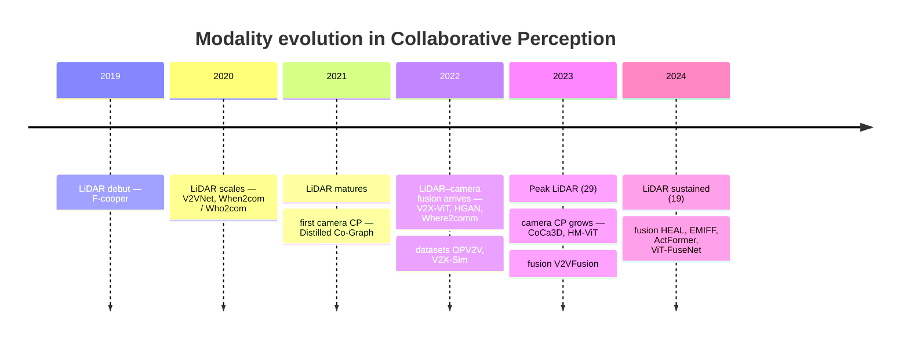
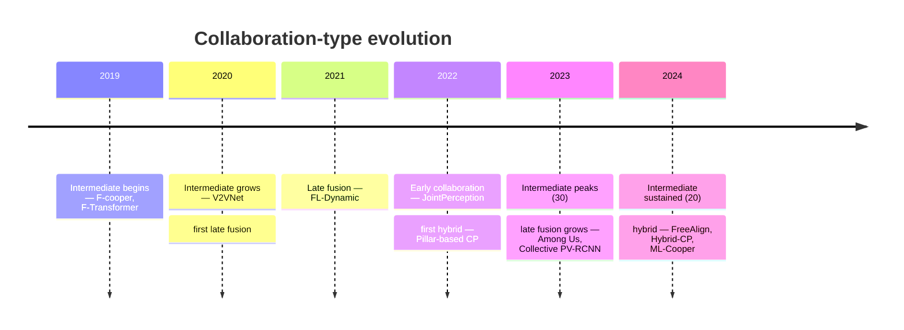
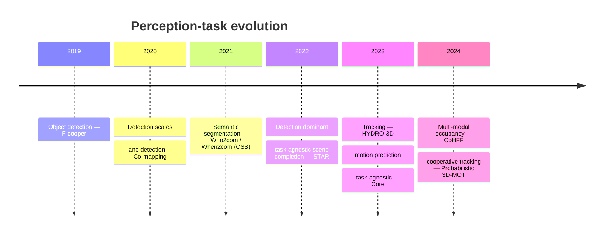

# Awesome Collaborative Perception [](https://awesome.re)

<div align="center">
<a href="A_Systematic_Literature_Review_on_Vehicular_Collaborative_PerceptionA_Computer_Vision_Perspective.pdf"></a>
<a href="https://github.com/lei-wan/awesome-collaborative-perception/stargazers"></a>
<a href="https://github.com/lei-wan/awesome-collaborative-perception/network/members"></a>
<a href="https://github.com/lei-wan/awesome-collaborative-perception/issues"></a>
</div>

This repository is organized directly around our survey paper, **"A Systematic Literature Review on Vehicular Collaborative Perception: A Computer Vision Perspective"** (*IEEE T-ITS, 2026*). Instead of a loose awesome-list, the README follows the survey taxonomy and presents each major classification as a structured Markdown table with paper metadata, paper links, and repository links when available.

- Survey scope: vehicular collaborative perception from a computer vision perspective
- Current collection: **106 papers**
- Source of truth: `collaborative-perception.bib`
- Generated from: `tools/data_extraction/readme_generator.py`
- Last generated: `2026-05-29`

<p align="center">

</p>

## Table of Contents

- [Related Reviews](#related-reviews)
- [Publication Statistics](#publication-statistics)
- [Structured Taxonomy](#structured-taxonomy)
- [Development Timeline](#development-timeline)
- [Modality Type](#modality-type)
  - [LiDAR](#lidar)
  - [Camera](#camera)
  - [LiDAR-Camera](#lidar-camera)
- [Collaboration Type](#collaboration-type)
  - [Early Collaboration](#early-collaboration)
  - [Intermediate Collaboration](#intermediate-collaboration)
  - [Late Collaboration](#late-collaboration)
  - [Hybrid Collaboration](#hybrid-collaboration)
- [Perception Tasks](#perception-tasks)
  - [Collaborative Object Detection](#collaborative-object-detection)
  - [Collaborative Semantic Segmentation](#collaborative-semantic-segmentation)
  - [Collaborative Object Tracking](#collaborative-object-tracking)
  - [Collaborative Motion Prediction](#collaborative-motion-prediction)
  - [Collaborative Lane Detection](#collaborative-lane-detection)
  - [Multi-Task and Task-Agnostic](#multi-task-and-task-agnostic)
- [Datasets](#datasets)
- [Forward-Snowballing Extension (2024–2026)](#forward-snowballing-extension-20242026)
- [Citation](#citation)
- [License](#license)

---

## Related Reviews

| Review | Year | Publication | Focus |
| --- | ---: | --- | --- |
| Bai et al. | 2022 | IEEE T-ITS | High-level overview of CP architecture and node structure |
| Caillot et al. | 2022 | IEEE T-ITS | Focus on localization, object detection, and tracking |
| Han et al. | 2023 | IEEE ITS Magazine | CP methods for both ideal and adverse scenarios |
| Liu et al. | 2023 | arXiv | Introduction to CP issues |
| Huang et al. | 2024 | arXiv | Framework proposal for CP |

Our survey emphasizes a PRISMA-style SLR process, a structured taxonomy, and a computer-vision-centric analysis of collaborative perception.

---

## Publication Statistics

These figures mirror **Table VIII** of the survey (aggregate, unique-study counts) so the repository stays consistent with the paper.

| Dimension | Categories (survey Table VIII) |
| --- | --- |
| **Modality** | LiDAR (63), Camera (13), LiDAR-Camera (12) |
| **Collaboration** | Early (6), Intermediate (71), Late (15), Hybrid (6) |
| **Task** | Object Detection (78), Semantic Segmentation (6), Object Tracking (5), Motion Prediction (3), Lane Detection (2), Multi-task (3), Task-agnostic (8) |
| **Region** | Asia (54), North America (38), Europe (13), Africa (1) |
| **Top venues** | ICRA (16), CVPR (8), IEEE T-IV (8), NeurIPS (8), ICCV (5), IEEE RA-L (5), IEEE ITSC (5), IEEE T-ITS (4), IEEE IoTJ (4), IEEE IV (4) |

> The per-section tables below enumerate the same studies from the survey's per-method Tables IX–XXIX. Minor per-axis count differences versus Table VIII arise from the survey's unique-study aggregation and an *Agnostic* modality not separated in Table VIII.

---
## Structured Taxonomy

The README follows the same three major axes used in the survey:

1. **Modality Type**: LiDAR, Camera, and LiDAR-Camera.
2. **Collaboration Type**: Early, Intermediate, Late, and Hybrid collaboration.
3. **Perception Tasks**: Object Detection, Semantic Segmentation, Object Tracking, Motion Prediction, Lane Detection, and Multi-Task / Task-Agnostic settings.

Every section below is rendered as a table so the repository can be used as a practical lookup index rather than only a narrative overview.

---

## Development Timeline

Development trajectory of vehicular collaborative perception along the three taxonomy axes
(milestone methods from the survey's Tables IX–XXIX; per-year counts from this collection).

### Modality trajectory

LiDAR anchored the field from the start; camera-only CP emerged around 2021–2023 and
LiDAR–camera fusion from 2022, but LiDAR still dominates (63 vs 13 vs 12 in the survey).



### Collaboration trajectory

Intermediate (feature-level) fusion became and stayed dominant (71); early, late and hybrid
schemes remain comparatively rare.



### Perception-task trajectory

Object detection dominated from the outset (78); segmentation, tracking, motion prediction,
lane detection and multi-task / task-agnostic settings emerged and broadened later.



---

## Modality Type

### LiDAR (68 papers)

| Paper | Venue | Year | Collaboration | Task | Paper Link | Repo Link |
| --- | --- | --- | --- | --- | --- | --- |
| Breaking Data Silos: Cross-Domain Learning for Multi-Agent Perception from Independent Private Sources | Proc. IEEE Int. Conf. Robot. Autom. (ICRA) | 2024 | Intermediate | Object Detection | [Paper](https://doi.org/10.1109/ICRA57147.2024.10610591) | [Repo](https://github.com/jinlong17/BDS-V2V) |
| CenterCoop: Center-Based Feature Aggregation for Communication-Efficient Vehicle-Infrastructure Cooperative 3D Object Detection | IEEE Robotics and Automation Letters | 2024 | Intermediate | Object Detection | [Paper](https://doi.org/10.1109/LRA.2023.3339399) | — |
| Collaborative Multi-Object Tracking With Conformal Uncertainty Propagation | IEEE Robotics and Automation Letters | 2024 | Late | Object Tracking | [Paper](https://doi.org/10.1109/LRA.2024.3364450) | — |
| EdgeCooper: Network-Aware Cooperative LiDAR Perception for Enhanced Vehicular Awareness | IEEE Journal on Selected Areas in Communications | 2024 | Early | Object Detection | [Paper](https://doi.org/10.1109/JSAC.2023.3322764) | — |
| Fast Clustering for Cooperative Perception Based on LiDAR Adaptive Dynamic Grid Encoding | Cognitive Computation | 2024 | Early | Object Detection | [Paper](https://doi.org/10.1007/s12559-023-10211-x) | — |
| HP3D-V2V: High-Precision 3D Object Detection Vehicle-to-Vehicle Cooperative Perception Algorithm | Sensors | 2024 | Intermediate | Object Detection | [Paper](https://doi.org/10.3390/s24072170) | — |
| Interruption-Aware Cooperative Perception for V2X Communication-Aided Autonomous Driving | IEEE Transactions on Intelligent Vehicles | 2024 | Intermediate | Object Detection | [Paper](https://doi.org/10.1109/TIV.2024.3371974) | — |
| MACP: Efficient Model Adaptation for Cooperative Perception | 2024 IEEE/CVF Winter Conference on Applications of Computer Vision (WACV) | 2024 | Intermediate | Object Detection | [Paper](https://doi.org/10.1109/WACV57701.2024.00334) | [Repo](https://github.com/PurdueDigitalTwin/MACP) |
| MKD-Cooper: Cooperative 3D Object Detection for Autonomous Driving via Multi-Teacher Knowledge Distillation | IEEE Transactions on Intelligent Vehicles | 2024 | Intermediate | Object Detection | [Paper](https://doi.org/10.1109/TIV.2023.3310580) | — |
| PAFNet: Pillar Attention Fusion Network for Vehicle--Infrastructure Cooperative Target Detection Using LiDAR | Symmetry | 2024 | Intermediate | Object Detection | [Paper](https://doi.org/10.3390/sym16040401) | — |
| Pillar Attention Encoder for Adaptive Cooperative Perception | IEEE Internet of Things Journal | 2024 | Intermediate | Object Detection | [Paper](https://doi.org/10.1109/JIOT.2024.3390552) | — |
| Practical Collaborative Perception: A Framework for Asynchronous and Multi-Agent 3D Object Detection | IEEE Transactions on Intelligent Transportation Systems | 2024 | Late | Object Detection | [Paper](https://doi.org/10.1109/TITS.2024.3371177) | — |
| Region-Based Hybrid Collaborative Perception for Connected Autonomous Vehicles | IEEE Transactions on Vehicular Technology | 2024 | Hybrid | Object Detection | [Paper](https://doi.org/10.1109/TVT.2023.3324439) | — |
| Robust Collaborative Perception without External Localization and Clock Devices | Proc. IEEE Int. Conf. Robot. Autom. (ICRA) | 2024 | Intermediate | Object Detection | [Paper](https://doi.org/10.1109/ICRA57147.2024.10610635) | — |
| S2R-ViT for Multi-Agent Cooperative Perception: Bridging the Gap from Simulation to Reality | Proc. IEEE Int. Conf. Robot. Autom. (ICRA) | 2024 | Intermediate | Object Detection | — | — |
| Select2Col: Leveraging Spatial-Temporal Importance of Semantic Information for Efficient Collaborative Perception | IEEE Trans. Veh. Technol. | 2024 | Intermediate | Object Detection | [Paper](https://doi.org/10.1109/TVT.2024.3390414) | [Repo](https://github.com/huangqzj/Select2Col/) |
| Self-Supervised Adaptive Weighting for Cooperative Perception in V2V Communications | IEEE Transactions on Intelligent Vehicles | 2024 | Intermediate | Object Detection | [Paper](https://doi.org/10.1109/TIV.2023.3345035) | — |
| Semantic Communication for Cooperative Perception Based on Importance Map | Journal of the Franklin Institute | 2024 | Intermediate | Object Detection | [Paper](https://doi.org/10.1016/j.jfranklin.2024.106739) | — |
| V2VFormer: Vehicle-to-Vehicle Cooperative Perception With Spatial-Channel Transformer | IEEE Transactions on Intelligent Vehicles | 2024 | Intermediate | Object Detection | [Paper](https://doi.org/10.1109/TIV.2024.3353254) | — |
| 3D Multi-Object Tracking Based on Two-Stage Data Association for Collaborative Perception Scenarios | 2023 IEEE Intelligent Vehicles Symposium (IV) | 2023 | Late | Object Tracking | [Paper](https://doi.org/10.1109/IV55152.2023.10186777) | — |
| A Cooperative Perception System Robust to Localization Errors | 2023 IEEE Intelligent Vehicles Symposium (IV) | 2023 | Late | Object Detection | [Paper](https://doi.org/10.1109/IV55152.2023.10186727) | — |
| A LiDAR Semantic Segmentation Framework for the Cooperative Vehicle-Infrastructure System | 2023 IEEE 98th Vehicular Technology Conference (VTC2023-Fall) | 2023 | Intermediate | Semantic Segmentation | [Paper](https://doi.org/10.1109/VTC2023-Fall60731.2023.10333790) | — |
| Adaptive Feature Fusion for Cooperative Perception Using LiDAR Point Clouds | 2023 IEEE/CVF Winter Conference on Applications of Computer Vision (WACV) | 2023 | Intermediate | Object Detection | [Paper](https://doi.org/10.1109/WACV56688.2023.00124) | — |
| Among Us: Adversarially Robust Collaborative Perception by Consensus | 2023 IEEE/CVF International Conference on Computer Vision (ICCV) | 2023 | Late | Object Detection | [Paper](https://doi.org/10.1109/ICCV51070.2023.00024) | — |
| Asynchrony-Robust Collaborative Perception via Bird's Eye View Flow | Adv. Neural Inf. Process. Syst. (NeurIPS) | 2023 | Intermediate | Object Detection | — | [Repo](https://github.com/MediaBrain-SJTU/CoBEVFlow) |
| Bridging the Domain Gap for Multi-Agent Perception | 2023 IEEE International Conference on Robotics and Automation (ICRA) | 2023 | Intermediate | Object Detection | [Paper](https://doi.org/10.1109/ICRA48891.2023.10160871) | — |
| Collaborative 3D Object Detection for Autonomous Vehicles via Learnable Communications | IEEE Transactions on Intelligent Transportation Systems | 2023 | Intermediate | Object Detection | [Paper](https://doi.org/10.1109/TITS.2023.3272027) | — |
| Collective PV-RCNN: A Novel Fusion Technique Using Collective Detections for Enhanced Local LiDAR-Based Perception | 2023 IEEE 26th International Conference on Intelligent Transportation Systems (ITSC) | 2023 | Late | Object Detection | [Paper](https://doi.org/10.1109/ITSC57777.2023.10422079) | — |
| Cooperative Perception With Learning-Based V2V Communications | IEEE Wireless Communications Letters | 2023 | Hybrid | Object Detection | [Paper](https://doi.org/10.1109/LWC.2023.3295612) | — |
| Core: Cooperative Reconstruction for Multi-Agent Perception | 2023 IEEE/CVF International Conference on Computer Vision (ICCV) | 2023 | Intermediate | Object Detection, Multi-Task & Task-Agnostic | [Paper](https://doi.org/10.1109/ICCV51070.2023.00800) | — |
| DI-V2X: Learning Domain-Invariant Representation for Vehicle-Infrastructure Collaborative 3D Object Detection | Proc. AAAI Conf. Artif. Intell. (AAAI) | 2023 | Intermediate | Object Detection | [Paper](https://doi.org/10.1609/aaai.v38i4.28105) | [Repo](https://github.com/Serenos/DI-V2X) |
| DUSA: Decoupled Unsupervised Sim2Real Adaptation for Vehicle-to-Everything Collaborative Perception | Proceedings of the 31st ACM International Conference on Multimedia | 2023 | Intermediate | Object Detection | [Paper](https://doi.org/10.1145/3581783.3611948) | — |
| Dynamic Feature Sharing for Cooperative Perception from Point Clouds | 2023 IEEE 26th International Conference on Intelligent Transportation Systems (ITSC) | 2023 | Intermediate | Object Detection | [Paper](https://doi.org/10.1109/ITSC57777.2023.10422242) | — |
| FeaCo: Reaching Robust Feature-Level Consensus in Noisy Pose Conditions | Proceedings of the 31st ACM International Conference on Multimedia | 2023 | Intermediate | Object Detection | [Paper](https://doi.org/10.1145/3581783.3611880) | — |
| Flow-Based Feature Fusion for Vehicle-Infrastructure Cooperative 3D Object Detection | Adv. Neural Inf. Process. Syst. (NeurIPS) | 2023 | Intermediate | Object Detection | — | [Repo](https://github.com/haibao-yu/FFNet-VIC3D) |
| Generating Evidential BEV Maps in Continuous Driving Space | ISPRS Journal of Photogrammetry and Remote Sensing | 2023 | Early | Object Detection, Multi-Task & Task-Agnostic | [Paper](https://doi.org/10.1016/j.isprsjprs.2023.08.013) | — |
| How2comm: Communication-Efficient and Collaboration-Pragmatic Multi-Agent Perception | Adv. Neural Inf. Process. Syst. (NeurIPS) | 2023 | Intermediate | Object Detection | — | [Repo](https://github.com/ydk122024/How2comm) |
| HPL-ViT: A Unified Perception Framework for Heterogeneous Parallel LiDARs in V2V | Proc. IEEE Int. Conf. Robot. Autom. (ICRA) | 2023 | Intermediate | Object Detection | [Paper](https://doi.org/10.1109/ICRA57147.2024.10611424) | — |
| HYDRO-3D: Hybrid Object Detection and Tracking for Cooperative Perception Using 3D LiDAR | IEEE Transactions on Intelligent Vehicles | 2023 | Intermediate | Object Detection | [Paper](https://doi.org/10.1109/TIV.2023.3282567) | — |
| Learning for Vehicle-to-Vehicle Cooperative Perception Under Lossy Communication | IEEE Transactions on Intelligent Vehicles | 2023 | Intermediate | Object Detection | [Paper](https://doi.org/10.1109/TIV.2023.3260040) | — |
| Model-Agnostic Multi-Agent Perception Framework | 2023 IEEE International Conference on Robotics and Automation (ICRA) | 2023 | Late | Object Detection | [Paper](https://doi.org/10.1109/ICRA48891.2023.10161460) | — |
| Robust Collaborative 3D Object Detection in Presence of Pose Errors | 2023 IEEE International Conference on Robotics and Automation (ICRA) | 2023 | Intermediate | Object Detection | [Paper](https://doi.org/10.1109/ICRA48891.2023.10160546) | [Repo](https://github.com/yifanlu0227/CoAlign) |
| Robust Real-time Multi-vehicle Collaboration on Asynchronous Sensors | Proceedings of the 29th Annual International Conference on Mobile Computing and Networking | 2023 | Early | Object Detection | [Paper](https://doi.org/10.1145/3570361.3613271) | — |
| Spatio-Temporal Domain Awareness for Multi-Agent Collaborative Perception | 2023 IEEE/CVF International Conference on Computer Vision (ICCV) | 2023 | Intermediate | Object Detection | [Paper](https://doi.org/10.1109/ICCV51070.2023.02137) | — |
| UMC: A Unified Bandwidth-efficient and Multi-resolution Based Collaborative Perception Framework | 2023 IEEE/CVF International Conference on Computer Vision (ICCV) | 2023 | Intermediate | Object Detection | [Paper](https://doi.org/10.1109/ICCV51070.2023.00752) | — |
| Uncertainty Quantification of Collaborative Detection for Self-Driving | Proc. IEEE Int. Conf. Robot. Autom. (ICRA) | 2023 | Intermediate | Object Detection | [Paper](https://doi.org/10.1109/ICRA48891.2023.10160367) | — |
| VINet: Lightweight, Scalable, and Heterogeneous Cooperative Perception for 3D Object Detection | Mechanical Systems and Signal Processing | 2023 | Intermediate | Object Detection | [Paper](https://doi.org/10.1016/j.ymssp.2023.110723) | — |
| What2comm: Towards Communication-efficient Collaborative Perception via Feature Decoupling | Proceedings of the 31st ACM International Conference on Multimedia | 2023 | Intermediate | Object Detection | [Paper](https://doi.org/10.1145/3581783.3611699) | — |
| A Joint Perception Scheme For Connected Vehicles | 2022 IEEE Sensors | 2022 | Early | Object Detection | [Paper](https://doi.org/10.1109/SENSORS52175.2022.9967271) | — |
| Complementarity-Enhanced and Redundancy-Minimized Collaboration Network for Multi-agent Perception | Proceedings of the 30th ACM International Conference on Multimedia | 2022 | Intermediate | Object Detection | [Paper](https://doi.org/10.1145/3503161.3548197) | — |
| F-Transformer: Point Cloud Fusion Transformer for Cooperative 3D Object Detection | Artificial Neural Networks and Machine Learning -- ICANN 2022 | 2022 | Intermediate | Object Detection | [Paper](https://doi.org/10.1007/978-3-031-15919-0_15) | — |
| Keypoints-Based Deep Feature Fusion for Cooperative Vehicle Detection of Autonomous Driving | IEEE Robotics and Automation Letters | 2022 | Intermediate | Object Detection | [Paper](https://doi.org/10.1109/LRA.2022.3143299) | — |
| Latency-Aware Collaborative Perception | Computer Vision - ECCV 2022 - 17th European Conference, Tel Aviv, Israel, October 23-27, 2022, Proceedings, Part XXXII | 2022 | Intermediate | Object Detection | [Paper](https://doi.org/10.1007/978-3-031-19824-3_19) | — |
| Multi-Modal Virtual-Real Fusion Based Transformer for Collaborative Perception | 2022 IEEE 13th International Symposium on Parallel Architectures, Algorithms and Programming (PAAP) | 2022 | Intermediate | Object Detection | [Paper](https://doi.org/10.1109/PAAP56126.2022.10010640) | — |
| Multi-Robot Scene Completion: Towards Task-Agnostic Collaborative Perception | Proc. Conf. Robot Learn. (CoRL) | 2022 | Early | Object Detection, Semantic Segmentation, Multi-Task & Task-Agnostic | [Paper](https://coperception.github.io/star/) | — |
| Pillar-Based Cooperative Perception from Point Clouds for 6G-Enabled Cooperative Autonomous Vehicles | Wireless Communications and Mobile Computing | 2022 | Early | Object Detection | [Paper](https://doi.org/10.1155/2022/3646272) | — |
| PillarGrid: Deep Learning-Based Cooperative Perception for 3D Object Detection from Onboard-Roadside LiDAR | 2022 IEEE 25th International Conference on Intelligent Transportation Systems (ITSC) | 2022 | Intermediate | Object Detection | [Paper](https://doi.org/10.1109/ITSC55140.2022.9921947) | — |
| Slim-FCP: Lightweight-Feature-Based Cooperative Perception for Connected Automated Vehicles | IEEE Internet of Things Journal | 2022 | Intermediate | Object Detection | [Paper](https://doi.org/10.1109/JIOT.2022.3153260) | — |
| Soft Actor--Critic-Based Multilevel Cooperative Perception for Connected Autonomous Vehicles | IEEE Internet of Things Journal | 2022 | Hybrid | Object Detection | [Paper](https://doi.org/10.1109/JIOT.2022.3179739) | — |
| V2X-ViT: Vehicle-to-Everything Cooperative Perception with Vision Transformer | Computer Vision -- ECCV 2022 | 2022 | Intermediate | Object Detection | [Paper](https://doi.org/10.1007/978-3-031-19842-7_7) | [Repo](https://github.com/DerrickXuNu/v2x-vit) |
| CoFF: Cooperative Spatial Feature Fusion for 3-D Object Detection on Autonomous Vehicles | IEEE Internet of Things Journal | 2021 | Intermediate | Object Detection | [Paper](https://doi.org/10.1109/JIOT.2021.3053184) | — |
| Distributed Dynamic Map Fusion via Federated Learning for Intelligent Networked Vehicles | 2021 IEEE International Conference on Robotics and Automation (ICRA) | 2021 | Late | Object Detection | [Paper](https://doi.org/10.1109/ICRA48506.2021.9561612) | — |
| Learning Distilled Collaboration Graph for Multi-Agent Perception | Advances in Neural Information Processing Systems | 2021 | Intermediate | Object Detection | — | [Repo](https://github.com/ai4ce/DiscoNet) |
| Learning to Communicate and Correct Pose Errors | Proceedings of the 2020 Conference on Robot Learning | 2021 | Intermediate | Object Detection | — | — |
| Bandwidth-Adaptive Feature Sharing for Cooperative LIDAR Object Detection | 2020 IEEE 3rd Connected and Automated Vehicles Symposium (CAVS) | 2020 | Intermediate | Object Detection | [Paper](https://doi.org/10.1109/CAVS51000.2020.9334618) | — |
| Cooperative LIDAR Object Detection via Feature Sharing in Deep Networks | 2020 IEEE 92nd Vehicular Technology Conference (VTC2020-Fall) | 2020 | Intermediate | Object Detection | [Paper](https://doi.org/10.1109/VTC2020-Fall49728.2020.9348723) | — |
| V2VNet: Vehicle-to-Vehicle Communication for Joint Perception and Prediction | Computer Vision -- ECCV 2020 | 2020 | Intermediate | Object Detection | [Paper](https://doi.org/10.1007/978-3-030-58536-5_36) | — |
| F-Cooper: Feature Based Cooperative Perception for Autonomous Vehicle Edge Computing System Using 3D Point Clouds | Proceedings of the 4th ACM/IEEE Symposium on Edge Computing | 2019 | Intermediate | Object Detection | [Paper](https://doi.org/10.1145/3318216.3363300) | — |

### Camera (13 papers)

| Paper | Venue | Year | Collaboration | Task | Paper Link | Repo Link |
| --- | --- | --- | --- | --- | --- | --- |
| ActFormer: Scalable Collaborative Perception via Active Queries | Proc. IEEE Int. Conf. Robot. Autom. (ICRA) | 2024 | Intermediate | Object Detection | [Paper](https://doi.org/10.1109/ICRA57147.2024.10610907) | — |
| Collaborative Semantic Occupancy Prediction with Hybrid Feature Fusion in Connected Automated Vehicles | Proc. IEEE/CVF Conf. Comput. Vis. Pattern Recognit. (CVPR) | 2024 | Intermediate | Semantic Segmentation, Multi-Task & Task-Agnostic | [Paper](https://doi.org/10.1109/CVPR52733.2024.01704) | — |
| EMIFF: Enhanced Multi-scale Image Feature Fusion for Vehicle-Infrastructure Cooperative 3D Object Detection | Proc. IEEE Int. Conf. Robot. Autom. (ICRA) | 2024 | Intermediate | Object Detection | [Paper](https://doi.org/10.1109/ICRA57147.2024.10610545) | — |
| Enhancing Lane Detection with a Lightweight Collaborative Late Fusion Model | Robotics and Autonomous Systems | 2024 | Late | Lane Detection | [Paper](https://doi.org/10.1016/j.robot.2024.104680) | — |
| CoBEVT: Cooperative Bird's Eye View Semantic Segmentation with Sparse Transformers | Proceedings of The 6th Conference on Robot Learning | 2023 | Intermediate | Semantic Segmentation | — | [Repo](https://github.com/DerrickXuNu/CoBEVT) |
| CoLD Fusion: A Real-time Capable Spline-based Fusion Algorithm for Collective Lane Detection | 2023 IEEE Intelligent Vehicles Symposium (IV) | 2023 | Late | Lane Detection | [Paper](https://doi.org/10.1109/IV55152.2023.10186632) | — |
| Collaboration Helps Camera Overtake LiDAR in 3D Detection | 2023 IEEE/CVF Conference on Computer Vision and Pattern Recognition (CVPR) | 2023 | Intermediate | Object Detection | [Paper](https://doi.org/10.1109/CVPR52729.2023.00892) | — |
| MoRFF: Multi-View Object Detection for Connected Autonomous Driving under Communication and Localization Limitations | 2023 IEEE 98th Vehicular Technology Conference (VTC2023-Fall) | 2023 | Intermediate | Object Detection | [Paper](https://doi.org/10.1109/VTC2023-Fall60731.2023.10333428) | — |
| QUEST: Query Stream for Practical Cooperative Perception | Proc. IEEE Int. Conf. Robot. Autom. (ICRA) | 2023 | Intermediate | Object Detection | [Paper](https://doi.org/10.1109/ICRA57147.2024.10610412) | — |
| Bandwidth Constrained Cooperative Object Detection in Images | Artificial Intelligence and Machine Learning in Defense Applications IV | 2022 | Intermediate | Object Detection | [Paper](https://doi.org/10.1117/12.2636279) | — |
| Overcoming Obstructions via Bandwidth-Limited Multi-Agent Spatial Handshaking | 2021 IEEE/RSJ International Conference on Intelligent Robots and Systems (IROS) | 2021 | Intermediate | Semantic Segmentation | [Paper](https://doi.org/10.1109/IROS51168.2021.9636761) | — |
| When2com: Multi-Agent Perception via Communication Graph Grouping | 2020 IEEE/CVF Conference on Computer Vision and Pattern Recognition (CVPR) | 2020 | Intermediate | Semantic Segmentation | [Paper](https://doi.org/10.1109/CVPR42600.2020.00416) | — |
| Who2com: Collaborative Perception via Learnable Handshake Communication | 2020 IEEE International Conference on Robotics and Automation (ICRA) | 2020 | Intermediate | Semantic Segmentation | [Paper](https://doi.org/10.1109/ICRA40945.2020.9197364) | — |

### LiDAR-Camera (13 papers)

| Paper | Venue | Year | Collaboration | Task | Paper Link | Repo Link |
| --- | --- | --- | --- | --- | --- | --- |
| DeepAccident: A Motion and Accident Prediction Benchmark for V2X Autonomous Driving | Proceedings of the AAAI Conference on Artificial Intelligence | 2024 | V2V & V2I | Dataset / Benchmark | [Paper](https://doi.org/10.1609/aaai.v38i6.28370) | — |
| TUMTraf V2X Cooperative Perception Dataset | Proc. IEEE/CVF Conf. Comput. Vis. Pattern Recognit. (CVPR) | 2024 | V2I | Dataset / Benchmark | [Paper](https://doi.org/10.1109/CVPR52733.2024.02139) | — |
| V2VFormer++: Multi-Modal Vehicle-to-Vehicle Cooperative Perception via Global-Local Transformer | IEEE Transactions on Intelligent Transportation Systems | 2024 | Intermediate | Object Detection | [Paper](https://doi.org/10.1109/TITS.2023.3314919) | — |
| ViT-FuseNet: Multimodal Fusion of Vision Transformer for Vehicle-Infrastructure Cooperative Perception | IEEE access : practical innovations, open solutions | 2024 | Intermediate | Object Detection | [Paper](https://doi.org/10.1109/ACCESS.2024.3368404) | — |
| MCoT: Multi-Modal Vehicle-to-Vehicle Cooperative Perception with Transformers | 2023 IEEE 29th International Conference on Parallel and Distributed Systems (ICPADS) | 2023 | Intermediate | Object Detection | [Paper](https://doi.org/10.1109/ICPADS60453.2023.00226) | — |
| Multimodal Cooperative 3D Object Detection Over Connected Vehicles for Autonomous Driving | IEEE Network | 2023 | Intermediate | Object Detection | [Paper](https://doi.org/10.1109/MNET.010.2300029) | — |
| V2VFusion: Multimodal Fusion for Enhanced Vehicle-to-Vehicle Cooperative Perception | 2023 China Automation Congress (CAC) | 2023 | Intermediate | Object Detection | [Paper](https://doi.org/10.1109/CAC59555.2023.10450676) | — |
| V2X-Seq: A Large-Scale Sequential Dataset for Vehicle-Infrastructure Cooperative Perception and Forecasting | 2023 IEEE/CVF Conference on Computer Vision and Pattern Recognition (CVPR) | 2023 | V2I | Dataset / Benchmark | [Paper](https://doi.org/10.1109/CVPR52729.2023.00531) | [Repo](https://github.com/AIR-THU/DAIR-V2X-Seq) |
| DAIR-V2X: A Large-Scale Dataset for Vehicle-Infrastructure Cooperative 3D Object Detection | 2022 IEEE/CVF Conference on Computer Vision and Pattern Recognition (CVPR) | 2022 | V2I | Dataset / Benchmark | [Paper](https://doi.org/10.1109/CVPR52688.2022.02067) | [Repo](https://github.com/AIR-THU/DAIR-V2X) |
| DOLPHINS: Dataset for Collaborative Perception Enabled Harmonious and Interconnected Self-driving | Computer Vision -- ACCV 2022 | 2022 | V2V & V2I | Dataset / Benchmark | [Paper](https://doi.org/10.1007/978-3-031-26348-4_29) | — |
| Multistage Fusion Approach of Lidar and Camera for Vehicle-Infrastructure Cooperative Object Detection | 2022 5th World Conference on Mechanical Engineering and Intelligent Manufacturing (WCMEIM) | 2022 | Intermediate | Object Detection | [Paper](https://doi.org/10.1109/WCMEIM56910.2022.10021459) | — |
| OPV2V: An Open Benchmark Dataset and Fusion Pipeline for Perception with Vehicle-to-Vehicle Communication | 2022 International Conference on Robotics and Automation (ICRA) | 2022 | V2V | Dataset / Benchmark | [Paper](https://doi.org/10.1109/ICRA46639.2022.9812038) | — |
| Where2comm: Communication-Efficient Collaborative Perception via Spatial Confidence Maps | Adv. Neural Inf. Process. Syst. (NeurIPS) | 2022 | Intermediate | Object Detection | — | [Repo](https://github.com/MediaBrain-SJTU/where2comm) |

---

## Collaboration Type

### Early Collaboration (7 papers)

| Paper | Venue | Year | Modality | Task | Paper Link | Repo Link |
| --- | --- | --- | --- | --- | --- | --- |
| EdgeCooper: Network-Aware Cooperative LiDAR Perception for Enhanced Vehicular Awareness | IEEE Journal on Selected Areas in Communications | 2024 | LiDAR | Object Detection | [Paper](https://doi.org/10.1109/JSAC.2023.3322764) | — |
| Fast Clustering for Cooperative Perception Based on LiDAR Adaptive Dynamic Grid Encoding | Cognitive Computation | 2024 | LiDAR | Object Detection | [Paper](https://doi.org/10.1007/s12559-023-10211-x) | — |
| Generating Evidential BEV Maps in Continuous Driving Space | ISPRS Journal of Photogrammetry and Remote Sensing | 2023 | LiDAR | Object Detection, Multi-Task & Task-Agnostic | [Paper](https://doi.org/10.1016/j.isprsjprs.2023.08.013) | — |
| Robust Real-time Multi-vehicle Collaboration on Asynchronous Sensors | Proceedings of the 29th Annual International Conference on Mobile Computing and Networking | 2023 | LiDAR | Object Detection | [Paper](https://doi.org/10.1145/3570361.3613271) | — |
| A Joint Perception Scheme For Connected Vehicles | 2022 IEEE Sensors | 2022 | LiDAR | Object Detection | [Paper](https://doi.org/10.1109/SENSORS52175.2022.9967271) | — |
| Multi-Robot Scene Completion: Towards Task-Agnostic Collaborative Perception | Proc. Conf. Robot Learn. (CoRL) | 2022 | LiDAR | Object Detection, Semantic Segmentation, Multi-Task & Task-Agnostic | [Paper](https://coperception.github.io/star/) | — |
| Pillar-Based Cooperative Perception from Point Clouds for 6G-Enabled Cooperative Autonomous Vehicles | Wireless Communications and Mobile Computing | 2022 | LiDAR | Object Detection | [Paper](https://doi.org/10.1155/2022/3646272) | — |

### Intermediate Collaboration (71 papers)

| Paper | Venue | Year | Modality | Task | Paper Link | Repo Link |
| --- | --- | --- | --- | --- | --- | --- |
| ActFormer: Scalable Collaborative Perception via Active Queries | Proc. IEEE Int. Conf. Robot. Autom. (ICRA) | 2024 | Camera | Object Detection | [Paper](https://doi.org/10.1109/ICRA57147.2024.10610907) | — |
| An Extensible Framework for Open Heterogeneous Collaborative Perception | Proc. Int. Conf. Learn. Represent. (ICLR) | 2024 | Agnostic | Object Detection | — | — |
| Breaking Data Silos: Cross-Domain Learning for Multi-Agent Perception from Independent Private Sources | Proc. IEEE Int. Conf. Robot. Autom. (ICRA) | 2024 | LiDAR | Object Detection | [Paper](https://doi.org/10.1109/ICRA57147.2024.10610591) | [Repo](https://github.com/jinlong17/BDS-V2V) |
| CenterCoop: Center-Based Feature Aggregation for Communication-Efficient Vehicle-Infrastructure Cooperative 3D Object Detection | IEEE Robotics and Automation Letters | 2024 | LiDAR | Object Detection | [Paper](https://doi.org/10.1109/LRA.2023.3339399) | — |
| Collaborative Semantic Occupancy Prediction with Hybrid Feature Fusion in Connected Automated Vehicles | Proc. IEEE/CVF Conf. Comput. Vis. Pattern Recognit. (CVPR) | 2024 | Camera | Semantic Segmentation, Multi-Task & Task-Agnostic | [Paper](https://doi.org/10.1109/CVPR52733.2024.01704) | — |
| EMIFF: Enhanced Multi-scale Image Feature Fusion for Vehicle-Infrastructure Cooperative 3D Object Detection | Proc. IEEE Int. Conf. Robot. Autom. (ICRA) | 2024 | Camera | Object Detection | [Paper](https://doi.org/10.1109/ICRA57147.2024.10610545) | — |
| HP3D-V2V: High-Precision 3D Object Detection Vehicle-to-Vehicle Cooperative Perception Algorithm | Sensors | 2024 | LiDAR | Object Detection | [Paper](https://doi.org/10.3390/s24072170) | — |
| Interruption-Aware Cooperative Perception for V2X Communication-Aided Autonomous Driving | IEEE Transactions on Intelligent Vehicles | 2024 | LiDAR | Object Detection | [Paper](https://doi.org/10.1109/TIV.2024.3371974) | — |
| MACP: Efficient Model Adaptation for Cooperative Perception | 2024 IEEE/CVF Winter Conference on Applications of Computer Vision (WACV) | 2024 | LiDAR | Object Detection | [Paper](https://doi.org/10.1109/WACV57701.2024.00334) | [Repo](https://github.com/PurdueDigitalTwin/MACP) |
| MKD-Cooper: Cooperative 3D Object Detection for Autonomous Driving via Multi-Teacher Knowledge Distillation | IEEE Transactions on Intelligent Vehicles | 2024 | LiDAR | Object Detection | [Paper](https://doi.org/10.1109/TIV.2023.3310580) | — |
| PAFNet: Pillar Attention Fusion Network for Vehicle--Infrastructure Cooperative Target Detection Using LiDAR | Symmetry | 2024 | LiDAR | Object Detection | [Paper](https://doi.org/10.3390/sym16040401) | — |
| Pillar Attention Encoder for Adaptive Cooperative Perception | IEEE Internet of Things Journal | 2024 | LiDAR | Object Detection | [Paper](https://doi.org/10.1109/JIOT.2024.3390552) | — |
| Robust Collaborative Perception without External Localization and Clock Devices | Proc. IEEE Int. Conf. Robot. Autom. (ICRA) | 2024 | LiDAR | Object Detection | [Paper](https://doi.org/10.1109/ICRA57147.2024.10610635) | — |
| S2R-ViT for Multi-Agent Cooperative Perception: Bridging the Gap from Simulation to Reality | Proc. IEEE Int. Conf. Robot. Autom. (ICRA) | 2024 | LiDAR | Object Detection | — | — |
| Select2Col: Leveraging Spatial-Temporal Importance of Semantic Information for Efficient Collaborative Perception | IEEE Trans. Veh. Technol. | 2024 | LiDAR | Object Detection | [Paper](https://doi.org/10.1109/TVT.2024.3390414) | [Repo](https://github.com/huangqzj/Select2Col/) |
| Self-Supervised Adaptive Weighting for Cooperative Perception in V2V Communications | IEEE Transactions on Intelligent Vehicles | 2024 | LiDAR | Object Detection | [Paper](https://doi.org/10.1109/TIV.2023.3345035) | — |
| Semantic Communication for Cooperative Perception Based on Importance Map | Journal of the Franklin Institute | 2024 | LiDAR | Object Detection | [Paper](https://doi.org/10.1016/j.jfranklin.2024.106739) | — |
| V2VFormer++: Multi-Modal Vehicle-to-Vehicle Cooperative Perception via Global-Local Transformer | IEEE Transactions on Intelligent Transportation Systems | 2024 | LiDAR-Camera | Object Detection | [Paper](https://doi.org/10.1109/TITS.2023.3314919) | — |
| V2VFormer: Vehicle-to-Vehicle Cooperative Perception With Spatial-Channel Transformer | IEEE Transactions on Intelligent Vehicles | 2024 | LiDAR | Object Detection | [Paper](https://doi.org/10.1109/TIV.2024.3353254) | — |
| ViT-FuseNet: Multimodal Fusion of Vision Transformer for Vehicle-Infrastructure Cooperative Perception | IEEE access : practical innovations, open solutions | 2024 | LiDAR-Camera | Object Detection | [Paper](https://doi.org/10.1109/ACCESS.2024.3368404) | — |
| A LiDAR Semantic Segmentation Framework for the Cooperative Vehicle-Infrastructure System | 2023 IEEE 98th Vehicular Technology Conference (VTC2023-Fall) | 2023 | LiDAR | Semantic Segmentation | [Paper](https://doi.org/10.1109/VTC2023-Fall60731.2023.10333790) | — |
| Adaptive Feature Fusion for Cooperative Perception Using LiDAR Point Clouds | 2023 IEEE/CVF Winter Conference on Applications of Computer Vision (WACV) | 2023 | LiDAR | Object Detection | [Paper](https://doi.org/10.1109/WACV56688.2023.00124) | — |
| Asynchrony-Robust Collaborative Perception via Bird's Eye View Flow | Adv. Neural Inf. Process. Syst. (NeurIPS) | 2023 | LiDAR | Object Detection | — | [Repo](https://github.com/MediaBrain-SJTU/CoBEVFlow) |
| BEV-V2X: Cooperative Birds-Eye-View Fusion and Grid Occupancy Prediction via V2X-Based Data Sharing | IEEE Transactions on Intelligent Vehicles | 2023 | Agnostic | Motion Prediction, Multi-Task & Task-Agnostic | [Paper](https://doi.org/10.1109/TIV.2023.3293954) | — |
| Bridging the Domain Gap for Multi-Agent Perception | 2023 IEEE International Conference on Robotics and Automation (ICRA) | 2023 | LiDAR | Object Detection | [Paper](https://doi.org/10.1109/ICRA48891.2023.10160871) | — |
| CoBEVT: Cooperative Bird's Eye View Semantic Segmentation with Sparse Transformers | Proceedings of The 6th Conference on Robot Learning | 2023 | Camera | Semantic Segmentation | — | [Repo](https://github.com/DerrickXuNu/CoBEVT) |
| Collaboration Helps Camera Overtake LiDAR in 3D Detection | 2023 IEEE/CVF Conference on Computer Vision and Pattern Recognition (CVPR) | 2023 | Camera | Object Detection | [Paper](https://doi.org/10.1109/CVPR52729.2023.00892) | — |
| Collaborative 3D Object Detection for Autonomous Vehicles via Learnable Communications | IEEE Transactions on Intelligent Transportation Systems | 2023 | LiDAR | Object Detection | [Paper](https://doi.org/10.1109/TITS.2023.3272027) | — |
| Core: Cooperative Reconstruction for Multi-Agent Perception | 2023 IEEE/CVF International Conference on Computer Vision (ICCV) | 2023 | LiDAR | Object Detection, Multi-Task & Task-Agnostic | [Paper](https://doi.org/10.1109/ICCV51070.2023.00800) | — |
| DI-V2X: Learning Domain-Invariant Representation for Vehicle-Infrastructure Collaborative 3D Object Detection | Proc. AAAI Conf. Artif. Intell. (AAAI) | 2023 | LiDAR | Object Detection | [Paper](https://doi.org/10.1609/aaai.v38i4.28105) | [Repo](https://github.com/Serenos/DI-V2X) |
| DUSA: Decoupled Unsupervised Sim2Real Adaptation for Vehicle-to-Everything Collaborative Perception | Proceedings of the 31st ACM International Conference on Multimedia | 2023 | LiDAR | Object Detection | [Paper](https://doi.org/10.1145/3581783.3611948) | — |
| Dynamic Feature Sharing for Cooperative Perception from Point Clouds | 2023 IEEE 26th International Conference on Intelligent Transportation Systems (ITSC) | 2023 | LiDAR | Object Detection | [Paper](https://doi.org/10.1109/ITSC57777.2023.10422242) | — |
| FeaCo: Reaching Robust Feature-Level Consensus in Noisy Pose Conditions | Proceedings of the 31st ACM International Conference on Multimedia | 2023 | LiDAR | Object Detection | [Paper](https://doi.org/10.1145/3581783.3611880) | — |
| Flow-Based Feature Fusion for Vehicle-Infrastructure Cooperative 3D Object Detection | Adv. Neural Inf. Process. Syst. (NeurIPS) | 2023 | LiDAR | Object Detection | — | [Repo](https://github.com/haibao-yu/FFNet-VIC3D) |
| HM-ViT: Hetero-modal Vehicle-to-Vehicle Cooperative Perception with Vision Transformer | 2023 IEEE/CVF International Conference on Computer Vision (ICCV) | 2023 | Agnostic | Object Detection | [Paper](https://doi.org/10.1109/ICCV51070.2023.00033) | [Repo](https://github.com/XHwind/HM-ViT) |
| How2comm: Communication-Efficient and Collaboration-Pragmatic Multi-Agent Perception | Adv. Neural Inf. Process. Syst. (NeurIPS) | 2023 | LiDAR | Object Detection | — | [Repo](https://github.com/ydk122024/How2comm) |
| HPL-ViT: A Unified Perception Framework for Heterogeneous Parallel LiDARs in V2V | Proc. IEEE Int. Conf. Robot. Autom. (ICRA) | 2023 | LiDAR | Object Detection | [Paper](https://doi.org/10.1109/ICRA57147.2024.10611424) | — |
| HYDRO-3D: Hybrid Object Detection and Tracking for Cooperative Perception Using 3D LiDAR | IEEE Transactions on Intelligent Vehicles | 2023 | LiDAR | Object Detection | [Paper](https://doi.org/10.1109/TIV.2023.3282567) | — |
| Learning for Vehicle-to-Vehicle Cooperative Perception Under Lossy Communication | IEEE Transactions on Intelligent Vehicles | 2023 | LiDAR | Object Detection | [Paper](https://doi.org/10.1109/TIV.2023.3260040) | — |
| MCoT: Multi-Modal Vehicle-to-Vehicle Cooperative Perception with Transformers | 2023 IEEE 29th International Conference on Parallel and Distributed Systems (ICPADS) | 2023 | LiDAR-Camera | Object Detection | [Paper](https://doi.org/10.1109/ICPADS60453.2023.00226) | — |
| MoRFF: Multi-View Object Detection for Connected Autonomous Driving under Communication and Localization Limitations | 2023 IEEE 98th Vehicular Technology Conference (VTC2023-Fall) | 2023 | Camera | Object Detection | [Paper](https://doi.org/10.1109/VTC2023-Fall60731.2023.10333428) | — |
| Multimodal Cooperative 3D Object Detection Over Connected Vehicles for Autonomous Driving | IEEE Network | 2023 | LiDAR-Camera | Object Detection | [Paper](https://doi.org/10.1109/MNET.010.2300029) | — |
| QUEST: Query Stream for Practical Cooperative Perception | Proc. IEEE Int. Conf. Robot. Autom. (ICRA) | 2023 | Camera | Object Detection | [Paper](https://doi.org/10.1109/ICRA57147.2024.10610412) | — |
| Robust Collaborative 3D Object Detection in Presence of Pose Errors | 2023 IEEE International Conference on Robotics and Automation (ICRA) | 2023 | LiDAR | Object Detection | [Paper](https://doi.org/10.1109/ICRA48891.2023.10160546) | [Repo](https://github.com/yifanlu0227/CoAlign) |
| Spatio-Temporal Domain Awareness for Multi-Agent Collaborative Perception | 2023 IEEE/CVF International Conference on Computer Vision (ICCV) | 2023 | LiDAR | Object Detection | [Paper](https://doi.org/10.1109/ICCV51070.2023.02137) | — |
| UMC: A Unified Bandwidth-efficient and Multi-resolution Based Collaborative Perception Framework | 2023 IEEE/CVF International Conference on Computer Vision (ICCV) | 2023 | LiDAR | Object Detection | [Paper](https://doi.org/10.1109/ICCV51070.2023.00752) | — |
| Uncertainty Quantification of Collaborative Detection for Self-Driving | Proc. IEEE Int. Conf. Robot. Autom. (ICRA) | 2023 | LiDAR | Object Detection | [Paper](https://doi.org/10.1109/ICRA48891.2023.10160367) | — |
| V2VFusion: Multimodal Fusion for Enhanced Vehicle-to-Vehicle Cooperative Perception | 2023 China Automation Congress (CAC) | 2023 | LiDAR-Camera | Object Detection | [Paper](https://doi.org/10.1109/CAC59555.2023.10450676) | — |
| VINet: Lightweight, Scalable, and Heterogeneous Cooperative Perception for 3D Object Detection | Mechanical Systems and Signal Processing | 2023 | LiDAR | Object Detection | [Paper](https://doi.org/10.1016/j.ymssp.2023.110723) | — |
| What2comm: Towards Communication-efficient Collaborative Perception via Feature Decoupling | Proceedings of the 31st ACM International Conference on Multimedia | 2023 | LiDAR | Object Detection | [Paper](https://doi.org/10.1145/3581783.3611699) | — |
| Bandwidth Constrained Cooperative Object Detection in Images | Artificial Intelligence and Machine Learning in Defense Applications IV | 2022 | Camera | Object Detection | [Paper](https://doi.org/10.1117/12.2636279) | — |
| Complementarity-Enhanced and Redundancy-Minimized Collaboration Network for Multi-agent Perception | Proceedings of the 30th ACM International Conference on Multimedia | 2022 | LiDAR | Object Detection | [Paper](https://doi.org/10.1145/3503161.3548197) | — |
| F-Transformer: Point Cloud Fusion Transformer for Cooperative 3D Object Detection | Artificial Neural Networks and Machine Learning -- ICANN 2022 | 2022 | LiDAR | Object Detection | [Paper](https://doi.org/10.1007/978-3-031-15919-0_15) | — |
| Keypoints-Based Deep Feature Fusion for Cooperative Vehicle Detection of Autonomous Driving | IEEE Robotics and Automation Letters | 2022 | LiDAR | Object Detection | [Paper](https://doi.org/10.1109/LRA.2022.3143299) | — |
| Latency-Aware Collaborative Perception | Computer Vision - ECCV 2022 - 17th European Conference, Tel Aviv, Israel, October 23-27, 2022, Proceedings, Part XXXII | 2022 | LiDAR | Object Detection | [Paper](https://doi.org/10.1007/978-3-031-19824-3_19) | — |
| Multi-Modal Virtual-Real Fusion Based Transformer for Collaborative Perception | 2022 IEEE 13th International Symposium on Parallel Architectures, Algorithms and Programming (PAAP) | 2022 | LiDAR | Object Detection | [Paper](https://doi.org/10.1109/PAAP56126.2022.10010640) | — |
| Multistage Fusion Approach of Lidar and Camera for Vehicle-Infrastructure Cooperative Object Detection | 2022 5th World Conference on Mechanical Engineering and Intelligent Manufacturing (WCMEIM) | 2022 | LiDAR-Camera | Object Detection | [Paper](https://doi.org/10.1109/WCMEIM56910.2022.10021459) | — |
| PillarGrid: Deep Learning-Based Cooperative Perception for 3D Object Detection from Onboard-Roadside LiDAR | 2022 IEEE 25th International Conference on Intelligent Transportation Systems (ITSC) | 2022 | LiDAR | Object Detection | [Paper](https://doi.org/10.1109/ITSC55140.2022.9921947) | — |
| Slim-FCP: Lightweight-Feature-Based Cooperative Perception for Connected Automated Vehicles | IEEE Internet of Things Journal | 2022 | LiDAR | Object Detection | [Paper](https://doi.org/10.1109/JIOT.2022.3153260) | — |
| V2X-ViT: Vehicle-to-Everything Cooperative Perception with Vision Transformer | Computer Vision -- ECCV 2022 | 2022 | LiDAR | Object Detection | [Paper](https://doi.org/10.1007/978-3-031-19842-7_7) | [Repo](https://github.com/DerrickXuNu/v2x-vit) |
| Where2comm: Communication-Efficient Collaborative Perception via Spatial Confidence Maps | Adv. Neural Inf. Process. Syst. (NeurIPS) | 2022 | LiDAR-Camera | Object Detection | — | [Repo](https://github.com/MediaBrain-SJTU/where2comm) |
| CoFF: Cooperative Spatial Feature Fusion for 3-D Object Detection on Autonomous Vehicles | IEEE Internet of Things Journal | 2021 | LiDAR | Object Detection | [Paper](https://doi.org/10.1109/JIOT.2021.3053184) | — |
| Learning Distilled Collaboration Graph for Multi-Agent Perception | Advances in Neural Information Processing Systems | 2021 | LiDAR | Object Detection | — | [Repo](https://github.com/ai4ce/DiscoNet) |
| Learning to Communicate and Correct Pose Errors | Proceedings of the 2020 Conference on Robot Learning | 2021 | LiDAR | Object Detection | — | — |
| Overcoming Obstructions via Bandwidth-Limited Multi-Agent Spatial Handshaking | 2021 IEEE/RSJ International Conference on Intelligent Robots and Systems (IROS) | 2021 | Camera | Semantic Segmentation | [Paper](https://doi.org/10.1109/IROS51168.2021.9636761) | — |
| Bandwidth-Adaptive Feature Sharing for Cooperative LIDAR Object Detection | 2020 IEEE 3rd Connected and Automated Vehicles Symposium (CAVS) | 2020 | LiDAR | Object Detection | [Paper](https://doi.org/10.1109/CAVS51000.2020.9334618) | — |
| Cooperative LIDAR Object Detection via Feature Sharing in Deep Networks | 2020 IEEE 92nd Vehicular Technology Conference (VTC2020-Fall) | 2020 | LiDAR | Object Detection | [Paper](https://doi.org/10.1109/VTC2020-Fall49728.2020.9348723) | — |
| V2VNet: Vehicle-to-Vehicle Communication for Joint Perception and Prediction | Computer Vision -- ECCV 2020 | 2020 | LiDAR | Object Detection | [Paper](https://doi.org/10.1007/978-3-030-58536-5_36) | — |
| When2com: Multi-Agent Perception via Communication Graph Grouping | 2020 IEEE/CVF Conference on Computer Vision and Pattern Recognition (CVPR) | 2020 | Camera | Semantic Segmentation | [Paper](https://doi.org/10.1109/CVPR42600.2020.00416) | — |
| Who2com: Collaborative Perception via Learnable Handshake Communication | 2020 IEEE International Conference on Robotics and Automation (ICRA) | 2020 | Camera | Semantic Segmentation | [Paper](https://doi.org/10.1109/ICRA40945.2020.9197364) | — |
| F-Cooper: Feature Based Cooperative Perception for Autonomous Vehicle Edge Computing System Using 3D Point Clouds | Proceedings of the 4th ACM/IEEE Symposium on Edge Computing | 2019 | LiDAR | Object Detection | [Paper](https://doi.org/10.1145/3318216.3363300) | — |

### Late Collaboration (13 papers)

| Paper | Venue | Year | Modality | Task | Paper Link | Repo Link |
| --- | --- | --- | --- | --- | --- | --- |
| Collaborative Multi-Object Tracking With Conformal Uncertainty Propagation | IEEE Robotics and Automation Letters | 2024 | LiDAR | Object Tracking | [Paper](https://doi.org/10.1109/LRA.2024.3364450) | — |
| Enhancing Lane Detection with a Lightweight Collaborative Late Fusion Model | Robotics and Autonomous Systems | 2024 | Camera | Lane Detection | [Paper](https://doi.org/10.1016/j.robot.2024.104680) | — |
| Practical Collaborative Perception: A Framework for Asynchronous and Multi-Agent 3D Object Detection | IEEE Transactions on Intelligent Transportation Systems | 2024 | LiDAR | Object Detection | [Paper](https://doi.org/10.1109/TITS.2024.3371177) | — |
| Probabilistic 3D Multi-Object Cooperative Tracking for Autonomous Driving via Differentiable Multi-Sensor Kalman Filter | Proc. IEEE Int. Conf. Robot. Autom. (ICRA) | 2024 | Agnostic | Object Tracking | [Paper](https://doi.org/10.1109/ICRA57147.2024.10610367) | — |
| 3D Multi-Object Tracking Based on Two-Stage Data Association for Collaborative Perception Scenarios | 2023 IEEE Intelligent Vehicles Symposium (IV) | 2023 | LiDAR | Object Tracking | [Paper](https://doi.org/10.1109/IV55152.2023.10186777) | — |
| A Cooperative Perception System Robust to Localization Errors | 2023 IEEE Intelligent Vehicles Symposium (IV) | 2023 | LiDAR | Object Detection | [Paper](https://doi.org/10.1109/IV55152.2023.10186727) | — |
| Among Us: Adversarially Robust Collaborative Perception by Consensus | 2023 IEEE/CVF International Conference on Computer Vision (ICCV) | 2023 | LiDAR | Object Detection | [Paper](https://doi.org/10.1109/ICCV51070.2023.00024) | — |
| CoLD Fusion: A Real-time Capable Spline-based Fusion Algorithm for Collective Lane Detection | 2023 IEEE Intelligent Vehicles Symposium (IV) | 2023 | Camera | Lane Detection | [Paper](https://doi.org/10.1109/IV55152.2023.10186632) | — |
| Collective PV-RCNN: A Novel Fusion Technique Using Collective Detections for Enhanced Local LiDAR-Based Perception | 2023 IEEE 26th International Conference on Intelligent Transportation Systems (ITSC) | 2023 | LiDAR | Object Detection | [Paper](https://doi.org/10.1109/ITSC57777.2023.10422079) | — |
| Model-Agnostic Multi-Agent Perception Framework | 2023 IEEE International Conference on Robotics and Automation (ICRA) | 2023 | LiDAR | Object Detection | [Paper](https://doi.org/10.1109/ICRA48891.2023.10161460) | — |
| Environment-Aware Optimization of Track-to-Track Fusion for Collective Perception | 2022 IEEE 25th International Conference on Intelligent Transportation Systems (ITSC) | 2022 | Agnostic | Object Detection | [Paper](https://doi.org/10.1109/ITSC55140.2022.9922388) | — |
| Distributed Dynamic Map Fusion via Federated Learning for Intelligent Networked Vehicles | 2021 IEEE International Conference on Robotics and Automation (ICRA) | 2021 | LiDAR | Object Detection | [Paper](https://doi.org/10.1109/ICRA48506.2021.9561612) | — |
| Cooperative Road Geometry Estimation via Sharing Processed Camera Data | 2020 IEEE 3rd Connected and Automated Vehicles Symposium (CAVS) | 2020 | Agnostic | Lane Detection | [Paper](https://doi.org/10.1109/CAVS51000.2020.9334579) | — |

### Hybrid Collaboration (3 papers)

| Paper | Venue | Year | Modality | Task | Paper Link | Repo Link |
| --- | --- | --- | --- | --- | --- | --- |
| Region-Based Hybrid Collaborative Perception for Connected Autonomous Vehicles | IEEE Transactions on Vehicular Technology | 2024 | LiDAR | Object Detection | [Paper](https://doi.org/10.1109/TVT.2023.3324439) | — |
| Cooperative Perception With Learning-Based V2V Communications | IEEE Wireless Communications Letters | 2023 | LiDAR | Object Detection | [Paper](https://doi.org/10.1109/LWC.2023.3295612) | — |
| Soft Actor--Critic-Based Multilevel Cooperative Perception for Connected Autonomous Vehicles | IEEE Internet of Things Journal | 2022 | LiDAR | Object Detection | [Paper](https://doi.org/10.1109/JIOT.2022.3179739) | — |

---

## Perception Tasks

### Collaborative Object Detection (81 papers)

| Paper | Venue | Year | Modality | Collaboration | Paper Link | Repo Link |
| --- | --- | --- | --- | --- | --- | --- |
| ActFormer: Scalable Collaborative Perception via Active Queries | Proc. IEEE Int. Conf. Robot. Autom. (ICRA) | 2024 | Camera | Intermediate | [Paper](https://doi.org/10.1109/ICRA57147.2024.10610907) | — |
| An Extensible Framework for Open Heterogeneous Collaborative Perception | Proc. Int. Conf. Learn. Represent. (ICLR) | 2024 | Agnostic | Intermediate | — | — |
| Breaking Data Silos: Cross-Domain Learning for Multi-Agent Perception from Independent Private Sources | Proc. IEEE Int. Conf. Robot. Autom. (ICRA) | 2024 | LiDAR | Intermediate | [Paper](https://doi.org/10.1109/ICRA57147.2024.10610591) | [Repo](https://github.com/jinlong17/BDS-V2V) |
| CenterCoop: Center-Based Feature Aggregation for Communication-Efficient Vehicle-Infrastructure Cooperative 3D Object Detection | IEEE Robotics and Automation Letters | 2024 | LiDAR | Intermediate | [Paper](https://doi.org/10.1109/LRA.2023.3339399) | — |
| EdgeCooper: Network-Aware Cooperative LiDAR Perception for Enhanced Vehicular Awareness | IEEE Journal on Selected Areas in Communications | 2024 | LiDAR | Early | [Paper](https://doi.org/10.1109/JSAC.2023.3322764) | — |
| EMIFF: Enhanced Multi-scale Image Feature Fusion for Vehicle-Infrastructure Cooperative 3D Object Detection | Proc. IEEE Int. Conf. Robot. Autom. (ICRA) | 2024 | Camera | Intermediate | [Paper](https://doi.org/10.1109/ICRA57147.2024.10610545) | — |
| Fast Clustering for Cooperative Perception Based on LiDAR Adaptive Dynamic Grid Encoding | Cognitive Computation | 2024 | LiDAR | Early | [Paper](https://doi.org/10.1007/s12559-023-10211-x) | — |
| HP3D-V2V: High-Precision 3D Object Detection Vehicle-to-Vehicle Cooperative Perception Algorithm | Sensors | 2024 | LiDAR | Intermediate | [Paper](https://doi.org/10.3390/s24072170) | — |
| Interruption-Aware Cooperative Perception for V2X Communication-Aided Autonomous Driving | IEEE Transactions on Intelligent Vehicles | 2024 | LiDAR | Intermediate | [Paper](https://doi.org/10.1109/TIV.2024.3371974) | — |
| MACP: Efficient Model Adaptation for Cooperative Perception | 2024 IEEE/CVF Winter Conference on Applications of Computer Vision (WACV) | 2024 | LiDAR | Intermediate | [Paper](https://doi.org/10.1109/WACV57701.2024.00334) | [Repo](https://github.com/PurdueDigitalTwin/MACP) |
| MKD-Cooper: Cooperative 3D Object Detection for Autonomous Driving via Multi-Teacher Knowledge Distillation | IEEE Transactions on Intelligent Vehicles | 2024 | LiDAR | Intermediate | [Paper](https://doi.org/10.1109/TIV.2023.3310580) | — |
| PAFNet: Pillar Attention Fusion Network for Vehicle--Infrastructure Cooperative Target Detection Using LiDAR | Symmetry | 2024 | LiDAR | Intermediate | [Paper](https://doi.org/10.3390/sym16040401) | — |
| Pillar Attention Encoder for Adaptive Cooperative Perception | IEEE Internet of Things Journal | 2024 | LiDAR | Intermediate | [Paper](https://doi.org/10.1109/JIOT.2024.3390552) | — |
| Practical Collaborative Perception: A Framework for Asynchronous and Multi-Agent 3D Object Detection | IEEE Transactions on Intelligent Transportation Systems | 2024 | LiDAR | Late | [Paper](https://doi.org/10.1109/TITS.2024.3371177) | — |
| Region-Based Hybrid Collaborative Perception for Connected Autonomous Vehicles | IEEE Transactions on Vehicular Technology | 2024 | LiDAR | Hybrid | [Paper](https://doi.org/10.1109/TVT.2023.3324439) | — |
| Robust Collaborative Perception without External Localization and Clock Devices | Proc. IEEE Int. Conf. Robot. Autom. (ICRA) | 2024 | LiDAR | Intermediate | [Paper](https://doi.org/10.1109/ICRA57147.2024.10610635) | — |
| S2R-ViT for Multi-Agent Cooperative Perception: Bridging the Gap from Simulation to Reality | Proc. IEEE Int. Conf. Robot. Autom. (ICRA) | 2024 | LiDAR | Intermediate | — | — |
| Select2Col: Leveraging Spatial-Temporal Importance of Semantic Information for Efficient Collaborative Perception | IEEE Trans. Veh. Technol. | 2024 | LiDAR | Intermediate | [Paper](https://doi.org/10.1109/TVT.2024.3390414) | [Repo](https://github.com/huangqzj/Select2Col/) |
| Self-Supervised Adaptive Weighting for Cooperative Perception in V2V Communications | IEEE Transactions on Intelligent Vehicles | 2024 | LiDAR | Intermediate | [Paper](https://doi.org/10.1109/TIV.2023.3345035) | — |
| Semantic Communication for Cooperative Perception Based on Importance Map | Journal of the Franklin Institute | 2024 | LiDAR | Intermediate | [Paper](https://doi.org/10.1016/j.jfranklin.2024.106739) | — |
| V2VFormer++: Multi-Modal Vehicle-to-Vehicle Cooperative Perception via Global-Local Transformer | IEEE Transactions on Intelligent Transportation Systems | 2024 | LiDAR-Camera | Intermediate | [Paper](https://doi.org/10.1109/TITS.2023.3314919) | — |
| V2VFormer: Vehicle-to-Vehicle Cooperative Perception With Spatial-Channel Transformer | IEEE Transactions on Intelligent Vehicles | 2024 | LiDAR | Intermediate | [Paper](https://doi.org/10.1109/TIV.2024.3353254) | — |
| ViT-FuseNet: Multimodal Fusion of Vision Transformer for Vehicle-Infrastructure Cooperative Perception | IEEE access : practical innovations, open solutions | 2024 | LiDAR-Camera | Intermediate | [Paper](https://doi.org/10.1109/ACCESS.2024.3368404) | — |
| A Cooperative Perception System Robust to Localization Errors | 2023 IEEE Intelligent Vehicles Symposium (IV) | 2023 | LiDAR | Late | [Paper](https://doi.org/10.1109/IV55152.2023.10186727) | — |
| Adaptive Feature Fusion for Cooperative Perception Using LiDAR Point Clouds | 2023 IEEE/CVF Winter Conference on Applications of Computer Vision (WACV) | 2023 | LiDAR | Intermediate | [Paper](https://doi.org/10.1109/WACV56688.2023.00124) | — |
| Among Us: Adversarially Robust Collaborative Perception by Consensus | 2023 IEEE/CVF International Conference on Computer Vision (ICCV) | 2023 | LiDAR | Late | [Paper](https://doi.org/10.1109/ICCV51070.2023.00024) | — |
| Asynchrony-Robust Collaborative Perception via Bird's Eye View Flow | Adv. Neural Inf. Process. Syst. (NeurIPS) | 2023 | LiDAR | Intermediate | — | [Repo](https://github.com/MediaBrain-SJTU/CoBEVFlow) |
| Bridging the Domain Gap for Multi-Agent Perception | 2023 IEEE International Conference on Robotics and Automation (ICRA) | 2023 | LiDAR | Intermediate | [Paper](https://doi.org/10.1109/ICRA48891.2023.10160871) | — |
| Collaboration Helps Camera Overtake LiDAR in 3D Detection | 2023 IEEE/CVF Conference on Computer Vision and Pattern Recognition (CVPR) | 2023 | Camera | Intermediate | [Paper](https://doi.org/10.1109/CVPR52729.2023.00892) | — |
| Collaborative 3D Object Detection for Autonomous Vehicles via Learnable Communications | IEEE Transactions on Intelligent Transportation Systems | 2023 | LiDAR | Intermediate | [Paper](https://doi.org/10.1109/TITS.2023.3272027) | — |
| Collective PV-RCNN: A Novel Fusion Technique Using Collective Detections for Enhanced Local LiDAR-Based Perception | 2023 IEEE 26th International Conference on Intelligent Transportation Systems (ITSC) | 2023 | LiDAR | Late | [Paper](https://doi.org/10.1109/ITSC57777.2023.10422079) | — |
| Cooperative Perception With Learning-Based V2V Communications | IEEE Wireless Communications Letters | 2023 | LiDAR | Hybrid | [Paper](https://doi.org/10.1109/LWC.2023.3295612) | — |
| Core: Cooperative Reconstruction for Multi-Agent Perception | 2023 IEEE/CVF International Conference on Computer Vision (ICCV) | 2023 | LiDAR | Intermediate | [Paper](https://doi.org/10.1109/ICCV51070.2023.00800) | — |
| DI-V2X: Learning Domain-Invariant Representation for Vehicle-Infrastructure Collaborative 3D Object Detection | Proc. AAAI Conf. Artif. Intell. (AAAI) | 2023 | LiDAR | Intermediate | [Paper](https://doi.org/10.1609/aaai.v38i4.28105) | [Repo](https://github.com/Serenos/DI-V2X) |
| DUSA: Decoupled Unsupervised Sim2Real Adaptation for Vehicle-to-Everything Collaborative Perception | Proceedings of the 31st ACM International Conference on Multimedia | 2023 | LiDAR | Intermediate | [Paper](https://doi.org/10.1145/3581783.3611948) | — |
| Dynamic Feature Sharing for Cooperative Perception from Point Clouds | 2023 IEEE 26th International Conference on Intelligent Transportation Systems (ITSC) | 2023 | LiDAR | Intermediate | [Paper](https://doi.org/10.1109/ITSC57777.2023.10422242) | — |
| FeaCo: Reaching Robust Feature-Level Consensus in Noisy Pose Conditions | Proceedings of the 31st ACM International Conference on Multimedia | 2023 | LiDAR | Intermediate | [Paper](https://doi.org/10.1145/3581783.3611880) | — |
| Flow-Based Feature Fusion for Vehicle-Infrastructure Cooperative 3D Object Detection | Adv. Neural Inf. Process. Syst. (NeurIPS) | 2023 | LiDAR | Intermediate | — | [Repo](https://github.com/haibao-yu/FFNet-VIC3D) |
| Generating Evidential BEV Maps in Continuous Driving Space | ISPRS Journal of Photogrammetry and Remote Sensing | 2023 | LiDAR | Early | [Paper](https://doi.org/10.1016/j.isprsjprs.2023.08.013) | — |
| HM-ViT: Hetero-modal Vehicle-to-Vehicle Cooperative Perception with Vision Transformer | 2023 IEEE/CVF International Conference on Computer Vision (ICCV) | 2023 | Agnostic | Intermediate | [Paper](https://doi.org/10.1109/ICCV51070.2023.00033) | [Repo](https://github.com/XHwind/HM-ViT) |
| How2comm: Communication-Efficient and Collaboration-Pragmatic Multi-Agent Perception | Adv. Neural Inf. Process. Syst. (NeurIPS) | 2023 | LiDAR | Intermediate | — | [Repo](https://github.com/ydk122024/How2comm) |
| HPL-ViT: A Unified Perception Framework for Heterogeneous Parallel LiDARs in V2V | Proc. IEEE Int. Conf. Robot. Autom. (ICRA) | 2023 | LiDAR | Intermediate | [Paper](https://doi.org/10.1109/ICRA57147.2024.10611424) | — |
| HYDRO-3D: Hybrid Object Detection and Tracking for Cooperative Perception Using 3D LiDAR | IEEE Transactions on Intelligent Vehicles | 2023 | LiDAR | Intermediate | [Paper](https://doi.org/10.1109/TIV.2023.3282567) | — |
| Learning for Vehicle-to-Vehicle Cooperative Perception Under Lossy Communication | IEEE Transactions on Intelligent Vehicles | 2023 | LiDAR | Intermediate | [Paper](https://doi.org/10.1109/TIV.2023.3260040) | — |
| MCoT: Multi-Modal Vehicle-to-Vehicle Cooperative Perception with Transformers | 2023 IEEE 29th International Conference on Parallel and Distributed Systems (ICPADS) | 2023 | LiDAR-Camera | Intermediate | [Paper](https://doi.org/10.1109/ICPADS60453.2023.00226) | — |
| Model-Agnostic Multi-Agent Perception Framework | 2023 IEEE International Conference on Robotics and Automation (ICRA) | 2023 | LiDAR | Late | [Paper](https://doi.org/10.1109/ICRA48891.2023.10161460) | — |
| MoRFF: Multi-View Object Detection for Connected Autonomous Driving under Communication and Localization Limitations | 2023 IEEE 98th Vehicular Technology Conference (VTC2023-Fall) | 2023 | Camera | Intermediate | [Paper](https://doi.org/10.1109/VTC2023-Fall60731.2023.10333428) | — |
| Multimodal Cooperative 3D Object Detection Over Connected Vehicles for Autonomous Driving | IEEE Network | 2023 | LiDAR-Camera | Intermediate | [Paper](https://doi.org/10.1109/MNET.010.2300029) | — |
| QUEST: Query Stream for Practical Cooperative Perception | Proc. IEEE Int. Conf. Robot. Autom. (ICRA) | 2023 | Camera | Intermediate | [Paper](https://doi.org/10.1109/ICRA57147.2024.10610412) | — |
| Robust Collaborative 3D Object Detection in Presence of Pose Errors | 2023 IEEE International Conference on Robotics and Automation (ICRA) | 2023 | LiDAR | Intermediate | [Paper](https://doi.org/10.1109/ICRA48891.2023.10160546) | [Repo](https://github.com/yifanlu0227/CoAlign) |
| Robust Real-time Multi-vehicle Collaboration on Asynchronous Sensors | Proceedings of the 29th Annual International Conference on Mobile Computing and Networking | 2023 | LiDAR | Early | [Paper](https://doi.org/10.1145/3570361.3613271) | — |
| Spatio-Temporal Domain Awareness for Multi-Agent Collaborative Perception | 2023 IEEE/CVF International Conference on Computer Vision (ICCV) | 2023 | LiDAR | Intermediate | [Paper](https://doi.org/10.1109/ICCV51070.2023.02137) | — |
| UMC: A Unified Bandwidth-efficient and Multi-resolution Based Collaborative Perception Framework | 2023 IEEE/CVF International Conference on Computer Vision (ICCV) | 2023 | LiDAR | Intermediate | [Paper](https://doi.org/10.1109/ICCV51070.2023.00752) | — |
| Uncertainty Quantification of Collaborative Detection for Self-Driving | Proc. IEEE Int. Conf. Robot. Autom. (ICRA) | 2023 | LiDAR | Intermediate | [Paper](https://doi.org/10.1109/ICRA48891.2023.10160367) | — |
| V2VFusion: Multimodal Fusion for Enhanced Vehicle-to-Vehicle Cooperative Perception | 2023 China Automation Congress (CAC) | 2023 | LiDAR-Camera | Intermediate | [Paper](https://doi.org/10.1109/CAC59555.2023.10450676) | — |
| VINet: Lightweight, Scalable, and Heterogeneous Cooperative Perception for 3D Object Detection | Mechanical Systems and Signal Processing | 2023 | LiDAR | Intermediate | [Paper](https://doi.org/10.1016/j.ymssp.2023.110723) | — |
| What2comm: Towards Communication-efficient Collaborative Perception via Feature Decoupling | Proceedings of the 31st ACM International Conference on Multimedia | 2023 | LiDAR | Intermediate | [Paper](https://doi.org/10.1145/3581783.3611699) | — |
| A Joint Perception Scheme For Connected Vehicles | 2022 IEEE Sensors | 2022 | LiDAR | Early | [Paper](https://doi.org/10.1109/SENSORS52175.2022.9967271) | — |
| Bandwidth Constrained Cooperative Object Detection in Images | Artificial Intelligence and Machine Learning in Defense Applications IV | 2022 | Camera | Intermediate | [Paper](https://doi.org/10.1117/12.2636279) | — |
| Complementarity-Enhanced and Redundancy-Minimized Collaboration Network for Multi-agent Perception | Proceedings of the 30th ACM International Conference on Multimedia | 2022 | LiDAR | Intermediate | [Paper](https://doi.org/10.1145/3503161.3548197) | — |
| Environment-Aware Optimization of Track-to-Track Fusion for Collective Perception | 2022 IEEE 25th International Conference on Intelligent Transportation Systems (ITSC) | 2022 | Agnostic | Late | [Paper](https://doi.org/10.1109/ITSC55140.2022.9922388) | — |
| F-Transformer: Point Cloud Fusion Transformer for Cooperative 3D Object Detection | Artificial Neural Networks and Machine Learning -- ICANN 2022 | 2022 | LiDAR | Intermediate | [Paper](https://doi.org/10.1007/978-3-031-15919-0_15) | — |
| Keypoints-Based Deep Feature Fusion for Cooperative Vehicle Detection of Autonomous Driving | IEEE Robotics and Automation Letters | 2022 | LiDAR | Intermediate | [Paper](https://doi.org/10.1109/LRA.2022.3143299) | — |
| Latency-Aware Collaborative Perception | Computer Vision - ECCV 2022 - 17th European Conference, Tel Aviv, Israel, October 23-27, 2022, Proceedings, Part XXXII | 2022 | LiDAR | Intermediate | [Paper](https://doi.org/10.1007/978-3-031-19824-3_19) | — |
| Multi-Modal Virtual-Real Fusion Based Transformer for Collaborative Perception | 2022 IEEE 13th International Symposium on Parallel Architectures, Algorithms and Programming (PAAP) | 2022 | LiDAR | Intermediate | [Paper](https://doi.org/10.1109/PAAP56126.2022.10010640) | — |
| Multi-Robot Scene Completion: Towards Task-Agnostic Collaborative Perception | Proc. Conf. Robot Learn. (CoRL) | 2022 | LiDAR | Early | [Paper](https://coperception.github.io/star/) | — |
| Multistage Fusion Approach of Lidar and Camera for Vehicle-Infrastructure Cooperative Object Detection | 2022 5th World Conference on Mechanical Engineering and Intelligent Manufacturing (WCMEIM) | 2022 | LiDAR-Camera | Intermediate | [Paper](https://doi.org/10.1109/WCMEIM56910.2022.10021459) | — |
| Pillar-Based Cooperative Perception from Point Clouds for 6G-Enabled Cooperative Autonomous Vehicles | Wireless Communications and Mobile Computing | 2022 | LiDAR | Early | [Paper](https://doi.org/10.1155/2022/3646272) | — |
| PillarGrid: Deep Learning-Based Cooperative Perception for 3D Object Detection from Onboard-Roadside LiDAR | 2022 IEEE 25th International Conference on Intelligent Transportation Systems (ITSC) | 2022 | LiDAR | Intermediate | [Paper](https://doi.org/10.1109/ITSC55140.2022.9921947) | — |
| Slim-FCP: Lightweight-Feature-Based Cooperative Perception for Connected Automated Vehicles | IEEE Internet of Things Journal | 2022 | LiDAR | Intermediate | [Paper](https://doi.org/10.1109/JIOT.2022.3153260) | — |
| Soft Actor--Critic-Based Multilevel Cooperative Perception for Connected Autonomous Vehicles | IEEE Internet of Things Journal | 2022 | LiDAR | Hybrid | [Paper](https://doi.org/10.1109/JIOT.2022.3179739) | — |
| V2X-ViT: Vehicle-to-Everything Cooperative Perception with Vision Transformer | Computer Vision -- ECCV 2022 | 2022 | LiDAR | Intermediate | [Paper](https://doi.org/10.1007/978-3-031-19842-7_7) | [Repo](https://github.com/DerrickXuNu/v2x-vit) |
| Where2comm: Communication-Efficient Collaborative Perception via Spatial Confidence Maps | Adv. Neural Inf. Process. Syst. (NeurIPS) | 2022 | LiDAR-Camera | Intermediate | — | [Repo](https://github.com/MediaBrain-SJTU/where2comm) |
| CoFF: Cooperative Spatial Feature Fusion for 3-D Object Detection on Autonomous Vehicles | IEEE Internet of Things Journal | 2021 | LiDAR | Intermediate | [Paper](https://doi.org/10.1109/JIOT.2021.3053184) | — |
| Distributed Dynamic Map Fusion via Federated Learning for Intelligent Networked Vehicles | 2021 IEEE International Conference on Robotics and Automation (ICRA) | 2021 | LiDAR | Late | [Paper](https://doi.org/10.1109/ICRA48506.2021.9561612) | — |
| Learning Distilled Collaboration Graph for Multi-Agent Perception | Advances in Neural Information Processing Systems | 2021 | LiDAR | Intermediate | — | [Repo](https://github.com/ai4ce/DiscoNet) |
| Learning to Communicate and Correct Pose Errors | Proceedings of the 2020 Conference on Robot Learning | 2021 | LiDAR | Intermediate | — | — |
| Bandwidth-Adaptive Feature Sharing for Cooperative LIDAR Object Detection | 2020 IEEE 3rd Connected and Automated Vehicles Symposium (CAVS) | 2020 | LiDAR | Intermediate | [Paper](https://doi.org/10.1109/CAVS51000.2020.9334618) | — |
| Cooperative LIDAR Object Detection via Feature Sharing in Deep Networks | 2020 IEEE 92nd Vehicular Technology Conference (VTC2020-Fall) | 2020 | LiDAR | Intermediate | [Paper](https://doi.org/10.1109/VTC2020-Fall49728.2020.9348723) | — |
| V2VNet: Vehicle-to-Vehicle Communication for Joint Perception and Prediction | Computer Vision -- ECCV 2020 | 2020 | LiDAR | Intermediate | [Paper](https://doi.org/10.1007/978-3-030-58536-5_36) | — |
| F-Cooper: Feature Based Cooperative Perception for Autonomous Vehicle Edge Computing System Using 3D Point Clouds | Proceedings of the 4th ACM/IEEE Symposium on Edge Computing | 2019 | LiDAR | Intermediate | [Paper](https://doi.org/10.1145/3318216.3363300) | — |

### Collaborative Semantic Segmentation (7 papers)

| Paper | Venue | Year | Modality | Collaboration | Paper Link | Repo Link |
| --- | --- | --- | --- | --- | --- | --- |
| Collaborative Semantic Occupancy Prediction with Hybrid Feature Fusion in Connected Automated Vehicles | Proc. IEEE/CVF Conf. Comput. Vis. Pattern Recognit. (CVPR) | 2024 | Camera | Intermediate | [Paper](https://doi.org/10.1109/CVPR52733.2024.01704) | — |
| A LiDAR Semantic Segmentation Framework for the Cooperative Vehicle-Infrastructure System | 2023 IEEE 98th Vehicular Technology Conference (VTC2023-Fall) | 2023 | LiDAR | Intermediate | [Paper](https://doi.org/10.1109/VTC2023-Fall60731.2023.10333790) | — |
| CoBEVT: Cooperative Bird's Eye View Semantic Segmentation with Sparse Transformers | Proceedings of The 6th Conference on Robot Learning | 2023 | Camera | Intermediate | — | [Repo](https://github.com/DerrickXuNu/CoBEVT) |
| Multi-Robot Scene Completion: Towards Task-Agnostic Collaborative Perception | Proc. Conf. Robot Learn. (CoRL) | 2022 | LiDAR | Early | [Paper](https://coperception.github.io/star/) | — |
| Overcoming Obstructions via Bandwidth-Limited Multi-Agent Spatial Handshaking | 2021 IEEE/RSJ International Conference on Intelligent Robots and Systems (IROS) | 2021 | Camera | Intermediate | [Paper](https://doi.org/10.1109/IROS51168.2021.9636761) | — |
| When2com: Multi-Agent Perception via Communication Graph Grouping | 2020 IEEE/CVF Conference on Computer Vision and Pattern Recognition (CVPR) | 2020 | Camera | Intermediate | [Paper](https://doi.org/10.1109/CVPR42600.2020.00416) | — |
| Who2com: Collaborative Perception via Learnable Handshake Communication | 2020 IEEE International Conference on Robotics and Automation (ICRA) | 2020 | Camera | Intermediate | [Paper](https://doi.org/10.1109/ICRA40945.2020.9197364) | — |

### Collaborative Object Tracking (3 papers)

| Paper | Venue | Year | Modality | Collaboration | Paper Link | Repo Link |
| --- | --- | --- | --- | --- | --- | --- |
| Collaborative Multi-Object Tracking With Conformal Uncertainty Propagation | IEEE Robotics and Automation Letters | 2024 | LiDAR | Late | [Paper](https://doi.org/10.1109/LRA.2024.3364450) | — |
| Probabilistic 3D Multi-Object Cooperative Tracking for Autonomous Driving via Differentiable Multi-Sensor Kalman Filter | Proc. IEEE Int. Conf. Robot. Autom. (ICRA) | 2024 | Agnostic | Late | [Paper](https://doi.org/10.1109/ICRA57147.2024.10610367) | — |
| 3D Multi-Object Tracking Based on Two-Stage Data Association for Collaborative Perception Scenarios | 2023 IEEE Intelligent Vehicles Symposium (IV) | 2023 | LiDAR | Late | [Paper](https://doi.org/10.1109/IV55152.2023.10186777) | — |

### Collaborative Motion Prediction (1 papers)

| Paper | Venue | Year | Modality | Collaboration | Paper Link | Repo Link |
| --- | --- | --- | --- | --- | --- | --- |
| BEV-V2X: Cooperative Birds-Eye-View Fusion and Grid Occupancy Prediction via V2X-Based Data Sharing | IEEE Transactions on Intelligent Vehicles | 2023 | Agnostic | Intermediate | [Paper](https://doi.org/10.1109/TIV.2023.3293954) | — |

### Collaborative Lane Detection (3 papers)

| Paper | Venue | Year | Modality | Collaboration | Paper Link | Repo Link |
| --- | --- | --- | --- | --- | --- | --- |
| Enhancing Lane Detection with a Lightweight Collaborative Late Fusion Model | Robotics and Autonomous Systems | 2024 | Camera | Late | [Paper](https://doi.org/10.1016/j.robot.2024.104680) | — |
| CoLD Fusion: A Real-time Capable Spline-based Fusion Algorithm for Collective Lane Detection | 2023 IEEE Intelligent Vehicles Symposium (IV) | 2023 | Camera | Late | [Paper](https://doi.org/10.1109/IV55152.2023.10186632) | — |
| Cooperative Road Geometry Estimation via Sharing Processed Camera Data | 2020 IEEE 3rd Connected and Automated Vehicles Symposium (CAVS) | 2020 | Agnostic | Late | [Paper](https://doi.org/10.1109/CAVS51000.2020.9334579) | — |

### Multi-Task and Task-Agnostic (5 papers)

| Paper | Venue | Year | Modality | Collaboration | Paper Link | Repo Link |
| --- | --- | --- | --- | --- | --- | --- |
| Collaborative Semantic Occupancy Prediction with Hybrid Feature Fusion in Connected Automated Vehicles | Proc. IEEE/CVF Conf. Comput. Vis. Pattern Recognit. (CVPR) | 2024 | Camera | Intermediate | [Paper](https://doi.org/10.1109/CVPR52733.2024.01704) | — |
| BEV-V2X: Cooperative Birds-Eye-View Fusion and Grid Occupancy Prediction via V2X-Based Data Sharing | IEEE Transactions on Intelligent Vehicles | 2023 | Agnostic | Intermediate | [Paper](https://doi.org/10.1109/TIV.2023.3293954) | — |
| Core: Cooperative Reconstruction for Multi-Agent Perception | 2023 IEEE/CVF International Conference on Computer Vision (ICCV) | 2023 | LiDAR | Intermediate | [Paper](https://doi.org/10.1109/ICCV51070.2023.00800) | — |
| Generating Evidential BEV Maps in Continuous Driving Space | ISPRS Journal of Photogrammetry and Remote Sensing | 2023 | LiDAR | Early | [Paper](https://doi.org/10.1016/j.isprsjprs.2023.08.013) | — |
| Multi-Robot Scene Completion: Towards Task-Agnostic Collaborative Perception | Proc. Conf. Robot Learn. (CoRL) | 2022 | LiDAR | Early | [Paper](https://coperception.github.io/star/) | — |

---

## Datasets

### Dataset / Benchmark Papers (16 papers)

| Paper | Venue | Year | Modality | Task | Paper Link | Repo Link |
| --- | --- | --- | --- | --- | --- | --- |
| DeepAccident: A Motion and Accident Prediction Benchmark for V2X Autonomous Driving | Proceedings of the AAAI Conference on Artificial Intelligence | 2024 | LiDAR-Camera | Dataset / Benchmark | [Paper](https://doi.org/10.1609/aaai.v38i6.28370) | — |
| HoloVIC: Large-scale Dataset and Benchmark for Multi-Sensor Holographic Intersection and Vehicle-Infrastructure Cooperative | Proc. IEEE/CVF Conf. Comput. Vis. Pattern Recognit. (CVPR) | 2024 | Agnostic | Dataset / Benchmark | [Paper](https://doi.org/10.1109/CVPR52733.2024.02089) | — |
| TUMTraf V2X Cooperative Perception Dataset | Proc. IEEE/CVF Conf. Comput. Vis. Pattern Recognit. (CVPR) | 2024 | LiDAR-Camera | Dataset / Benchmark | [Paper](https://doi.org/10.1109/CVPR52733.2024.02139) | — |
| Asynchrony-Robust Collaborative Perception via Bird's Eye View Flow | Adv. Neural Inf. Process. Syst. (NeurIPS) | 2023 | LiDAR | Object Detection | — | [Repo](https://github.com/MediaBrain-SJTU/CoBEVFlow) |
| LUCOOP: Leibniz University Cooperative Perception and Urban Navigation Dataset | 2023 IEEE Intelligent Vehicles Symposium (IV) | 2023 | Agnostic | Dataset / Benchmark | [Paper](https://doi.org/10.1109/IV55152.2023.10186693) | — |
| V2V4Real: A Real-World Large-Scale Dataset for Vehicle-to-Vehicle Cooperative Perception | 2023 IEEE/CVF Conference on Computer Vision and Pattern Recognition (CVPR) | 2023 | Agnostic | Dataset / Benchmark | [Paper](https://doi.org/10.1109/CVPR52729.2023.01318) | — |
| V2X-Seq: A Large-Scale Sequential Dataset for Vehicle-Infrastructure Cooperative Perception and Forecasting | 2023 IEEE/CVF Conference on Computer Vision and Pattern Recognition (CVPR) | 2023 | LiDAR-Camera | Dataset / Benchmark | [Paper](https://doi.org/10.1109/CVPR52729.2023.00531) | [Repo](https://github.com/AIR-THU/DAIR-V2X-Seq) |
| DAIR-V2X: A Large-Scale Dataset for Vehicle-Infrastructure Cooperative 3D Object Detection | 2022 IEEE/CVF Conference on Computer Vision and Pattern Recognition (CVPR) | 2022 | LiDAR-Camera | Dataset / Benchmark | [Paper](https://doi.org/10.1109/CVPR52688.2022.02067) | [Repo](https://github.com/AIR-THU/DAIR-V2X) |
| DOLPHINS: Dataset for Collaborative Perception Enabled Harmonious and Interconnected Self-driving | Computer Vision -- ACCV 2022 | 2022 | LiDAR-Camera | Dataset / Benchmark | [Paper](https://doi.org/10.1007/978-3-031-26348-4_29) | — |
| OPV2V: An Open Benchmark Dataset and Fusion Pipeline for Perception with Vehicle-to-Vehicle Communication | 2022 International Conference on Robotics and Automation (ICRA) | 2022 | LiDAR-Camera | Dataset / Benchmark | [Paper](https://doi.org/10.1109/ICRA46639.2022.9812038) | — |
| V2X-Sim: Multi-Agent Collaborative Perception Dataset and Benchmark for Autonomous Driving | IEEE Robotics and Automation Letters | 2022 | Agnostic | Dataset / Benchmark | [Paper](https://doi.org/10.1109/LRA.2022.3192802) | — |
| V2X-ViT: Vehicle-to-Everything Cooperative Perception with Vision Transformer | Computer Vision -- ECCV 2022 | 2022 | LiDAR | Object Detection | [Paper](https://doi.org/10.1007/978-3-031-19842-7_7) | [Repo](https://github.com/DerrickXuNu/v2x-vit) |
| COMAP: A SYNTHETIC DATASET FOR COLLECTIVE MULTI-AGENT PERCEPTION OF AUTONOMOUS DRIVING | The International Archives of the Photogrammetry, Remote Sensing and Spatial Information Sciences | 2021 | Agnostic | Dataset / Benchmark | [Paper](https://doi.org/10.5194/isprs-archives-XLIII-B2-2021-255-2021) | — |
| A Novel Multi-View Pedestrian Detection Database for Collaborative Intelligent Transportation Systems | Future Generation Computer Systems | 2020 | Agnostic | Dataset / Benchmark | [Paper](https://doi.org/10.1016/j.future.2020.07.025) | — |
| V2VNet: Vehicle-to-Vehicle Communication for Joint Perception and Prediction | Computer Vision -- ECCV 2020 | 2020 | LiDAR | Object Detection | [Paper](https://doi.org/10.1007/978-3-030-58536-5_36) | — |
| F-Cooper: Feature Based Cooperative Perception for Autonomous Vehicle Edge Computing System Using 3D Point Clouds | Proceedings of the 4th ACM/IEEE Symposium on Edge Computing | 2019 | LiDAR | Object Detection | [Paper](https://doi.org/10.1145/3318216.3363300) | — |

---

## Forward-Snowballing Extension (2024–2026)

The survey's literature collection was finalized in **March 2024**. Following the survey's own recommendation to *"apply forward snowballing to update the review with cutting-edge research beyond the collection period,"* the **296 papers** below were discovered by forward snowballing (Semantic Scholar / OpenCitations citation graph of the 106 surveyed papers) and screened with the same inclusion/exclusion criteria (IC1–IC4, EC1–EC6). They are listed separately and are **not** counted in the survey statistics above.

### Object Detection (256 papers)

| Paper | Venue | Year | Modality | Collaboration | Task | Paper Link |
| --- | --- | --- | --- | --- | --- | --- |
| A Cooperative 3-D Perception Framework via Representation Alignment and Latent State Reasoning for Spatially Variant LiDAR Observations | IEEE Transactions on Instrumentation and Measurement | 2026 | LiDAR | Intermediate | Object Detection | [Paper](https://www.semanticscholar.org/search?q=A%20Cooperative%203-D%20Perception%20Framework%20via%20Representation%20Alignment%20and%20Latent%20State%20Reasoning%20for%20Spatially%20Variant%20LiDAR%20Observations&sort=relevance) |
| An Efficient Cross-Agent Spatial-Temporal Collaboration Framework for Environmental Perception in IoV | IEEE Transactions on Cognitive Communications and Networking | 2026 | LiDAR | Intermediate | Object Detection | [Paper](https://doi.org/10.1109/tccn.2026.3686792) |
| An Online-Training-Free Adaptor for Open Heterogeneous Collaborative Perception via Diffusion Model | IEEE transactions on circuits and systems for video technology (Print) | 2026 | Agnostic | Intermediate | Object Detection | [Paper](https://doi.org/10.1109/tcsvt.2025.3628726) |
| Asymmetric Frequency-Adaptive State-Space Model for Roadside Cooperative Perception | IEEE transactions on circuits and systems for video technology (Print) | 2026 | Agnostic | Intermediate | Object Detection | [Paper](https://doi.org/10.1109/tcsvt.2026.3651666) |
| BELT-Fusion: Bayesian Evidential Late Fusion for Trustworthy V2X Perception | IEEE Transactions on Intelligent Transportation Systems | 2026 | Agnostic | Late | Object Detection | [Paper](https://doi.org/10.1109/tits.2025.3625597) |
| Boosting Vehicle-to-Vehicle Collaborative Perception in Bird's-Eye View by Attentive Feature Fusion and Robust Pose Correction | IEEE Robotics and Automation Letters | 2026 | LiDAR | Intermediate | Object Detection | [Paper](https://doi.org/10.1109/lra.2026.3653278) |
| BRIDGE: Task-Aware LiDAR Point Cloud Compression with Optimal Detection-Critical Subset Learning | Most | 2026 | LiDAR | Early | Object Detection | [Paper](https://www.semanticscholar.org/search?q=BRIDGE%3A%20Task-Aware%20LiDAR%20Point%20Cloud%20Compression%20with%20Optimal%20Detection-Critical%20Subset%20Learning&sort=relevance) |
| Bringing Different Views Together: A Hybrid Cooperative Perception Framework for Connected Autonomous Vehicles | IEEE Network | 2026 | Agnostic | Hybrid | Object Detection | [Paper](https://doi.org/10.1109/mnet.2025.3546821) |
| CEST: Enhancing Multi-Agent Perception via Communication-Efficient Spatial–Temporal Fusion | IEEE transactions on intelligent transportation systems (Print) | 2026 | Agnostic | Intermediate | Object Detection | [Paper](https://www.semanticscholar.org/search?q=CEST%3A%20Enhancing%20Multi-Agent%20Perception%20via%20Communication-Efficient%20Spatial%E2%80%93Temporal%20Fusion&sort=relevance) |
| CoFeatNet: An Efficient Multimodal Feature Extraction Network for Cooperative Vehicle-to-Infrastructure 3-D Object Detection | IEEE Internet of Things Journal | 2026 | LiDAR-Camera | Intermediate | Object Detection | [Paper](https://doi.org/10.1109/jiot.2026.3662009) |
| Communication Efficient Cooperative Perception via Codebook-Free Vector Quantization | IEEE Access | 2026 | Agnostic | Intermediate | Object Detection | [Paper](https://doi.org/10.1109/access.2026.3674083) |
| Cooperative Perception of Multi-Agents Under the Spatio-Temporal Drift Issue | IEEE transactions on intelligent transportation systems (Print) | 2026 | Agnostic | Intermediate | Object Detection | [Paper](https://doi.org/10.1109/tits.2025.3626365) |
| COOPMamba: Efficient Vehicle-to-Vehicle Cooperative Perception Based on 3-D Point Clouds | IEEE Sensors Journal | 2026 | LiDAR | Intermediate | Object Detection | [Paper](https://doi.org/10.1109/jsen.2026.3682367) |
| Edge-Assisted Semantics-Aware Point Cloud Sampling and Transmission for CAVs | IEEE Internet of Things Journal | 2026 | LiDAR | Early | Object Detection | [Paper](https://doi.org/10.1109/jiot.2026.3656459) |
| Enhancing BEV Perception Through Vehicle-Road Cooperative Systems: An Attention-Based Cross-View Fusion Approach | IEEE Transactions on Vehicular Technology | 2026 | Camera | Intermediate | Object Detection | [Paper](https://doi.org/10.1109/tvt.2025.3626427) |
| FreqBEV-V2I: Frequency-Domain BEV-Enhanced Vehicle-to-Infrastructure Cooperative 3D Detection | IEEE Transactions on Intelligent Transportation Systems | 2026 | Camera | Intermediate | Object Detection | [Paper](https://doi.org/10.1109/tits.2025.3630170) |
| FullPerception: Network-Level Collaborative Perception for Eliminating Vehicular Blind Spots | IEEE Transactions on Mobile Computing | 2026 | Agnostic | Intermediate | Object Detection | [Paper](https://www.semanticscholar.org/search?q=FullPerception%3A%20Network-Level%20Collaborative%20Perception%20for%20Eliminating%20Vehicular%20Blind%20Spots&sort=relevance) |
| Fusion of Heterogeneous and Multi-Location Sensors for Collective Perception | Most | 2026 | Agnostic | Late | Object Detection | [Paper](https://doi.org/10.1109/MOST69733.2026.00012) |
| G-MIND: Galway Multimodal Infrastructure Node Dataset for Intelligent Transportation Systems | IEEE Open Journal of Vehicular Technology | 2026 | LiDAR-Camera | Late | Object Detection | [Paper](https://doi.org/10.1109/ojvt.2025.3648251) |
| HAFNet: Hybrid-Stage Collaborative Perception via Agent-Foreground List | IEEE Transactions on Intelligent Transportation Systems | 2026 | LiDAR | Hybrid | Object Detection | [Paper](https://doi.org/10.1109/tits.2026.3651733) |
| Hierarchical and Hybrid Fusion for Robust Collaborative Perception in Vehicular Networks | International Conference on Electronics, Information and Communications | 2026 | Agnostic | Hybrid | Object Detection | [Paper](https://doi.org/10.1109/iceic69189.2026.11386373) |
| Mobility-Aware Sensing Data Orchestration for Communication-Efficient Cooperative Perception | International Conference on Computing, Networking and Communications | 2026 | Agnostic | Early | Object Detection | [Paper](https://doi.org/10.1109/icnc68183.2026.11416959) |
| Multiview BEV Fusion From Vehicle-on-Board and Roadside Cameras for 3-D Object Detection | IEEE Sensors Journal | 2026 | Camera | Intermediate | Object Detection | [Paper](https://doi.org/10.1109/jsen.2026.3661270) |
| Octopus: Vehicle-to-Road Collaborative Perception for Autonomous Driving with Closed-Loop Fusion | Proceedings of the ACM Web Conference 2026 | 2026 | LiDAR | Intermediate | Object Detection | [Paper](https://doi.org/10.1145/3774904.3792317) |
| Research on Cooperative Vehicle-Infrastructure Perception Integrating Enhanced Point-Cloud Features and Spatial Attention | World Electric Vehicle Journal | 2026 | LiDAR | Intermediate | Object Detection | [Paper](https://doi.org/10.3390/wevj17040164) |
| SC-MII: Infrastructure LiDAR-based 3D Object Detection on Edge Devices for Split Computing with Multiple Intermediate Outputs Integration | Consumer Communications and Networking Conference | 2026 | LiDAR | Intermediate | Object Detection | [Paper](https://doi.org/10.1109/CCNC65079.2026.11366278) |
| Spatio-Temporal Interaction Aware Cooperative Perception for Networked Vehicles | IEEE Transactions on Mobile Computing | 2026 | Agnostic | Intermediate | Object Detection | [Paper](https://doi.org/10.1109/icra57147.2024.10610188) |
| STCo: A Communication-Efficient Spatiotemporal Context-Aware Framework for V2V Collaborative Perception | IEEE Internet of Things Journal | 2026 | LiDAR | Intermediate | Object Detection | [Paper](https://doi.org/10.1109/jiot.2026.3667134) |
| V2X-JEPA: Self-Supervised Multiagent Joint Embedding Predictive Architecture for Robust Vehicle-to-Everything Perception | IEEE Internet of Things Journal | 2026 | Agnostic | Intermediate | Object Detection | [Paper](https://doi.org/10.1109/jiot.2026.3660030) |
| VICooper: Communication-Efficient Vehicle-Infrastructure Cooperative 3-D Object Detection Leveraging Roadside HD Point Cloud Background Map Priors | IEEE Internet of Things Journal | 2026 | LiDAR | Intermediate | Object Detection | [Paper](https://doi.org/10.1109/jiot.2025.3624814) |
| A Late Collaborative Perception Framework for 3D Multi-Object and Multi-Source Association and Fusion | 2025 9th International Conference on Robotics and Automation Sciences (ICRAS) | 2025 | Agnostic | Late | Object Detection | [Paper](https://doi.org/10.1109/icras65818.2025.11108781) |
| A Lightweight Two-Stage Multivehicle Feature Fusion Method Guided by Global Feature | IEEE Sensors Journal | 2025 | LiDAR | Intermediate | Object Detection | [Paper](https://www.semanticscholar.org/search?q=A%20Lightweight%20Two-Stage%20Multivehicle%20Feature%20Fusion%20Method%20Guided%20by%20Global%20Feature&sort=relevance) |
| A Multimodal Collaborative Perception Framework in Challenging Environments | IEEE International Conference on Network Infrastructure and Digital Content | 2025 | LiDAR-Camera | Intermediate | Object Detection | [Paper](https://doi.org/10.1109/IC-NIDC67200.2025.11390536) |
| A Novel Communication-Efficient Cooperative Perception Framework Based on Infrastructure-Side Critical Feature Extraction | IEEE Internet of Things Journal | 2025 | LiDAR | Intermediate | Object Detection | [Paper](https://doi.org/10.1109/jiot.2025.3582847) |
| A Sparse BEV Feature Transmission Algorithm with Delay Compensation for Vehicle-Infrastructure Cooperative Perception | 2025 IEEE 102nd Vehicular Technology Conference (VTC2025-Fall) | 2025 | Agnostic | Intermediate | Object Detection | [Paper](https://doi.org/10.1109/vtc2025-fall65116.2025.11310712) |
| A Vehicle-Infrastructure Cooperative LiDAR Object Detection Model Aided by Semantic Communication | 2025 IEEE 102nd Vehicular Technology Conference (VTC2025-Fall) | 2025 | LiDAR | Intermediate | Object Detection | [Paper](https://doi.org/10.1109/vtc2025-fall65116.2025.11310157) |
| A Vehicle–Infrastructure Cooperative Perception Network Based on Multi-Scale Dynamic Feature Fusion | Applied Sciences | 2025 | LiDAR | Intermediate | Object Detection | [Paper](https://doi.org/10.3390/app15063399) |
| Adaptive Fusion of LiDAR Features for 3D Object Detection in Autonomous Driving | Italian National Conference on Sensors | 2025 | LiDAR | Intermediate | Object Detection | [Paper](https://doi.org/10.3390/s25133865) |
| Advanced Multi-Modal Sensor Fusion Architectures for Robust Autonomous Driving Systems | 2025 IEEE 5th International Conference on Electronic Technology, Communication and Information (ICETCI) | 2025 | LiDAR-Camera | Intermediate | Object Detection | [Paper](https://doi.org/10.1109/icetci64844.2025.11084124) |
| Adversarial Collaborative Perception in Autonomous Driving | IEEE International Symposium on Distributed Simulation and Real-Time Applications | 2025 | Agnostic | Hybrid | Object Detection | [Paper](https://doi.org/10.1109/ds-rt68115.2025.11185995) |
| An Autonomous Vehicle Collaborative Perception Method Based on Holographic Counterpart Construction From Consumer Electronics Sensors | IEEE transactions on consumer electronics | 2025 | Camera | Late | Object Detection | [Paper](https://doi.org/10.1109/tce.2025.3583286) |
| AVCPNet: An AAV-Vehicle Collaborative Perception Network for 3-D Object Detection | IEEE Transactions on Geoscience and Remote Sensing | 2025 | Camera | Intermediate | Object Detection | [Paper](https://doi.org/10.1109/TGRS.2025.3546669) |
| Bandwidth-Adaptive Spatiotemporal Correspondence Identification for Collaborative Perception | IEEE International Conference on Robotics and Automation | 2025 | Agnostic | Intermediate | Object Detection | [Paper](https://doi.org/10.1109/icra55743.2025.11127581) |
| Bandwidth-Efficient Communication Modelling for Autonomous Vehicle Collaborative Perception | IEEE Workshop/Winter Conference on Applications of Computer Vision | 2025 | Agnostic | Intermediate | Object Detection | [Paper](https://doi.org/10.1109/wacv61041.2025.00599) |
| CoCMT: Communication-Efficient Cross-Modal Transformer for Collaborative Perception | IEEE/RJS International Conference on Intelligent RObots and Systems | 2025 | LiDAR-Camera | Intermediate | Object Detection | [Paper](https://doi.org/10.1109/iros60139.2025.11247637) |
| CoDifFu: Diffusion-Based Collaborative Perception with Efficient Heterogeneous Feature Fusion | IEEE/RJS International Conference on Intelligent RObots and Systems | 2025 | Agnostic | Intermediate | Object Detection | [Paper](https://doi.org/10.1109/iros60139.2025.11247103) |
| CoDS: Enhancing Collaborative Perception in Heterogeneous Scenarios via Domain Separation | IEEE Transactions on Mobile Computing | 2025 | Agnostic | Intermediate | Object Detection | [Paper](https://doi.org/10.1109/TMC.2025.3622937) |
| CoDynTrust: Robust Asynchronous Collaborative Perception via Dynamic Feature Trust Modulus | IEEE International Conference on Robotics and Automation | 2025 | LiDAR | Intermediate | Object Detection | [Paper](https://www.semanticscholar.org/search?q=CoDynTrust%3A%20Robust%20Asynchronous%20Collaborative%20Perception%20via%20Dynamic%20Feature%20Trust%20Modulus&sort=relevance) |
| Collaborate for Real-Time Gain: Semantic-Based Robotic Communication in 3D Object Tracking | IEEE Transactions on Mobile Computing | 2025 | Agnostic | Intermediate | Object Detection, Object Tracking | [Paper](https://www.semanticscholar.org/search?q=Collaborate%20for%20Real-Time%20Gain%3A%20Semantic-Based%20Robotic%20Communication%20in%203D%20Object%20Tracking&sort=relevance) |
| Collaborative Perception Against Data Fabrication Attacks in Vehicular Networks | IEEE Transactions on Mobile Computing | 2025 | LiDAR | Intermediate | Object Detection | [Paper](https://doi.org/10.1109/tmc.2025.3571013) |
| CoMCM: Collaborative 3D Detection With Multiscale Clustering Mamba | IEEE Journal on Selected Topics in Signal Processing | 2025 | LiDAR | Intermediate | Object Detection | [Paper](https://doi.org/10.1109/jstsp.2025.3650028) |
| Communication-Efficient Multi-Agent Collaborative Perception via Spatio-Temporal Heterogeneity | Global Communications Conference | 2025 | Agnostic | Intermediate | Object Detection | [Paper](https://doi.org/10.1109/globecom59602.2025.11432592) |
| Context-Aware Fusion Framework for Enhancing Robustness in Lossy V2X Communication | 2025 4th International Conference on Image Processing, Computer Vision and Machine Learning (ICICML) | 2025 | LiDAR | Intermediate | Object Detection | [Paper](https://doi.org/10.1109/icicml67980.2025.11333560) |
| CoopDETR: A Unified Cooperative Perception Framework for 3D Detection via Object Query | IEEE International Conference on Robotics and Automation | 2025 | Agnostic | Intermediate | Object Detection | [Paper](https://doi.org/10.1109/icra55743.2025.11128057) |
| Cooptrack: Exploring End-to-End Learning for Efficient Cooperative Sequential Perception | IEEE International Conference on Computer Vision | 2025 | Agnostic | Intermediate | Object Detection, Object Tracking | [Paper](https://doi.org/10.1109/iccv51701.2025.02502) |
| CoPe: Taming Collaborative 3D Perception via Lite Network Attention across Mobile Agents | IEEE International Conference on Distributed Computing Systems | 2025 | LiDAR | Intermediate | Object Detection | [Paper](https://doi.org/10.1109/icdcs63083.2025.00027) |
| CoPEFT: Fast Adaptation Framework for Multi-Agent Collaborative Perception with Parameter-Efficient Fine-Tuning | AAAI Conference on Artificial Intelligence | 2025 | Agnostic | Intermediate | Object Detection | [Paper](https://doi.org/10.1609/aaai.v39i22.34502) |
| CoRA: A Collaborative Robust Architecture with Hybrid Fusion for Efficient Perception | Proceedings of the AAAI Conference on Artificial Intelligence | 2025 | Agnostic | Hybrid | Object Detection | [Paper](https://doi.org/10.1609/aaai.v40i4.37274) |
| CoRange: Collaborative Range-Aware Adaptive Fusion for Multi-Agent Perception | IEEE Transactions on Intelligent Vehicles | 2025 | LiDAR | Intermediate | Object Detection | [Paper](https://doi.org/10.1109/tiv.2024.3478756) |
| CoSDH: Communication-Efficient Collaborative Perception via Supply-Demand Awareness and Intermediate-Late Hybridization | Computer Vision and Pattern Recognition | 2025 | Agnostic | Hybrid | Object Detection | [Paper](https://doi.org/10.1109/cvpr52734.2025.00641) |
| CoSGMN: Cooperative 3D Object Detection with Spatial Grouping Multiscale Fusion | IEEE International Geoscience and Remote Sensing Symposium | 2025 | LiDAR | Intermediate | Object Detection | [Paper](https://doi.org/10.1109/igarss55030.2025.11243101) |
| CoST: Efficient Collaborative Perception from Unified Spatiotemporal Perspective | IEEE International Conference on Computer Vision | 2025 | Agnostic | Intermediate | Object Detection | [Paper](https://doi.org/10.1109/iccv51701.2025.00112) |
| CoSTFE: Spatio-Temporal Feature Enhancement for Collaborative Perception | IEEE transactions on intelligent transportation systems (Print) | 2025 | Agnostic | Intermediate | Object Detection | [Paper](https://doi.org/10.1109/tits.2025.3594753) |
| CoVeRaP: Cooperative Vehicular Perception through mmWave FMCW Radars | International Conference on Computer Communications and Networks | 2025 | Agnostic | Intermediate | Object Detection | [Paper](https://doi.org/10.1109/ICCCN65249.2025.11133916) |
| CPD-KD: a cooperative perception network for discrepancy feature fusion through knowledge distillation | Scientific Reports | 2025 | LiDAR | Intermediate | Object Detection | [Paper](https://doi.org/10.1038/s41598-025-08482-5) |
| Cross-Domain Generalization for LiDAR-Based 3D Object Detection in Infrastructure and Vehicle Environments | Sensors | 2025 | LiDAR | Intermediate | Object Detection | [Paper](https://doi.org/10.3390/s25030767) |
| Cross-Modality Cooperative Perception for Multiple Vehicles under V2X | International Conferences on Smart Internet of Things | 2025 | LiDAR-Camera | Intermediate | Object Detection | [Paper](https://doi.org/10.1109/SmartIoT66867.2025.00043) |
| CRUISE: Cooperative Reconstruction and Editing in V2X Scenarios using Gaussian Splatting | IEEE/RJS International Conference on Intelligent RObots and Systems | 2025 | Camera | Intermediate | Object Detection, Object Tracking | [Paper](https://doi.org/10.1109/iros60139.2025.11246201) |
| CTCP: Contrastive Representation Learning for Balanced Two-Stage Collaborative Perception | 2025 6th International Conference on Artificial Intelligence and Computer Engineering (ICAICE) | 2025 | LiDAR | Intermediate | Object Detection | [Paper](https://www.semanticscholar.org/search?q=CTCP%3A%20Contrastive%20Representation%20Learning%20for%20Balanced%20Two-Stage%20Collaborative%20Perception&sort=relevance) |
| CUDA-X: Unsupervised Domain-Adaptive Vehicle-to-Everything Collaboration via Knowledge Transfer and Alignment | IEEE Transactions on Neural Networks and Learning Systems | 2025 | LiDAR | Intermediate | Object Detection | [Paper](https://doi.org/10.1109/tnnls.2025.3539358) |
| DATA: Domain-And-Time Alignment for High-Quality Feature Fusion in Collaborative Perception | IEEE International Conference on Computer Vision | 2025 | Agnostic | Intermediate | Object Detection | [Paper](https://doi.org/10.1109/iccv51701.2025.02660) |
| DelAwareCol: Delay Aware Collaborative Perception | IEEE Open Journal of Vehicular Technology | 2025 | Agnostic | Intermediate | Object Detection | [Paper](https://doi.org/10.1109/ojvt.2025.3556381) |
| Delay-Aware Graph Attention Framework for Collaborative Perception | 2025 IEEE 102nd Vehicular Technology Conference (VTC2025-Fall) | 2025 | LiDAR | Intermediate | Object Detection | [Paper](https://doi.org/10.1109/vtc2025-fall65116.2025.11310224) |
| Density-Aware Early Fusion for Vehicle Collaborative Perception | IEEE Intelligent Transportation Systems Magazine | 2025 | LiDAR | Early | Object Detection | [Paper](https://doi.org/10.1109/mits.2024.3502177) |
| E2E-V2X-CP: An Efficient Cooperative Perception Method for End-To-End Autonomous Driving | International Conferences on Smart Internet of Things | 2025 | Agnostic | Intermediate | Object Detection, Motion Prediction | [Paper](https://doi.org/10.1109/smartiot66867.2025.00044) |
| Edge Assisted Low-Latency Cooperative BEV Perception With Progressive State Estimation | IEEE Transactions on Mobile Computing | 2025 | Camera | Late | Object Detection, Motion Prediction | [Paper](https://doi.org/10.1109/tmc.2024.3509716) |
| Edge-Assisted Collaborative Perception Against Jamming and Interference in Vehicular Networks | IEEE Transactions on Wireless Communications | 2025 | LiDAR | Intermediate | Object Detection | [Paper](https://doi.org/10.1109/twc.2024.3510601) |
| Edge-Enabled Collaborative Object Detection for Real-Time Multi-Vehicle Perception | International Conference on Edge Computing [Services Society] | 2025 | Camera | Late | Object Detection | [Paper](https://doi.org/10.1109/edge67623.2025.00011) |
| Efficient Collaborative Perception With Integrated Uncertainty Estimation via Evidence Regression | IEEE transactions on intelligent transportation systems (Print) | 2025 | Agnostic | Intermediate | Object Detection | [Paper](https://doi.org/10.1109/tits.2025.3587766) |
| Efficient Multi-Agent Collaborative Perception via Context Awareness for Connected and Automated Vehicles | 2025 11th International Conference on Computer and Communications (ICCC) | 2025 | Agnostic | Intermediate | Object Detection | [Paper](https://doi.org/10.1109/iccc68654.2025.11438167) |
| Efficomm: Bandwidth Efficient Multi Agent Communication | 2025 IEEE 28th International Conference on Intelligent Transportation Systems (ITSC) | 2025 | Agnostic | Intermediate | Object Detection | [Paper](https://doi.org/10.1109/itsc60802.2025.11423066) |
| End-to-End 3D Spatiotemporal Perception with Multimodal Fusion and V2X Collaboration | IEEE Internet of Things Journal | 2025 | LiDAR-Camera | Intermediate | Object Detection, Object Tracking | [Paper](https://doi.org/10.1109/jiot.2026.3694808) |
| Energy-Aware Multi-Modal Vision Transformer (ViT) based C-V2X Cooperative Perception in CAVs | IEEE International Conference on Mobile Adhoc and Sensor Systems | 2025 | LiDAR-Camera | Intermediate | Object Detection | [Paper](https://doi.org/10.1109/mass66014.2025.00065) |
| Enhancing collaborative perception through multi-scale contextual information integration | Accident Analysis and Prevention | 2025 | LiDAR | Intermediate | Object Detection | [Paper](https://doi.org/10.1016/j.aap.2025.108367) |
| Enhancing Cooperative LiDAR-Based Perception Accuracy in Vehicular Edge Networks | IEEE Transactions on Intelligent Transportation Systems | 2025 | LiDAR | Intermediate | Object Detection | [Paper](https://doi.org/10.1109/tits.2025.3541265) |
| Enhancing Roadside 3D Detection with Height-Depth Fusion in Camera-Only Collaborative Perception | 2025 International Conference on Mechanical Engineering, Intelligent Manufacturing, and Automation Technology (MEMAT) | 2025 | Camera | Intermediate | Object Detection | [Paper](https://doi.org/10.1109/memat68155.2025.11433945) |
| Evaluation of an Uncertainty-Aware Late Fusion Algorithm for Multi-Source Bird's Eye View Detections Under Controlled Noise | 2025 8th International Conference on Intelligent Robotics and Control Engineering (IRCE) | 2025 | Agnostic | Late | Object Detection | [Paper](https://doi.org/10.1109/irce66030.2025.11203125) |
| Extended Visibility of Autonomous Vehicles via Optimized Cooperative Perception under Imperfect Communication | Transportation Research Part C: Emerging Technologies | 2025 | Camera | Early | Object Detection | [Paper](https://doi.org/10.2139/ssrn.5171366) |
| Extensible Heterogeneous Collaborative Perception in Autonomous Vehicles with Codebook Compression | Robotics | 2025 | Agnostic | Intermediate | Object Detection | [Paper](https://doi.org/10.3390/robotics14120186) |
| Feature-Level Vehicle-Infrastructure Cooperative Perception with Adaptive Fusion for 3D Object Detection | Smart Cities | 2025 | Camera | Intermediate | Object Detection | [Paper](https://doi.org/10.3390/smartcities8050171) |
| FENSe: Feedback-Enabled Neighbor Selection for Spatial Aware Collaborative Perception | International Conference on Parallel and Distributed Systems | 2025 | Agnostic | Intermediate | Object Detection | [Paper](https://doi.org/10.1109/ICPADS67057.2025.11323225) |
| FocalComm: Hard Instance-Aware Multi-Agent Perception | IEEE Workshop/Winter Conference on Applications of Computer Vision | 2025 | Agnostic | Intermediate | Object Detection | [Paper](https://doi.org/10.1109/wacv61042.2026.00607) |
| From Chaos to Clarity: Strengthening 3D Collaborative Autonomous Vehicle Perception with Noise-Aware Training | 2025 IEEE MIT Undergraduate Research Technology Conference (URTC) | 2025 | LiDAR-Camera | Intermediate | Object Detection | [Paper](https://doi.org/10.1109/urtc68753.2025.11532973) |
| GCP: Guarded Collaborative Perception with Spatial-Temporal Aware Malicious Agent Detection | IEEE Transactions on Dependable and Secure Computing | 2025 | LiDAR | Intermediate | Object Detection | [Paper](https://doi.org/10.1109/tdsc.2026.3693684) |
| GIFF: Graph Iterative Attention Based Feature Fusion for Collaborative Perception | VISIGRAPP : VISAPP | 2025 | LiDAR | Intermediate | Object Detection | [Paper](https://doi.org/10.5220/0013297900003912) |
| Griffin: Aerial-Ground Cooperative Detection and Tracking Dataset and Benchmark | AAAI Conference on Artificial Intelligence | 2025 | Agnostic | Intermediate | Object Detection, Object Tracking | [Paper](https://doi.org/10.1609/aaai.v40i12.37951) |
| HeCoFuse: Cross-Modal Complementary V2X Cooperative Perception with Heterogeneous Sensors | 2025 IEEE 28th International Conference on Intelligent Transportation Systems (ITSC) | 2025 | LiDAR-Camera | Intermediate | Object Detection | [Paper](https://doi.org/10.1109/itsc60802.2025.11423237) |
| Heterogeneous Multiscale Cooperative Perception for Connected Autonomous Vehicles via V2X Interaction | IEEE Internet of Things Journal | 2025 | LiDAR-Camera | Intermediate | Object Detection | [Paper](https://doi.org/10.1109/jiot.2025.3560738) |
| HGSTA: Leveraging Hypergraph Computing for Effective Collaborative Perception Feature Fusion | 2025 IEEE 102nd Vehicular Technology Conference (VTC2025-Fall) | 2025 | LiDAR | Intermediate | Object Detection | [Paper](https://doi.org/10.1109/vtc2025-fall65116.2025.11309988) |
| HPLaw: Heterogeneous Parallel LiDARs for Adverse Weather in V2V | IEEE/RJS International Conference on Intelligent RObots and Systems | 2025 | LiDAR | Intermediate | Object Detection | [Paper](https://doi.org/10.1109/iros60139.2025.11247380) |
| Improving Efficiency of V2X Based Collaborative Perception by Over-the-Air Computation | 2025 International Conference on Meta-Networking (MEET) | 2025 | Agnostic | Intermediate | Object Detection | [Paper](https://doi.org/10.1109/meet67398.2025.11335987) |
| Improving Vulnerable Road-Users Detection Through Hybrid Collaborative Perception and Detection Refinement | 2025 IEEE 28th International Conference on Intelligent Transportation Systems (ITSC) | 2025 | LiDAR | Hybrid | Object Detection | [Paper](https://doi.org/10.1109/itsc60802.2025.11423004) |
| Incentivizing Point Cloud-Based Accurate Cooperative Perception for Connected Vehicles | IEEE Transactions on Vehicular Technology | 2025 | LiDAR | Early | Object Detection | [Paper](https://doi.org/10.1109/tvt.2024.3519626) |
| InfoCom: Kilobyte-Scale Communication-Efficient Collaborative Perception with Information Bottleneck | AAAI Conference on Artificial Intelligence | 2025 | LiDAR | Intermediate | Object Detection | [Paper](https://www.semanticscholar.org/search?q=InfoCom%3A%20Kilobyte-Scale%20Communication-Efficient%20Collaborative%20Perception%20with%20Information%20Bottleneck&sort=relevance) |
| INSTINCT: Instance-Level Interaction Architecture for Query-Based Collaborative Perception | IEEE International Conference on Computer Vision | 2025 | LiDAR | Intermediate | Object Detection | [Paper](https://doi.org/10.1109/iccv51701.2025.02362) |
| Is Discretization Fusion All You Need for Collaborative Perception? | IEEE International Conference on Robotics and Automation | 2025 | Agnostic | Intermediate | Object Detection | [Paper](https://doi.org/10.1109/icra55743.2025.11128776) |
| Latency Robust Cooperative Perception Using Asynchronous Feature Fusion | IEEE Workshop/Winter Conference on Applications of Computer Vision | 2025 | Agnostic | Intermediate | Object Detection | [Paper](https://doi.org/10.1109/wacv61041.2025.00476) |
| Learning spatio-temporal representation for cooperative 3D object detection and tracking | Neural Networks | 2025 | LiDAR | Intermediate | Object Detection, Object Tracking | [Paper](https://doi.org/10.1016/j.neunet.2025.107626) |
| Learning to Detect Objects from Multi-Agent LiDAR Scans without Manual Labels | Computer Vision and Pattern Recognition | 2025 | LiDAR | Early | Object Detection | [Paper](https://doi.org/10.1109/cvpr52734.2025.00140) |
| LFF-V2V: A Late Fusion Cooperative Framework in V2V Scenarios | 2025 IEEE Intelligent Vehicles Symposium (IV) | 2025 | Agnostic | Late | Object Detection, Motion Prediction | [Paper](https://doi.org/10.1109/iv64158.2025.11097375) |
| Location- and Modality-aware Heterogeneous Data Fusion for Cooperative Perception | IEEE International Conference on Mobile Adhoc and Sensor Systems | 2025 | Agnostic | Intermediate | Object Detection | [Paper](https://doi.org/10.1109/MASS66014.2025.00031) |
| Matching Under Uncertainty: Toward Robust and Communication-Efficient Perception in Embedded Multi-Agent Systems | IEEE/ASME International Conference on Mechatronic and Embedded Systems and Applications | 2025 | Agnostic | Hybrid | Object Detection | [Paper](https://doi.org/10.1109/mesa68091.2025.11278863) |
| MDNet: Multimodal Cooperative Perception via Spatial Alignment of Modal Decision-Making | IEEE Internet of Things Journal | 2025 | LiDAR-Camera | Intermediate | Object Detection | [Paper](https://doi.org/10.1109/jiot.2025.3531145) |
| MHCPP: A Motion-Based Historical Enhancement Collaborative Perception and Prediction Framework | IEEE Transactions on Intelligent Transportation Systems | 2025 | LiDAR | Intermediate | Object Detection, Motion Prediction | [Paper](https://doi.org/10.1109/tits.2025.3608565) |
| Mixed Signals: A Diverse Point Cloud Dataset for Heterogeneous LiDAR V2X Collaboration | IEEE International Conference on Computer Vision | 2025 | LiDAR | Intermediate | Object Detection | [Paper](https://doi.org/10.1109/iccv51701.2025.02671) |
| MM-VSM: Multi-Modal Vehicle Semantic Mesh and Trajectory Reconstruction for Image-Based Cooperative Perception | Applied Sciences | 2025 | LiDAR-Camera | Intermediate | Object Detection, Multi-Task & Task-Agnostic | [Paper](https://doi.org/10.3390/app15126930) |
| mmCooper: A Multi-Agent Multi-Stage Communication-Efficient and Collaboration-Robust Cooperative Perception Framework | IEEE International Conference on Computer Vision | 2025 | Agnostic | Hybrid | Object Detection | [Paper](https://doi.org/10.1109/iccv51701.2025.02637) |
| MTRCP: Multimodal Two-Level Fusion Architecture for Roadside Cooperative Perception | IEEE Intelligent Transportation Systems Magazine | 2025 | LiDAR-Camera | Hybrid | Object Detection | [Paper](https://doi.org/10.1109/mits.2025.3565617) |
| Multi-Modal Vehicle-Infrastructure Collaborative Perception via Deformable Attention Mechanism | 2025 IEEE International Annual Conference on Complex Systems and Intelligent Science (CSIS-IAC) | 2025 | LiDAR-Camera | Intermediate | Object Detection | [Paper](https://doi.org/10.1109/csis-iac65538.2025.11161374) |
| Multi-Scale Dynamic Spatial Attention Module for Robust Point Cloud Perception in Cooperative Vehicle Infrastructure System | IEEE Access | 2025 | LiDAR | Intermediate | Object Detection | [Paper](https://doi.org/10.1109/access.2025.3616145) |
| Multidimensional Feature Enhancement and Interactive Fusion Method for Collaborative Perception | 2025 10th International Conference on Electronic Technology and Information Science (ICETIS) | 2025 | LiDAR | Intermediate | Object Detection | [Paper](https://doi.org/10.1109/icetis66286.2025.11144067) |
| Multitask Collaborative Perception for Vehicle-to-Everything Considering Impaired Communication | IEEE Transactions on Instrumentation and Measurement | 2025 | Agnostic | Intermediate | Object Detection, Semantic Segmentation, Multi-Task & Task-Agnostic | [Paper](https://doi.org/10.1109/tim.2025.3548801) |
| Near-Sensor LiDAR and Visual Feature Extraction and Communication for Low-Latency Roadside Cooperative Perception | IEEE Internet of Things Journal | 2025 | LiDAR-Camera | Intermediate | Object Detection | [Paper](https://doi.org/10.1109/jiot.2025.3583443) |
| Optimized Collaborative Perception: Sector-Based BEV Fusion in Limited Communication Conditions | 2025 IEEE 101st Vehicular Technology Conference (VTC2025-Spring) | 2025 | LiDAR | Early | Object Detection | [Paper](https://doi.org/10.1109/vtc2025-spring65109.2025.11174390) |
| Overcoming Communication Time Delay in V2V Collaborative Perception | 2025 IEEE 28th International Conference on Intelligent Transportation Systems (ITSC) | 2025 | LiDAR | Intermediate | Object Detection | [Paper](https://doi.org/10.1109/itsc60802.2025.11423434) |
| PerceptNet-V2X duplicate check passthrough placeholder | __SKIP__ | 2025 | LiDAR | Intermediate | Object Detection | [Paper](https://www.semanticscholar.org/search?q=PerceptNet-V2X%20duplicate%20check%20passthrough%20placeholder&sort=relevance) |
| PerceptNet-V2X: Perception Network for Vehicle to Everything Scenarios in Autonomous Driving | IEEE Access | 2025 | LiDAR | Intermediate | Object Detection | [Paper](https://doi.org/10.1109/access.2025.3624285) |
| Planning-Oriented Cooperative Perception Among Heterogeneous Vehicles | IEEE International Conference on Robotics and Automation | 2025 | LiDAR | Early | Object Detection | [Paper](https://doi.org/10.1109/icra55743.2025.11127774) |
| PnPDA+: A Meta Feature-Guided Domain Adapter for Collaborative Perception | World Electric Vehicle Journal | 2025 | Agnostic | Intermediate | Object Detection | [Paper](https://doi.org/10.3390/wevj16070343) |
| PosiFusion: A Vehicle-to-Everything Cooperative Perception Framework with Positional Prior Fusion | ISPRS Annals of the Photogrammetry, Remote Sensing and Spatial Information Sciences | 2025 | LiDAR | Intermediate | Object Detection | [Paper](https://doi.org/10.5194/isprs-annals-x-1-w2-2025-115-2025) |
| QCTF: A Quantized Communication and Transferable Fusion Framework for Multi-Agent Collaborative Perception | IEEE transactions on intelligent transportation systems (Print) | 2025 | Agnostic | Intermediate | Object Detection | [Paper](https://doi.org/10.1109/tits.2025.3574725) |
| RCP-Bench: Benchmarking Robustness for Collaborative Perception Under Diverse Corruptions | Computer Vision and Pattern Recognition | 2025 | Camera | Intermediate | Object Detection | [Paper](https://doi.org/10.1109/cvpr52734.2025.01112) |
| Reflectance Prediction-Based Knowledge Distillation for Robust 3D Object Detection in Compressed Point Clouds | IEEE Transactions on Image Processing | 2025 | LiDAR | Early | Object Detection | [Paper](https://doi.org/10.1109/tip.2025.3648203) |
| Residual Vector Quantization For Communication-Efficient Multi-Agent Perception | IEEE International Conference on Acoustics, Speech, and Signal Processing | 2025 | Agnostic | Intermediate | Object Detection | [Paper](https://doi.org/10.1109/icassp55912.2026.11464570) |
| RG-Attn: Radian Glue Attention for Multi-Modal Multi-Agent Cooperative Perception | 2025 IEEE/CVF International Conference on Computer Vision Workshops (ICCVW) | 2025 | LiDAR-Camera | Intermediate | Object Detection | [Paper](https://www.semanticscholar.org/search?q=RG-Attn%3A%20Radian%20Glue%20Attention%20for%20Multi-Modal%20Multi-Agent%20Cooperative%20Perception&sort=relevance) |
| Roadside Fisheye Vision for Cooperative Perception in V2I-Assisted Automated Driving | IEEE Open Journal of Intelligent Transportation Systems | 2025 | Camera | Late | Object Detection, Object Tracking | [Paper](https://doi.org/10.1109/ojits.2025.3603968) |
| Robust Collaborative Perception: Combining Adversarial Training with Consensus Mechanism for Enhanced V2X Security | 2025 IEEE Intelligent Vehicles Symposium (IV) | 2025 | LiDAR | Intermediate | Object Detection | [Paper](https://doi.org/10.1109/iv64158.2025.11097632) |
| Robust Multi-Agent Collaborative Perception via Spatio-Temporal Awareness | IEEE transactions on circuits and systems for video technology (Print) | 2025 | LiDAR | Intermediate | Object Detection | [Paper](https://doi.org/10.1109/tcsvt.2025.3528980) |
| Robust Multi-Agent Collaborative Perception via Triple-Attention and Dynamic Gating | 2025 IEEE 101st Vehicular Technology Conference (VTC2025-Spring) | 2025 | LiDAR | Intermediate | Object Detection | [Paper](https://doi.org/10.1109/vtc2025-spring65109.2025.11174503) |
| RoCo-Sim: Enhancing Roadside Collaborative Perception through Foreground Simulation | IEEE International Conference on Computer Vision | 2025 | Camera | Intermediate | Object Detection | [Paper](https://doi.org/10.1109/ICCV51701.2025.02504) |
| RSOF: Receiver-Side Object Filtering for Scalable Collective Perception Object Fusion | 2025 IEEE 101st Vehicular Technology Conference (VTC2025-Spring) | 2025 | Agnostic | Late | Object Detection | [Paper](https://doi.org/10.1109/vtc2025-spring65109.2025.11174621) |
| S2S-Net: Addressing the Domain Gap of Heterogeneous Sensor Systems in LiDAR-Based Collective Perception | International Conference on Vehicular Electronics and Safety | 2025 | LiDAR | Intermediate | Object Detection | [Paper](https://doi.org/10.1109/ICVES65691.2025.11376363) |
| Safety Field-Based Vehicle-Infrastructure Cooperative Perception for Autonomous Driving Using 3D Point Clouds | IEEE transactions on intelligent transportation systems (Print) | 2025 | LiDAR | Early | Object Detection | [Paper](https://doi.org/10.1109/tits.2025.3546980) |
| SCORPION: Robust Spatial-Temporal Collaborative Perception Model on Lossy Wireless Network | IEEE/RSJ International Conference on Intelligent Robots and Systems | 2025 | LiDAR | Intermediate | Object Detection | [Paper](https://doi.org/10.1109/iros60139.2025.11247050) |
| Seeing More With Less: Leveraging Positional Telemetry for V2X Cooperative Perception | 2025 IEEE Future Networks World Forum (FNWF) | 2025 | Agnostic | Late | Object Detection, Object Tracking | [Paper](https://doi.org/10.1109/fnwf66845.2025.11317191) |
| Select2Drive: Pragmatic Communications for Real-Time Collaborative Autonomous Driving | IEEE Transactions on Intelligent Transportation Systems | 2025 | LiDAR | Intermediate | Object Detection, Multi-Task & Task-Agnostic | [Paper](https://doi.org/10.1109/tits.2025.3611377) |
| Selective Shift: Towards Personalized Domain Adaptation in Multi-Agent Collaborative Perception | ACM Multimedia | 2025 | LiDAR | Intermediate | Object Detection | [Paper](https://doi.org/10.1145/3746027.3754723) |
| Semantic Communication-Enhanced Cooperative Object Detection Framework in IoV | International Conference on Wireless Communications and Signal Processing | 2025 | Camera | Intermediate | Object Detection | [Paper](https://doi.org/10.1109/wcsp68525.2025.1010233) |
| SlimComm: Doppler-Guided Sparse Queries for Bandwidth-Efficient Cooperative 3-D Perception | 2025 IEEE/CVF International Conference on Computer Vision Workshops (ICCVW) | 2025 | LiDAR | Intermediate | Object Detection | [Paper](https://doi.org/10.1109/iccvw69036.2025.00190) |
| SMSCNet:Sparse Multi-Scale and Spatially Enhanced Cooperative Perception Network | 2025 9th CAA International Conference on Vehicular Control and Intelligence (CVCI) | 2025 | LiDAR | Intermediate | Object Detection | [Paper](https://doi.org/10.1109/cvci66304.2025.11348559) |
| SparseAlign: A Fully Sparse Framework for Cooperative Object Detection | Computer Vision and Pattern Recognition | 2025 | LiDAR | Intermediate | Object Detection | [Paper](https://doi.org/10.1109/cvpr52734.2025.02077) |
| SparseCoop: Cooperative Perception with Kinematic-Grounded Queries | AAAI Conference on Artificial Intelligence | 2025 | Agnostic | Intermediate | Object Detection, Object Tracking | [Paper](https://doi.org/10.1609/aaai.v40i12.37952) |
| STAMP: Scalable Task And Model-agnostic Collaborative Perception | International Conference on Learning Representations | 2025 | Agnostic | Intermediate | Object Detection, Multi-Task & Task-Agnostic | [Paper](https://www.semanticscholar.org/search?q=STAMP%3A%20Scalable%20Task%20And%20Model-agnostic%20Collaborative%20Perception&sort=relevance) |
| Supply-Demand-Driven Information Selection Algorithm for Efficient V2X Perception | 2025 4th International Conference on Artificial Intelligence, Internet of Things and Cloud Computing Technology (AIoTC) | 2025 | Agnostic | Intermediate | Object Detection | [Paper](https://doi.org/10.1109/aiotc66747.2025.11198777) |
| The Impact of Pose Alignment Errors on a Classical Late Infrastructure-Vehicle Collaboration Framework Using Experimental Data | IEEE Open Journal of Vehicular Technology | 2025 | LiDAR | Late | Object Detection | [Paper](https://doi.org/10.1109/ojvt.2025.3591210) |
| Towards Model-Agnostic Cooperative Perception | IEEE International Joint Conference on Neural Network | 2025 | Agnostic | Intermediate | Object Detection | [Paper](https://doi.org/10.1109/ijcnn64981.2025.11229412) |
| TraF-Align: Trajectory-aware Feature Alignment for Asynchronous Multi-agent Perception | Computer Vision and Pattern Recognition | 2025 | LiDAR | Intermediate | Object Detection | [Paper](https://doi.org/10.1109/cvpr52734.2025.01125) |
| Transformer-Based Latency Compensation for Cooperative Perception | IEEE Vehicular Networking Conference | 2025 | LiDAR | Early | Object Detection | [Paper](https://www.semanticscholar.org/search?q=Transformer-Based%20Latency%20Compensation%20for%20Cooperative%20Perception&sort=relevance) |
| TruckV2X: A Truck-Centered Perception Dataset | IEEE Robotics and Automation Letters | 2025 | LiDAR-Camera | Intermediate | Object Detection | [Paper](https://doi.org/10.1109/LRA.2025.3592884) |
| TurboTrain: Towards Efficient and Balanced Multi-Task Learning for Multi-Agent Perception and Prediction | IEEE International Conference on Computer Vision | 2025 | LiDAR | Intermediate | Object Detection, Motion Prediction, Multi-Task & Task-Agnostic | [Paper](https://doi.org/10.1109/ICCV51701.2025.00418) |
| UniSense: Spatial-Uncertainty-Aware Collaborative Sensing for Autonomous Driving | ACM SIGMOBILE International Conference on Mobile Systems, Applications, and Services | 2025 | LiDAR | Intermediate | Object Detection | [Paper](https://doi.org/10.1145/3711875.3729130) |
| V2I-Coop: Accurate Object Detection for Connected Automated Vehicles at Accident Black Spots With V2I Cross-Modality Cooperation | IEEE Transactions on Mobile Computing | 2025 | LiDAR-Camera | Intermediate | Object Detection | [Paper](https://doi.org/10.1109/tmc.2024.3486758) |
| V2V Cooperative Perception With Adaptive Communication Loss for Autonomous Driving | IEEE transactions on intelligent transportation systems (Print) | 2025 | Camera | Intermediate | Object Detection | [Paper](https://www.semanticscholar.org/search?q=V2V%20Cooperative%20Perception%20With%20Adaptive%20Communication%20Loss%20for%20Autonomous%20Driving&sort=relevance) |
| V2V-APG: Adversarial Progressive Generalization for Vehicle-to-Vehicle Cooperative Perception | IEEE Internet of Things Journal | 2025 | LiDAR | Intermediate | Object Detection | [Paper](https://doi.org/10.1109/jiot.2025.3621285) |
| V2VLoc: Robust GNSS-Free Collaborative Perception via LiDAR Localization | Proceedings of the AAAI Conference on Artificial Intelligence | 2025 | LiDAR | Intermediate | Object Detection | [Paper](https://doi.org/10.1609/aaai.v40i9.37633) |
| V2X Fusion Communication Framework Based on VANETS Collaborative Autonomous Driving | Transactions on Emerging Telecommunications Technologies | 2025 | LiDAR-Camera | Intermediate | Object Detection | [Paper](https://doi.org/10.1002/ett.70263) |
| V2X-DG: Domain Generalization for Vehicle-to-Everything Cooperative Perception | IEEE International Conference on Robotics and Automation | 2025 | LiDAR | Intermediate | Object Detection | [Paper](https://doi.org/10.1109/icra55743.2025.11128005) |
| V2X-DGPE: Addressing Domain Gaps and Pose Errors for Robust Collaborative 3D Object Detection | 2025 IEEE Intelligent Vehicles Symposium (IV) | 2025 | Agnostic | Intermediate | Object Detection | [Paper](https://doi.org/10.1109/iv64158.2025.11097385) |
| V2X-MGHD: A Collaborative Perception Network for Multiview LiDAR Sensors via Masked Generative Heterogeneous Distillation | IEEE Sensors Journal | 2025 | LiDAR | Intermediate | Object Detection | [Paper](https://doi.org/10.1109/jsen.2025.3572449) |
| Vehicle-Road-Cloud Collaborative Perception: Resource and Intelligence Optimization | Applied Sciences | 2025 | Agnostic | Intermediate | Object Detection | [Paper](https://doi.org/10.3390/app152312613) |
| Vehicle-to-Infrastructure Multi-Sensor Fusion (V2I-MSF) With Reinforcement Learning Framework for Enhancing Autonomous Vehicle Perception | IEEE Access | 2025 | LiDAR-Camera | Intermediate | Object Detection, Lane Detection | [Paper](https://doi.org/10.1109/access.2025.3551367) |
| VI-BEV: Vehicle-Infrastructure Collaborative Perception for 3-D Object Detection on Bird's-Eye View | IEEE Open Journal of Intelligent Transportation Systems | 2025 | Camera | Intermediate | Object Detection | [Paper](https://doi.org/10.1109/ojits.2025.3543831) |
| VIU-YOLO: Vehicle-Infrastructure-UAV Cooperative Perception with the Multi-Head Self-Attention Detection Model | 2025 IEEE International Conference on Unmanned Systems (ICUS) | 2025 | Camera | Intermediate | Object Detection | [Paper](https://doi.org/10.1109/icus66297.2025.11295715) |
| VRDeepSafety: A Scalable VR Simulation Platform with V2X Communication for Enhanced Accident Prediction in Autonomous Vehicles | World Electric Vehicle Journal | 2025 | LiDAR-Camera | Intermediate | Object Detection, Motion Prediction | [Paper](https://doi.org/10.3390/wevj16020082) |
| Weighted Least-Squares Multi-Detection Fusion and Kalman Filter-Based Tracking for Collaborative Perception Systems | International Conference on Networking, Sensing and Control | 2025 | Agnostic | Late | Object Detection, Object Tracking | [Paper](https://doi.org/10.1109/icnsc66229.2025.00035) |
| You Share Beliefs, I Adapt: Progressive Heterogeneous Collaborative Perception | IEEE International Conference on Computer Vision | 2025 | Agnostic | Intermediate | Object Detection | [Paper](https://doi.org/10.1109/iccv51701.2025.02555) |
| A Collaborative Perception Network based on Dynamic Multi-scale Fusion | Cybersecurity and Cyberforensics Conference | 2024 | LiDAR | Intermediate | Object Detection | [Paper](https://doi.org/10.23919/ccc63176.2024.10661468) |
| A Two-Stage Clustering Method for Point Clouds Based on Cooperative Perception of Vehicle-to-Vehicle | International Conference on Mechatronics and Robotics Engineering | 2024 | LiDAR | Early | Object Detection | [Paper](https://doi.org/10.1109/icmre60776.2024.10532146) |
| BB-Align: A Lightweight Pose Recovery Framework for Vehicle-to-Vehicle Cooperative Perception | IEEE International Conference on Distributed Computing Systems | 2024 | LiDAR | Intermediate | Object Detection | [Paper](https://doi.org/10.1109/icdcs60910.2024.00098) |
| Boosting Collaborative Vehicular Perception on the Edge with Vehicle-to-Vehicle Communication | ACM International Conference on Embedded Networked Sensor Systems | 2024 | Agnostic | Hybrid | Object Detection, Semantic Segmentation | [Paper](https://doi.org/10.1145/3666025.3699328) |
| CMP: Cooperative Motion Prediction With Multi-Agent Communication | IEEE Robotics and Automation Letters | 2024 | LiDAR | Hybrid | Object Detection, Object Tracking, Motion Prediction | [Paper](https://doi.org/10.1109/lra.2025.3546862) |
| CoBEVFusion Cooperative Perception with LiDAR-Camera Bird's Eye View Fusion | International Conference on Digital Image Computing: Techniques and Applications | 2024 | LiDAR-Camera | Intermediate | Object Detection, Semantic Segmentation | [Paper](https://doi.org/10.1109/dicta63115.2024.00064) |
| CoDRMA: Collaborative Depth Refinement via Dual-Mask and Dual-Attention for Bird's Eye View Collaborative 3D Object Detection | 2024 IEEE 20th International Conference on Automation Science and Engineering (CASE) | 2024 | Camera | Intermediate | Object Detection | [Paper](https://doi.org/10.1109/CASE59546.2024.10711318) |
| CoDTS: Enhancing Sparsely Supervised Collaborative Perception with a Dual Teacher-Student Framework | AAAI Conference on Artificial Intelligence | 2024 | LiDAR | Intermediate | Object Detection | [Paper](https://doi.org/10.1609/aaai.v39i3.32348) |
| CoFormerNet: A Transformer-Based Fusion Approach for Enhanced Vehicle-Infrastructure Cooperative Perception | Italian National Conference on Sensors | 2024 | Agnostic | Intermediate | Object Detection | [Paper](https://doi.org/10.3390/s24134101) |
| CollabGAT: Collaborative Perception Using Graph Attention Network | IEEE Access | 2024 | LiDAR | Intermediate | Object Detection | [Paper](https://www.semanticscholar.org/search?q=CollabGAT%3A%20Collaborative%20Perception%20Using%20Graph%20Attention%20Network&sort=relevance) |
| Collaborative and Reidentifying Techniques for Improved Monocular 3-D Perception in Vehicles | IEEE Internet of Things Journal | 2024 | Camera | Late | Object Detection | [Paper](https://doi.org/10.1109/jiot.2024.3402071) |
| Collaborative Multimodal Fusion Network for Multiagent Perception | IEEE Transactions on Cybernetics | 2024 | LiDAR-Camera | Intermediate | Object Detection | [Paper](https://doi.org/10.1109/tcyb.2024.3491756) |
| CoMamba: Real-time Cooperative Perception Unlocked with State-Space Models | IEEE/RJS International Conference on Intelligent RObots and Systems | 2024 | Agnostic | Intermediate | Object Detection | [Paper](https://doi.org/10.1109/iros60139.2025.11245863) |
| Communication-Efficient Collaborative Perception via Information Filling with Codebook | Computer Vision and Pattern Recognition | 2024 | Agnostic | Intermediate | Object Detection | [Paper](https://doi.org/10.1109/cvpr52733.2024.01466) |
| Consensus-based Attack Detection and Cooperative Perception of Connected Vehicles | 2024 IEEE 100th Vehicular Technology Conference (VTC2024-Fall) | 2024 | Agnostic | Late | Object Detection | [Paper](https://doi.org/10.1109/vtc2024-fall63153.2024.10757806) |
| Cooperative Perception Using V2X Communications: An Experimental Study | 2024 IEEE 100th Vehicular Technology Conference (VTC2024-Fall) | 2024 | Camera | Late | Object Detection | [Paper](https://www.semanticscholar.org/search?q=Cooperative%20Perception%20Using%20V2X%20Communications%3A%20An%20Experimental%20Study&sort=relevance) |
| Cooperative Perception with Deep Reinforcement Learning in Vehicular Networks | International Conference on Mobile Ad-hoc and Sensor Networks | 2024 | Agnostic | Late | Object Detection | [Paper](https://doi.org/10.1109/msn63567.2024.00117) |
| CooPercept: Cooperative Perception for 3D Object Detection of Autonomous Vehicles | Drones | 2024 | LiDAR-Camera | Intermediate | Object Detection | [Paper](https://doi.org/10.3390/drones8060228) |
| CooperFuse: A Real-Time Cooperative Perception Fusion Framework | 2024 IEEE Intelligent Vehicles Symposium (IV) | 2024 | Agnostic | Late | Object Detection, Object Tracking | [Paper](https://doi.org/10.1109/iv55156.2024.10588758) |
| CooPre: Cooperative Pretraining for V2X Cooperative Perception | IEEE/RSJ International Conference on Intelligent Robots and Systems | 2024 | LiDAR | Intermediate | Object Detection | [Paper](https://doi.org/10.1109/iros60139.2025.11246787) |
| CoopScenes: Multi-Scene Infrastructure and Vehicle Data for Advancing Collective Perception in Autonomous Driving | 2025 IEEE Intelligent Vehicles Symposium (IV) | 2024 | LiDAR-Camera | Intermediate | Object Detection | [Paper](https://www.semanticscholar.org/search?q=CoopScenes%3A%20Multi-Scene%20Infrastructure%20and%20Vehicle%20Data%20for%20Advancing%20Collective%20Perception%20in%20Autonomous%20Driving&sort=relevance) |
| CoSense3D: an Agent-based Efficient Learning Framework for Collective Perception | 2024 IEEE Intelligent Vehicles Symposium (IV) | 2024 | LiDAR | Intermediate | Object Detection | [Paper](https://doi.org/10.1109/iv55156.2024.10588865) |
| DiffCP: Ultra-Low Bit Collaborative Perception via Diffusion Model | IEEE International Conference on Robotics and Automation | 2024 | Agnostic | Intermediate | Object Detection | [Paper](https://doi.org/10.1109/icra55743.2025.11128518) |
| Directed-CP: Directed Collaborative Perception for Connected and Autonomous Vehicles via Proactive Attention | IEEE International Conference on Robotics and Automation | 2024 | LiDAR | Intermediate | Object Detection | [Paper](https://doi.org/10.1109/icra55743.2025.11127818) |
| Distance-Aware Attentive Framework for Multi-Agent Collaborative Perception in Presence of Pose Error | Adaptive Agents and Multi-Agent Systems | 2024 | LiDAR | Intermediate | Object Detection | [Paper](https://doi.org/10.65109/xjqs5325) |
| DSRC: Learning Density-insensitive and Semantic-aware Collaborative Representation against Corruptions | AAAI Conference on Artificial Intelligence | 2024 | LiDAR | Intermediate | Object Detection | [Paper](https://doi.org/10.1609/aaai.v39i9.33078) |
| Efficient Collaborative Perception with Adaptive Communication in Bandwidth-Constrained Scenarios | International Conference on Robotics, Intelligent Control and Artificial Intelligence | 2024 | Agnostic | Intermediate | Object Detection | [Paper](https://doi.org/10.1109/ricai64321.2024.10910966) |
| Efficient Vehicle-Infrastructure Collaborative Perception Based on Vehicle Re-Identification and Mini-ICP Algorithm | IEEE transactions on intelligent transportation systems (Print) | 2024 | LiDAR | Late | Object Detection, Object Tracking | [Paper](https://doi.org/10.1109/tits.2023.3346214) |
| Efficient Vehicular Collaborative Perception Based on Saptial-Temporal Feature Compression | IEEE Transactions on Vehicular Technology | 2024 | LiDAR | Intermediate | Object Detection | [Paper](https://doi.org/10.1109/tvt.2024.3403263) |
| Empowering Autonomous Shuttles with Next-Generation Infrastructure | ECCV Workshops | 2024 | LiDAR-Camera | Late | Object Detection | [Paper](https://doi.org/10.1007/978-3-031-91813-1_15) |
| Enhanced Cooperative Perception for Autonomous Vehicles Using Imperfect Communication | 2024 20th International Conference on Distributed Computing in Smart Systems and the Internet of Things (DCOSS-IoT) | 2024 | Camera | Early | Object Detection | [Paper](https://doi.org/10.1109/dcoss-iot61029.2024.00108) |
| Enhancing Autonomous Driving Through Collaborative Perception and Scene Situation Map Construction | 2024 IEEE 27th International Conference on Intelligent Transportation Systems (ITSC) | 2024 | LiDAR-Camera | Late | Object Detection, Object Tracking | [Paper](https://doi.org/10.1109/itsc58415.2024.10919502) |
| Experimental Study of Multi-Camera Infrastructure Perception for V2X-Assisted Automated Driving in Highway Merging | IEEE transactions on intelligent transportation systems (Print) | 2024 | Camera | Late | Object Detection, Object Tracking | [Paper](https://doi.org/10.1109/tits.2024.3424673) |
| FeaKM: Robust Collaborative Perception under Noisy Pose Conditions | Proceedings of the 2024 4th International Joint Conference on Robotics and Artificial Intelligence | 2024 | Agnostic | Intermediate | Object Detection | [Paper](https://doi.org/10.1145/3696474.3696686) |
| Fusion of Multiple Sensors and V2V Information for 3D Object Detection | 2024 16th International Conference on Communication Software and Networks (ICCSN) | 2024 | LiDAR-Camera | Intermediate | Object Detection | [Paper](https://doi.org/10.1109/iccsn63464.2024.10793347) |
| Graph Attention Based Feature Fusion For Collaborative Perception | 2024 IEEE Intelligent Vehicles Symposium (IV) | 2024 | LiDAR | Intermediate | Object Detection | [Paper](https://doi.org/10.5220/0013297900003912) |
| GraphPS: Graph Pair Sequences-Based Noisy-Robust Multi-Hop Collaborative Perception | IEEE Transactions on Intelligent Vehicles | 2024 | Agnostic | Late | Object Detection | [Paper](https://doi.org/10.1109/tiv.2023.3337656) |
| HEAD: A Bandwidth-Efficient Cooperative Perception Approach for Heterogeneous Connected and Autonomous Vehicles | ECCV Workshops | 2024 | LiDAR-Camera | Late | Object Detection | [Paper](https://doi.org/10.1007/978-3-031-91813-1_13) |
| ICOP: Image-based Cooperative Perception for End-to-End Autonomous Driving | 2024 IEEE Intelligent Vehicles Symposium (IV) | 2024 | Camera | Intermediate | Object Detection | [Paper](https://doi.org/10.1109/iv55156.2024.10588825) |
| IFTR: An Instance-Level Fusion Transformer for Visual Collaborative Perception | European Conference on Computer Vision | 2024 | Camera | Intermediate | Object Detection | [Paper](https://doi.org/10.1007/978-3-031-73021-4_8) |
| Infrastructure-Assisted Collaborative Perception in Automated Valet Parking: A Safety Perspective | IEEE Vehicular Technology Conference | 2024 | LiDAR-Camera | Intermediate | Object Detection | [Paper](https://doi.org/10.1109/vtc2024-spring62846.2024.10683664) |
| InterCoop: Spatio-Temporal Interaction Aware Cooperative Perception for Networked Vehicles | IEEE International Conference on Robotics and Automation | 2024 | Agnostic | Intermediate | Object Detection | [Paper](https://doi.org/10.1109/icra57147.2024.10610188) |
| KeyCoop: Communication-Efficient Raw-Level Cooperative Perception for Connected Autonomous Vehicles via Keypoints Extraction | Annual IEEE Communications Society Conference on Sensor, Mesh and Ad Hoc Communications and Networks | 2024 | LiDAR | Early | Object Detection | [Paper](https://www.semanticscholar.org/search?q=KeyCoop%3A%20Communication-Efficient%20Raw-Level%20Cooperative%20Perception%20for%20Connected%20Autonomous%20Vehicles%20via%20Keypoints%20Extraction&sort=relevance) |
| Learning 3D Perception from Others' Predictions | International Conference on Learning Representations | 2024 | LiDAR | Late | Object Detection | [Paper](https://www.semanticscholar.org/search?q=Learning%203D%20Perception%20from%20Others%27%20Predictions&sort=relevance) |
| Leveraging Temporal Contexts to Enhance Vehicle-Infrastructure Cooperative Perception | 2024 IEEE 27th International Conference on Intelligent Transportation Systems (ITSC) | 2024 | LiDAR | Intermediate | Object Detection | [Paper](https://doi.org/10.1109/itsc58415.2024.10920140) |
| LiDAR-Based End-to-End Temporal Perception for Vehicle-Infrastructure Cooperation | IEEE Internet of Things Journal | 2024 | LiDAR | Intermediate | Object Detection, Object Tracking | [Paper](https://doi.org/10.1109/jiot.2025.3552526) |
| MR3D-Net: Dynamic Multi-Resolution 3D Sparse Voxel Grid Fusion for LiDAR-Based Collective Perception | 2024 IEEE 27th International Conference on Intelligent Transportation Systems (ITSC) | 2024 | LiDAR | Early | Object Detection | [Paper](https://doi.org/10.1109/itsc58415.2024.10919592) |
| Multi-Agent Collaborative Perception via Motion-Aware Robust Communication Network | Computer Vision and Pattern Recognition | 2024 | LiDAR | Intermediate | Object Detection | [Paper](https://doi.org/10.1109/cvpr52733.2024.01449) |
| Multi-Modality Fusion Perception Strategy Based on Adaptive Matching for Vehicle-Road Cooperation | 2024 IEEE 27th International Conference on Intelligent Transportation Systems (ITSC) | 2024 | LiDAR-Camera | Intermediate | Object Detection | [Paper](https://doi.org/10.1109/itsc58415.2024.10919674) |
| One is Plenty: A Polymorphic Feature Interpreter for Immutable Heterogeneous Collaborative Perception | Computer Vision and Pattern Recognition | 2024 | Agnostic | Intermediate | Object Detection | [Paper](https://www.semanticscholar.org/search?q=One%20is%20Plenty%3A%20A%20Polymorphic%20Feature%20Interpreter%20for%20Immutable%20Heterogeneous%20Collaborative%20Perception&sort=relevance) |
| OTVIC: A Dataset with Online Transmission for Vehicle-to-Infrastructure Cooperative 3D Object Detection | IEEE/RJS International Conference on Intelligent RObots and Systems | 2024 | LiDAR-Camera | Late | Object Detection | [Paper](https://doi.org/10.1109/iros58592.2024.10802656) |
| PACP: Priority-Aware Collaborative Perception for Connected and Autonomous Vehicles | IEEE Transactions on Mobile Computing | 2024 | LiDAR | Intermediate | Object Detection | [Paper](https://doi.org/10.1109/TMC.2024.3449371) |
| Perception for Connected Autonomous Vehicles under Adverse Weather Conditions | IEEE/RJS International Conference on Intelligent RObots and Systems | 2024 | LiDAR | Intermediate | Object Detection | [Paper](https://www.semanticscholar.org/search?q=Perception%20for%20Connected%20Autonomous%20Vehicles%20under%20Adverse%20Weather%20Conditions&sort=relevance) |
| RCDN: Towards Robust Camera-Insensitivity Collaborative Perception via Dynamic Feature-based 3D Neural Modeling | Neural Information Processing Systems | 2024 | Camera | Intermediate | Object Detection | [Paper](https://doi.org/10.48550/arXiv.2405.16868) |
| RCooper: A Real-world Large-scale Dataset for Roadside Cooperative Perception | Computer Vision and Pattern Recognition | 2024 | LiDAR-Camera | Intermediate | Object Detection, Object Tracking | [Paper](https://doi.org/10.1109/cvpr52733.2024.02109) |
| Reinforcement Learning Based Collaborative Perception for Vehicular Networks | Global Communications Conference | 2024 | LiDAR | Intermediate | Object Detection | [Paper](https://doi.org/10.1109/globecom52923.2024.10901016) |
| Research on cooperative perception method based on heterogeneous graph attention network | Other Conferences | 2024 | LiDAR | Intermediate | Object Detection | [Paper](https://doi.org/10.1117/12.3031369) |
| Rethinking the Role of Infrastructure in Collaborative Perception | ECCV Workshops | 2024 | LiDAR | Intermediate | Object Detection | [Paper](https://doi.org/10.1007/978-3-031-91813-1_14) |
| Robust Collaborative Perception against Temporal Information Disturbance | IEEE International Conference on Robotics and Automation | 2024 | LiDAR | Intermediate | Object Detection | [Paper](https://doi.org/10.1109/icra57147.2024.10611481) |
| RoCo: Robust Cooperative Perception By Iterative Object Matching and Pose Adjustment | ACM Multimedia | 2024 | Agnostic | Intermediate | Object Detection | [Paper](https://doi.org/10.1145/3664647.3680559) |
| Semantic Communication for Cooperative Perception with HARQ | International Workshop on Machine Learning for Signal Processing | 2024 | LiDAR | Intermediate | Object Detection | [Paper](https://doi.org/10.1109/mlsp58920.2024.10734724) |
| SmartCooper: Vehicular Collaborative Perception with Adaptive Fusion and Judger Mechanism | IEEE International Conference on Robotics and Automation | 2024 | LiDAR | Intermediate | Object Detection | [Paper](https://doi.org/10.1109/icra57147.2024.10610199) |
| StreamLTS: Query-based Temporal-Spatial LiDAR Fusion for Cooperative Object Detection | ECCV Workshops | 2024 | LiDAR | Intermediate | Object Detection | [Paper](https://doi.org/10.1007/978-3-031-91813-1_3) |
| SwissCheese: Fine-Grained Channel-Spatial Feature Filtering for Communication-Efficient Cooperative Perception | IEEE transactions on intelligent transportation systems (Print) | 2024 | Agnostic | Intermediate | Object Detection | [Paper](https://doi.org/10.1109/tits.2024.3480359) |
| Task-Oriented Communication for Vehicle-to-Infrastructure Cooperative Perception | International Workshop on Machine Learning for Signal Processing | 2024 | LiDAR | Intermediate | Object Detection | [Paper](https://www.semanticscholar.org/search?q=Task-Oriented%20Communication%20for%20Vehicle-to-Infrastructure%20Cooperative%20Perception&sort=relevance) |
| Task-Oriented Wireless Communications for Collaborative Perception in Intelligent Unmanned Systems | IEEE Network | 2024 | LiDAR | Intermediate | Object Detection | [Paper](https://doi.org/10.1109/MNET.2024.3414144) |
| TimeSync: GAN-Driven Temporal Feature Synchronization for Robust Collaborative Perception in Autonomous Driving | International Conference on Intelligent Computing and its Emerging Applications | 2024 | Agnostic | Intermediate | Object Detection | [Paper](https://www.semanticscholar.org/search?q=TimeSync%3A%20GAN-Driven%20Temporal%20Feature%20Synchronization%20for%20Robust%20Collaborative%20Perception%20in%20Autonomous%20Driving&sort=relevance) |
| Toward Robust Cooperative Perception via Spatio-Temporal Modelling | IEEE Transactions on Circuits and Systems - II - Express Briefs | 2024 | LiDAR | Intermediate | Object Detection | [Paper](https://www.semanticscholar.org/search?q=Toward%20Robust%20Cooperative%20Perception%20via%20Spatio-Temporal%20Modelling&sort=relevance) |
| Unified Multi-Modal Multi-Agent Cooperative Perception Framework for Intelligent Transportation Systems | SAE technical paper series | 2024 | LiDAR-Camera | Intermediate | Object Detection | [Paper](https://doi.org/10.4271/2024-01-7028) |
| V2IViewer: Towards Efficient Collaborative Perception via Point Cloud Data Fusion and Vehicle-to-Infrastructure Communications | IEEE Transactions on Network Science and Engineering | 2024 | LiDAR | Late | Object Detection, Object Tracking | [Paper](https://doi.org/10.1109/tnse.2024.3479770) |
| V2X-BGN: Camera-based V2X-Collaborative 3D Object Detection with BEV Global Non-Maximum Suppression | 2024 IEEE Intelligent Vehicles Symposium (IV) | 2024 | Camera | Late | Object Detection | [Paper](https://doi.org/10.1109/iv55156.2024.10588592) |
| V2X-DGW: Domain Generalization for Multi-Agent Perception Under Adverse Weather Conditions | IEEE International Conference on Robotics and Automation | 2024 | LiDAR | Intermediate | Object Detection | [Paper](https://doi.org/10.1109/icra55743.2025.11127945) |
| V2X-DSI: A Density-Sensitive Infrastructure LiDAR Benchmark for Economic Vehicle-to-Everything Cooperative Perception | 2024 IEEE Intelligent Vehicles Symposium (IV) | 2024 | LiDAR | Intermediate | Object Detection | [Paper](https://doi.org/10.1109/iv55156.2024.10588684) |
| V2X-R: Cooperative LiDAR-4D Radar Fusion with Denoising Diffusion for 3D Object Detection | Computer Vision and Pattern Recognition | 2024 | LiDAR | Intermediate | Object Detection | [Paper](https://doi.org/10.1109/cvpr52734.2025.02551) |
| V2X-ViTv2: Improved Vision Transformers for Vehicle-to-Everything Cooperative Perception | IEEE Transactions on Pattern Analysis and Machine Intelligence | 2024 | LiDAR | Intermediate | Object Detection | [Paper](https://doi.org/10.1109/tpami.2024.3479222) |
| V2XPnP: Vehicle-to-Everything Spatio-Temporal Fusion for Multi-Agent Perception and Prediction | IEEE International Conference on Computer Vision | 2024 | LiDAR | Intermediate | Object Detection, Motion Prediction | [Paper](https://doi.org/10.1109/iccv51701.2025.02356) |
| VRF: Vehicle Road-side Point Cloud Fusion | ACM SIGMOBILE International Conference on Mobile Systems, Applications, and Services | 2024 | LiDAR | Early | Object Detection | [Paper](https://doi.org/10.1145/3643832.3661874) |
| Weather-Aware Collaborative Perception With Uncertainty Reduction | IEEE transactions on intelligent transportation systems (Print) | 2024 | LiDAR | Intermediate | Object Detection | [Paper](https://doi.org/10.1109/tits.2024.3479720) |
| WHALES: A Multi-Agent Scheduling Dataset for Enhanced Cooperation in Autonomous Driving | IEEE/RJS International Conference on Intelligent RObots and Systems | 2024 | Agnostic | Intermediate | Object Detection | [Paper](https://doi.org/10.1109/iros60139.2025.11247472) |
| What Makes Good Collaborative Views? Contrastive Mutual Information Maximization for Multi-Agent Perception | AAAI Conference on Artificial Intelligence | 2024 | LiDAR | Intermediate | Object Detection | [Paper](https://doi.org/10.1609/aaai.v38i16.29705) |

### Semantic Segmentation (10 papers)

| Paper | Venue | Year | Modality | Collaboration | Task | Paper Link |
| --- | --- | --- | --- | --- | --- | --- |
| Privacy-Concealing Cooperative Perception for BEV Scene Segmentation | IEEE International Conference on Acoustics, Speech, and Signal Processing | 2026 | Camera | Intermediate | Semantic Segmentation | [Paper](https://doi.org/10.1109/icassp55912.2026.11464941) |
| Generative Map Priors for Collaborative BEV Semantic Segmentation | Computer Vision and Pattern Recognition | 2025 | Camera | Intermediate | Semantic Segmentation | [Paper](https://doi.org/10.1109/CVPR52734.2025.01113) |
| Intelligent Cooperative Perception Technology for Vehicles and Experiments Based on V2V/V2I Semantic Communication | Electronics | 2025 | Camera | Intermediate | Semantic Segmentation | [Paper](https://doi.org/10.3390/electronics14244969) |
| Multitask Collaborative Perception for Vehicle-to-Everything Considering Impaired Communication | IEEE Transactions on Instrumentation and Measurement | 2025 | Agnostic | Intermediate | Object Detection, Semantic Segmentation, Multi-Task & Task-Agnostic | [Paper](https://doi.org/10.1109/tim.2025.3548801) |
| Toward Full-Scene Domain Generalization in Multi-Agent Collaborative Bird's Eye View Segmentation for Connected and Autonomous Driving | IEEE transactions on intelligent transportation systems (Print) | 2025 | Camera | Intermediate | Semantic Segmentation | [Paper](https://doi.org/10.1109/tits.2024.3506284) |
| Boosting Collaborative Vehicular Perception on the Edge with Vehicle-to-Vehicle Communication | ACM International Conference on Embedded Networked Sensor Systems | 2024 | Agnostic | Hybrid | Object Detection, Semantic Segmentation | [Paper](https://doi.org/10.1145/3666025.3699328) |
| CoBEVFusion Cooperative Perception with LiDAR-Camera Bird's Eye View Fusion | International Conference on Digital Image Computing: Techniques and Applications | 2024 | LiDAR-Camera | Intermediate | Object Detection, Semantic Segmentation | [Paper](https://doi.org/10.1109/dicta63115.2024.00064) |
| Collaborative Joint Perception and Prediction for Autonomous Driving | Italian National Conference on Sensors | 2024 | LiDAR | Intermediate | Semantic Segmentation, Motion Prediction, Multi-Task & Task-Agnostic | [Paper](https://doi.org/10.3390/s24196263) |
| Semantic Scene Completion in Autonomous Driving: A Two-Stream Multi-Vehicle Collaboration Approach | Sensors | 2024 | LiDAR | Intermediate | Semantic Segmentation, Multi-Task & Task-Agnostic | [Paper](https://doi.org/10.3390/s24237702) |
| Unlocking Past Information: Temporal Embeddings in Cooperative Bird's Eye View Prediction | 2024 IEEE Intelligent Vehicles Symposium (IV) | 2024 | Camera | Intermediate | Semantic Segmentation | [Paper](https://doi.org/10.1109/iv55156.2024.10588608) |

### Object Tracking (23 papers)

| Paper | Venue | Year | Modality | Collaboration | Task | Paper Link |
| --- | --- | --- | --- | --- | --- | --- |
| Collaborate for Real-Time Gain: Semantic-Based Robotic Communication in 3D Object Tracking | IEEE Transactions on Mobile Computing | 2025 | Agnostic | Intermediate | Object Detection, Object Tracking | [Paper](https://www.semanticscholar.org/search?q=Collaborate%20for%20Real-Time%20Gain%3A%20Semantic-Based%20Robotic%20Communication%20in%203D%20Object%20Tracking&sort=relevance) |
| Cooperative 3D Multi-Object Tracking With Cross-Agent Data Association for Connected and Automated Vehicles | IEEE Transactions on Vehicular Technology | 2025 | Agnostic | Late | Object Tracking | [Paper](https://doi.org/10.1109/tvt.2025.3577676) |
| Cooptrack: Exploring End-to-End Learning for Efficient Cooperative Sequential Perception | IEEE International Conference on Computer Vision | 2025 | Agnostic | Intermediate | Object Detection, Object Tracking | [Paper](https://doi.org/10.1109/iccv51701.2025.02502) |
| CRUISE: Cooperative Reconstruction and Editing in V2X Scenarios using Gaussian Splatting | IEEE/RJS International Conference on Intelligent RObots and Systems | 2025 | Camera | Intermediate | Object Detection, Object Tracking | [Paper](https://doi.org/10.1109/iros60139.2025.11246201) |
| End-to-End 3D Spatiotemporal Perception with Multimodal Fusion and V2X Collaboration | IEEE Internet of Things Journal | 2025 | LiDAR-Camera | Intermediate | Object Detection, Object Tracking | [Paper](https://doi.org/10.1109/jiot.2026.3694808) |
| Griffin: Aerial-Ground Cooperative Detection and Tracking Dataset and Benchmark | AAAI Conference on Artificial Intelligence | 2025 | Agnostic | Intermediate | Object Detection, Object Tracking | [Paper](https://doi.org/10.1609/aaai.v40i12.37951) |
| Learning spatio-temporal representation for cooperative 3D object detection and tracking | Neural Networks | 2025 | LiDAR | Intermediate | Object Detection, Object Tracking | [Paper](https://doi.org/10.1016/j.neunet.2025.107626) |
| Optimizing Cooperative Multi-Object Tracking using Graph Signal Processing | 2025 IEEE International Conference on Multimedia and Expo Workshops (ICMEW) | 2025 | LiDAR | Late | Object Tracking | [Paper](https://doi.org/10.1109/icmew68306.2025.11152179) |
| Roadside Fisheye Vision for Cooperative Perception in V2I-Assisted Automated Driving | IEEE Open Journal of Intelligent Transportation Systems | 2025 | Camera | Late | Object Detection, Object Tracking | [Paper](https://doi.org/10.1109/ojits.2025.3603968) |
| Robustifying 3D Perception via Least-Squares Graphs for Multi-Agent Object Tracking | Annual Conference of the IEEE Industrial Electronics Society | 2025 | LiDAR | Late | Object Tracking | [Paper](https://doi.org/10.1109/iecon58223.2025.11221345) |
| Seeing More With Less: Leveraging Positional Telemetry for V2X Cooperative Perception | 2025 IEEE Future Networks World Forum (FNWF) | 2025 | Agnostic | Late | Object Detection, Object Tracking | [Paper](https://doi.org/10.1109/fnwf66845.2025.11317191) |
| Sensor Selection for Multi-Level Collaborative Perception with Covariance Intersection | 2025 IEEE 101st Vehicular Technology Conference (VTC2025-Spring) | 2025 | Agnostic | Hybrid | Object Tracking | [Paper](https://doi.org/10.1109/vtc2025-spring65109.2025.11174938) |
| SparseCoop: Cooperative Perception with Kinematic-Grounded Queries | AAAI Conference on Artificial Intelligence | 2025 | Agnostic | Intermediate | Object Detection, Object Tracking | [Paper](https://doi.org/10.1609/aaai.v40i12.37952) |
| Weighted Least-Squares Multi-Detection Fusion and Kalman Filter-Based Tracking for Collaborative Perception Systems | International Conference on Networking, Sensing and Control | 2025 | Agnostic | Late | Object Detection, Object Tracking | [Paper](https://doi.org/10.1109/icnsc66229.2025.00035) |
| CMP: Cooperative Motion Prediction With Multi-Agent Communication | IEEE Robotics and Automation Letters | 2024 | LiDAR | Hybrid | Object Detection, Object Tracking, Motion Prediction | [Paper](https://doi.org/10.1109/lra.2025.3546862) |
| Cooperative 3D Multi-Object Tracking for Connected and Automated Vehicles with Complementary Data Association | 2024 IEEE Intelligent Vehicles Symposium (IV) | 2024 | LiDAR | Late | Object Tracking | [Paper](https://doi.org/10.1109/IV55156.2024.10588576) |
| CooperFuse: A Real-Time Cooperative Perception Fusion Framework | 2024 IEEE Intelligent Vehicles Symposium (IV) | 2024 | Agnostic | Late | Object Detection, Object Tracking | [Paper](https://doi.org/10.1109/iv55156.2024.10588758) |
| Efficient Vehicle-Infrastructure Collaborative Perception Based on Vehicle Re-Identification and Mini-ICP Algorithm | IEEE transactions on intelligent transportation systems (Print) | 2024 | LiDAR | Late | Object Detection, Object Tracking | [Paper](https://doi.org/10.1109/tits.2023.3346214) |
| Enhancing Autonomous Driving Through Collaborative Perception and Scene Situation Map Construction | 2024 IEEE 27th International Conference on Intelligent Transportation Systems (ITSC) | 2024 | LiDAR-Camera | Late | Object Detection, Object Tracking | [Paper](https://doi.org/10.1109/itsc58415.2024.10919502) |
| Experimental Study of Multi-Camera Infrastructure Perception for V2X-Assisted Automated Driving in Highway Merging | IEEE transactions on intelligent transportation systems (Print) | 2024 | Camera | Late | Object Detection, Object Tracking | [Paper](https://doi.org/10.1109/tits.2024.3424673) |
| LiDAR-Based End-to-End Temporal Perception for Vehicle-Infrastructure Cooperation | IEEE Internet of Things Journal | 2024 | LiDAR | Intermediate | Object Detection, Object Tracking | [Paper](https://doi.org/10.1109/jiot.2025.3552526) |
| RCooper: A Real-world Large-scale Dataset for Roadside Cooperative Perception | Computer Vision and Pattern Recognition | 2024 | LiDAR-Camera | Intermediate | Object Detection, Object Tracking | [Paper](https://doi.org/10.1109/cvpr52733.2024.02109) |
| V2IViewer: Towards Efficient Collaborative Perception via Point Cloud Data Fusion and Vehicle-to-Infrastructure Communications | IEEE Transactions on Network Science and Engineering | 2024 | LiDAR | Late | Object Detection, Object Tracking | [Paper](https://doi.org/10.1109/tnse.2024.3479770) |

### Motion Prediction (25 papers)

| Paper | Venue | Year | Modality | Collaboration | Task | Paper Link |
| --- | --- | --- | --- | --- | --- | --- |
| Bridging Infrastructures and Vehicles: A Cooperative Framework for Fusing Heterogeneous Future Trajectory Prediction | IEEE Internet of Things Journal | 2026 | Agnostic | Late | Motion Prediction | [Paper](https://doi.org/10.1109/jiot.2026.3671814) |
| IoT-Enabled Cooperative Autonomous Driving: A Hierarchical Spatial–Temporal Transformer Framework for Trajectory Prediction | IEEE Internet of Things Journal | 2026 | Agnostic | Late | Motion Prediction | [Paper](https://doi.org/10.1109/JIOT.2026.3654101) |
| CAMNet: Leveraging Cooperative Awareness Messages for Vehicle Trajectory Prediction | Consumer Communications and Networking Conference | 2025 | Agnostic | Late | Motion Prediction | [Paper](https://doi.org/10.1109/ccnc65079.2026.11366398) |
| Co-MTP: A Cooperative Trajectory Prediction Framework with Multi-Temporal Fusion for Autonomous Driving | IEEE International Conference on Robotics and Automation | 2025 | Agnostic | Intermediate | Motion Prediction | [Paper](https://doi.org/10.1109/icra55743.2025.11127303) |
| CooperRisk: A Driving Risk Quantification Pipeline with Multi-Agent Cooperative Perception and Prediction | IEEE/RJS International Conference on Intelligent RObots and Systems | 2025 | Agnostic | Intermediate | Motion Prediction | [Paper](https://doi.org/10.1109/iros60139.2025.11246231) |
| CoPAD: Multi-source Trajectory Fusion and Cooperative Trajectory Prediction with Anchor-oriented Decoder in V2X Scenarios | IEEE/RSJ International Conference on Intelligent Robots and Systems | 2025 | Agnostic | Early | Motion Prediction | [Paper](https://doi.org/10.1109/iros60139.2025.11247038) |
| E2E-V2X-CP: An Efficient Cooperative Perception Method for End-To-End Autonomous Driving | International Conferences on Smart Internet of Things | 2025 | Agnostic | Intermediate | Object Detection, Motion Prediction | [Paper](https://doi.org/10.1109/smartiot66867.2025.00044) |
| Edge Assisted Low-Latency Cooperative BEV Perception With Progressive State Estimation | IEEE Transactions on Mobile Computing | 2025 | Camera | Late | Object Detection, Motion Prediction | [Paper](https://doi.org/10.1109/tmc.2024.3509716) |
| Enhancing Autonomous Vehicles' Situational Awareness With Dynamic Maps: Cooperative Prediction on Edge, Cloud and Vehicle | IEEE Transactions on Intelligent Vehicles | 2025 | Agnostic | Late | Motion Prediction | [Paper](https://doi.org/10.1109/tiv.2024.3462744) |
| Knowledge-Informed Multi-Agent Trajectory Prediction at Signalized Intersections for Infrastructure-to-Everything | IEEE Transactions on Intelligent Transportation Systems | 2025 | Agnostic | Late | Motion Prediction | [Paper](https://doi.org/10.48550/arXiv.2501.13461) |
| LFF-V2V: A Late Fusion Cooperative Framework in V2V Scenarios | 2025 IEEE Intelligent Vehicles Symposium (IV) | 2025 | Agnostic | Late | Object Detection, Motion Prediction | [Paper](https://doi.org/10.1109/iv64158.2025.11097375) |
| MHCPP: A Motion-Based Historical Enhancement Collaborative Perception and Prediction Framework | IEEE Transactions on Intelligent Transportation Systems | 2025 | LiDAR | Intermediate | Object Detection, Motion Prediction | [Paper](https://doi.org/10.1109/tits.2025.3608565) |
| PMI-Transformer: Parking Memory Interaction Transformer for Vehicle Intent Prediction via Cooperative Vehicle-Infrastructure Systems | IEEE Transactions on Intelligent Transportation Systems | 2025 | Agnostic | Late | Motion Prediction | [Paper](https://doi.org/10.1109/tits.2025.3614199) |
| Risk Map as Middleware: Toward Interpretable Cooperative End-to-End Autonomous Driving for Risk-Aware Planning | IEEE Robotics and Automation Letters | 2025 | Agnostic | Intermediate | Motion Prediction | [Paper](https://doi.org/10.1109/lra.2025.3636031) |
| Towards Communication-Efficient Cooperative Perception via Planning-Oriented Feature Sharing | IEEE Transactions on Mobile Computing | 2025 | Agnostic | Intermediate | Motion Prediction | [Paper](https://doi.org/10.1109/tmc.2024.3496856) |
| TrajAgents: A Multi-Agent Framework for Interpretable and Semantically Consistent V2I Trajectory Prediction | IEEE/ASME International Conference on Mechatronic and Embedded Systems and Applications | 2025 | Agnostic | Late | Motion Prediction | [Paper](https://doi.org/10.1109/mesa68091.2025.11278858) |
| TurboTrain: Towards Efficient and Balanced Multi-Task Learning for Multi-Agent Perception and Prediction | IEEE International Conference on Computer Vision | 2025 | LiDAR | Intermediate | Object Detection, Motion Prediction, Multi-Task & Task-Agnostic | [Paper](https://doi.org/10.1109/ICCV51701.2025.00418) |
| ViTraj: Learning Dual-Side Representations for Vehicle-Infrastructure Cooperative Trajectory Prediction | ACM Multimedia | 2025 | Agnostic | Late | Motion Prediction | [Paper](https://www.semanticscholar.org/search?q=ViTraj%3A%20Learning%20Dual-Side%20Representations%20for%20Vehicle-Infrastructure%20Cooperative%20Trajectory%20Prediction&sort=relevance) |
| VRDeepSafety: A Scalable VR Simulation Platform with V2X Communication for Enhanced Accident Prediction in Autonomous Vehicles | World Electric Vehicle Journal | 2025 | LiDAR-Camera | Intermediate | Object Detection, Motion Prediction | [Paper](https://doi.org/10.3390/wevj16020082) |
| CMP: Cooperative Motion Prediction With Multi-Agent Communication | IEEE Robotics and Automation Letters | 2024 | LiDAR | Hybrid | Object Detection, Object Tracking, Motion Prediction | [Paper](https://doi.org/10.1109/lra.2025.3546862) |
| Co-HTTP: Cooperative Trajectory Prediction with Heterogeneous Graph Transformer for Autonomous Driving | 2024 IEEE 27th International Conference on Intelligent Transportation Systems (ITSC) | 2024 | Agnostic | Late | Motion Prediction | [Paper](https://doi.org/10.1109/itsc58415.2024.10919922) |
| Collaborative Joint Perception and Prediction for Autonomous Driving | Italian National Conference on Sensors | 2024 | LiDAR | Intermediate | Semantic Segmentation, Motion Prediction, Multi-Task & Task-Agnostic | [Paper](https://doi.org/10.3390/s24196263) |
| Enhancing Motion Prediction by a Cooperative Framework | 2024 IEEE Intelligent Vehicles Symposium (IV) | 2024 | Agnostic | Late | Motion Prediction | [Paper](https://doi.org/10.1109/iv55156.2024.10588440) |
| MSMA: Multi-agent Trajectory Prediction in Connected and Autonomous Vehicle Environment with Multi-source Data Integration | CICTP 2024 | 2024 | Agnostic | Late | Motion Prediction | [Paper](https://doi.org/10.1061/9780784485484.026) |
| V2XPnP: Vehicle-to-Everything Spatio-Temporal Fusion for Multi-Agent Perception and Prediction | IEEE International Conference on Computer Vision | 2024 | LiDAR | Intermediate | Object Detection, Motion Prediction | [Paper](https://doi.org/10.1109/iccv51701.2025.02356) |

### Lane Detection (1 papers)

| Paper | Venue | Year | Modality | Collaboration | Task | Paper Link |
| --- | --- | --- | --- | --- | --- | --- |
| Vehicle-to-Infrastructure Multi-Sensor Fusion (V2I-MSF) With Reinforcement Learning Framework for Enhancing Autonomous Vehicle Perception | IEEE Access | 2025 | LiDAR-Camera | Intermediate | Object Detection, Lane Detection | [Paper](https://doi.org/10.1109/access.2025.3551367) |

### Multi-Task and Task-Agnostic (14 papers)

| Paper | Venue | Year | Modality | Collaboration | Task | Paper Link |
| --- | --- | --- | --- | --- | --- | --- |
| MM-VSM: Multi-Modal Vehicle Semantic Mesh and Trajectory Reconstruction for Image-Based Cooperative Perception | Applied Sciences | 2025 | LiDAR-Camera | Intermediate | Object Detection, Multi-Task & Task-Agnostic | [Paper](https://doi.org/10.3390/app15126930) |
| Multitask Collaborative Perception for Vehicle-to-Everything Considering Impaired Communication | IEEE Transactions on Instrumentation and Measurement | 2025 | Agnostic | Intermediate | Object Detection, Semantic Segmentation, Multi-Task & Task-Agnostic | [Paper](https://doi.org/10.1109/tim.2025.3548801) |
| Omni-V2X: A Vision-Language Model for Actionable Insights in Vehicle-to-Everything Systems | IEEE International Joint Conference on Neural Network | 2025 | Camera | Intermediate | Multi-Task & Task-Agnostic | [Paper](https://doi.org/10.2139/ssrn.5038210) |
| Select2Drive: Pragmatic Communications for Real-Time Collaborative Autonomous Driving | IEEE Transactions on Intelligent Transportation Systems | 2025 | LiDAR | Intermediate | Object Detection, Multi-Task & Task-Agnostic | [Paper](https://doi.org/10.1109/tits.2025.3611377) |
| STAMP: Scalable Task And Model-agnostic Collaborative Perception | International Conference on Learning Representations | 2025 | Agnostic | Intermediate | Object Detection, Multi-Task & Task-Agnostic | [Paper](https://www.semanticscholar.org/search?q=STAMP%3A%20Scalable%20Task%20And%20Model-agnostic%20Collaborative%20Perception&sort=relevance) |
| Towards Communication-Efficient Heterogeneous Collaborative Perception via Semantic Disentanglement | International Conference on Parallel and Distributed Systems | 2025 | Agnostic | Intermediate | Multi-Task & Task-Agnostic | [Paper](https://doi.org/10.1109/icpads67057.2025.11322931) |
| TurboTrain: Towards Efficient and Balanced Multi-Task Learning for Multi-Agent Perception and Prediction | IEEE International Conference on Computer Vision | 2025 | LiDAR | Intermediate | Object Detection, Motion Prediction, Multi-Task & Task-Agnostic | [Paper](https://doi.org/10.1109/ICCV51701.2025.00418) |
| Vision-Only Gaussian Splatting for Collaborative Semantic Occupancy Prediction | Proceedings of the AAAI Conference on Artificial Intelligence | 2025 | Camera | Intermediate | Multi-Task & Task-Agnostic | [Paper](https://doi.org/10.1609/aaai.v40i4.37269) |
| Collaborative Joint Perception and Prediction for Autonomous Driving | Italian National Conference on Sensors | 2024 | LiDAR | Intermediate | Semantic Segmentation, Motion Prediction, Multi-Task & Task-Agnostic | [Paper](https://doi.org/10.3390/s24196263) |
| End-to-End Autonomous Driving through V2X Cooperation | AAAI Conference on Artificial Intelligence | 2024 | Agnostic | Hybrid | Multi-Task & Task-Agnostic | [Paper](https://www.semanticscholar.org/search?q=End-to-End%20Autonomous%20Driving%20through%20V2X%20Cooperation&sort=relevance) |
| Multi-Task Collaborative Perception Algorithm Based on Consensus Perception | 2024 IEEE International Conference on Unmanned Systems (ICUS) | 2024 | Agnostic | Intermediate | Multi-Task & Task-Agnostic | [Paper](https://doi.org/10.1109/icus61736.2024.10839829) |
| Semantic Scene Completion in Autonomous Driving: A Two-Stream Multi-Vehicle Collaboration Approach | Sensors | 2024 | LiDAR | Intermediate | Semantic Segmentation, Multi-Task & Task-Agnostic | [Paper](https://doi.org/10.3390/s24237702) |
| Toward Collaborative Autonomous Driving: Simulation Platform and End-to-End System | IEEE Transactions on Pattern Analysis and Machine Intelligence | 2024 | Agnostic | Intermediate | Multi-Task & Task-Agnostic | [Paper](https://doi.org/10.1109/tpami.2025.3560327) |
| V2X-VLM: End-to-End V2X Cooperative Autonomous Driving Through Large Vision-Language Models | Transportation Research Part C: Emerging Technologies | 2024 | Camera | Intermediate | Multi-Task & Task-Agnostic | [Paper](https://doi.org/10.1016/j.trc.2025.105457) |

### Datasets and Benchmarks (31 papers)

| Paper | Venue | Year | Modality | Collaboration | Task | Paper Link |
| --- | --- | --- | --- | --- | --- | --- |
| CampusSyn: A Real World Complex Environment Dataset for Vehicle-to-Vehicle Collaborative Perception | International Conference on Intelligent Control and Information Processing | 2026 | LiDAR | Intermediate | Dataset / Benchmark | [Paper](https://doi.org/10.1109/icicip67436.2026.11417530) |
| G-MIND: Galway Multimodal Infrastructure Node Dataset for Intelligent Transportation Systems | IEEE Open Journal of Vehicular Technology | 2026 | LiDAR-Camera | Late | Object Detection | [Paper](https://doi.org/10.1109/ojvt.2025.3648251) |
| AVCPNet: An AAV-Vehicle Collaborative Perception Network for 3-D Object Detection | IEEE Transactions on Geoscience and Remote Sensing | 2025 | Camera | Intermediate | Object Detection | [Paper](https://doi.org/10.1109/TGRS.2025.3546669) |
| CoVeRaP: Cooperative Vehicular Perception through mmWave FMCW Radars | International Conference on Computer Communications and Networks | 2025 | Agnostic | Intermediate | Object Detection | [Paper](https://doi.org/10.1109/ICCCN65249.2025.11133916) |
| CRUISE: Cooperative Reconstruction and Editing in V2X Scenarios using Gaussian Splatting | IEEE/RJS International Conference on Intelligent RObots and Systems | 2025 | Camera | Intermediate | Object Detection, Object Tracking | [Paper](https://doi.org/10.1109/iros60139.2025.11246201) |
| Griffin: Aerial-Ground Cooperative Detection and Tracking Dataset and Benchmark | AAAI Conference on Artificial Intelligence | 2025 | Agnostic | Intermediate | Object Detection, Object Tracking | [Paper](https://doi.org/10.1609/aaai.v40i12.37951) |
| HPLaw: Heterogeneous Parallel LiDARs for Adverse Weather in V2V | IEEE/RJS International Conference on Intelligent RObots and Systems | 2025 | LiDAR | Intermediate | Object Detection | [Paper](https://doi.org/10.1109/iros60139.2025.11247380) |
| Location- and Modality-aware Heterogeneous Data Fusion for Cooperative Perception | IEEE International Conference on Mobile Adhoc and Sensor Systems | 2025 | Agnostic | Intermediate | Object Detection | [Paper](https://doi.org/10.1109/MASS66014.2025.00031) |
| Mixed Signals: A Diverse Point Cloud Dataset for Heterogeneous LiDAR V2X Collaboration | IEEE International Conference on Computer Vision | 2025 | LiDAR | Intermediate | Object Detection | [Paper](https://doi.org/10.1109/iccv51701.2025.02671) |
| RCP-Bench: Benchmarking Robustness for Collaborative Perception Under Diverse Corruptions | Computer Vision and Pattern Recognition | 2025 | Camera | Intermediate | Object Detection | [Paper](https://doi.org/10.1109/cvpr52734.2025.01112) |
| RoCo-Sim: Enhancing Roadside Collaborative Perception through Foreground Simulation | IEEE International Conference on Computer Vision | 2025 | Camera | Intermediate | Object Detection | [Paper](https://doi.org/10.1109/ICCV51701.2025.02504) |
| SlimComm: Doppler-Guided Sparse Queries for Bandwidth-Efficient Cooperative 3-D Perception | 2025 IEEE/CVF International Conference on Computer Vision Workshops (ICCVW) | 2025 | LiDAR | Intermediate | Object Detection | [Paper](https://doi.org/10.1109/iccvw69036.2025.00190) |
| TruckV2X: A Truck-Centered Perception Dataset | IEEE Robotics and Automation Letters | 2025 | LiDAR-Camera | Intermediate | Object Detection | [Paper](https://doi.org/10.1109/LRA.2025.3592884) |
| V2VLoc: Robust GNSS-Free Collaborative Perception via LiDAR Localization | Proceedings of the AAAI Conference on Artificial Intelligence | 2025 | LiDAR | Intermediate | Object Detection | [Paper](https://doi.org/10.1609/aaai.v40i9.37633) |
| VRDeepSafety: A Scalable VR Simulation Platform with V2X Communication for Enhanced Accident Prediction in Autonomous Vehicles | World Electric Vehicle Journal | 2025 | LiDAR-Camera | Intermediate | Object Detection, Motion Prediction | [Paper](https://doi.org/10.3390/wevj16020082) |
| Adver-City: Open-Source Multi-Modal Dataset for Collaborative Perception Under Adverse Weather Conditions | 2025 IEEE 28th International Conference on Intelligent Transportation Systems (ITSC) | 2024 | LiDAR-Camera | Intermediate | Dataset / Benchmark | [Paper](https://doi.org/10.1109/itsc60802.2025.11423805) |
| CoopScenes: Multi-Scene Infrastructure and Vehicle Data for Advancing Collective Perception in Autonomous Driving | 2025 IEEE Intelligent Vehicles Symposium (IV) | 2024 | LiDAR-Camera | Intermediate | Object Detection | [Paper](https://www.semanticscholar.org/search?q=CoopScenes%3A%20Multi-Scene%20Infrastructure%20and%20Vehicle%20Data%20for%20Advancing%20Collective%20Perception%20in%20Autonomous%20Driving&sort=relevance) |
| DSRC: Learning Density-insensitive and Semantic-aware Collaborative Representation against Corruptions | AAAI Conference on Artificial Intelligence | 2024 | LiDAR | Intermediate | Object Detection | [Paper](https://doi.org/10.1609/aaai.v39i9.33078) |
| Empowering Autonomous Shuttles with Next-Generation Infrastructure | ECCV Workshops | 2024 | LiDAR-Camera | Late | Object Detection | [Paper](https://doi.org/10.1007/978-3-031-91813-1_15) |
| LSTV-V2V: A Large-Scale Traffic Virtual Dataset for Vehicle-to-Vehicle Cooperative Perception | 2024 IEEE 27th International Conference on Intelligent Transportation Systems (ITSC) | 2024 | LiDAR | Intermediate | Dataset / Benchmark | [Paper](https://doi.org/10.1109/itsc58415.2024.10920245) |
| Multiagent Multitraversal Multimodal Self-Driving: Open MARS Dataset | Computer Vision and Pattern Recognition | 2024 | LiDAR-Camera | Intermediate | Dataset / Benchmark | [Paper](https://doi.org/10.1109/cvpr52733.2024.02081) |
| OTVIC: A Dataset with Online Transmission for Vehicle-to-Infrastructure Cooperative 3D Object Detection | IEEE/RJS International Conference on Intelligent RObots and Systems | 2024 | LiDAR-Camera | Late | Object Detection | [Paper](https://doi.org/10.1109/iros58592.2024.10802656) |
| RCDN: Towards Robust Camera-Insensitivity Collaborative Perception via Dynamic Feature-based 3D Neural Modeling | Neural Information Processing Systems | 2024 | Camera | Intermediate | Object Detection | [Paper](https://doi.org/10.48550/arXiv.2405.16868) |
| RCooper: A Real-world Large-scale Dataset for Roadside Cooperative Perception | Computer Vision and Pattern Recognition | 2024 | LiDAR-Camera | Intermediate | Object Detection, Object Tracking | [Paper](https://doi.org/10.1109/cvpr52733.2024.02109) |
| SCOPE: A Synthetic Multi-Modal Dataset for Collective Perception Including Physical-Correct Weather Conditions | 2024 IEEE 27th International Conference on Intelligent Transportation Systems (ITSC) | 2024 | LiDAR-Camera | Intermediate | Dataset / Benchmark | [Paper](https://doi.org/10.1109/itsc58415.2024.10920280) |
| Toward Collaborative Autonomous Driving: Simulation Platform and End-to-End System | IEEE Transactions on Pattern Analysis and Machine Intelligence | 2024 | Agnostic | Intermediate | Multi-Task & Task-Agnostic | [Paper](https://doi.org/10.1109/tpami.2025.3560327) |
| V2X-DGW: Domain Generalization for Multi-Agent Perception Under Adverse Weather Conditions | IEEE International Conference on Robotics and Automation | 2024 | LiDAR | Intermediate | Object Detection | [Paper](https://doi.org/10.1109/icra55743.2025.11127945) |
| V2X-DSI: A Density-Sensitive Infrastructure LiDAR Benchmark for Economic Vehicle-to-Everything Cooperative Perception | 2024 IEEE Intelligent Vehicles Symposium (IV) | 2024 | LiDAR | Intermediate | Object Detection | [Paper](https://doi.org/10.1109/iv55156.2024.10588684) |
| V2X-R: Cooperative LiDAR-4D Radar Fusion with Denoising Diffusion for 3D Object Detection | Computer Vision and Pattern Recognition | 2024 | LiDAR | Intermediate | Object Detection | [Paper](https://doi.org/10.1109/cvpr52734.2025.02551) |
| V2XPnP: Vehicle-to-Everything Spatio-Temporal Fusion for Multi-Agent Perception and Prediction | IEEE International Conference on Computer Vision | 2024 | LiDAR | Intermediate | Object Detection, Motion Prediction | [Paper](https://doi.org/10.1109/iccv51701.2025.02356) |
| WHALES: A Multi-Agent Scheduling Dataset for Enhanced Cooperation in Autonomous Driving | IEEE/RJS International Conference on Intelligent RObots and Systems | 2024 | Agnostic | Intermediate | Object Detection | [Paper](https://doi.org/10.1109/iros60139.2025.11247472) |

---

## Citation

If you find this repository useful, please cite our survey paper:

```bibtex
@article{wan2026systematic,
  title={A Systematic Literature Review on Vehicular Collaborative Perception: A Computer Vision Perspective},
  author={Wan, Lei and others},
  journal={IEEE Transactions on Intelligent Transportation Systems},
  year={2026}
}
```

## License

[![CC BY 4.0][cc-by-shield]][cc-by]

This work is licensed under a [Creative Commons Attribution 4.0 International License][cc-by].

[cc-by]: http://creativecommons.org/licenses/by/4.0/
[cc-by-shield]: https://img.shields.io/badge/License-CC%20BY%204.0-lightgrey.svg
